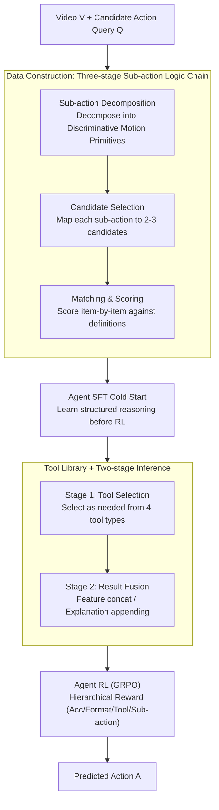

# Video-STAR: Reinforcing Open-Vocabulary Action Recognition with Tools

**Conference**: ICLR 2026  
**OpenReview**: [https://openreview.net/forum?id=NBOHB6aYZh](https://openreview.net/forum?id=NBOHB6aYZh)  
**Area**: Video Understanding / Multimodal VLM / Reinforcement Learning  
**Keywords**: Open-Vocabulary Action Recognition, Sub-action Decomposition, Tool Augmentation, Agent Reinforcement Learning, GRPO  

## TL;DR
Video-STAR reformulates Open-Vocabulary Action Recognition (OVAR) as a sequential decision process of "selecting tools first, then decomposing sub-actions": during inference, a Multimodal Large Language Model (MLLM) calls domain-specific tools (e.g., pose estimation, human detection, online retrieval) to supplement visual evidence and decomposes holistic actions into discriminative sub-action primitives for scoring and matching; this is coupled with a hierarchical reward system (rewarding accuracy, tool efficiency, and sub-action relevance) to train the model via GRPO, shifting it from "relying on text priors" to "vision-grounded reasoning," significantly advancing the SOTA across five benchmarks: HMDB-51, UCF-101, K-400/600, and SSv2.

## Background & Motivation
**Background**: Open-vocabulary action recognition requires identifying action categories not seen during training. Early methods relied on cross-modal alignment from CLIP (ActionCLIP, ViFi-CLIP) or parameter-efficient adapters (ST-Adapter, AIM) to transfer image-text knowledge to video. Recently, attempts have been made to use the Chain-of-Thought (CoT) capabilities of MLLMs for zero-shot action understanding.

**Limitations of Prior Work**: The authors identify two major flaws when applying MLLMs to OVAR. First is **cross-modal hallucination**—models rely excessively on linguistic priors for CoT reasoning, forcing continuous temporal visual features into discrete textual representations, leading to responses based on common sense (e.g., misidentifying a rod strike as "baseball hit" or "throw"). Second is the **lack of category-specific reasoning**—actions in an open vocabulary are unpredictable, preventing the model from learning discriminative patterns. Consequently, the model struggles with semantically similar actions (e.g., golf, hit, and punch all involve forward arm swinging).

**Key Challenge**: The essence of an action lies in fine-grained temporal dynamics and hierarchical coordination of body parts. Matching an action as a "monolithic entity" against text labels naturally discards this internal structure. Existing tool-augmented CoT works (frame-level operations like zooming or cropping) only supplement static spatial information without modeling movement continuity and hierarchical sub-action dependencies.

**Goal**: To equip the model with two capabilities: (1) fine-grained action discrimination through contextual sub-action decomposition; (2) autonomous invocation of domain tools via multimodal CoT to enhance visual-semantic representations and reduce hallucinations.

**Key Insight**: Instead of viewing action recognition as a label-matching problem, it should be treated as a **sequential decision process**: decomposing sub-actions $\rightarrow$ matching candidates $\rightarrow$ hierarchical scoring. Reinforcement learning is used to let the model autonomously learn "when to use which tool" and "which sub-actions are more important," rather than relying on explicit human supervision.

**Core Idea**: A unified framework of "contextual sub-action decomposition + tool-augmented agent reinforcement learning" to transition from text-centric reasoning to vision-grounded reasoning.

## Method

### Overall Architecture
The input to Video-STAR is a video $V$ and a query $Q$ with candidate actions, and the output is the predicted action $A$ (which may belong to unseen categories). The system consists of three tightly coupled training stages: first, synthesizing high-quality CoT reasoning data with tool calls using a "three-stage sub-action logic chain"; second, performing Supervised Fine-Tuning (SFT) on the Qwen2.5-VL base model using these structured reasoning chains for a cold start; and finally, using GRPO reinforcement learning with a hierarchical reward to optimize tool usage and sub-action reasoning.

During inference, the model follows a **two-stage decision process**: the first stage performs tool selection, choosing and executing the most relevant tool from the set $T=\{T_p, T_d, T_a, T_v\}$ (pose estimation / human detection / action explanation / video description) to obtain intermediate results $R$; the second stage performs result fusion, concatenating visual tool features $F$ with original frames and appending semantic tool explanations $E$ to the query, eventually predicting:

$$A \sim \pi_\theta(\cdot \mid V \oplus F,\; Q \oplus E;\; T),$$

where $\oplus$ denotes feature concatenation for visual modalities and text appending for textual modalities, and $\pi_\theta$ is the policy network of the MLLM.

### Key Designs

**1. Contextual Sub-action Decomposition: Breaking holistic actions into discriminative motion primitives**

This step directly addresses the lack of category-specific reasoning and the inability to distinguish semantically similar actions. Video-STAR no longer treats an action as a holistic label; instead, it uses a three-stage logic chain: first, **sub-action decomposition** identifies key motion primitives based on body part interactions (e.g., "shoot ball" is decomposed into "torso bending $\rightarrow$ leg extension $\rightarrow$ foot-ball interaction"); second, **candidate selection** maps each sub-action to detailed definitions and generates 2-3 semantically related candidates (e.g., "torso bending" suggests *run*, "leg extension" suggests *hurdle*, "foot-ball interaction" corresponds to *shoot*), narrowing the search space while retaining semantic diversity; third, **matching & scoring** evaluates each sub-action against the detailed definitions of every candidate (e.g., Golf 9/10, Hit 6/10, Punch 3/10). This forces the model to look at visually discriminative details, such as arm moves and torso rotations, rather than hallucinating based on text priors.

**2. Multi-tool Library and Two-stage Dynamic Tool Invocation: Supplementing visual evidence as needed**

This step targets "cross-modal hallucination." The authors build a tool library with four sub-tools: human detection and pose estimation both use YOLO 11 (the latter utilizes 17-keypoint COCO skeletons to capture fine-grained joint positions), while action explanation and video description invoke Qwen APIs for Retrieval-Augmented Generation (RAG). These redefine actions based on transition phases (e.g., "stand" $\rightarrow$ "transit from sit or lay to stand") and extract temporally salient frames to resolve ambiguities in multi-stage sequences (e.g., "sit-stand-walk"). Crucially, it is not a static pipeline that runs all tools; the model **first determines which tool to invoke**. Visual features from $T_p, T_d$ are merged into video frames to enrich spatio-temporal representations, while explanations from $T_a, T_v$ are appended to provide contextual anchoring. This agentic dynamic selection saves significant time with almost no loss in accuracy—compared to a static "all-tool pipeline," total inference time drops from 4.10s to 3.18s (~22% savings) with only a 0.5% drop in UCF-101 accuracy.

**3. Agent SFT Cold Start: Teaching structured reasoning before RL**

This is a critical architectural design. Attempting RL directly (modeled after R1-Zero) revealed a counter-intuitive phenomenon: as policy rollouts progressed, **tool invocation frequency continued to decline**. This occurs because the visual features from tools differ from the pre-training data distribution; pure RL struggles to learn tool usage stably in a high-dimensional reasoning space without prior guidance. Consequently, an SFT cold start phase was added, formalizing each training sample as $T=(X, I, S, Y)$ (input modalities / instruction / reasoning steps / target output) and minimizing the negative log-likelihood of the reasoning process:

$$\mathcal{L}_{\text{SFT}} = -\mathbb{E}_{T\sim D}\left[\sum_{t=1}^{T}\log p_\theta(s_t \mid X, I, s_{<t})\right],$$

allowing the model to learn to generate reasoning chains on 5,000 high-fidelity samples verified by Qwen-VL-Max before initializing the RL policy. Ablations show that removing SFT (pure RL) causes a sharper performance drop than removing RL (pure SFT).

**4. Hierarchical Reward: Jointly rewarding accuracy, tool efficiency, and sub-action relevance**

Standard rewards only look at answer correctness and format, failing to guide "meaningful" tool use or sub-action decomposition. Video-STAR employs GRPO for policy optimization (sampling $G$ trajectories per query and updating via group-relative advantage $A_i=(r_i-\text{mean})/\text{std}$) and designs a four-component hierarchical reward: accuracy $R_{acc}$, format $R_{format}$, tool usage $R_{tool}$, and sub-action $R_{sub}$. The sub-action reward uses hierarchical weighting: the model ranks $n$ sub-actions by relevance; the $k$-th sub-action has weight $w_k=n-k+1$. If the prediction hits the subset $\{k_1, \dots, k_m\}$, $R_{sub}=\sum_{i=1}^{m}w_{k_i}/\sum_{i=1}^{n}w_i$. The total reward is:

$$R(\tau)=R_{acc}(\tau)+R_{format}(\tau)+\mathbb{I}_{R_{acc}(\tau)>0}\cdot\left(R_{tool}(\tau)+R_{sub}(\tau)\right),$$

The indicator function $\mathbb{I}_{R_{acc}>0}$ ensures tool and sub-action rewards only apply when the answer is correct. This penalizes redundant tool calls and irrelevant sub-actions; tools are only activated when they genuinely contribute to information.

### Loss & Training
Two phases: Phase one is SFT on 5,000 high-fidelity reasoning chains synthesized from HMDB-51 video-query pairs. Phase two uses the same data for GRPO reinforcement learning. It is implemented on Qwen2.5-VL-3B/7B using 8x H20 GPUs (90GB) with a batch size of 8, 4 rollouts per sample, a learning rate of 5e-7, and 600 iterations (~20 hours).

## Key Experimental Results

### Main Results
In the base-to-novel setting, Video-STAR is fine-tuned only on the HMDB-51 base set but evaluated zero-shot on K-400, UCF-101, and SSv2, yielding New SOTA:

| Dataset (HM) | Prev. SOTA | Video-STAR-7B | Note |
|--------|----------|---------------|------|
| K-400 | 70.4 (FROSTER) | **96.7** | Gain ~26.3% |
| HMDB-51 | 70.0 (VTD-CLIP) | **92.1** | Gain ~27.0% |
| UCF-101 | 87.0 (FROSTER) | **99.7** | Near perfect |
| SSv2 | 15.4 (VTD-CLIP) | **15.5** | Temporal nuance remains difficult |

Notably, accuracy on novel classes in K-400 and UCF-101 exceeds base classes, indicating extreme generalization. While general Qwen2.5-VL-7B is competitive on K-400 (HM 86.3), it fails on HMDB-51 (45.6) and SSv2 (11.6), highlighting the necessity of this specialized alignment.

### Ablation Study
Accuracy on Cross-dataset splits (UCF-101 / HMDB-51 / K-600):

| Config | UCF-101 | HMDB-51 | K-600 | Description |
|------|---------|---------|-------|------|
| (b) Full model | 96.7 | 86.2 | 90.5 | Complete model |
| (c) w/o RL (SFT only) | 76.8 | 63.5 | 61.3 | Major drop without RL |
| (d) w/o SFT (RL only) | 71.4 | 57.6 | 54.8 | Largest drop, proves cold start necessity |
| (e) w/o Tools | 87.1 | 74.9 | 78.4 | Drop of at least 9.1% |
| (f) w/o Sub-actions | 88.5 | 76.8 | 81.2 | Drop of 8.2-9.4% |

### Key Findings
- **SFT Cold Start is the foundation**: Removing SFT results in larger drops than removing RL; direct RL leads to tool invocation decay.
- **Tools and sub-actions are complementary**: Removing either results in an ~8-9% drop; their union is required for peak performance.
- **Hierarchical reward components are vital**: Using only accuracy/format rewards yields the worst RL configuration.
- **Modular Robustness**: Replacing YOLO 11 with OpenPose or Qwen with Gemini-1.5-Pro maintains high accuracy, proving the core contribution is the agent logic.

## Highlights & Insights
- **Reformulating action recognition as sequential decision-making**: The decomposition $\rightarrow$ matching $\rightarrow$ scoring logic chain transforms the old "similar action confusion" problem into a structured reasoning process optimizable by RL.
- **Clever indicator-coupled reward design**: $\mathbb{I}_{R_{acc}>0}$ "locks" tool/sub-action rewards behind a correct answer, naturally suppressing reward hacking where the model would otherwise spam tool calls for points.
- **Value of the "SFT before RL" failure observation**: The decay of tool calls in pure RL explains why agentic tasks generally require a cold start—a practical insight for tool-augmented RL.

## Limitations & Future Work
- **SSv2 remains a weakness** (HM only 15.5); fine-grained temporal "something-something" actions are hard to resolve via static sub-action decomposition and tools; temporal continuity modeling is limited.
- **Dependency on external tools and closed-source APIs**: Action explanations rely on Qwen API RAG, tool calls add ~1.43s latency, and reconstruction relies on Qwen2.5-VL-72B for data verification.
- **Limited training scale**: 5,000 reasoning chains from HMDB-51 might constrain generalization boundaries to vastly different action distributions.

## Related Work & Insights
- **vs. CLIP-based OVAR (FROSTER, ViFi-CLIP)**: These rely on weight interpolation or residual distillation but are constrained by static feature assumptions. Ours uses grounded reasoning with tools, leading in generalization and discrimination.
- **vs. Frame-level Tool CoT (FAST, PyVision)**: These perform static frame-level operations with fixed pipelines. Ours models sub-action hierarchies and dynamically balances tool efficiency with motion relevance.
- **vs. MLLM RL (DeepSeek-R1 logic)**: This work extends RL post-training to OVAR, using multimodal CoT + tools to explicitly reduce long-sequence hallucinations rather than relying on pure text reasoning.

## Rating
- Novelty: ⭐⭐⭐⭐⭐ Reformulating OVAR as "tool selection + sub-action score" sequential decisions optimized by hierarchical RL is highly novel.
- Experimental Thoroughness: ⭐⭐⭐⭐⭐ Comprehensive evaluation across five datasets, two settings, and multi-dimensional ablations.
- Writing Quality: ⭐⭐⭐⭐ Clear framework and diagrams; some mathematical notations for rewards require careful reading.
- Value: ⭐⭐⭐⭐⭐ Significant SOTA improvements and reusable insights (e.g., tool-augmented RL cold start) provide great utility for agent-based video understanding.

<!-- RELATED:START -->

## Related Papers

- [\[ICLR 2026\] Video-KTR: Reinforcing Video Reasoning via Key Token Attribution](video-ktr_reinforcing_video_reasoning_via_key_token_attribution.md)
- [\[ICCV 2025\] Learning to Generalize Without Bias for Open-Vocabulary Action Recognition](../../ICCV2025/video_understanding/learning_to_generalize_without_bias_for_open-vocabulary_action_recognition.md)
- [\[ICLR 2026\] Invert4TVG: A Temporal Video Grounding Framework with Inversion Tasks Preserving Action Understanding Ability](invert4tvg_a_temporal_video_grounding_framework_with_inversion_tasks_preserving_.md)
- [\[ICLR 2026\] Language-guided Open-world Video Anomaly Detection under Weak Supervision](language-guided_open-world_video_anomaly_detection_under_weak_supervision.md)
- [\[CVPR 2026\] HERO: Hierarchical Embedding-Refinement for Open-Vocabulary Temporal Sentence Grounding in Videos](../../CVPR2026/video_understanding/hero_hierarchical_embedding-refinement_for_open-vocabulary_temporal_sentence_gro.md)

<!-- RELATED:END -->
