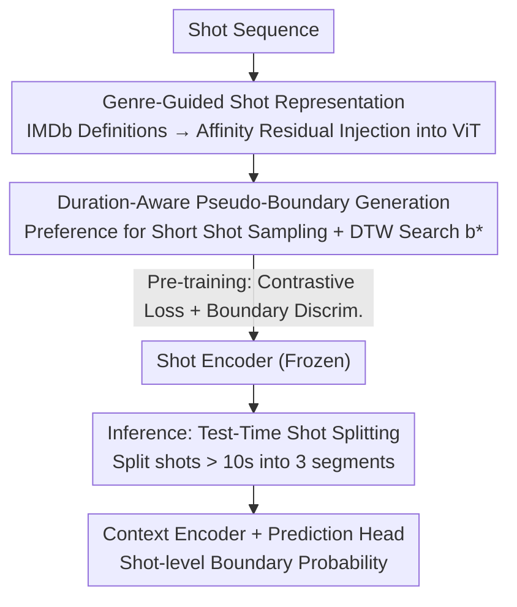

# Video Scene Segmentation with Genre and Duration Signals

**Conference**: ICLR 2026  
**OpenReview**: [https://openreview.net/forum?id=c8r3lzyVTS](https://openreview.net/forum?id=c8r3lzyVTS)  
**Code**: None  
**Area**: Video Understanding  
**Keywords**: Video Scene Segmentation, Self-supervised Learning, Genre Prior, Shot Duration, Long Video Understanding

## TL;DR
This paper introduces "genre conventions" and "shot duration patterns" from professional filmmaking as metadata signals for video scene segmentation. It uses IMDb text definitions as soft semantic priors to enhance shot representations, employs inverse-duration-weighted sampling to generate diverse pseudo-boundaries during pre-training, and splits long shots during inference. This approach achieves SOTA performance on MovieNet-SSeg and BBC datasets and introduces the MovieChat-SSeg benchmark with scene boundary annotations.

## Background & Motivation
**Background**: Long videos (movies, TV shows, documentaries) are naturally composed of semantically coherent "scenes," each consisting of multiple "shots." Scene segmentation is the task of determining whether each shot marks the end of a scene, essentially a shot-level binary classification problem. Recent mainstream approaches follow a two-stage self-supervised paradigm: first, pre-training a shot encoder (e.g., BaSSL, TranS4mer, CAT) on large-scale unlabeled videos using "pseudo-scene boundaries" as a pretext task, then fine-tuning a context encoder and prediction head on small-scale labeled data.

**Limitations of Prior Work**: Existing methods rely almost exclusively on **visual similarity** between adjacent shots to detect boundaries. However, many real-world scene transitions occur at the "narrative level"—where location, time, or theme changes without significant visual jumps. Conversely, visual jumps can occur within a continuous scene due to lighting changes or cut-ins. Purely visual signals lead to both false negatives (semantic change without visual change) and false positives (visual change without narrative break).

**Key Challenge**: There is a systematic misalignment between low-level visual signals and high-level narrative structures, a gap that visual features alone cannot bridge.

**Key Insight**: The authors observe that professional film production embeds intentional contextual clues, specifically "genre conventions" (visual/narrative patterns unique to sci-fi, thriller, etc.) and "shot duration patterns" (often serving as indicators of narrative structure). The difficulty lies in the fact that genre labels are typically available only at the **video level**, and duration distributions vary significantly across genres and production styles.

**Core Idea**: Treat genre as a "soft semantic prior" injected into shot representations during self-supervised pre-training, use duration as "sampling weights" to construct diverse pseudo-boundaries, and split long shots during inference. None of these components require changes to the backbone architecture, allowing them to be integrated into existing self-supervised frameworks.

## Method

### Overall Architecture
The method builds upon the BaSSL-style two-stage self-supervised paradigm. During the pre-training stage, the shot encoder is optimized using pseudo-boundaries. During fine-tuning, the shot encoder is frozen, and only the context encoder $\theta_c$ and prediction head $h_p$ are trained. The proposed modifications focus on three areas: injecting genre priors at the **input side**, using duration-weighted anchor sampling for **pseudo-labels**, and performing shot splitting on the **inference side**.

The input is a shot sequence $\{s_1,\dots,s_N\}$. Each shot is processed by a ViT shot encoder integrated with genre embeddings to produce a representation $e_i$. During pre-training, anchors are sampled using duration weights, and a DTW-style search locates the pseudo-boundary $b^*$ to split the sequence into two pseudo-scenes for contrastive learning and boundary discrimination. During inference, shots exceeding 10 seconds are split into three segments before being processed by the context encoder.

### Key Designs

**1. Genre-Guided Shot Representation: Textual Definitions as Soft Semantic Priors**

To address the failure of visual features in capturing narrative coherence, the authors encode genre conventions as text. They collect definitions for 21 genres from IMDb and pre-encode them using CLIP/OpenCLIP into a fixed set of genre embeddings $G_e \in \mathbb{R}^{N_g \times D}$. Within the ViT, the cosine similarity between visual token features $V_t$ and genre embeddings is computed to form an affinity matrix, which is then injected back into the visual features via a residual connection:

$$A = \mathrm{softmax}\!\left(\frac{V_t G_e^{\top}}{\sqrt{D}}\right), \qquad V_t^{\mathrm{genre}} = V_t + A G_e W$$

Only the projection matrix $W \in \mathbb{R}^{D \times D}$ is trained. This "Affinity-Guided Residual (AG-Residual)" allows for dynamic weighting of genres based on current shot relevance, providing a flexible guide rather than a hard constraint. Ablation shows that simple frame-level concatenation drops performance from 61.27 to 59.13 AP, whereas AG-Residual improves it to 63.62 AP.

**2. Duration-Aware Pseudo-Boundary Generation: Sampling Diverse Training Signals**

Standard BaSSL uses fixed endpoints as anchors, resulting in limited temporal patterns. Observing that scenes are often composed of dense short shots forming narrative units, the authors sample anchors with a probability proportional to the **inverse of shot duration**:

$$P(s_i) = \frac{1/d_i}{\sum_{j=1}^{N} 1/d_j}$$

Where $d_i$ is the duration of shot $i$. After selecting anchors $\{s_l, s_r\}$, a DTW-style similarity search identifies the optimal pseudo-boundary $b^*$ by maximizing the average similarity of sub-segments to their respective anchors. This Inverse-Duration-Weighted (IDW) sampling improves performance by +0.8 AP over fixed sampling on MovieNet, as short shots facilitate more diverse sub-sequences.

**3. Test-Time Shot Splitting: Splitting Long Shots for Precise Boundaries**

While training improvements address representation learning, real-world shot durations are highly uneven during inference. A single long shot may contain multiple narrative segments. The authors propose a preprocessing strategy: any shot with duration $d_i > \tau$ (set to 10s) is split into three equal segments, each treated as an independent shot. This strategy requires no re-training and can be applied to any existing framework. Ablation shows that smaller thresholds yield more stable gains: No splitting 63.62 → 60s 63.63 → 30s 63.76 → 10s 63.80 AP.

### Loss & Training
The pre-training phase uses a linear combination of two objectives: an InfoNCE-based contrastive loss $L_{con}$, treating the average representation of shots within a pseudo-scene as positive pairs with anchors; and a binary cross-entropy loss $L_{pb}$ for pseudo-boundary discrimination. In the fine-tuning phase, the shot encoder is frozen, and the context encoder/prediction head are trained using standard binary cross-entropy $L_{sb}$ with ground-truth labels. The shot encoder uses ViT-B/32 (frozen), and the context encoder is a 2-layer BERT trained from scratch.

## Key Experimental Results

### Main Results
The method outperforms previous SOTA across MovieNet-SSeg, BBC (documentary), and the new MovieChat-SSeg benchmark:

| Dataset | Metric | Ours | Prev. SOTA | Gain |
|--------|------|------|----------|------|
| MovieNet-SSeg | AP | 63.62 | 60.78 (TranS4mer) | +2.84 |
| MovieNet-SSeg | F1 | 58.88 | 52.05 (CMS) | +6.83 |
| MovieNet-SSeg | mIoU | 59.64 | 53.67 (CAT) | +5.97 |
| BBC | AP(avg) | 37.2 | 30.3 (TranS4mer*) | +6.9 |
| MovieChat-SSeg | AP(total) | 46.7 | 37.9 (TranS4mer*) | +8.8 |

Significant gains in F1 and mIoU (+6~7 points) suggest qualitative improvements in precise boundary localization.

### Ablation Study
On MovieNet-SSeg (AP):

| Configuration | AP | Notes |
|------|------|------|
| Full Model (AG-Res + IDW + 10s split) | 63.80 | All components enabled |
| w/o Genre Embeddings | 61.27 | Removing genre prior drops 2.4 points |
| Frame-level Concat Genre | 59.13 | Poor fusion is worse than no prior |
| Token-level Concat Genre | 62.43 | Simple concat provides limited gain |
| Fixed Anchor Sampling (Side) | 62.82 | Back to BaSSL-style sampling |
| Long-shot Preference (DW) | 63.44 | Inverse logic performs worse than IDW |
| No Shot Splitting | 63.62 | Inference splitting contributes ~+0.18 |

### Key Findings
- Genre priors contribute the most, but the **fusion mechanism** is critical: frame-level concatenation (59.13) performs worse than using no genre (61.27). AG-Residual dynamic fusion is essential.
- Textual information density matters: using full IMDb definitions (63.62) is superior to just genre names (63.23).
- Direction of duration sampling is vital: IDW > DW > Side, confirming that short shots provide richer training samples for fixed-length sequences.
- Components are architecture-agnostic: Applying IDW and splitting to BaSSL/TranS4mer yielded +0.8~2.1 and +0.6~0.8 AP gains respectively.

## Highlights & Insights
- **Production Metadata as First-Class Citizens**: Moving beyond pure visual similarity, using genre and duration—signals intentionally designed by directors—effectively complements narrative understanding.
- **AG-Residual as a Lightweight Injection**: Training only a projection matrix $W$ while freezing the backbone provides a robust method for soft-injecting textual priors into visual encoders.
- **Inverse-Duration-Weighted Sampling**: This simple adjustment to anchor sampling increases pseudo-boundary diversity without adding parameters, offering a cost-effective boost to self-supervised quality.
- **Test-Time Splitting for Plug-and-Play Gains**: As a purely preprocessing step, it improves existing systems without requiring model updates.

## Limitations & Future Work
- Genre information remains **video-level**, which might be too coarse for multi-genre films; shot-level or scene-level genre assignment remains an open problem.
- Test-time splitting uses a heuristic rule (splitting into three segments for shots > 10s). Adaptive splitting based on content might be more optimal.
- MovieChat-SSeg consists of relatively short clips (avg. 7.4 mins), which may not capture full-length movie narrative patterns.
- Error analysis shows that insert shots and extreme lighting changes still cause false positives, suggesting a need for multimodal signals (subtitles, dialogue).

## Related Work & Insights
- **vs. BaSSL**: BaSSL uses fixed anchors and pure visual contrastive learning; this work adopts the paradigm but introduces duration-weighted sampling and genre priors, improving AP from 60.40 to 63.62.
- **vs. TranS4mer / CAT**: These focus on long-range shot relationships or multi-scale contexts. This paper's gains are orthogonal, stemming from "production metadata."
- **vs. Movies2Scenes**: That work uses metadata for cross-movie similarity; this paper uses genre as an intra-shot semantic prior.
- **vs. VSS-MGP / Movie-CLIP**: Unlike methods requiring shot-level genre labels, this work uses text definitions as soft priors, requiring no additional shot-level annotations.

## Rating
- Novelty: ⭐⭐⭐⭐ Systematically introduces genre and duration metadata into segmentation; well-targeted modifications.
- Experimental Thoroughness: ⭐⭐⭐⭐ Three datasets including cross-domain (BBC) and new benchmarks; detailed ablation.
- Writing Quality: ⭐⭐⭐⭐ Clear logic from motivation to experimentation.
- Value: ⭐⭐⭐⭐ SOTA results + plug-and-play components + new benchmark.

<!-- RELATED:START -->

## Related Papers

- [\[CVPR 2026\] Scene-Centric Unsupervised Video Panoptic Segmentation](../../CVPR2026/video_understanding/scene-centric_unsupervised_video_panoptic_segmentation.md)
- [\[CVPR 2026\] SAM2Text: Towards Prompt-Free and Multi-Resolution Video Scene Text Segmentation](../../CVPR2026/video_understanding/sam2text_towards_prompt-free_and_multi-resolution_video_scene_text_segmentation.md)
- [\[CVPR 2026\] Seeing the Scene Matters: Revealing Forgetting in Video Understanding Models with a Scene-Aware Long-Video Benchmark](../../CVPR2026/video_understanding/seeing_the_scene_matters_revealing_forgetting_in_video_understanding_models_with.md)
- [\[CVPR 2025\] VISTA: Enhancing Long-Duration and High-Resolution Video Understanding by Video SpatioTemporal Augmentation](../../CVPR2025/video_understanding/vista_enhancing_long-duration_and_high-resolution_video_understanding_by_video_s.md)
- [\[CVPR 2026\] Robust Promptable Video Object Segmentation](../../CVPR2026/video_understanding/robust_promptable_video_object_segmentation.md)

<!-- RELATED:END -->
