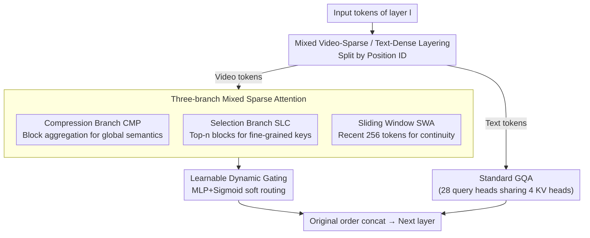

# VideoNSA: Native Sparse Attention Scales Video Understanding

**Conference**: ICLR 2026  
**arXiv**: [2510.02295](https://arxiv.org/abs/2510.02295)  
**Code**: None  
**Area**: Video Understanding  
**Keywords**: sparse attention, video understanding, long context, multimodal LLM

## TL;DR

Ours proposes VideoNSA, which introduces Native Sparse Attention (NSA) into video-language models. Through a hybrid sparse attention mechanism with dynamic gating across three branches—compression, selection, and sliding window—it achieves 128K token video understanding using only 3.6% of the attention budget. It comprehensively outperforms token compression and training-free sparse attention baselines in long video understanding, temporal reasoning, and spatial understanding tasks.

## Background & Motivation

1. **Video understanding limited by context length**: Existing Multimodal Large Language Models (MLLMs) are restricted by context windows when processing long videos, often missing critical transition frames and struggling to maintain consistency over long periods. For instance, a decisive moment in a football match lasts seconds, while the entire game spans 90 minutes.

2. **Irreversible information loss in token compression**: Current token compression methods (FastV, VScan, VisionZip, etc.) reduce redundancy but significantly degrade performance in complex reasoning tasks, as compression strategies limit the generalization of perception and reasoning.

3. **Lack of hardware alignment in training-free sparse attention**: Training-free sparse attention methods (Tri-Shape, MInference, etc.) are typically not hardware-aligned and impose static adjacency matrices, restricting the flexibility of information flow and failing to improve training efficiency.

4. **High temporal redundancy in video tokens**: Substantial redundancy exists between consecutive video frames, making them suitable for sparse attention mechanisms. however, the complexity of videos (spatiotemporal dependencies) prevents existing text-based sparse attention methods from being directly applied to video scenarios.

5. **Validation of NSA in LLMs**: Native Sparse Attention has demonstrated advantages in learnable, hardware-aware sparse attention for pure text long-context modeling but has not yet been applied to video multimodal contexts.

6. **High cost of increasing frame counts**: While increasing video frame sampling intuitively improves accuracy, the computational complexity of additional tokens grows quadratically, creating an urgent need for efficient attention mechanisms to break this limitation.

## Method

### Overall Architecture

VideoNSA uses Qwen2.5-VL-7B as the backbone, implementing a key distinction in each LLM decoder layer: input tokens are first split into video tokens and text tokens based on position IDs. Video tokens follow the three-branch sparse path of Native Sparse Attention, dynamically weighted by gating, while text tokens follow standard GQA. Finally, the two outputs are concatenated in their original order for the forward pass. This allows the video side to benefit from sparse attention efficiency and learnable inductive bias, while the text side retains instruction-following capabilities. The entire mechanism is trained end-to-end rather than using an external training-free mask.

### Key Designs

**1. Mixed Video-Sparse / Text-Dense Layering: Modality-based bifurcation within the same layer to balance efficiency and instruction understanding**

Video tokens are highly redundant and suitable for sparsification, whereas text tokens are few and semantically dense; sparsifying text tokens harms instruction following. Thus, VideoNSA does not apply a one-size-fits-all approach to the entire sequence. Each layer $l$ splits the input into video tokens $\mathbf{X}_\mathcal{V}$ and text tokens $\mathbf{X}_\mathcal{T}$ by position ID. The video side enters the three-branch sparse attention, while the text side undergoes standard GQA (fully connected with 28 query heads sharing 4 KV heads). The outputs are concatenated $\mathbf{o}^{(l)} = [\mathbf{o}_\mathcal{V}^{(l)}; \mathbf{o}_\mathcal{T}^{(l)}]$ before the next layer. This hybrid design is key to retaining both efficiency and understanding.

**2. Three-branch Mixed Sparse Attention: Complementary perspectives covering different temporal scales of long video**

A single sparse pattern struggles to capture global semantics, key moments, and local continuity simultaneously. On the video side, NSA splits the attention of each query $q_t$ into three complementary branches: the compression branch (CMP) aggregates continuous token blocks into coarse-grained representations via a learnable MLP to capture global semantics (block size is 64 per-frame tokens, using intra-frame mean pooling); the selection branch (SLC) calculates importance scores for each KV block and retains only the top-$n$ most significant blocks for fine-grained key information; and the sliding window branch (SWA) retains the most recent $w=256$ KV pairs to ensure local temporal continuity. These correspond to "global view, key focus, and continuity," filling the dependency gaps left by irreversible token compression methods. They are aggregated by gating:

$$\mathbf{o}_t = \sum_{c \in \{\text{cmp}, \text{slc}, \text{win}\}} g_t^c \cdot \text{Attn}(q_t, \tilde{\mathbf{K}}_t^c, \tilde{\mathbf{V}}_t^c)$$

**3. Learnable Dynamic Gating: Adaptive attention budget allocation based on content rather than static adjacency matrices**

Training-free sparse methods impose fixed sparse structures, lacking flexible information flow and efficiency gains. VideoNSA employs a two-layer MLP + Sigmoid to produce gating weights $g_t^c$, performing data-dependent soft routing across the three branches. Gating changes dynamically with query content and layer depth—analysis shows the compression branch remains dominant across all layers, while selection and sliding window branches weaken in deeper layers, indicating the model learns to adjust sparse allocation by layer and task. This learnable routing allows VideoNSA to scale stably to 128K tokens with only 3.6% of the attention budget.

### Loss & Training

Training data is a subset of 216K QA pairs filtered from LLaVA-Video-178K with videos of 350–550 frames. Each frame is capped at 50,176 pixels, and the single-instance context limit is 36K tokens. Sparse hyper-parameters are set to block size $s=64$, block count $b=32$, and sliding window $w=256$. The system is trained end-to-end within the SWIFT framework, utilizing a FLA-based NSA kernel implementation, with a total cost of approximately 4600 H100 GPU hours.

## Key Experimental Results

### Main Results: Comprehensive Multi-task Evaluation

| Model | LongVideoBench | MLVU_test | TimeScope | LongTimeScope | Tomato | VSIBench |
|------|:-:|:-:|:-:|:-:|:-:|:-:|
| Qwen2.5-VL-7B (Baseline) | 58.7 | 51.2 | 81.0 | 40.7 | 22.6 | 29.7 |
| + FastV (Token Compression) | 57.3 | 41.8 | 46.5 | 35.6 | 21.6 | 32.0 |
| + VisionZip (Token Compression) | 52.4 | 33.1 | 43.5 | 40.4 | 23.6 | 32.1 |
| + MInference (Sparse Attention) | 59.2 | 49.2 | 82.7 | 44.4 | 23.0 | 36.5 |
| + XAttention (Sparse Attention) | 59.1 | 50.2 | 83.1 | 41.1 | 21.4 | 36.6 |
| **VideoNSA** | **60.0** | **51.8** | **83.7** | **44.4** | **26.5** | **36.1** |

**Key Findings**:
- Sparse attention methods generally outperform token compression methods.
- VideoNSA show significant advantages in temporal reasoning (Tomato +3.9) and long video understanding.
- In spatial understanding (VSIBench), it matches the strongest sparse baselines and significantly exceeds compression methods.

### Ablation Study: Branch Combination Analysis

| CMP | SLC | SWD | LongVideoBench | MLVU | TimeScope | LongTimeScope | Tomato | VSIBench |
|:-:|:-:|:-:|:-:|:-:|:-:|:-:|:-:|:-:|
| ✓ | | | 48.1 | 43.9 | 41.5 | 25.1 | 23.3 | 29.2 |
| | ✓ | | 48.4 | 47.7 | 63.7 | 37.1 | 24.0 | 27.6 |
| | | ✓ | 49.1 | 40.2 | 59.3 | 29.8 | 24.0 | 29.8 |
| ✓ | ✓ | ✓ | **60.0** | **51.8** | **83.7** | **44.4** | **26.5** | **36.1** |

The combination of three branches is significantly better than any single or dual-branch configuration, proving the necessity of integrating all branches via dynamic gating.

### Scaling Analysis

1. **Sparse weights transferable to dense attention**: Dense-NSA (using VideoNSA weights with dense attention inference) outperforms the baseline in most tasks, indicating sparse training provides an effective attention inductive bias.
2. **Reliable scaling to 128K tokens**: Performance continues to improve even beyond the training length (36K).
3. **Optimal attention allocation is highly task-dependent**: LongVideoBench prefers more tokens per frame, while Tomato prefers higher frame rates.
4. **Gating distribution evolves by layer**: The compression branch remains dominant throughout, while selection and sliding window branches weaken in deeper layers.
5. **Compression branch is the efficiency bottleneck**: As context grows, inference latency is dominated by the compression branch.
6. **Learnable sparse attention induces dynamic attention sinks**: The selection branch has almost no sinks, while the compression branch has the most, effectively offset by the gating mechanism. The overall sink ratio is only 0.3%.

## Highlights & Insights

- **First learnable and hardware-aware video sparse attention**: Unlike static sparse patterns, VideoNSA achieves data-dependent sparse connections through end-to-end training.
- **Exquisite hybrid attention design**: Uses sparse for video and dense for text, balancing efficiency and instruction following.
- **Optimal performance with 3.6% budget**: Extreme computational efficiency.
- **Systematic scaling analysis**: Six findings provide deep insights into the behavior of sparse attention in video understanding.

## Limitations & Future Work

- Limited training data quality (LLaVA-Video-178K subset); some benchmarks show slight decreases after SFT.
- The compression branch remains an inference bottleneck; kernel and memory efficiency require further optimization.
- Validated only on 7B-level models; lacks experiments on larger scales.
- Block size is fixed to tokens per frame; adaptive block partitioning strategies have not been explored.

## Related Work & Insights

### vs. MInference (Jiang et al., 2024)
MInference is a training-free sparse attention method using predefined patterns (A-shape, Vertical-Slash, etc.). VideoNSA learns data-dependent patterns through training, performing better in Tomato (26.5 vs 23.0) and matching VSIBench (36.1 vs 36.5) at the cost of 4600 H100 GPU hours.

### vs. FastV / VisionZip (Token Compression)
Token compression methods drop or merge tokens, causing irreversible info loss. FastV scores only 46.5 on TimeScope (vs VideoNSA 83.7), and VisionZip scores 33.1 on MLVU (vs 51.8). VideoNSA retains all tokens but focuses on critical dependencies via sparse attention, offering a huge advantage in complex reasoning.

### vs. XAttention (Xu et al., 2025)
XAttention is training-free sparse attention using the same configuration as VideoNSA but without training. VideoNSA leads significantly in LongTimeScope (44.4 vs 41.1) and Tomato (26.5 vs 21.4), proving end-to-end training is crucial for learning effective sparse patterns.

## Rating

- ⭐⭐⭐⭐ Novelty: First systematic introduction of learnable sparse attention to video understanding with unique hybrid design.
- ⭐⭐⭐⭐ Technical Quality: Comprehensive experiments, thorough analysis of six findings, and sufficient ablations.
- ⭐⭐⭐⭐ Utility: Directly applicable to existing VLM architectures; code and models are open-sourced.
- ⭐⭐⭐ Writing Quality: Clear structure, though some symbol definitions are scattered; Figure descriptions could be more concise.

<!-- RELATED:START -->

## Related Papers

- [\[CVPR 2026\] VecAttention: Vector-wise Sparse Attention for Accelerating Long Context Inference](../../CVPR2026/video_understanding/vecattention_vector-wise_sparse_attention_for_accelerating_long_context_inferenc.md)
- [\[CVPR 2026\] Attend Before Attention: Efficient and Scalable Video Understanding via Autoregressive Gazing](../../CVPR2026/video_understanding/autogaze_attend_before_attention_efficient_video.md)
- [\[AAAI 2026\] Predicting Video Slot Attention Queries from Random Slot-Feature Pairs](../../AAAI2026/video_understanding/predicting_video_slot_attention_queries_from_random_slot-feature_pairs.md)
- [\[NeurIPS 2025\] Enhancing Temporal Understanding in Video-LLMs through Stacked Temporal Attention in Vision Encoders](../../NeurIPS2025/video_understanding/enhancing_temporal_understanding_in_videollms_through_stacke.md)
- [\[ACL 2025\] Sparse-to-Dense: A Free Lunch for Lossless Acceleration of Video Understanding in LLMs](../../ACL2025/video_understanding/sparse-to-dense_a_free_lunch_for_lossless_acceleration_of_video_understanding_in.md)

<!-- RELATED:END -->
