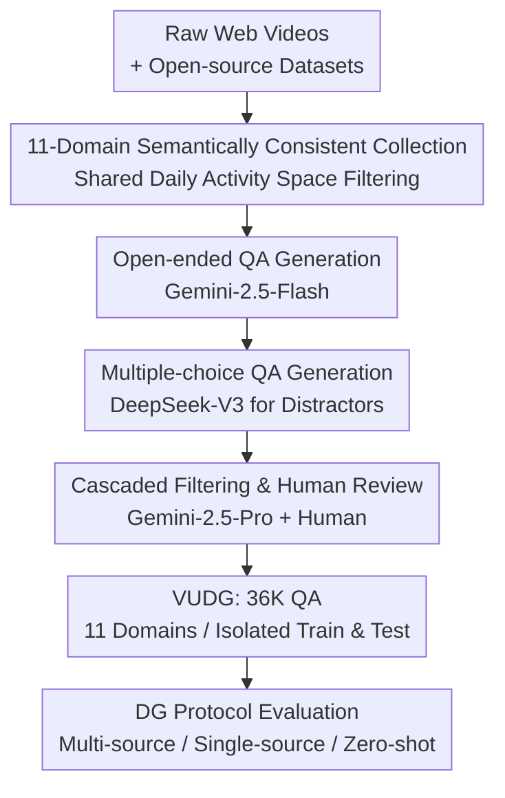

# VUDG: A Dataset for Video Understanding Domain Generalization

**Conference**: ICLR 2026  
**OpenReview**: [https://openreview.net/forum?id=0mUiXz1TNq](https://openreview.net/forum?id=0mUiXz1TNq)  
**Project Page**: [https://VUDG-Video.github.io](https://VUDG-Video.github.io)  
**Area**: Video Understanding  
**Keywords**: Domain Generalization, Video Question Answering, LVLM Evaluation, Multi-expert Annotation, Benchmark Dataset

## TL;DR
VUDG constructs the first dataset specifically designed to evaluate domain generalization (DG) in video understanding. By utilizing 11 domains that share the same semantic space but vary only in visual style, viewpoint, or environmental conditions—coupled with a multi-expert cascaded automated annotation pipeline generating 36K QA pairs—the results demonstrate that nearly all models, including the strongest LVLMs, suffer significant performance degradation when encountering domain shifts.

## Background & Motivation

**Background**: Video understanding (e.g., action recognition, VideoQA) has advanced rapidly in recent years due to large-scale models and annotated data, with an increasing number of Large Vision-Language Models (LVLMs) being fine-tuned for specific video applications.

**Limitations of Prior Work**: Existing models almost universally assume that the training and testing distributions are identical. Significant performance drops occur once distribution shifts are encountered in real-world deployments. Since it is impossible to enumerate all data distributions during the deployment phase, a model's ability to handle "unseen domains" is directly related to safety and reliability. This is essentially a **Domain Generalization (DG)** problem—training on source domains and requiring robust performance on target domains with different distributions.

**Key Challenge**: While several cross-domain video understanding benchmarks exist (e.g., TGIF-QA, MVBench, Video-MME, VideoVista), their **semantic spaces are inconsistent across domains**. For instance, content differences between "HowTo," "Film," and "Cartoon" categories are immense. Consequently, it is impossible to distinguish whether a performance drop is due to "domain shift" or because the "semantic content itself became more difficult," making DG capability unmeasurable.

**Goal**: To provide a dataset that **cleanly isolates domain shift effects**, making "model robustness across different domains" the sole variable, thereby allowing for a strict and fair evaluation of the domain generalization capabilities of video understanding models.

**Key Insight**: The authors argue that a prerequisite for fair DG evaluation is **cross-domain semantic consistency**. All domains should depict the same set of everyday human activities, varying only in filming style, viewpoint, or weather. By predefining a shared activity scene space and using it to filter videos, content homogeneity across 11 domains can be guaranteed, with differences existing only in the "domain" dimension.

**Core Idea**: Construct an 11-domain, semantically consistent VideoQA dataset using a "predefined shared activity semantic space + multi-expert cascaded annotation," transforming domain shift into a controllable variable to quantify the DG capability of LVLMs.

## Method

### Overall Architecture
VUDG is not a new model but rather a **dataset + annotation pipeline + evaluation protocol**. The overall objective is to first collect videos across 11 domains that share semantics but vary in domain attributes, then use a multi-expert cascaded automated annotation pipeline to generate structured QA pairs for each video, and finally evaluate various video models using standard DG protocols. The annotation pipeline consists of four stages: Video Collection $\rightarrow$ Open-ended QA Generation $\rightarrow$ Multiple-choice QA Generation $\rightarrow$ QA Filtering and Review. Different large models are used at each step to avoid self-reinforcement bias (where the same model both poses and answers questions), followed by a final manual quality check.

### Key Designs

**1. Semantically Consistent 11-Domain Design: Making "Domain Shift" the Sole Variable**

This design directly addresses the aforementioned key challenge where old benchmarks confound domain shifts with semantic changes. VUDG **manually defines a shared list of everyday human activity scenes** (e.g., reading documents, riding a bicycle, feeding pets) and uses Qwen2.5-VL-7B to select only content belonging to this list during collection. Thus, the 11 domains—Cartoon, Game, Movie/TV, Virtual (Visual Style); First-person, Surveillance, Shaking (Viewpoint); and Fog, Night, Rain, Snow (Environmental Conditions)—all depict the same activities. Performance differences across domains can thus be **cleanly attributed to the domain shift itself**. This is the fundamental difference from benchmarks like Video-MME and VideoVista (see Table 1 in the paper, where VUDG is the only dataset satisfying both Dom. $\checkmark$ and Sem. $\checkmark$).

To avoid data leakage from LVLM pre-training, VUDG **constructs separate training and test sets for each domain and forces them to originate from different data sources**. The training set is derived from training partitions of InternVid, ShareGPT4Video, VideoInstruct100K, and MMDL. The test set is derived from test partitions of VATEX, ActivityNet, VideoVista, MMDL, and UGC videos crawled from YouTube/TikTok/Bilibili (self-collected videos account for 49.62%). This "train-test source isolation" ensures that the evaluation measures true generalization rather than memorization.

**2. Multi-expert Progressive Annotation: Breaking Self-reinforcement Bias via Model Heterogeneity**

If the same large model is used for both generating and verifying questions, it tends to approve its own output, contaminating annotation quality with cyclic dependency. VUDG's solution is to **use different large models for the generation and verification phases**, forming a cascade. Four QA types are predefined: Action Recognition, Attribute Recognition, Object Recognition, and Temporal Understanding. Open-ended QA is generated by Gemini-2.5-Flash. Multiple-choice questions use DeepSeek-V3 to generate five "plausible but incorrect" distractors based on the original question and the correct answer, with the six options then randomized to balance the distribution.

The final step is **Hybrid Filtering**: first using the more powerful Gemini-2.5-Pro to review each entry based on the original video context, classifying each QA pair as (a) Correct, (b) Partially Incorrect with fixable flaws, or (c) Invalid. Human experts then correct or delete items labeled as (b) or (c). This **mandatory human-in-the-loop** combined with model cascading "breaks potential cyclic dependencies and reduces reliance on a single LLM," which is key to ensuring the quality of the 36,388 QA pairs.

**3. Three DG Protocols + Dual Evaluation Metrics: Covering Generalization Strength from Multi-source to Zero-shot**

VUDG supports three DG protocols. **Multi-source Generalization** uses Leave-One-Domain-Out: one domain is the target (using its test set), and the training sets of the remaining $N-1$ domains are merged as the source for training. The final performance is the average across all domains: $\text{Avg}_m = \frac{1}{N}\sum_{i=1}^{N} P_i$. **Single-source Generalization** uses Leave-But-One-Domain-Out: only one domain's training set is used as the source, and all other $N-1$ domains are targets: $\text{Avg}_s = \frac{1}{N}\sum_{i=1}^{N}\left(\frac{1}{N-1}\sum_{j=1,j\neq i}^{N} P_j^{i}\right)$. **Zero-shot** involves direct evaluation on the full test set without training.

Regarding metrics, MCQs are evaluated via accuracy. Open-ended QA is automatically scored by DeepSeek-V3 across two dimensions (5 points each, 10 points total): Action/Attribute/Object Recognition are scored on factual accuracy and relevance, while Temporal Understanding is scored on temporal accuracy and relevance. The final score is $\text{Score} = S_{acc} + S_{rel}$, where $S_{acc}, S_{rel} \in [0,5]$.

### Loss & Training
During evaluation, non-LLM methods undergo full-parameter fine-tuning, while LVLMs use LoRA (rank=128, scaling=256). In the zero-shot setting, all LVLMs use official default configurations. For frame sampling, models with fixed frame counts use their official settings (e.g., VideoLLaMA2 uses 16 frames), while models with fixed FPS are set to 1 FPS. Training videos are limited to a maximum of 10 minutes, whereas the test set deliberately includes longer videos to challenge long-range temporal context processing.

## Key Experimental Results

Dataset scale: Training set contains 6,337 videos / 31,685 QA pairs; Test set contains 1,532 videos / 4,703 QA pairs. Totaling 7,899 videos and 36,388 QA pairs, it leads in scale and is the only one with semantic consistency among compared datasets.

### Main Results (Zero-shot MCQ, 11-Domain Average D-Avg)

| Model | Visual Style | Viewpoint | Env. Cond. | D-Avg |
|------|------|------|------|------|
| Qwen2.5VL-7B | 70.1 | 73.7 | 72.9 | **72.1** |
| VideoLLaMA3-7B | 68.7 | 61.8 | 64.0 | 65.1 |
| GPT-4o (16 frames) | 67.6 | 65.4 | 61.0 | 64.6 |
| Tarsier2-7B | 64.1 | 64.6 | 60.5 | 62.8 |
| Video-CCAM-7B | 52.3 | 53.0 | 49.5 | 51.5 |
| Video-ChatGPT-7B | 12.7 | 12.9 | 15.1 | 13.6 |

The strongest open-source model, Qwen2.5VL-7B, achieved a 72.1% average accuracy, while the closed-source GPT-4o achieved only 64.6%, indicating that **large-scale pre-training does not automatically solve domain shift**. Early models (Video-ChatGPT, MiniGPT4-Video) hovered around 13%–14% accuracy (close to the random 16.7% for six options), showing extremely poor robustness.

### Ablation Study: Domain Generalization Performance Drops

| Setting | VideoLLaMA2-7B (D-Avg) | Description |
|------|------|------|
| All-domain Fine-tuning (Upper Bound) | 68.8 | Observed all domains |
| Multi-source DG | 66.9 | Leave-one-out, still below upper bound |
| Single-source DG (Env. Cond.) | 53.4 | 15.4 percentage point drop from upper bound |

The 15.4 point drop in single-source generalization compared to full fine-tuning highlights the extreme difficulty of transfer when only one domain is seen. Even the stronger VideoLLaMA2 performed below the all-domain upper bound under multi-source DG.

### Key Findings
- **Universal Drop from Domain Shift**: Every model from SOTA LVLMs to traditional VideoQA methods significantly degraded under distribution shift, validating the necessity of VUDG.
- **Non-LLM Methods Practically Fail**: HBI and EMCL4QA achieved only 17%–18% accuracy in DG settings, showing that methods without LLM priors have very limited generalization.
- **Strong Static, Weak Temporal Reasoning**: Most models performed better on Action/Attribute/Object recognition than on Temporal Understanding (e.g., Qwen2.5VL-7B scored 67.7% on temporal vs. 80.8% on object recognition), exposing a preference for static appearance over dynamic temporal cues.
- **Environmental Noise is Most Lethal**: Qwen2.5VL-3B was significantly weaker in adverse environments like Night (NI 55.9%) and Snow (SN 55.5%) compared to visual styles like Cartoon, showing sensitivity to visual degradation.
- **Open-ended Gap Narrows**: Scores were closer in open-ended settings, suggesting that free-form generation under domain shift is challenging for all, flattening the advantage of stronger models.

## Highlights & Insights
- **"Semantic Consistency" is the Key Methodological Contribution**: By decoupling "domain shift" from "semantic difference," DG evaluation becomes clean and credible for the first time.
- **Multi-model Cascade Breaks Self-reinforcement**: Using model heterogeneity rather than self-evaluation to ensure quality saves labor and avoids embedding single LLM systematic biases into the data.
- **Physical Isolation of Train/Test Sources**: Directly building partitions from different data sources is a robust way to prevent data leakage in the LLM era.

## Limitations & Future Work
- **Evaluation Benchmark Only**: While VUDG reveals flaws in LVLM domain generalization, it does not propose training methods to improve it.
- **Annotation Dependency**: Heavy reliance on specific models like Gemini-2.5 and DeepSeek-V3 affects reproducibility. Using an LLM (DeepSeek-V3) for automatic scoring also introduces a risk of cyclic bias.
- **Empirical Domain Categorization**: The 11 domains were defined by humans; whether they cover all real-world shifts or are comparable in difficulty remains to be validated further.

## Related Work & Insights
- **vs. Video-MME / VideoVista**: These contain multiple domains but **lack semantic consistency**, confounding performance drops. VUDG is the only dataset in Table 1 satisfying both requirements, effectively isolating domain shifts.
- **vs. Traditional VideoQA**: Experiments prove that non-LLM methods are nearly random under DG, highlighting the value of LLM priors for generalization.

## Rating
- Novelty: ⭐⭐⭐⭐⭐ First semantically consistent DG dataset for video understanding.
- Experimental Thoroughness: ⭐⭐⭐⭐ Covers 9 SOTA LVLMs + traditional methods, but lacks validation of improvement methods.
- Writing Quality: ⭐⭐⭐⭐ Clear explanation of the pipeline and protocols.
- Value: ⭐⭐⭐⭐⭐ Fills a gap in DG evaluation for video understanding.

<!-- RELATED:START -->

## Related Papers

- [\[CVPR 2026\] VideoNet: A Large-Scale Dataset for Domain-Specific Action Recognition](../../CVPR2026/video_understanding/videonet_a_large-scale_dataset_for_domain-specific_action_recognition.md)
- [\[AAAI 2026\] EmoVid: A Multimodal Emotion Video Dataset for Emotion-Centric Video Understanding and Generation](../../AAAI2026/video_understanding/emovid_a_multimodal_emotion_video_dataset_for_emotion-centric_video_understandin.md)
- [\[ICML 2026\] Return of Frustratingly Easy Unsupervised Video Domain Adaptation](../../ICML2026/video_understanding/return_of_frustratingly_easy_unsupervised_video_domain_adaptation.md)
- [\[ICLR 2026\] VideoNSA: Native Sparse Attention Scales Video Understanding](videonsa_native_sparse_attention_scales_video_understanding.md)
- [\[ICLR 2026\] PPLLaVA: Varied Video Sequence Understanding With Prompt Guidance](ppllava_varied_video_sequence_understanding_with_prompt_guidance.md)

<!-- RELATED:END -->
