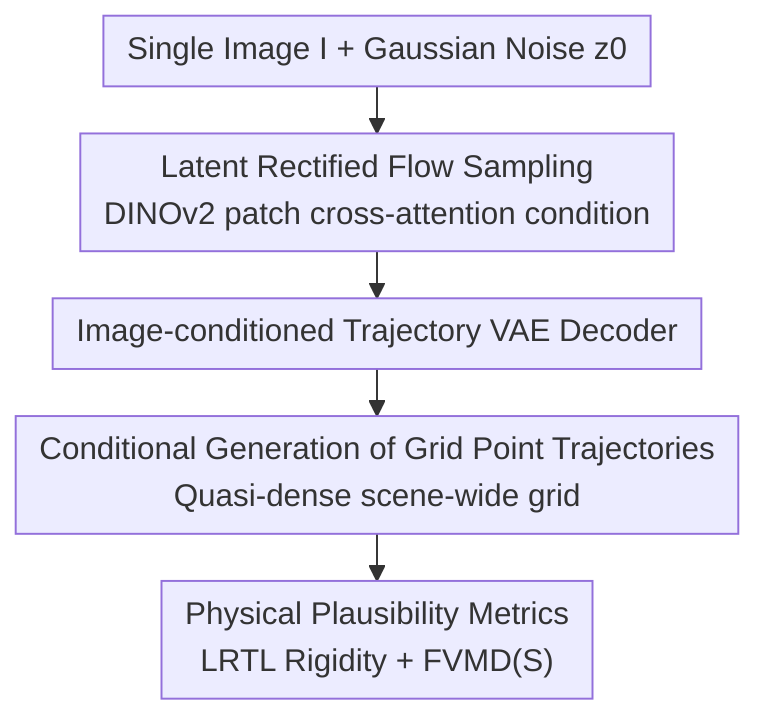

# What Happens Next? Anticipating Future Motion by Generating Point Trajectories

**Conference**: ICLR 2026  
**Paper**: Published as a conference paper at ICLR 2026  
**Code**: Not provided in the text  
**Area**: Video Understanding / Motion Prediction / Generative Models  
**Keywords**: Motion Prediction, Point Trajectory Generation, Flow Matching, Trajectory VAE, World Models

## TL;DR
This paper recasts the inherently ambiguous task of "predicting future motion from a single image" as a conditional generation task on a **dense grid of point trajectories**. By using a trajectory VAE to compress full-image point trajectories into a latent space and sampling diverse possible futures via rectified flow matching, the proposed method is both more accurate than regressive trajectory predictors and more physically plausible than large video models that generate RGB pixels before tracking.

## Background & Motivation
**Background**: Inferring "how things will move next" from a single image is a fundamental prerequisite for robotics control, model-based planning, and world models. The robotics field (ATM, Tra-MoE, Track2Act) has modeled this as predicting the trajectories of points in an image. However, these methods either perform deterministic regression on a few **active points** (e.g., on a robot arm) or use diffusion but still focus on only 32–400 target points. Another approach uses large video generators (WAN, SVD, LTX) trained on billions of videos as world models, generating RGB video first and then using point trackers to derive motion.

**Limitations of Prior Work**: ① Regressive trajectory predictors output a single deterministic result, failing to capture the inherent ambiguity where one image can have multiple plausible futures. Moreover, focusing only on active points discards scene-wide context (e.g., distant objects that might collide in a few frames). ② Large video models, even when fine-tuned on simple physical scenarios, frequently produce distortions, object splitting/disappearing, or physically implausible movements. They consume computation on low-level appearance (texture, lighting), often at the expense of motion accuracy.

**Key Challenge**: Motion prediction must **model uncertainty** (distribution of possible futures) while **maintaining physical plausibility** (rigidity, temporal coherence). Regression loses the former, while pixel generation loses the latter.

**Goal**: Develop a model with an architecture similar to modern video generators that **outputs motion instead of pixels**, achieving full-scene coverage, uncertainty modeling, and physical plausibility.

**Key Insight**: Trajectories directly encode motion and naturally possess inductive biases like **object permanence** and **temporal coherence**. In contrast, pixels must be re-translated into motion estimates, and these properties are exactly what general video generators struggle to guarantee. Hence, why not adapt the video generation recipe (latent space + flow matching) but replace RGB pixels with coordinate sequences of dense grid points?

**Core Idea**: Reformulate motion prediction as "generative modeling of quasi-dense grid point trajectories conditioned on an image," implemented via a trajectory VAE and latent rectified flow matching. This approach, trained from scratch, exceeds the performance of video models trained on billions of clips.

## Method

### Overall Architecture
A point trajectory is a 2D coordinate sequence $((x_0,y_0),\dots,(x_T,y_T))$ of a pixel over time. Given an image $I\in\mathbb{R}^{H\times W\times C}$, the model samples points on a grid with stride $s$ and predicts their motion for $T$ future steps, outputting a tensor $x\in\mathbb{R}^{\frac{H}{s}\times\frac{W}{s}\times T\times 2}$. Since this is an underdetermined problem, the authors model the conditional distribution $p(X\mid I)$ and sample multiple plausible futures.

The pipeline follows modern video generators: First, a **trajectory VAE** encodes grid trajectories into a low-dimensional latent space $z$ (both encoder and decoder use the image $I$ to utilize object boundaries and geometry). Second, a **rectified flow matching denoising network** $\hat v(z_t, I, t)$ is trained in the latent space to sample latent codes by integrating an ODE along a velocity field starting from Gaussian noise. Finally, the VAE decoder reconstructs the latent code into grid trajectories. Diversity is achieved by using different noise seeds during inference.

### Key Designs

**1. Recasting Motion Prediction as "Conditional Generation of Grid Point Trajectories"**

This is the foundation of the work, addressing the limitations of regressive predictors (deterministic output and sparse point focus). Instead of regressing 32 points, the authors **uniformly distribute points on a grid** (quasi-dense, every other pixel) and predict motion for every point regardless of whether it is static or dynamic. This has two benefits: First, the grid covers the entire scene, allowing the model to **jointly reason about scene dynamics** (distant objects might collide later, which requires a full-scene view). Second, formulating the task as **generation** of $p(X\mid I)$ allows multiple plausible futures to be explicitly modeled as a distribution. The paper identifies modeling uncertainty as more crucial than architecture-specific changes like MoE.

**2. Image-Conditioned Trajectory VAE Latent Space**

To address the difficulty of modeling in the raw trajectory space, a $\beta$-VAE compresses grid trajectories into a regularized latent space $z\in\mathbb{R}^{\frac{H}{rs}\times\frac{W}{rs}\times T\times D}$. The spatial dimensions are downsampled by $r$, but the **temporal dimension is uncompressed** for short windows ($T\in\{16,24,30\}$). Crucially, the encoder $\phi(x\mid I)$ and decoder $\psi(z\mid I)$ **take the image $I$ as additional input**, helping the model compensate for missing details between grid points using image-based boundaries and geometry. Training utilizes the $\beta$-VAE objective with Huber loss $L_\delta$ for reconstruction and KL regularization:

$$\mathcal{L}_{\beta\text{-VAE}} = \mathbb{E}_{z\sim N_\phi(x|I)}\big[L_\delta(x,\psi(z\mid I))\big] + \beta\cdot D_{KL}\big(N_\phi(x|I)\,\|\,N_0\big).$$

The encoder and decoder use symmetric spatio-temporal Transformers with learned Fourier features for coordinates.

**3. Latent Rectified Flow Matching**

Given the latent space, the conditional distribution $p(Z\mid I)$ is learned using rectified flow. For target $z_1\sim p(Z\mid I)$ and noise $z_0\sim N(0,I)$, a linear path $z_t=(1-t)z_0+tz_1$ is defined with constant velocity $v=z_1-z_0$. A network $\hat v(z_t,I,t)$ fits this velocity field:

$$\mathcal{L}_{RF}(\hat v)=\mathbb{E}_{z_0,(z_1,I),t}\big[\|\hat v(z_t,I,t)-(z_1-z_0)\|_2^2\big].$$

Inference samples a future by integrating the ODE from $z_0$. Unlike Track2Act, which compresses the image to a single vector, this method uses **DINOv2 patch tokens for spatio-temporal cross-attention** in each block, providing richer geometric information and leading to lower rigidity errors (LRTL).

**4. LRTL Rigidity Metric and FVMD(S) Distribution Metrics**

A specialized evaluation suite for generative motion predictors: ① **Best-of-K MSE**: Measures if the distribution covers the correct modes. ② **FVMD / FVMD(S)**: FVMD compares marginal distributions $p(X)$, while the **per-image FVMD(S)** evaluates the conditional distribution $p(X\mid I)$. ③ **LRTL (Low-Rank Trajectory Loss)**: Based on the principle that 2D trajectories of a rigid 3D object should form a low-rank matrix. LRTL is the Frobenius norm of the residual between the trajectory matrix and its rank-5 SVD truncation. Deformations or inconsistent group motions increase LRTL. FVMD and LRTL are complementary; LRTL alone could be minimized by predicting zero motion.

### Loss & Training
Two-stage process: First, train the trajectory VAE, then freeze it and train the latent space denoiser with rectified flow loss $\mathcal{L}_{RF}$. A noted training-inference discrepancy: training observes only one ground truth future per image, but the model must infer the existence of a multi-modal distribution from neighboring training samples. This is more challenging than text-to-video, as simple interpolation between physical samples may not result in a physically plausible motion.

## Key Experimental Results

### Main Results

**vs Regressive Trajectory Predictors (LIBERO Robotics Dataset, Lower MSE is better)**:

| Method | LIBERO-90 Side | LIBERO-90 Effector | LIBERO-10 Side | LIBERO-10 Effector |
|------|------|------|------|------|
| ATM (k=1) | 23.07 | 67.37 | 31.02 | 69.96 |
| Ours (MeanT, k=8) | 16.70 | 52.70 | 23.69 | 58.35 |
| Ours (Min, k=8) | **10.99** | **32.01** | **13.86** | **35.93** |

Ours significantly outperforms ATM and Tra-MoE. The advantage is most pronounced in the Effector view, where the camera moves with the arm, creating high uncertainty.

**vs Generative Methods and Video Models (Kubric, Lower is better)**:

| Model | FVMD | FVMD (S) | Best-of-K | LRTL |
|------|------|------|------|------|
| Track2Act (Traj. Diffusion) | 16735 | 22509 | 250.8 | 15.8 |
| **Ours (L)** | **13745** | **17838** | **127.0** | **14.1** |
| WAN 14B (Video) | 34573 | 42987 | 184.6 | 35.1 |
| WAN 1.3B† (Fine-tuned Video) | 14864 | 20010 | 162.8 | 26.6 |

Ours leads across all metrics even against fine-tuned video models. Trajectory-based methods show significantly lower LRTL, confirming that RGB generation overhead leads to non-rigid and implausible motion. In user studies, Ours was ranked first 52% of the time.

### Ablation Study

**Output Modality Ablation (Fixed architecture, varying output, Kubric)**:

| Latent Space | Latent Shape | FVMD | Best-of-K | LRTL |
|------|------|------|------|------|
| SVD (RGB) | 24×16×16×4 | 20589 | 195 | 48.5 |
| SD3.5 (RGB) | 24×16×16×16 | 16592 | 147 | 33.7 |
| WAN (RGB) | 7×16×16×16 | 17320 | 160 | 31.1 |
| SD3.5 + Tracks (Joint) | 24×24×16×16 | 15399 | 136 | 28.2 |
| **Tracks (Ours)** | 24×16×16×8 | **12221** | **127** | **15.9** |

Since latent dimensions were kept comparable, the gain is attributed to the **choice of modality** rather than dimensionality reduction.

### Key Findings
- **Modality > Scale**: A trajectory model trained from scratch outperforms video models like WAN/SVD/LTX trained on billions of clips, even when the latter are fine-tuned. Massive general video data does not automatically yield physical consistency.
- **Joint RGB+Trajectory Generation improves video quality**: Diffusion of RGB and trajectories simultaneously (using CoTracker3 to derive motion from generated RGB) improves metrics like LRTL, suggesting trajectory-based supervision helps video models achieve rigidity.
- **DINOv2 Patch Cross-Attention vs Single Vector**: Using patch tokens provides far richer geometric information, reducing MeanT MSE on Cityscapes from 7037 to 1475 compared to global vector conditioning.
- **Real-world Robustness**: On Physics101, Ours (MSE 28.62) outperforms fine-tuned WAN (30.08) and is particularly superior in complex "Multi" scenes with fewer outliers.

## Highlights & Insights
- The **modality ablation** is clean: by fixing the architecture and latent dimensions, it proves that motion should be modeled directly rather than inferred from pixels.
- The **LRTL rigidity metric** is clever: translating "rigid objects maintain shape" into "trajectory matrices are low-rank" provides a computable proxy for physical plausibility.
- Demonstrates that world models do not necessarily need to be pixel-based; the "trajectory-as-world-model" approach is highly transferable to policy learning and model-based control.

## Limitations & Future Work
- Primarily focused on **simulated** environments (Kubric/LIBERO); generalization to complex, long-horizon real-world scenarios remains to be tested.
- Evaluation depends on **pseudo-ground truth trajectories** (CoTracker3) for real data, which might introduce tracking errors into the conclusions.
- Temporal dimensions are not compressed, limiting prediction to short windows (16–30 frames); long-term error accumulation is not addressed.
- The mechanism for ensuring diversity in physical futures from a single ground truth training sample relies on implicit generative biases rather than an explicit mechanism.

## Related Work & Insights
- **vs ATM / Tra-MoE**: These use deterministic regression for active points. Ours uses full-scene generation, proving that modeling uncertainty and scene-wide context is more effective than specialized architectural tweaks like MoE.
- **vs Track2Act**: While both use trajectory diffusion, Track2Act uses only 400 points and a global image vector. Ours uses a dense grid and DINOv2 patch tokens, achieving higher accuracy and rigidity with a smaller model.
- **vs Video Models**: Video models prioritize appearance, leading to motion distortion. Ours targets motion directly, injecting object permanence and temporal continuity.
- **vs Walker (2016) / Li (2018)**: Classical methods used DCT or independent optical flow. Ours utilizes point trajectories (resistant to occlusion) and modern latent flow matching for a more structured and expressive latent space.

## Rating
- Novelty: ⭐⭐⭐⭐⭐ Transferring the video generation recipe to trajectories and proving "modality over scale" is a fresh perspective.
- Experimental Thoroughness: ⭐⭐⭐⭐⭐ Comprehensive comparison across regression, trajectory generation, and full video models with new metrics.
- Writing Quality: ⭐⭐⭐⭐ Clear logic; formulas and notation are dense but well-supported by figures.
- Value: ⭐⭐⭐⭐⭐ Provides strong evidence for trajectory-based world models for future robotics applications.

<!-- RELATED:START -->

## Related Papers

- [\[CVPR 2026\] Envisioning the Future, One Step at a Time](../../CVPR2026/video_understanding/envisioning_the_future_one_step_at_a_time.md)
- [\[ICLR 2026\] ARFlow: Auto-regressive Optical Flow Estimation for Arbitrary-Length Videos via Progressive Next-Frame Forecasting](arflow_auto-regressive_optical_flow_estimation_for_arbitrary-length_videos_via_p.md)
- [\[CVPR 2026\] InternVideo-Next: Towards World-Understanding Video Models](../../CVPR2026/video_understanding/internvideo-next_towards_world-understanding_video_models.md)
- [\[ICLR 2026\] Point Prompting: Counterfactual Tracking with Video Diffusion Models](point_prompting_counterfactual_tracking_with_video_diffusion_models.md)
- [\[CVPR 2026\] Generative Point Tracking and Forecasting](../../CVPR2026/video_understanding/generative_point_tracking_and_forecasting.md)

<!-- RELATED:END -->
