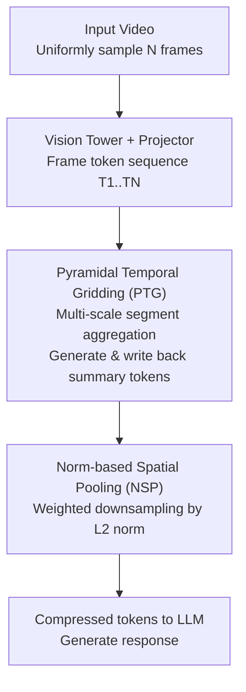

# Enhancing Visual Token Representations for Video Large Language Models via Training-free Spatial-Temporal Pooling and Gridding

**Conference**: ICLR2026  
**OpenReview**: [https://openreview.net/forum?id=MZi9SYPVz5](https://openreview.net/forum?id=MZi9SYPVz5)  
**Code**: https://github.com/bingjunluo/ST-GridPool  
**Area**: Multimodal VLM / Video Understanding / VLM Efficiency  
**Keywords**: Video Large Language Models, visual token compression, training-free, spatio-temporal pooling, token norm

## TL;DR
Addressing the issue where Video Large Language Models (Video LLMs) lose spatio-temporal information when compressing thousands of visual tokens into a limited context, this paper proposes ST-GridPool, a training-free method. It utilizes "Pyramidal Temporal Gridding" to aggregate frame tokens across different time scales, injecting multi-granularity motion information, and "Norm-based Spatial Pooling" to weighted-preserve high-information regions based on L2 norms. It achieves consistent performance gains as a plug-and-play solution on LLaVA-Video / LLaVA-OneVision without retraining.

## Background & Motivation
**Background**: To understand a video, Video LLMs must feed dozens of frames, each containing hundreds of visual tokens, into the language model. However, the complexity of self-attention grows quadratically with the number of tokens, and context length has a hard limit. Consequently, mainstream approaches (e.g., LLaVA series) typically use simple 2D average pooling or bilinear interpolation to compress the visual tokens of each frame into a fixed, smaller shape before inputting them into the LLM.

**Limitations of Prior Work**: Such "simple pooling/interpolation" treats all tokens equally during compression, leading to two overlooked issues. In the temporal dimension, it assumes that temporal dynamics in videos are "uniformly scaled," simply concatenating uniformly sampled frame tokens; however, real-world videos contain both fast micro-motions (e.g., gestures) and slow displacements (e.g., walking), which single-scale temporal modeling fails to capture. In the spatial dimension, semantically salient objects often occupy only small areas while large portions are background; equal-weight downsampling fails to prioritize regions rich in information, causing information loss and token redundancy.

**Key Challenge**: The downsampling function must simultaneously satisfy the conflicting goals of "reducing computation" and "preserving key spatio-temporal information," whereas simple pooling focuses only on the former at the expense of the latter.

**Goal**: To make the existing "visual token compression" step in Video LLMs smarter and increase the information density of compressed tokens without adding trainable parameters, changing architecture, or retraining.

**Key Insight**: Most previous training-free methods (e.g., SF-LLaVA, TS-LLaVA) focused on adapting image LLMs to video. However, native Video LLMs have advanced rapidly in the past year, making optimizations for image models insufficient. The authors advocate for training-free visual token enhancement **specifically designed for Video LLMs**. Concurrently, the authors made a key observation on the HKU-IS saliency detection dataset: the L2 norm of visual tokens is positively correlated with their semantic richness (tokens in salient object regions have high norms, while background regions have low norms), providing a zero-cost indicator for identifying which tokens to preserve.

**Core Idea**: Visual token compression is decoupled into optimized temporal and spatial paths—hierarchical gridding for injecting multi-granularity dynamics temporally, and token norm weighting for preserving high-information regions spatially. Both are training-free and combine into the plug-and-play ST-GridPool.

## Method

### Overall Architecture
ST-GridPool is placed after the vision encoder + multimodal projector and before the language model. The input is a sequence of frame tokens $T_1, T_2, \dots, T_N \in \mathbb{R}^{H\times W\times d}$, and the output consists of downsampled tokens $T^{\downarrow}_1, \dots, T^{\downarrow}_N$, which are then fed into the LLM for response generation. The pipeline consists of two serial modules: first, **Pyramidal Temporal Gridding (PTG)** aggregates segments of different lengths in the temporal dimension into "summary tokens" and writes them back to update the sequence, injecting multi-scale temporal dynamics; the updated sequence then enters **Norm-based Spatial Pooling (NSP)**, which performs spatial downsampling within each frame weighted by token norms to preserve high-information areas. Neither step introduces trainable parameters, as the host model simply replaces the original "simple pooling" function.

### Key Designs

**1. Pyramidal Temporal Gridding (PTG): Capturing dynamics with hierarchical grids across multiple time scales**

To address the limitation that simple concatenation assumes uniform temporal dynamics, PTG constructs a pyramid in the temporal dimension. It consists of $L$ layers, where the segment length for layer $l$ is $K_l = K\cdot 2^{l-1}$ ($K$ is the base length of the first layer). The frame sequence of length $N$ is divided into $N_l=\lceil N/K_l\rceil$ segments according to $K_l$. For example, with $N=32$, $K=8$, and $L=3$: Layer 1 splits the sequence into 4 segments (8 frames each, capturing short-term fine-grained dynamics), Layer 2 into 2 segments (16 frames each), and Layer 3 into 1 segment (all 32 frames, capturing long-term context).

Each segment generates a **summary token** to encapsulate its temporal dynamics: it uniformly samples $m\times n$ frames from the segment, concatenates their token grids into a large spatial grid $G_{l,j}$ (resolution becomes $mH\times nW$), and then uses bilinear interpolation to shrink it back to the original resolution $H\times W$, obtaining $\text{Interp}(G_{l,j})\in\mathbb{R}^{H\times W\times d}$. This summary token does not add new slots but **updates by overwriting** the last frame of the segment: $T_{t_{l,j}+K_l-1} \xleftarrow{\text{update}} \text{Interp}(G_{l,j})$. After processing all layers and segments, multi-scale temporal information from fine to coarse is embedded into the sequence while the total token count and parameters remain unchanged.

**2. Norm-based Spatial Pooling (NSP): Using token norms as saliency indicators for weighted preservation**

NSP addresses the issue where equal-weight spatial downsampling drowns out small salient objects. The design is based on the verified observation: **The L2 norm of a visual token is positively correlated with its semantic richness.** On the HKU-IS saliency set, regions enclosed by the top 50% of tokens by L2 norm almost align with salient object annotations. Thus, the norm serves as a **zero-cost, ready-made** measure of regional saliency.

NSP replaces uniform pooling with norm-weighted pooling. For a sliding window of size $(k_H,k_W)$ and stride $(s_H,s_W)$, let the token at position $(m,n)$ in the window be $t_{m,n}$. The $L_p$ norm $\|t_{m,n}\|_p$ is calculated and normalized into weights using softmax:

$$\alpha_{m,n}=\frac{\exp(\beta\|t_{m,n}\|_p)}{\sum_{i=0}^{k_H-1}\sum_{j=0}^{k_W-1}\exp(\beta\|t_{i,j}\|_p)}$$

The temperature $\beta$ controls the sharpness of the weight distribution. The output token is the weighted sum of features in the window $T^{\downarrow}_i(h,w)=\sum_{m}\sum_{n}\alpha_{m,n}\cdot t_{m,n}$. This ensures that high-norm (most likely salient object) tokens dominate the compression while low-norm backgrounds are suppressed.

### Loss & Training
The method is **completely training-free with zero additional parameters**. There is no training objective or fine-tuning process; it simply replaces the visual token downsampling function during inference. Key hyperparameters: spatial pooling kernel and stride are both 2, temperature $\beta=1$, and norm order $p=2$ (L2). Input frame counts and total LLM token counts are kept consistent with the original models (32 frames for LLaVA-OneVision, 64 frames for LLaVA-Video).

## Key Experimental Results

### Main Results
ST-GridPool was evaluated as a plug-and-play module on LLaVA-OneVision-7B and LLaVA-Video-7B across 6 benchmarks, including long video understanding (VideoMME / LongVideoBench / EgoSchema) and general video understanding (NexT-QA / TempCompass / MVBench), showing consistent improvements.

| Model | VideoMME | LongV.Bench | EgoSchema | NexT-QA | TempCompass | MVBench |
|------|----------|-------------|-----------|---------|-------------|---------|
| LLaVA-OneVision-7B | 58.2 | 56.5 | 60.1 | 79.4 | 64.2 | 56.7 |
| + Ours | 59.0 (+0.8) | 56.7 (+0.2) | 62.1 (+2.0) | 79.6 (+0.2) | 64.4 (+0.2) | 58.0 (+1.3) |
| LLaVA-Video-7B | 63.3 | 58.2 | 57.3 | 83.2 | 65.4 | 58.6 |
| + Ours | 64.2 (+0.9) | 60.1 (+1.9) | 57.8 (+0.5) | 83.8 (+0.6) | 66.1 (+0.7) | 59.8 (+1.2) |

Compared to mainstream token reduction methods (FastV / PruMerge / FasterVLM / VisionZip / FrameFusion) on LLaVA-Video-7B under different token budgets, the method excels particularly at high compression ratios:

| Method | VideoMME | L.V.Bench | EgoSchema |
|------|----------|-----------|-----------|
| Upper Bound (Full tokens, LLaVA-Video) | 63.3 | 58.2 | 57.3 |
| **30% Budget** FastV | 59.3 | 53.5 | 51.3 |
| 30% Budget FrameFusion | 61.3 | 56.0 | 53.0 |
| 30% Budget **Ours** | **62.0** | **58.1** | **56.0** |
| **50% Budget** FrameFusion | 62.6 | 57.6 | 55.8 |
| 50% Budget **Ours** | 62.5 | **58.9** | **57.1** |

Under a strict 30% budget, the method leads across all three long video benchmarks. At a 50% budget, it achieves the best results on L.V.Bench and EgoSchema, indicating its superior ability to identify and preserve key information under high compression.

### Ablation Study

| Configuration | VideoMME | LongV.Bench | MVBench | Description |
|------|----------|-------------|---------|------|
| Baseline (LLaVA-Video) | 63.3 | 58.2 | 58.6 | Original simple pooling |
| Ours w/o NSP | 63.8 | 59.2 | 59.1 | PTG only |
| Ours w/o PTG | 63.6 | 59.8 | 58.8 | NSP only |
| Ours (Full) | 64.2 | 60.1 | 59.8 | Complete model |

### Key Findings
- **Modules are complementary**: Adding PTG or NSP individually outperforms the baseline, but the best results are achieved when both are used together—PTG handles multi-scale temporal aggregation, while NSP aligns spatial saliency.
- **Hyperparameter Sensitivity**: For temperature $\beta$, performance peaks at $\beta=1$; extreme values (5 or 10) lead to drops due to over-smoothing or instability. For norm order $p$, L2 ($p=2$) provides the best balance between sparsity and discriminative power.
- **Lower Computational Cost**: At a 30% token budget, ST-GridPool reduces inference time and peak memory compared to the baseline. Savings increase with the number of input frames.
- **Greater Gains on Long Videos**: Improvements are particularly prominent on long video benchmarks like LongVideoBench (+1.9 for LLaVA-Video), as it effectively relates spatio-temporal information across large distances.

## Highlights & Insights
- **"Token norm ≈ semantic saliency" is a cheap yet effective insight**: Instead of training a saliency predictor, the L2 norm of tokens already computed by the encoder is used as an importance indicator, enabling zero-cost weighted spatial pooling. This correlation could potentially be transferred to image LLM token pruning or keyframe selection.
- **Pyramidal temporal aggregation via overwriting**: Summary tokens overwrite existing frame tokens rather than adding new ones, allowing the injection of multi-scale information within a fixed budget without increasing sequence length.
- **Completely training-free and plug-and-play**: Replacing the downsampling function during inference is all that is needed. It works directly for LLaVA-Video / LLaVA-OneVision, offering very low deployment costs.
- **Superior at high compression**: The relative advantage is greater when the token budget is tight (30%), showing that its strategy for "preserving key information and discarding redundancy" is more accurate than pure pruning or merging methods.

## Limitations & Future Work
- **Relatively small and uneven gains**: Most improvements are in the range of 0.2 to 0.9 points. Some datasets (e.g., NexT-QA, TempCompass) show negligible change. It serves more as a stable "cherry on top" than a massive breakthrough.
- **Reliance on norm-saliency correlation**: It is unclear if this correlation holds across all vision encoders or video domains (e.g., medical, low-light, or animation). If the encoder changes, the correlation between norm and semantics might weaken.
- **Limited validation scale**: Tested primarily on 7B-level LLaVA models. Its generalizability to larger scales or different architectures (e.g., Qwen-VL, InternVL) remains to be explored.
- **Future Directions**: Combining norm-weighting with finer semantic signals (like attention maps), making pyramid levels adaptive to content, or exploring norm-based saliency for keyframe selection in the temporal dimension.

## Related Work & Insights
- **vs. Simple 2D Pooling / Bilinear Interpolation (LLaVA Native)**: Native methods compress uniformly and concatenate at a single scale, ignoring spatio-temporal heterogeneity; Ours fills these gaps with multi-scale temporal grids and norm-weighted spatial pooling.
- **vs. SF-LLaVA / TS-LLaVA**: These are training-free tricks for adapting **image LLMs** to video; Ours targets **native Video LLMs** directly.
- **vs. Token Reduction Methods (FastV, VisionZip, etc.)**: These focus on pruning or merging redundant tokens; Ours focuses on "enhancing representation + weighted preservation," leading to higher fidelity under high compression.

## Rating
- Novelty: ⭐⭐⭐⭐ The "token norm as saliency" observation and pyramidal write-back temporal aggregation are clever, though it belongs to incremental improvements within existing token compression paradigms.
- Experimental Thoroughness: ⭐⭐⭐⭐ 6 benchmarks × 2 backbones + comparison with multiple token reduction methods + hyperparameter/cost analysis; however, lacks validation on larger models.
- Writing Quality: ⭐⭐⭐⭐ Clear motivation, observations, and methodology.
- Value: ⭐⭐⭐⭐ Training-free, plug-and-play, and stronger at high compression; has direct practical value for deployed Video LLMs.

<!-- RELATED:START -->

## Related Papers

- [\[CVPR 2026\] GroundVTS: Visual Token Sampling in Multimodal Large Language Models for Video Temporal Grounding](../../CVPR2026/vlm_efficiency/groundvts_visual_token_sampling_in_multimodal_large_language_models_for_video_te.md)
- [\[ICLR 2026\] VisionTrim: Unified Vision Token Compression for Training-Free MLLM Acceleration](visiontrim_unified_vision_token_compression_for_training-free_mllm_acceleration.md)
- [\[CVPR 2026\] ZOO-Prune: Training-Free Token Pruning via Zeroth-Order Gradient Estimation in Vision-Language Models](../../CVPR2026/vlm_efficiency/zoo-prune_training-free_token_pruning_via_zeroth-order_gradient_estimation_in_vi.md)
- [\[CVPR 2026\] MeToM: Metadata-Guided Token Merging for Efficient Video LLMs](../../CVPR2026/vlm_efficiency/metom_metadata-guided_token_merging_for_efficient_video_llms.md)
- [\[CVPR 2026\] Accelerating Streaming Video Large Language Models via Hierarchical Token Compression](../../CVPR2026/vlm_efficiency/accelerating_streaming_video_large_language_models_via_hierarchical_token_compre.md)

<!-- RELATED:END -->
