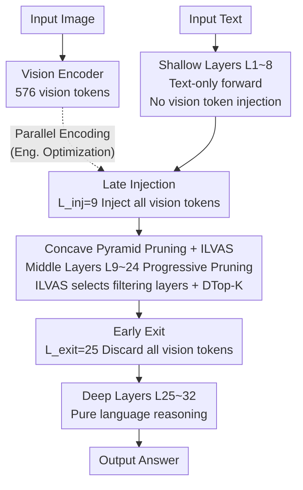

# HiDrop: Hierarchical Vision Token Reduction in MLLMs via Late Injection, Concave Pyramid Pruning, and Early Exit

**Conference**: ICLR 2026  
**arXiv**: [2602.23699](https://arxiv.org/abs/2602.23699)  
**Code**: [https://github.com/EIT-NLP/HiDrop](https://github.com/EIT-NLP/HiDrop)  
**Area**: Multimodal VLM  
**Keywords**: Vision token compression, MLLM acceleration, progressive pruning, Late Injection, diffused attention  

## TL;DR

The authors propose the HiDrop framework, which performs deep functional analysis of MLLM layers (Shallow = Propagators, Middle = Fusion Centers, Deep = Language Reasoning). It designs a three-stage strategy: Late Injection (skipping shallow layers), Concave Pyramid Pruning (pruning in middle layers), and Early Exit (exiting in deep layers). This approach compresses approximately 90% of vision tokens with negligible performance loss and achieves a 1.72× training speedup.

## Background & Motivation

**Background**: The computational overhead of processing vision tokens in MLLMs (e.g., LLaVA) grows quadratically with the number of tokens. Vision encoders generate significantly more tokens than text (e.g., 576 patch tokens), creating a primary bottleneck for both inference and training.

**Limitations of Prior Work**: Existing vision token pruning methods suffer from two core misconceptions: (a) the belief that shallow layers are critical multimodal fusion layers requiring dense vision tokens, whereas shallow layers actually perform little processing and primarily serve as passive propagators; (b) the use of fixed-ratio pyramid or linear pruning schedules (e.g., FastV, PDrop), which ignore the non-uniformity of information flow across different layers.

**Key Challenge**: How to design a token management strategy that dynamically aligns with the internal hierarchical processing of the model?

**Goal**: Design a token management strategy aligned with MLLM hierarchical functions—where vision tokens are not processed in shallow layers (skipped), aggressively pruned in middle layers where fusion redundancy is highest, and discarded in deep layers where fusion is complete.

**Key Insight**: Systematically analyze hierarchical behavior (intra-modal similarity + cross-modal influence) to replace heuristic assumptions with data-driven findings.

**Core Idea**: Execute the right operations at the right locations according to the functional division of MLLM layers (propagation/fusion/reasoning)—Late Injection, Aggressive Pruning, and Early Exit.

## Method

### Overall Architecture

The premise of HiDrop is that vision tokens are not "always needed" throughout the depth of the LLM. Thus, the management strategy should follow hierarchical functions rather than maintaining dense tokens from the first to the last layer. The authors first analyze hierarchical behavior, segmenting the 32 layers of LLaVA into three functional stages: shallow layers passively propagate vision information, middle layers are where cross-modal fusion occurs, and deep layers degrade into pure linguistic reasoning. Different strategies are applied to each segment.

Specifically, vision tokens do not enter the sequence in shallow layers (approx. Layers 1~8) via Late Injection. They are injected at the middle layers (approx. Layers 9~24) and progressively pruned using Differentiable Top-K in a "fast-then-slow" manner at selected filtering layers (Concave Pyramid Pruning). Upon reaching the deep layers (approx. Layers 25~32), all remaining vision tokens are discarded (Early Exit). This three-stage approach effectively opens a "processing window" for vision tokens that covers only about half of the total layers.

### Key Designs

**1. Late Injection: Skipping shallow layers**

Hierarchical analysis provides two pieces of evidence: vision tokens in shallow layers exhibit extremely high intra-modal cosine similarity, indicating they barely change, while cross-modal influence is near zero, indicating text representations are unaffected by images. Consequently, HiDrop injects vision tokens at $L_{inj}=9$, running only text through the first 8 layers. Unlike traditional routes that inject all tokens and then prune, HiDrop saves computation from the source.

**2. Concave Pyramid Pruning + ILVAS: Non-uniform middle layer pruning**

After injection, vision tokens enter the middle layers where fusion is densest and redundancy is highest. HiDrop addresses two questions: where to prune and what to prune. The pruning locations are determined by ILVAS (Inter-Layer Visual Attention Similarity), which measures the stability of vision token attention distributions between adjacent layers. Local maxima of the ILVAS curve are selected as filtering layers (e.g., layers {10, 14, 16, 18}). Token selection uses Differentiable Top-K (DTop-K): importance scores are normalized and sorted to get $c'_i$, and a soft mask is generated using sigmoid with a learnable threshold $a$:

$$\text{Mask}(c,a) = \sigma(\lambda(c'_i - a))$$

During the forward pass, discrete keep/drop decisions are made via a hard threshold, while gradients flow through the soft mask for importance estimation. Pruning follows a concave schedule—fast initially and slow later—matching the increasing sparsity of fusion in the middle layers.

**3. Early Exit: Discarding tokens in the reasoning phase**

Training-free experiments show that removing all vision tokens after layer 24 has almost no impact on performance. This suggests deep layers have completed cross-modal fusion and transitioned to pure language reasoning. Thus, remaining vision tokens are discarded at $L_{exit}=25$.

**4. Engineering Optimization**

*   **Persistent Position Encoding**: Assigns fixed position identifiers to vision tokens to prevent RoPE index confusion after dynamic pruning.
*   **FlashAttention Compatibility**: Uses a lightweight auxiliary attention for token selection while keeping the main attention computation unchanged, preserving FlashAttention acceleration.
*   **Parallel Decoupling**: Leverages Late Injection to execute shallow text forwarding and vision encoding in parallel.

### Loss & Training

- Follows standard LLaVA two-stage training (Pre-training + Instruction Tuning).
- DTop-K temperature coefficient $\lambda = N_v$ (number of vision tokens).
- Trained on $8 \times \text{A100 40GB}$.

## Key Experimental Results

### Main Results

Comparison on 11 benchmarks using LLaVA-1.5-7B (retaining ~64 tokens, 88.9% compression):

| Method | Type | MMEP | GQA | VQAv2 | POPE | MMStar | Avg(%) |
| :--- | :--- | :--- | :--- | :--- | :--- | :--- | :--- |
| LLaVA-1.5-7B | Upper Bound (576 t) | 1506.5 | 61.9 | 78.5 | 86.8 | 33.7 | 100.0 |
| FastV | Training-free | 1086.6 | 48.8 | 61.6 | 67.7 | 29.6 | 82.8 |
| PDrop | Training-based | 1350.7 | 56.6 | 71.8 | 82.6 | 32.7 | 94.2 |
| TwigVLM | Training-based | 1404.0 | 58.8 | 75.6 | 82.7 | 33.1 | 95.3 |
| **HiDrop** | **Training-based** | **1473.3** | **60.5** | **76.5** | **86.4** | **32.0** | **98.3** |

At an extreme 48 tokens (91.7% compression), HiDrop maintains 97.1% of the original performance.

### Ablation Study

| Configuration | Avg(%) | Description |
| :--- | :--- | :--- |
| Full HiDrop | 98.3 | Full framework |
| w/o Late Injection | 96.8 | Vision tokens processed in shallow layers |
| w/o Early Exit | 97.5 | Vision tokens kept in deep layers |
| w/o Concave (Linear) | 96.9 | Uniform pruning instead of concave |
| Hard Top-K | 97.1 | Non-differentiable hard selection |

Training Efficiency: HiDrop achieves a 1.72× training speedup compared to the original LLaVA-1.5-7B.

### Key Findings

- Late Injection contributes most (approx. 1.5% performance gain), proving that avoiding shallow processing reduces meaningless interference.
- Concave Pyramid > Linear > Convex Pyramid: Aggressive pruning in early fusion stages is optimal, aligning with fusion dynamic analysis.
- DTop-K outperforms Hard Top-K by ~1.2%, as differentiable selection allows importance estimation to be optimized via backpropagation.
- Even at 48 tokens (12× compression), the POPE metric only drops from 86.8 to 86.6, showing near-lossless performance.

## Highlights & Insights

- **Analysis-driven Design**: Rather than designing a method and then finding support, the authors perform systematic hierarchical analysis to drive algorithmic design.
- **Late Injection as a Breakthrough**: While prior methods assumed vision tokens are necessary from the first layer, HiDrop demonstrates that shallow layers do not require vision information, a localized insight potentially applicable to other modalities.
- **Structural Elegance**: The correspondence between policy and layer function—Late Injection (Propagation), Concave Pruning (Fusion), Early Exit (Reasoning)—is conceptually strong.

## Limitations & Future Work

- **Architecture Specificity**: Conclusions are validated on LLaVA-1.5; hierarchical behavior might differ in models like Qwen-VL or InternVL.
- **Fixed Thresholds**: $L_{inj}=9$ and $L_{exit}=25$ are hard-coded; different inputs might require dynamic windows.
- **Multi-image Scenarios**: Behavior in video or multi-image QA, where token counts are higher, remains unexplored.
- **DTop-K Overhead**: Differentiable Top-K introduces extra parameters/computation, requiring verification of the cost-benefit ratio on larger models.

## Related Work & Insights

- **vs. FastV**: FastV prunes once at an early layer, which is too coarse. HiDrop proves vision tokens should not be present in shallow layers at all.
- **vs. PDrop**: PDrop uses uniform intervals and ratios, ignoring non-uniform fusion dynamics. HiDrop’s ILVAS and concave scheduling are more precise.
- **vs. TwigVLM**: TwigVLM prunes in shallow layers; HiDrop's Late Injection is more efficient as it bypasses those layers entirely.

## Rating

- **Novelty**: ⭐⭐⭐⭐⭐ (Late Injection is a fresh perspective)
- **Experimental Thoroughness**: ⭐⭐⭐⭐⭐ (11 benchmarks, multiple scales, detailed ablation)
- **Writing Quality**: ⭐⭐⭐⭐⭐ (Fluid narrative from analysis to design)
- **Value**: ⭐⭐⭐⭐⭐ (Highly practical for MLLM acceleration)

<!-- RELATED:START -->

## Related Papers

- [\[CVPR 2026\] SCoRe: Salience-Coverage Reduction for Vision Token Pruning in Vision-Language Models](../../CVPR2026/vlm_efficiency/score_salience-coverage_reduction_for_vision_token_pruning_in_vision-language_mo.md)
- [\[ICLR 2026\] LearnPruner: Rethinking Attention-based Token Pruning in Vision Language Models](learnpruner_rethinking_attention-based_token_pruning_in_vision_language_models.md)
- [\[NeurIPS 2025\] Beyond Greedy Exits: Improved Early Exit Decisions for Risk Control and Reliability](../../NeurIPS2025/vlm_efficiency/beyond_greedy_exits_improved_early_exit_decisions_for_risk_control_and_reliabili.md)
- [\[ICLR 2026\] SURGE: Surprise-Guided Token Reduction for Efficient Video Understanding with VLMs](surge_surprise-guided_token_reduction_for_efficient_video_understanding_with_vlm.md)
- [\[ICLR 2026\] IVC-Prune: Revealing the Implicit Visual Coordinates in LVLMs for Vision Token Pruning](ivc-prune_revealing_the_implicit_visual_coordinates_in_lvlms_for_vision_token_pr.md)

<!-- RELATED:END -->
