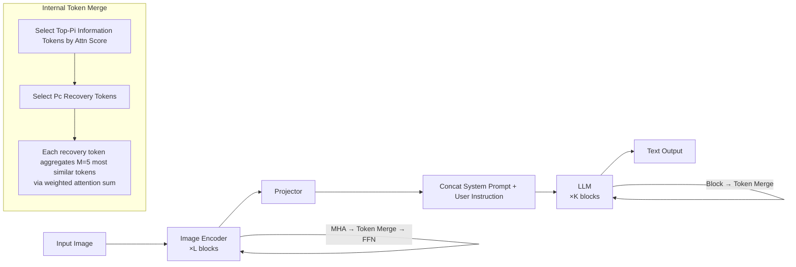

# iLLaVA: An Image Is Worth Fewer Than 1/3 Input Tokens in Large Multimodal Models

**Conference**: ICLR 2026  
**OpenReview**: [https://openreview.net/forum?id=svKk3PkjZn](https://openreview.net/forum?id=svKk3PkjZn)  
**Code**: [https://github.com/hulianyuyy/iLLaVA](https://github.com/hulianyuyy/iLLaVA)  
**Area**: Multimodal Large Model Acceleration / Vision Token Compression  
**Keywords**: LVLM acceleration, token merging, image encoder, training-free, dual-stage compression  

## TL;DR
iLLaVA breaks the inertia of "compressing tokens only in the LLM stage" by inserting token merging into both the **image encoder** and the **LLM**. Using an "information tokens + recovery tokens" merging strategy to retrieve useful information from discarded tokens, it achieves 2× throughput and 4× prefilling acceleration training-free while maintaining >95% performance.

## Background & Motivation
- **Background**: Works like FastV, SparseVLM, FasterVLM, VisionZip, PyramidDrop, and DivPrune have made significant progress in accelerating Large Vision-Language Models (LVLMs) by pruning or compressing redundant visual tokens.
- **Limitations of Prior Work**: These methods focus almost exclusively on the **LLM stage**—reducing tokens before entering the LLM or within the LLM itself to lower its computational load. However, they overlook another major computational bottleneck: the **image encoder**. This paper measures that in single-image, multi-image, and video tasks, the encoder and LLM together account for >99% of inference time, with the encoder alone occupying 17%~45% (highest in video tasks).
- **Key Challenge**: The image encoder is both a heavy computation consumer and the **largest source** of input tokens for the LLM. Reducing tokens only in the LLM manages the downstream while ignoring the upstream, failing to achieve true end-to-end acceleration. The paper demonstrates that for the same number of tokens reduced, reducing them in the encoder provides +25.3% more throughput and 21.2% less VRAM consumption compared to reducing them in the LLM.
- **Goal**: Incorporate the image encoder into the acceleration landscape, co-allocating the computation budget with the LLM to achieve "upstream relief → downstream chain relief" compounding acceleration while minimizing performance loss.
- **Core Idea**: **Dual-stage token merging + information recovery**—performing token merging in both the encoder and LLM, and extracting "representative tokens" from discarded tokens to aggregate useful information back rather than simple pruning.

## Method

### Overall Architecture
iLLaVA is a training-free plug-and-play solution: token merging modules are inserted between the attention and FFN of several blocks in the image encoder, and after several blocks in the LLM. Each module reduces a fixed set of tokens, uses attention scores to locate important tokens, and recovers information from discarded tokens into a small number of "recovery tokens." The entire process introduces no trainable parameters and adds negligible additional computation.

### Key Designs

**1. Dual-stage token merging: Shifting reduction down to the encoder**—Previous methods avoided pruning in the encoder because aggressive reduction in early stages could drop critical information, leading to severe performance degradation. iLLaVA splits the reduction across two stages for collaborative budget allocation: $B_v$ blocks in the encoder each reduce $R_v$ tokens; $B_t$ blocks in the LLM each reduce $R_t$ tokens. Given $N$ input tokens, the final count is $N - R_v \times B_v - R_t \times B_t$. The forward pass in the encoder is $x^v_{out} = \mathrm{FFN}(\mathrm{TokenMerge}(\mathrm{MHA}(x^v_{in})))$, and in the LLM it is $x^t_{out} = \mathrm{TokenMerge}(K_i(x^t_{in}))$. Since encoder reduction **proportionally shortens** the sequence sent to the LLM, every token reduced upstream leads to compounding computational savings downstream. The default configuration allocates 40% of merging to the encoder (Layers 5/9/13) and 60% to the LLM (Layers 2/8/14).

**2. Information token + recovery token merging strategy: Preserving useful information**—The preserved $P_v = N - R_v$ tokens are split into two types: $P^i_v$ **information tokens** and $P^c_v$ **recovery tokens**, such that $P^i_v + P^c_v = P_v$. Attention scores $S_h = \mathrm{Softmax}(Q_h K_h^T / \sqrt{D_h})$ are averaged over the head dimension to obtain $S_{avg} \in \mathbb{R}^N$. The Top-$P^i_v$ tokens are selected as information tokens. The remaining "minor" tokens are not discarded directly; instead, $P^c_v$ tokens are selected from them based on $S_{avg}$ to serve as "cluster centers." Each recovery token aggregates its $M$ (typically 5) most similar tokens by weighted summation using normalized attention scores. Finally, information and recovery tokens are concatenated as the module output. This recovery mechanism is critical for performance, significantly outperforming simple pruning or ToMe.

**3. Flash-Attention compatibility and near-zero extra overhead**—While vanilla attention can easily yield $S_{avg}$, Flash-Attention does not return the full attention matrix. The paper passes `return_attn_probs` to `flash_attn_varlen_func` to obtain the cumsum attention weights $S_{cumsum} \in \mathbb{R}^N$, then uses a simple transformation to derive $S_{avg}$ without extra computation. The only overhead comes from calculating $S_{sub}$ with complexity $O(R_v)\times B_v + O(R_t)\times B_t$. Since $R_v, R_t$ are in the dozens while inputs involve thousands of tokens, this overhead is negligible, ensuring that acceleration is not offset by computation costs.

## Key Experimental Results

### Main Results (Image Benchmarks, Qwen2.5-VL 7B, relative performance retention vs. vanilla)

| Reduction Ratio | Method | Avg. Retention |
|---|---|---|
| 66.7% | VisionZip (CVPR25) | 98.4% |
| 66.7% | **iLLaVA** | **99.2%** |
| 77.8% | VisionZip (CVPR25) | 96.4% |
| 77.8% | **iLLaVA** | **97.6%** |
| 88.9% | VisionZip (CVPR25) | 93.7% |
| 88.9% | **iLLaVA** | **95.2%** |

On video benchmarks (VideoMME / MVBench / EgoSchema / MLVU): At 90% reduction, iLLaVA outperforms the runner-up VisionZip by 1.2%; at 95% reduction, the gap widens to 1.7%, showing greater advantages at more aggressive levels.

### Ablation Study

| Stage Configuration | Acc(%) | Throughput | VRAM |
|---|---|---|---|
| Vanilla (No reduction) | 65.3 | 1.86 | 32.1G |
| LLM stage only | 62.1 | 3.46 | 23.1G |
| Encoder + LLM (iLLaVA) | Higher | **2.12×** | **0.64×** |

- **Dual-stage Design**: Including the encoder increases throughput to 2.12× and reduces VRAM to 0.64× compared to vanilla, with better accuracy than the "LLM-only" baseline.
- **Merging Strategy**: Compared to token pruning, SparseVLM/VisionZip/PyramidDrop merging, and the classic ToMe, iLLaVA's "recovery" strategy yields the highest average accuracy with comparable or better throughput.

### Key Findings
- **Efficiency**: On MMMU, iLLaVA achieves 1.59× VRAM savings, 2.12× throughput boost, and 4.46× reduction in prefilling time. The advantage grows as reduction ratios increase from 50% to 90%.
- **Big Wins Over Small**: With iLLaVA, InternVL-2.5 26B outperforms InternVL-2.5 8B at similar throughput (+4.2%/+2.2% on MMMU/MMStar). Qwen2.5-VL 7B also outperforms the 3B version with higher throughput (+5.6%/+8.1% on MMMU/MMStar).
- **Universality**: Consistent SOTA performance across architectures like LLaVA-OneVision, InternVL-2.5, and MiniCPM-V 2.6.

## Highlights & Insights
- **Repositioning the Bottleneck**: Using empirical data to highlight that the image encoder is both a heavy computation consumer and a primary token source is the paper's most persuasive motivation—the same reduction in the encoder yields 25.3% more throughput than in the LLM.
- **Compounding Acceleration**: Reducing tokens in the encoder shortens the LLM input sequence. This "upstream relief → downstream chain relief" lever is unavailable to single-stage methods.
- **Information-Preserving Engineering**: The "info + recovery" strategy compresses discarded content into a few cluster centers, preserving performance with near-zero overhead while resolving practical Flash-Attention deployment issues.
- **Training-free and Plug-and-play**: Requires no weight changes or retraining, allowing direct application to mainstream LVLMs.

## Limitations & Future Work
- Token importance relies entirely on attention scores. In scenarios where attention does not accurately reflect semantic importance (e.g., fine-grained OCR, dense counting), critical tokens might be mis-deleted. This failure mode was not explored in depth.
- The block selection and budget distribution (40%/60%, fixed layer indices) are empirical. There is a lack of an adaptive or learnable budget allocation mechanism.
- The "Fewer than 1/3 tokens" title is based on high reduction configurations. Extreme reduction (88.9%/95%) still causes a ~5% performance drop, requiring a trade-off for accuracy-sensitive applications.
- Robustness of hyperparameters, such as the number of similar group members $M=5$ and the ratio of info/recovery tokens across different tasks, requires more systematic validation.

## Related Work & Insights
- **LLM Stage Token Compression**: FastV (Top-K activation), SparseVLM (text-guided evaluation), FasterVLM (CLS-token pruning), PyramidDrop (phased proportional dropout), DivPrune (Max-Min diversity), AdaFV (cross-modal attention mixing)—iLLaVA complements this "LLM-only" line by including the encoder.
- **Token Merging**: VisionZip (merging discarded info into selected tokens), AIM (merging then pruning), and the classic ToMe—iLLaVA's recovery strategy can be seen as an upgrade of ToMe's concept into "attention-guided information recovery" deployed across both encoder and LLM.
- **Insight**: When pursuing model acceleration, using profiling to identify the actual distribution of bottlenecks is often more effective than optimizing in traditional locations; "recovery before discarding" is a universal paradigm for preserving performance in token reduction methods.

## Rating
- **Novelty**: ⭐⭐⭐⭐ — Moving reduction into the encoder with collaborative budget allocation is a clear incremental innovation. The recovery strategy and Flash-Attention compatibility are solid, though the core technique builds on mature attention-scoring paradigms.
- **Experimental Thoroughness**: ⭐⭐⭐⭐ — Covers 10+ benchmarks and various backbones with comprehensive efficiency metrics. Ablations support both key designs, though missing analysis on failure modes and robustness.
- **Writing Quality**: ⭐⭐⭐⭐ — Data-driven motivation with smooth logic, intuitive diagrams, and clear methodology.
- **Value**: ⭐⭐⭐⭐ — Training-free, plug-and-play, and 2× end-to-end throughput. Demonstrating "big wins over small" provides direct practical value for LVLM deployment.

<!-- RELATED:START -->

## Related Papers

- [\[ACL 2026\] ReGATE: Learning Faster and Better with Fewer Tokens in MLLMs](../../ACL2026/vlm_efficiency/regate_learning_faster_and_better_with_fewer_tokens_in_mllms.md)
- [\[ICCV 2025\] ShortV: Efficient Multimodal Large Language Models by Freezing Visual Tokens in Ineffective Layers](../../ICCV2025/vlm_efficiency/shortv_efficient_multimodal_large_language_models_by_freezing_visual_tokens_in_i.md)
- [\[ICLR 2026\] Photon: Speedup Volume Understanding with Efficient Multimodal Large Language Models](photon_speedup_volume_understanding_with_efficient_multimodal_large_language_mod.md)
- [\[CVPR 2026\] What Do Visual Tokens Really Encode? Uncovering Sparsity and Redundancy in Multimodal Large Language Models](../../CVPR2026/vlm_efficiency/what_do_visual_tokens_really_encode_uncovering_sparsity_and_redundancy_in_multim.md)
- [\[ICLR 2026\] PPE: Positional Preservation Embedding for Token Compression in Multimodal Large Language Models](ppe_positional_preservation_embedding_for_token_compression_in_multimodal_large_.md)

<!-- RELATED:END -->
