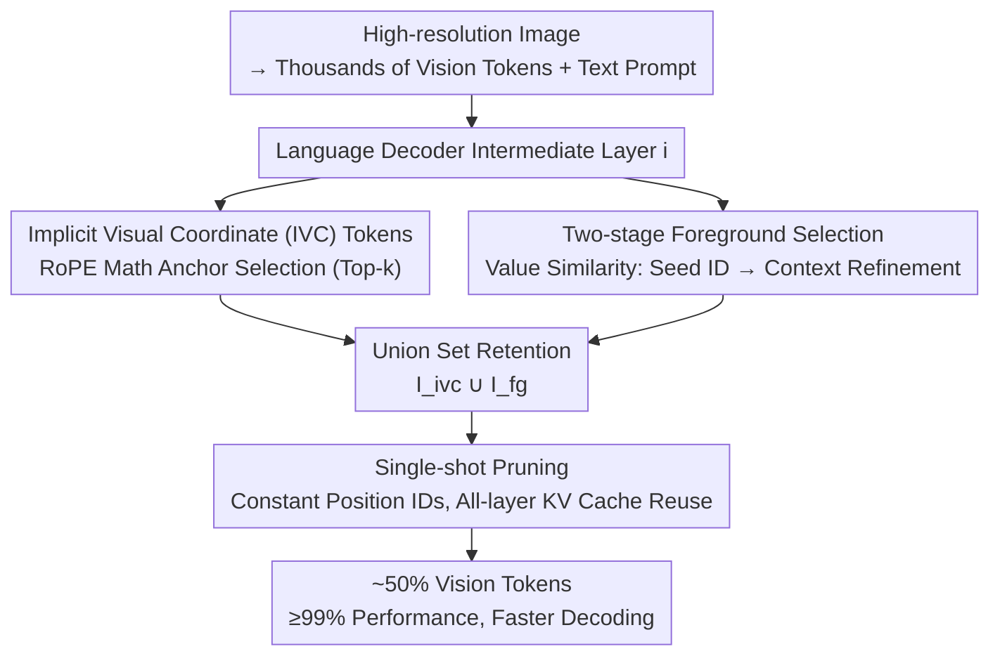

# IVC-Prune: Revealing the Implicit Visual Coordinates in LVLMs for Vision Token Pruning

**Conference**: ICLR 2026  
**arXiv**: [2602.03060](https://arxiv.org/abs/2602.03060)  
**Code**: [GitHub](https://github.com/FireRedTeam/IVC-Prune)  
**Area**: Multimodal VLM  
**Keywords**: Vision token pruning, RoPE positional encoding, Implicit visual coordinates, Spatial reasoning, Training-free

## TL;DR

This work reveals the implicit visual coordinate system (IVC tokens) established by RoPE positional encoding in LVLMs and proposes a training-free, prompt-aware vision token pruning strategy. By preserving both IVC tokens and semantic foreground tokens, it reduces visual tokens by approximately 50% while maintaining $\ge 99\%$ of the original performance.

## Background & Motivation

High-resolution image inputs generate thousands of vision tokens for Large Vision-Language Models (LVLMs), leading to significant memory overhead and high latency during inference. Existing vision token pruning methods primarily focus on semantic relevance, selecting tokens aligned with text semantics through attention scores or similarity metrics. However, these methods suffer severe degradation in space-sensitive tasks (e.g., visual grounding, spatial reasoning). The reason is that they only retain semantically relevant "foreground" tokens while discarding positional reference tokens crucial for spatial reasoning.

The authors provide the first deep analysis of how LVLMs perform spatial reasoning through RoPE. The core finding is that the rotation matrix of RoPE approximates the identity matrix (real-axis reference) or a 90° rotation matrix (imaginary-axis reference) at specific token positions; tokens at these positions naturally act as implicit visual coordinate anchors. When these tokens are removed by pruning methods, the model's spatial reasoning capability is severely impaired.

## Method

### Overall Architecture

IVC-Prune addresses the issue where high-resolution images result in thousands of vision tokens, causing unsustainable memory and latency, while existing pruning methods fail on spatial tasks because they only recognize "semantic relevance" and discard spatial anchors. The core idea is to identify two types of tokens to retain in parallel at an intermediate layer of the language decoder: **Implicit Visual Coordinate (IVC) tokens**, determined by the mathematical properties of RoPE to support the spatial reference frame, and **Foreground tokens**, which align with the semantics of the text prompt. After computing both sets, their union $\mathcal{I}_{\text{selected}} = \mathcal{I}_{\text{ivc}} \cup \mathcal{I}_{\text{fg}}$ is determined as the retention set. This decision is made **only once at the selected layer** and then applied to the KV cache of all layers, discarding the remaining vision tokens. The entire process is training-free and can be computed on-the-fly when a prompt arrives.

### Key Designs

**1. Implicit Visual Coordinate (IVC) Tokens: Extracting Absolute Position Anchors from RoPE Mathematics**

This step answers why certain tokens naturally serve as coordinate references and identifies them as a retention set. RoPE splits each $d$-dimensional feature into $d/2$ two-dimensional subspaces and applies rotation to the token at position $m$. The attention score is expressed as:

$$\text{Score}(\mathbf{q}_n, \mathbf{k}_m) = \mathbf{x}_n^T \mathbf{W}_q^T \mathbf{R}_{m-n} \mathbf{W}_k \mathbf{x}_m$$

While it essentially depends on the relative position $(m-n)$, spatial reasoning requires absolute positions. The key insight is that when the rotation matrix $\mathbf{R}_m$ of a key token at position $m$ approximates the identity matrix or a 90° rotation matrix, the relative rotation is "canceled," and the attention actually isolates the absolute position component $\mathbf{R}_n$ of the query itself. Such an $m$ becomes a coordinate anchor referenceable across the entire image. Finding an approximate identity matrix (real-axis reference) is equivalent to maximizing the cosine score $V(m) = \sum_{k=0}^{d/2-1} \cos(m\theta_k)$, and finding an approximate 90° rotation (imaginary-axis reference) is equivalent to maximizing the sine score $U(m) = \sum_{k=0}^{d/2-1} \sin(m\theta_k)$. With these curves, selecting IVC tokens involves taking the top-$k_c$ from each and merging them:

$$\mathcal{I}_{\text{ivc}} = \arg\text{TopK}(\{V(m)\}, k_c) \cup \arg\text{TopK}(\{U(m)\}, k_c)$$

By default, $k_c = 10\%$, resulting in IVC tokens accounting for about 10% of all vision tokens. Note that this step is entirely determined by position and $\theta_k$, independent of image content or model forward pass, allowing for pre-computation with zero inference overhead.

**2. Two-stage Foreground Selection: Bypassing Position Bias via Value Vectors**

Coordinate anchors alone are insufficient; tokens related to the target of the question must also be retained. Traditional methods pick foreground tokens based on attention scores, but attention is "polluted" by positional encoding, causing text tokens to favor spatially adjacent vision tokens over semantically relevant ones. IVC-Prune uses **Value vectors**, which are unaffected by positional encoding, to calculate similarity for debiasing. This is done in two stages. In the "Semantic Seed Identification" stage, the similarity between text values $\mathbf{V}_{\text{text}}$ and image values $\mathbf{V}_{\text{img}}$ is calculated by averaging normalized attention across text tokens for each vision token:

$$\mathbf{s} = \text{Mean}\left(\text{Softmax}\left(\frac{\mathbf{V}_{\text{text}} \cdot \mathbf{V}_{\text{img}}^T}{\sqrt{D}}\right)\right)$$

The top 1% vision tokens are selected as the seed set $\mathcal{I}_{\text{seed}}$. The second stage, "Contextual Foreground Refinement," concatenates these seeds with all text tokens to form an augmented query set $\mathbf{V}_{\text{query}}$, calculates similarity again to get refined scores $\mathbf{f}$, and selects the top-$k_f$ as the final foreground set $\mathcal{I}_{\text{fg}}$. The two-stage process ensures the seeds hit the target core while refinement completes the remaining parts of large or complex objects.

**3. Single-shot Selection Pruning: Compressing Multi-layer Pruning into One Operation**

The final design corrects a common misunderstanding. Prior work suggested that LVLMs are particularly sensitive to pruning in early layers, leading to cautious layer-by-layer methods. The authors found that this sensitivity actually arises from the accidental removal of IVC tokens rather than the pruning itself. Once IVC tokens are preserved, early layers can be pruned without performance loss. Consequently, the scheme becomes straightforward: determine the retention set **once** at a selected intermediate layer, keep position IDs unchanged, and apply this same selection back to the KV cache of all early layers and forward to subsequent layers. This offers three benefits: minimal single-operation overhead, prevention of unreliable shallow-layer selections from polluting downstream computation, and maximized KV cache compression for faster decoding.

### Loss & Training

IVC-Prune is a completely **training-free** method that requires no additional training or fine-tuning. The selection of IVC tokens is determined by the mathematical properties of RoPE, and foreground token selection is performed via Value vector similarity calculations. The selection layer $i$ is fixed based on empirical performance on a small validation set (RefCOCO testA subset).

## Key Experimental Results

### Main Results

Evaluated across 4 LVLMs (Qwen2.5-VL-7B, InternVL-2.5-8B, DeepSeek-VL2-16B, LLaVA-v1.5-7B) and 20 benchmarks.

**Visual Grounding Tasks (RefCOCO/RefCOCO+/RefCOCOg)**:

| Model | Method | Tokens Retained | Relative Avg Performance |
|-------|--------|-----------------|--------------------------|
| Qwen2.5-VL-7B | Vanilla | 100% | 100% |
| Qwen2.5-VL-7B | FastV | 54% | 84.7% |
| Qwen2.5-VL-7B | IVC-Prune | 50% | **99.6%** |
| InternVL-2.5-8B | Vanilla | 100% | 100% |
| InternVL-2.5-8B | FastV | 53% | 90.1% |
| InternVL-2.5-8B | IVC-Prune | 50% | **99.5%** |
| DeepSeek-VL2-16B | FastV | 54% | 96.7% |
| DeepSeek-VL2-16B | IVC-Prune | 52% | **99.0%** |

**General VQA Tasks (Average of 9 benchmarks)**:

| Model | Method | Tokens Retained | Relative Avg Performance |
|-------|--------|-----------------|--------------------------|
| Qwen2.5-VL-7B | Vanilla | 100% | 100% |
| Qwen2.5-VL-7B | FastV | 54% | 98.4% |
| Qwen2.5-VL-7B | IVC-Prune | 50% | **100.6%** |
| InternVL-2.5-8B | IVC-Prune | 50% | **99.6%** |
| DeepSeek-VL2-16B | IVC-Prune | 52% | **100.1%** |
| LLaVA-v1.5-7B | IVC-Prune | 28% | **101.3%** |

### Ablation Study

**Impact of IVC tokens (Qwen2.5-VL-7B)**:

| Method | Config | RefCOCO testA | RefCOCO+ testA | SEED | MMB |
|--------|--------|---------------|----------------|------|-----|
| Vanilla | Default | 92.2 | 88.0 | 76.7 | 82.4 |
| Vanilla | Remove IVC | 84.1 | 79.4 | 76.1 | 82.2 |
| FastV | Default | 74.4 | 68.9 | 72.9 | 80.5 |
| FastV | +IVC | 82.1 | 76.5 | 74.6 | 80.5 |
| PDrop | Default | 77.6 | 72.1 | 74.0 | 78.9 |
| PDrop | +IVC | 83.9 | 76.5 | 74.6 | 79.2 |

**Inference Efficiency (Qwen2.5-VL-7B, RefCOCO testA)**:

| Method | KV Cache | Prefill Time | Decoding Latency | Total Time | Accuracy |
|--------|----------|--------------|------------------|------------|----------|
| Vanilla | 26.0MB (1.0×) | 408ms | 65.3ms/tok | 60'17 | 92.2 |
| FastV | 16.1MB (1.6×) | 297ms | 62.7ms/tok | 51'51 | 74.4 |
| IVC-Prune | 15.9MB (1.6×) | 322ms | 60.2ms/tok | **47'47** | **92.0** |

### Key Findings

1. **IVC tokens are critical for spatial reasoning**: In the unpruned Vanilla model, removing only IVC tokens (~10%) drops RefCOCO testA by 8.1 points, while SEED and MMB are almost unaffected.
2. **IVC tokens are universally integrable**: Adding IVC tokens to FastV and PDrop significantly improves their grounding performance (FastV: +7.7, PDrop: +6.3).
3. **True cause of early-layer sensitivity**: The previously reported sensitivity to early-layer pruning stems from the accidental removal of IVC tokens; preserving them allows for pruning at any layer without performance loss.
4. **Consistency across model scales**: Performance remains consistent across 3B, 7B, and 32B versions of Qwen2.5-VL.

## Highlights & Insights

- **Deep Theoretical Innovation**: The work is the first to mathematically reveal the mechanism by which LVLMs implicitly establish a visual coordinate system through RoPE. This not only explains the failure of existing pruning methods on spatial tasks but also provides 
a new perspective for understanding the spatial reasoning capabilities of LVLMs.
- **High Practicality**: The method is entirely training-free. IVC token selection is pure mathematical calculation, and foreground token selection requires only a single Value vector similarity computation, making it plug-and-play for existing LVLMs.
- **Insight-driven Design**: After identifying the root of early-layer sensitivity, a single-shot selection strategy was proposed, simplifying pruning from a multi-layer operation to a single-layer one while maximizing KV cache savings.
- **Debiasing via Value Vectors**: Cleverly utilizing the property that Value vectors are unaffected by positional encoding solves the position bias issue found in attention scores.

## Limitations & Future Work

1. The ratios for IVC tokens ($k_c=10\%$) and foreground tokens ($k_f=40\%$) are fixed hyperparameters and may not be optimal for all scenarios; dynamic ratio adjustment is worth exploring.
2. Determining the selection layer requires searching on a validation set, adding some setup cost.
3. The method was primarily validated on 2D static images; its effectiveness in dynamic scenes like video understanding requires further evaluation.
4. Theoretical analysis is based on standard 1D and 2D RoPE; generalizability to other positional encoding schemes needs more research.

## Related Work & Insights

Similar to the concept of retaining "attention sink" tokens and delimiter tokens in LLMs (e.g., StreamingLLM and SepLLM), IVC-Prune identifies and retains "coordinate anchor" tokens in LVLMs. This suggests that different types of "special tokens" play key roles in various model capabilities. The Value vector debiasing technique may also inspire other scenarios requiring unbiased feature selection.

## Rating

- **Novelty**: ⭐⭐⭐⭐⭐ — First to reveal the RoPE implicit coordinate system; significant theoretical contribution.
- **Technical Quality**: ⭐⭐⭐⭐⭐ — Rigorous mathematical analysis; elegant two-stage foreground selection design.
- **Experimental Thoroughness**: ⭐⭐⭐⭐⭐ — 4 models × 20 benchmarks; comprehensive ablations.
- **Practicality**: ⭐⭐⭐⭐⭐ — Training-free, plug-and-play, clear efficiency gains.
- **Writing Quality**: ⭐⭐⭐⭐⭐ — Logical flow from theoretical discovery to method design.
- **Overall**: ⭐⭐⭐⭐⭐ (9.5/10)

<!-- RELATED:START -->

## Related Papers

- [\[ICLR 2026\] Prune Redundancy, Preserve Essence: Vision Token Compression in VLMs via Synergistic Importance-Diversity](prune_redundancy_preserve_essence_vision_token_compression_in_vlms_via_synergist.md)
- [\[CVPR 2026\] ZOO-Prune: Training-Free Token Pruning via Zeroth-Order Gradient Estimation in Vision-Language Models](../../CVPR2026/vlm_efficiency/zoo-prune_training-free_token_pruning_via_zeroth-order_gradient_estimation_in_vi.md)
- [\[AAAI 2026\] Rethinking Visual Token Reduction in LVLMs under Cross-Modal Misalignment](../../AAAI2026/vlm_efficiency/rethinking_visual_token_reduction_in_lvlms_under_cross-modal_misalignment.md)
- [\[CVPR 2026\] IF-Prune: Information-Flow Guided Token Pruning for Efficient Vision-Language Models](../../CVPR2026/vlm_efficiency/if-prune_information-flow_guided_token_pruning_for_efficient_vision-language_mod.md)
- [\[CVPR 2026\] Hi-Lo Prune: Look at What You'll Lose before Pruning with Hierarchical Token Selection](../../CVPR2026/vlm_efficiency/hi-lo_prune_look_at_what_youll_lose_before_pruning_with_hierarchical_token_selec.md)

<!-- RELATED:END -->
