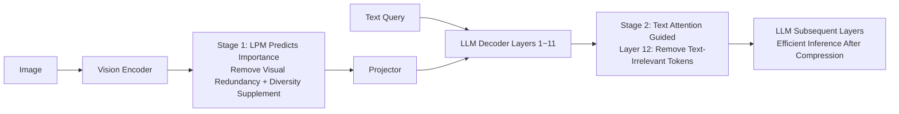

# LearnPruner: Rethinking Attention-based Token Pruning in Vision Language Models

**Conference**: ICLR 2026  
**OpenReview**: [https://openreview.net/forum?id=Dxb6gBJHby](https://openreview.net/forum?id=Dxb6gBJHby)  
**Code**: Authors committed to open-source (not yet released as of the note)  
**Area**: VLM Inference Efficiency / Vision Token Pruning  
**Keywords**: Token Pruning, Vision-Language Model, Attention Sink, Learnable Pruning, Inference Acceleration  

## TL;DR
LearnPruner empirically debunks the prevalent assumption that "attention score = token importance." It points out that [CLS] attention in vision encoders is contaminated by attention sinks, while in LLMs, only "text-to-vision" mid-layer attention is reliable. Consequently, it replaces [CLS] attention with a learnable pruning module and superimposes text-guided pruning at the LLM mid-layers. By retaining only ~5.5% of vision tokens, it maintains 95% performance and achieves a 3.2× speedup.

## Background & Motivation
**Background**: VLMs encode images into long visual token sequences for LLMs. LLaVA-1.5 generates 576 tokens per image, while LLaVA-NeXT can reach 2880 tokens with high-resolution cropping. The number of visual tokens far exceeds text tokens, despite lower information density. Token pruning has thus become a mainstream efficiency solution—assigning importance scores to each visual token and retaining only the top-k.

**Limitations of Prior Work**: Almost all methods use "attention scores" as a proxy for importance: either using [CLS] token attention from the vision encoder (VisPruner, VisionZip) or average attention received by tokens inside the LLM (FastV, SparseVLM). However, the authors discovered two issues via LLaVA-1.5 attention heatmaps—first, the vision encoder suffers from **attention sink**: [CLS] allocates excessive attention to low-information background regions (consistent with the ViT phenomenon of generating high-norm register/artifact tokens), leading to the loss of foreground during aggressive pruning; second, visual attention in the LLM suffers from **attention shift**: causal masking and positional encoding decay cause later-indexed visual tokens to systematically receive higher scores, biasing the pruning.

**Key Challenge**: Trusting attention directly leads to pruning the wrong tokens, but completely abandoning attention loses the cross-modal query-relevance guidance. It is necessary to distinguish "which part of the attention is trustworthy and which part should be replaced."

**Goal**: Replace the unreliable [CLS] attention on the vision encoder side with learnable importance prediction, and remove unreliable visual attention on the LLM side, keeping only reliable text-to-vision attention. Pruning is split into two stages to balance accuracy and acceleration.

**Key Insight**: The authors' key empirical finding is that **text-to-vision attention is resistant to attention shift**, and this reliability is strongest in the LLM mid-layers (around layer 12). (Shallow and deep attention are absorbed by non-informative areas, while mid-layer text tokens focus on their respective semantically relevant regions). **Two-stage progressive pruning**: Use a learnable module after the vision encoder to remove visual redundancy, then use text-to-vision attention at the LLM mid-layer to remove query-irrelevant content.

## Method

### Overall Architecture
LearnPruner is a two-stage progressive pruning pipeline: The first stage uses a lightweight Learnable Pruning Module (LPM) after the vision encoder to predict the importance of each visual token and retain the most informative subset, while additionally keeping a small number of "diversity tokens" to supplement background context. The second stage uses text-to-vision attention at the 12th layer of the LLM for query-aware secondary pruning, further discarding vision tokens irrelevant to the question. The base VLM weights remain frozen throughout, with only the LPM being trained.

### Key Designs
**1. Learnable Pruning Module (LPM): Replacing contaminated [CLS] attention with supervision.** Since [CLS] attention is biased by attention sinks, the authors "learn" importance instead of "reading" it from attention. The visual token features $X_v^{(0)}$ from the encoder are fed into a lightweight MLP for binary classification, outputting a soft mask $M_\text{soft}=\mathrm{Softmax}(\mathrm{MLP}(X_v^{(0)}))$. $M_\text{hard}=\arg\max(M_\text{soft})$ determines whether to retain or prune. Since discrete decisions are non-differentiable, the Straight-Through Estimator (STE) is used during training to drop tokens based on the hard mask in the forward pass while backpropagating gradients through the soft mask. During inference, $M_\text{soft}$ is used directly as the importance score. This module has only 0.53M parameters—extremely lightweight compared to VisionZip‡ (20.9M) or TwigVLM (610M)—yet it lifts the first-stage accuracy from 94.6% (using [CLS] attention) to 96.1%.

**2. Diversity Token Supplement: Preventing foreground bias at the cost of background clues.** LPM naturally prefers semantically rich foregrounds, but answers to some VQA tasks reside in the background. During inference, the authors add a similarity-based greedy selection: for tokens not selected by LPM, the maximum cosine similarity to the already selected set is calculated. In each iteration, the token with the "minimum maximum similarity" is added until the token budget is met. These diversity tokens (weighted at $\lambda=10\%$) ensure complementary visual context coverage to avoid an overly homogeneous compressed set.

**3. Text-guided Mid-layer Secondary Pruning: Using only the reliable part of attention.** Empirical evidence shows vision-to-vision attention is contaminated by attention shift and is unusable, but text-to-vision attention is reliable. In the second stage at LLM layer $k=12$, the attention from all $N_q$ query tokens to visual tokens is averaged across heads to obtain a query-relevance score for each visual token: $\tilde{A}^{(k)}=\frac{1}{N_q}\sum_{i=1}^{N_q} A^{(k)}(X_{q,i}^{(k)}, X_v^{(k)})$; only the top-k are kept. Layer 12 is chosen because shallow/deep layers are absorbed by non-informative areas, whereas mid-layers see text tokens focusing on semantically relevant regions. Ablations show that inserting another LPM in the second stage provides no gain—indicating that mid-layer text attention signals are already reliable enough, making additional learnable features redundant.

**4. Two-stage Budget Allocation: Removing redundancy first, then irrelevance.** Using LPM alone (similar to Dynamic-LLaVA) only removes visual redundancy. Using text attention alone requires delaying pruning to mid-layers, leaving the first 11 layers processing redundant tokens with limited speedup. Chaining both allows the first stage to significantly compress the sequence (budget allocated as $R_1:R_2=3$; $R_1$ kept in stage 1, $R_2$ in stage 2). This reduces redundant computation in the LLM's early stages (yielding real speedup) and allows the second stage to perform a query-aware selection on a cleaner set, overall lifting performance from 96.1% to 96.9%.

## Key Experimental Results
Evaluated on LLaVA-v1.5-7B, LLaVA-NeXT-7B, Video-LLaVA-7B, and Qwen2.5-VL-7B against FastV, SparseVLM, DivPrune, DART, VisPruner, VisionZip, TwigVLM, etc.

### Main Results (LLaVA-v1.5-7B, Relative Accuracy RelAcc.)

| Retained Tokens | Method | Learnable Params | RelAcc. |
|---|---|---|---|
| 128 (↓77.8%) | VisPruner | - | 97.3% |
| 128 | TwigVLM | 610M | 99.0% |
| 128 | **Ours** | 0.53M | **98.5%** |
| 64 (↓88.9%) | TwigVLM | 610M | 96.0% |
| 64 | **Ours** | 0.53M | **96.9%** |
| 32 (↓94.4%) | VisPruner | - | 89.7% |
| 32 | DivPrune | - | 90.5% |
| 32 | **Ours** | 0.53M | **94.8%** |

In the most aggressive setting of 32 tokens (only 5.6%), LearnPruner leads the second-best method (DivPrune, 90.5%) by 4.3 percentage points, with parameters three orders of magnitude smaller than the training-based TwigVLM. On LLaVA-NeXT-7B, retaining 160 tokens (↓94.4%) yields 94.0% RelAcc. (VisionZip‡ 93.3%); on Qwen2.5-VL-7B, retaining 142 tokens (↓88.9%) yields 94.1%, while FastV drops to 71.4%.

### Ablation Study (LLaVA-v1.5-7B, Fixed 64 Retained Tokens)

| Stage 1 Criterion | Stage 2 Criterion | RelAcc. |
|---|---|---|
| [CLS] Attn | - | 94.6% |
| LPM | - | 96.1% |
| LPM | LPM | 96.9% |
| LPM | Text Attn | 96.9% |

Replacing [CLS] attention with LPM in Stage 1 directly yields +1.5%; adding Stage 2 adds another +0.8%. Using LPM vs. text attention in Stage 2 yields identical results (96.9%), confirming that mid-layer text attention is sufficiently reliable without additional training.

### Key Findings
- **Efficiency**: On LLaVA-v1.5-7B with 32 tokens, prefill speedup is 2.3×, total time 1.5×, KV cache reduced by 6.8×, and TFLOPs decreased by 5.4×. On LLaVA-NeXT-7B with 160 tokens, prefill speedup is 6.0× and total time 3.2×. The longer the sequence, the more pronounced the speedup; LPM overhead is negligible.
- **Layer-wise Reliability**: From layer 8 onwards, text attention can maintain 95%+ of baseline performance. Mid-layers are most stable, while deep layers drop sharply—providing direct justification for "Layer 12 pruning."
- **Cross-Architecture/Modal Generalization**: Consistently outperforms FastV on non-LLaMA based Qwen2.5-VL and video tasks (TGIF/MSVD/MSRVTT-QA).

## Highlights & Insights
- **Diagnosis Before Prescription**: The most valuable part of the paper is not the module itself, but the decomposition of the industry-standard "attention=importance" assumption into two falsifiable sub-propositions (vision encoder attention sink and LLM attention shift). Quantitative falsification using foreground segmentation control experiments + layer-wise attention controls is highly convincing—especially the result that "random foreground selection" rivals "[CLS]-based full image selection."
- **Optimal Trade-off Between Learning and Training-Free**: By training only a 0.53M MLP with frozen base weights using 10% of LLaVA-665K data, the method enjoys the accuracy of learnable methods while keeping training costs far lower than TwigVLM (610M) or VisionZip‡ (20.9M).
- **Clear Separation of Learning vs. Rules**: Stage 1 attention is unreliable → use a learnable module; Stage 2 text attention is reliable → use it directly. Ablation proves adding a module here is unhelpful, avoiding over-engineering.

## Limitations & Future Work
- **LPM Requires Training and Foreground Labels**: High-level analysis uses LangSAM/SAM-2 for foreground segmentation to argue against [CLS] flaws. Although LPM training is end-to-end supervised, its inductive bias toward foregrounds might pose risks in tasks with ambiguous foregrounds or answers in the background; diversity tokens are a patch, not a cure.
- **Manual Hyperparameters**: The pruning layer (12), budget ratio ($R_1:R_2=3$), and $\lambda=10\%$ are empirical settings. There is a lack of an adaptive mechanism for different models and resolutions.
- **Limited Video and Long-Sequence Validation**: Video experiments only use the first 1000 samples of each benchmark and only compare against FastV, missing comparisons with stronger video-specific pruning methods.
- **Unreleased Code/Checkpoints**: Reproducibility currently relies on descriptions in the main text and appendix.

## Related Work & Insights
- **Training-Free Attention Pruning Spectrum**: FastV (shallow layer average attention), PyramidDrop (progressive redundancy), SparseVLM (text-aware + rank-adaptive ratio), VisPruner/VisionZip (fallback to [CLS] attention + token merging)—LearnPruner "reverse engineers" the attention assumptions of this spectrum.
- **Diversity Perspective**: DivPrune and DART maintain diverse sets via feature similarity; LearnPruner's diversity token module adopts this logic to compensate for foreground bias.
- **Training-Based Pruning**: ATP-LLaVA (instance-level thresholds), TwigVLM (inserted decoding blocks + speculative decoding), Dynamic-LLaVA (learned importance predictors)—LearnPruner's LPM is related to Dynamic-LLaVA but achieves superior budget distribution via mid-layer text pruning.
- **Insights**: When a "proxy signal" is adopted by default across an entire field, it is worth using controlled experiments to verify its reliability boundaries at different modules/layers rather than trusting or discarding it wholesale—"layer-specific reliability and module-specific trade-offs" may be more effective than "global weighting."

## Rating
- **Novelty**: ⭐⭐⭐⭐ Components (learnable MLP with STE, text-attention pruning, diversity selection) are mostly existing techniques, but the "double diagnosis (sink + shift) → modular learn/use decision" framework is novel and explanatory.
- **Experimental Thoroughness**: ⭐⭐⭐⭐ Covers 4 VLMs (including Qwen2.5-VL, video), multiple token budgets, and all efficiency dimensions (TFLOPs/latency/KV cache/memory) with clear ablations; video comparisons and hyperparameter sensitivity analysis are slightly weaker.
- **Writing Quality**: ⭐⭐⭐⭐ Motivation-evidence-method logic chain is smooth. Diagrams (heatmaps, layer-wise comparisons) provide intuitive support.
- **Value**: ⭐⭐⭐⭐ Significant lead in aggressive pruning ranges (5% tokens) with extremely light parameters. Directly useful for resource-constrained VLM deployment and provides methodological insights on "attention as importance."

<!-- RELATED:START -->

## Related Papers

- [\[CVPR 2026\] Rethinking Token Reduction for Large Vision-Language Models](../../CVPR2026/vlm_efficiency/rethinking_token_reduction_for_large_vision-language_models.md)
- [\[ACL 2026\] HiPrune: Hierarchical Attention for Efficient Token Pruning in Vision-Language Models](../../ACL2026/vlm_efficiency/hiprune_hierarchical_attention_for_efficient_token_pruning_in_vision-language_mo.md)
- [\[ICLR 2026\] IVC-Prune: Revealing the Implicit Visual Coordinates in LVLMs for Vision Token Pruning](ivc-prune_revealing_the_implicit_visual_coordinates_in_lvlms_for_vision_token_pr.md)
- [\[ICLR 2026\] HiDrop: Hierarchical Vision Token Reduction in MLLMs via Late Injection, Concave Pyramid Pruning, and Early Exit](hidrop_hierarchical_vision_token_reduction_in_mllms_via_late_injection_concave_p.md)
- [\[CVPR 2026\] Attention-aware Inference Optimizations for Large Vision-Language Models with Memory-efficient Decoding](../../CVPR2026/vlm_efficiency/attention-aware_inference_optimizations_for_large_vision-language_models_with_me.md)

<!-- RELATED:END -->
