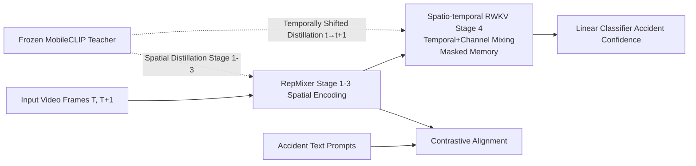

# Lightweight Spatio-Temporal Modeling via Temporally Shifted Distillation for Real-Time Accident Anticipation

**Conference**: ICLR 2026  
**OpenReview**: [https://openreview.net/forum?id=8zzfTSVds2](https://openreview.net/forum?id=8zzfTSVds2)  
**Code**: To be confirmed  
**Area**: Efficient Multimodal / Video Understanding / Traffic Accident Anticipation  
**Keywords**: Accident Anticipation, Knowledge Distillation, RWKV, Spatio-temporal Modeling, Edge Deployment, MobileCLIP  

## TL;DR
Using a **frozen image-only CLIP teacher + temporally shifted distillation**, a lightweight RepMixer+RWKV student learns "predictive" temporal capabilities without large-scale video pre-training. It achieves SOTA on the DAD/CCD accident anticipation benchmarks while being 3–7× smaller than competitors and running at 80 FPS on Jetson Orin Nano.

## Background & Motivation
**Background**: Real-time traffic accident anticipation requires assigning a "collision imminent" confidence score to every frame. The prediction window is extremely narrow, and scenarios are highly dynamic. Early methods (DSA, FA, adaLEA) used RNNs with soft attention, which have weak spatial reasoning. Subsequent research shifted to graph modeling and reinforcement learning (DRIVE, GSC, DSTA), but these depend on pre-defined graph structures, dense object-level annotations, or "detection + tracking" multi-stage pipelines.

**Limitations of Prior Work**: Existing strong baselines (DAA-GNN, CCAF-Net, MASTTA) generally follow an object-centric multi-stage route (e.g., "Faster R-CNN detection + VGG16 feature extraction"). These models often have 100–275M parameters and high latency, making them impossible to deploy on automotive edge devices. CCAF-Net even requires additional depth maps.

**Key Challenge**: Strong temporal modeling usually necessitates video-pre-trained teachers or spatio-temporal Transformers with quadratic complexity ($O(N^2T^2)$). However, accidents are rare events, video pre-training data is expensive and scarce, and edge devices are strictly limited by computing power and memory—**"temporal expressiveness" and "lightweight real-time" performance are difficult to balance**.

**Goal**: To create an end-to-end compact model that directly processes raw RGB frames and runs in real-time on Jetson while maintaining high early-prediction accuracy.

**Key Insight**: **Temporally Shifted Distillation (TSD)**. The student's output at time $t$ is aligned with the teacher's features at $t+1$. By using a frozen image-only teacher that inherently lacks temporal concepts, the student is "forced" to develop predictive temporal representations, thereby completely bypassing the need for video-pre-trained teachers.

## Method

### Overall Architecture
The framework uses a teacher-student structure: the teacher is a frozen MobileCLIP (4 RepMixer stages, with Stage 4 being purely spatial MHSA). The student shares the first three RepMixer stages of the backbone but replaces Stage 4 with a spatio-temporal RWKV block for linear-complexity temporal reasoning. Training occurs in two stages: first, pre-training with TSD + contrastive learning on MM-AU/Nexar video-text pairs, followed by end-to-end fine-tuning on DAD/CCD.

### Key Designs

**1. Temporally Shifted Distillation: Teaching temporal skills via a non-temporal teacher.** This is the most critical contribution. In the spatial branch, the student’s features at stage $\ell \in \{1,2,3\}$, after projection $P_\ell$, arealigned with the teacher's features at the same time: $L_{\text{spatial}}=\sum_{\ell=1}^{3}\lVert P_\ell(f^{(S)}_{t,\ell})-f^{(T)}_{t,\ell}\rVert_2^2$, which "copies" spatial semantics. The real trick lies in the temporal branch: the student uses its output at time $t$ to **predict the teacher's spatial features at $t+1$**: $L_{\text{temporal}}=\lVert H_{ST}(f^{(S)}_{t})-f^{(T)}_{t+1}\rVert_2^2$, where $H_{ST}$ is a spatio-temporal projection head. Since the supervisory signal is "shifted" by one frame, the student is forced to learn "what the next frame will look like," effectively treating a static image teacher as a future-frame oracle. Ablations (Table 5/6) show that TSD alone (74.1%) outperforms spatial-only distillation (71.2%). Replacing it with a true video teacher like V-JEPA2 yields a lower mAP (66%) due to spatial alignment issues from mismatched resolutions/tokenization. Table 4 shows a 1-frame shift is optimal; larger shifts improve lead time but degrade accuracy, fitting the "short-horizon" nature of accident prediction.

**2. Spatio-Temporal RWKV Block: Windowed recurrent temporal modeling with linear complexity.** The student's Stage 4 partitions features into $K$ non-overlapping windows ($p_1 \times p_2$) for local recurrence, avoiding quadratic attention. Temporal Mixing first performs learnable interpolation between the current frame $X_t$ and the previous frame $X_{t-1}$ to obtain $R_t, K_t, V_t$ (e.g., $R_t=W_r(\mu_r X_t+(1-\mu_r)X_{t-1})$), then uses a hidden state recurrence with learnable time decay $w, u$ to accumulate history: $\text{wkv}_t=\frac{s_{t-1}+m_t\odot(e^{u+k_t}\odot v_t)}{d_{t-1}+m_t\odot e^{u+k_t}}$. The output is gated by a sigmoid: $\text{rwkv}_t=W_o(\sigma(R_t)\odot \text{wkv}_t)$. Channel Mixing utilizes squared ReLU ($\sigma(R'_t)\odot W'_o(\text{ReLU}(K'_t)^2)$) to enhance intra-channel non-linearity. This design ensures long-range dependency and parallel training, providing the computational foundation for real-time deployment. Ablations (Table 1) show 6 RWKV layers with 26.7M parameters achieve the best mAP (75.33%).

**3. Masked Memory Strategy: Simulating occlusions via "Memory Dropout".** The binary mask $m_t \in \{0,1\}$ in the recurrence equation is designed for partial observability: when $m_t=1$, the hidden state is updated normally with current $(K_t, V_t)$; when $m_t=0$, only old memories $s_{t-1}, d_{t-1}$ are propagated (e.g., $s_t=m_t\odot(e^{-w}\odot s_{t-1}+e^{k_t}\odot v_t)+(1-m_t)\odot s_{t-1}$). This forces the model to rely on memory when current frames are unavailable, helping it learn to compensate for pedestrians obscured by cars, motion blur, or low-light nighttime conditions. This strategy is **only used during pre-training and disabled during fine-tuning and inference**. Integrated into CUDA kernels, it adds almost zero overhead. Ablations (Table 3) show a 30% mask rate is optimal (75.3%).

**4. Multimodal Contrastive Supervision: Anchoring semantics with accident text prompts.** During pre-training, a CLIP-style contrastive loss $L_{\text{contr}}$ aligns the student’s frame-level visual embeddings with 112 accident-related text prompts (e.g., "a car runs a red light"). Distances between matching pairs are minimized, while mismatched pairs are pushed apart. This injects semantic priors of accident categories into the features. The final objective is a weighted sum: $L_{\text{total}}=\lambda_1 L_{\text{spatial}}^{\text{distill}}+\lambda_2 L_{\text{temporal}}^{\text{distill}}+\lambda_3 L_{\text{contr}}+\lambda_4 L_{\text{accident}}$, where the accident loss uses exponential weighting to encourage early prediction. Removing the contrastive loss drops mAP from 75.3% to 70.1%.

## Key Experimental Results

### Main Results (DAD / CCD, mTTA @ Best mAP)

| Dataset | Method | Params (M) | mAP (%) | mTTA (s) |
|---|---|---|---|---|
| DAD | DAA-GNN (PR23) | 183 | 70.6 | 1.59 |
| DAD | MASTTA (TCSVT25) | 99 | 70.2 | 3.96 |
| DAD | CCAF-Net (NEURO25) | 191 | 71.8 | 4.15 |
| DAD | **Ours** | **26** | **75.3** | **4.04** |
| CCD | MASTTA | 99 | 99.9 | 4.95 |
| CCD | CCAF-Net | 191 | 93.9 | 4.94 |
| CCD | **Ours** | **26** | **99.9** | **4.95** |

On DAD, with 26M parameters (7× smaller than DAA-GNN, 8.3× smaller than CCAF-Net, and 3.8× smaller than the only end-to-end competitor MASTTA), Ours achieves the highest mAP of 75.3%. On CCD, it ties or exceeds SOTA in both mAP and mTTA.

### Ablation Study (Distillation & Modules)

| Configuration | mAP (%) | mTTA (s) |
|---|---|---|
| Spatial + Temporal Distill only (No Contrastive) | 70.1 | 3.54 |
| Spatial Distill + Contrastive only | 71.2 | 3.79 |
| Temporal Distill + Contrastive only | 74.1 | 3.95 |
| Full (Spatial + Temporal + Contr) | **75.3** | **4.04** |
| T-RWKV + Fine-tuning | 39.4 | 3.97 |
| S-RWKV + TSD + Fine-tuning | 55.6 | 4.00 |
| T-RWKV + TSD + Fine-tuning | **75.3** | 4.04 |

### Key Findings
- **Temporal Distillation > Spatial Distillation**: Temporal-only (74.1%) significantly outperforms spatial-only (71.2%), confirming "shifted supervision" as the source of predictive ability.
- **TSD and Temporal Modeling are Synergistic**: T-RWKV alone reaches only 39.4%, and TSD without temporal modeling (S-RWKV) hits 55.6%. Combining them yields 75.3%.
- **True Video Teachers perform worse**: A V-JEPA2 teacher yields only 66% mAP due to spatial incompatibility. Static MobileCLIP is a superior teacher.
- **Edge Performance**: After TensorRT BF16 compilation, the model is <69 MB and runs at 80 FPS on Jetson Orin Nano (~0.4s latency).

## Highlights & Insights
- **Counter-intuitive "Non-temporal teacher for temporal learning"**: Shifting the distillation target by one frame transforms a static CLIP model into a "future oracle." This is efficient for rare events like accidents.
- **Masking as Occlusion Simulation**: Masked memory explicitly incorporates "reliance on memory when vision fails" into training, cleverly using the partial observability of driving scenes as a form of regularization.
- **Simultaneous Win for Efficiency and Accuracy**: This is not a trade-off. Ours outperforms 191M models while having only 26M parameters, shifting the trade-off curve (Fig. 1) outward.

## Limitations & Future Work
- Evaluations were conducted only on DAD/CCD dashcam benchmarks; generalization to extreme weather or different geographical distributions requires further validation.
- The 1-frame shift is fixed; its relationship with frame rate and accident horizons is significant, but adaptive shifts were not explored.
- Teacher selection depends heavily on spatial compatibility with the student backbone (as shown by the V-JEPA2 failure); there is no universal rule for choosing teachers.
- The masking strategy is limited to pre-training; using active masking during inference for uncertainty estimation remains unexplored.

## Related Work & Insights
- **Lightweight Backbones**: RepMixer/MobileCLIP (Vasu 2024) provide efficient spatial encoding used for the student backbone.
- **Linear Attention / Recurrent Transformers**: RWKV (Peng 2023), Linear Attention (Katharopoulos 2020), AFT (Zhai 2021), VRWKV (Duan 2024). This paper adapts RWKV into windowed, mask-aware spatio-temporal blocks and notes that VRWKV's bi-directionality is unsuitable for real-time use.
- **Accident Anticipation Lineage**: Evolves from RNN+Attention (DSA/FA) to Graphs and RoIs (DRIVE/GSC) to RGB-D fusion (CCAF-Net). This work moves in the opposite direction: removing object detection, multi-stage pipelines, and video pre-training.
- **Inspiration**: TSD can be generalized to any scenario requiring "predictive qualities" from image-based foundation models (e.g., action prediction, video anomaly detection).

## Rating
- **Novelty**: ⭐⭐⭐⭐ —— TSD is a simple yet counter-intuitive idea; masked memory and RWKV adaptations show engineering ingenuity.
- **Experimental Thoroughness**: ⭐⭐⭐⭐ —— Extensive ablations (shifts, mask rates, layers, teacher types) and real Jetson deployment data; however, only 2 benchmarks were used.
- **Writing Quality**: ⭐⭐⭐⭐ —— Clear logic across motivation, method, and experiments.
- **Value**: ⭐⭐⭐⭐ —— Real-time accident anticipation is a high-value scenario; 3–7× compression with SOTA accuracy is highly practical for edge deployment.

<!-- RELATED:START -->

## Related Papers

- [\[CVPR 2026\] LIFT and PLACE: A Simple, Stable, and Effective Knowledge Distillation Framework for Lightweight Diffusion Models](../../CVPR2026/vlm_efficiency/lift_and_place_a_simple_stable_and_effective_knowledge_distillation_framework_fo.md)
- [\[ICML 2026\] Gated Relational Alignment via Confidence-based Distillation for Efficient VLMs](../../ICML2026/vlm_efficiency/gated_relational_alignment_via_confidence-based_distillation_for_efficient_vlms.md)
- [\[CVPR 2026\] Curvature-Aware Zeroth-Order Optimization for Memory-Efficient Test-Time Adaptation](../../CVPR2026/vlm_efficiency/curvature-aware_zeroth-order_optimization_for_memory-efficient_test-time_adaptat.md)
- [\[ICLR 2026\] Enhancing Visual Token Representations for Video Large Language Models via Training-free Spatial-Temporal Pooling and Gridding](enhancing_visual_token_representations_for_video_large_language_models_via_train.md)
- [\[CVPR 2026\] HTTM: Head-wise Temporal Token Merging for Faster VGGT](../../CVPR2026/vlm_efficiency/httm_head-wise_temporal_token_merging_for_faster_vggt.md)

<!-- RELATED:END -->
