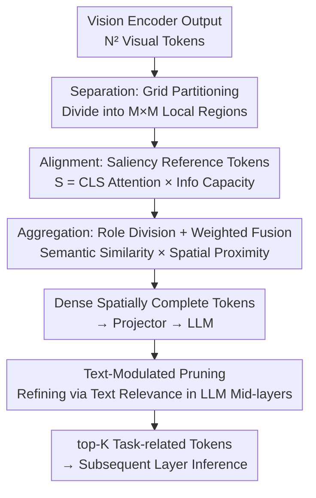

# Nüwa: Mending the Spatial Integrity Torn by VLM Token Pruning

**Conference**: ICLR 2026  
**OpenReview**: [https://openreview.net/forum?id=C9yclwdquU](https://openreview.net/forum?id=C9yclwdquU)  
**Code**: https://github.com/Man-PaperRejected/Nuwa  
**Area**: Multi-modal VLM / LLM Efficiency / Visual Token Pruning  
**Keywords**: Visual Token Pruning, Visual Grounding, Spatial Integrity, Swarm Intelligence, Two-stage Pruning

## TL;DR
This paper discovers that existing visual token pruning methods collapse on visual grounding (VG) tasks because they destroy the "global spatial reference system" constructed by positional encodings. Consequently, it proposes Nüwa—a two-stage pruning framework inspired by swarm intelligence (Boids) that employs a "Partition-Align-Aggregate" strategy on the vision encoder side to preserve spatial anchors, followed by text-guided refinement in the middle of the LLM. This approach improves performance retention on VG tasks from ~7% to 47% while maintaining VQA performance at 95%.

## Background & Motivation

**Background**: Visual Language Models (VLMs) generate a large number of visual tokens during inference (e.g., 576 for LLaVA-1.5), leading to significant computational overhead. Visual token pruning has emerged as a mainstream acceleration technique, generally categorized into three types: vision encoder-side pruning (e.g., VisionZip, PruMerge, based on visual semantic similarity), LLM single-layer one-time pruning (e.g., FastV, based on attention scores), and LLM multi-layer dynamic pruning (e.g., SparseVLM, PyramidDrop).

**Limitations of Prior Work**: While these methods maintain performance on VQA-like tasks, the authors identified two critical facts through systematic comparison: First, on VQA, complex pruning methods offer almost no advantage over simple baselines like "random sampling" or "average pooling" (Finding 1). Second, nearly all methods systematically collapse on visual grounding tasks—at a 64-token budget, the performance retention of FastV/SparseVLM/VisionZip on RefCOCO is only 1.88%~7.28%, whereas naive average pooling performs the best (~12%). This indicates that the "advancements" of current pruning are not only useless for grounding but actually harmful.

**Key Challenge**: Why does a crude method like pooling outperform others in grounding? Investigating this anomaly, the authors analyzed the VLM visual processing pipeline and found it to be a multi-stage process "from global semantic integration to fine-grained object focus" (characterized by Visual Attention Entropy and Object-Centric Cohesion, OCC, which peaks in the middle of both ViT and LLM). Grounding tasks depend heavily on the "global spatial reference system" constructed through token positional encoding interactions in the middle stages. Existing pruning methods tear this reference system apart by either compressing the range of positional encodings (VisionZip’s PERC) or breaking spatial continuity while keeping absolute coordinates (FastV’s PESP). Pooling performs better because it aggregates features on a coarse grid, implicitly maintaining global topology.

**Goal**: To significantly compress tokens while preserving the "global spatial reference system," enabling pruned VLMs to perform both VQA and grounding.

**Key Insight**: The authors verified this hypothesis using position reconstruction experiments. By replacing the positional encoding strategies of VisionZip/FastV with RPME (Relative Position Mapping Extension, which linearly maps pruned token relative distances back to the original full range), grounding performance recovered immediately (VisionZip improved by 5.6%/13.4%) with almost no impact on VQA (Finding 3). This proves that "restoring continuous spatial coordinates" is the fundamental solution.

**Core Idea**: Treat visual token compression as a swarm aggregation problem of "maintaining uniform spatial coverage." Borrowing the "Separation/Alignment/Cohesion" operations from the Boids swarm intelligence algorithm, the method preserves spatial anchors on the vision encoder side and performs task-related refinement using text semantics in the middle of the LLM.

## Method

### Overall Architecture
Nüwa is a two-stage pruning framework. The input is $N^2$ visual tokens from the vision encoder, and the output is a small number (e.g., 64/128/192) of tokens that preserve both global spatial topology and text-task relevance for LLM inference.

The first stage performs "**Spatial Cohesion Pruning**" on the **vision encoder side**, utilizing three serial operations inspired by Boids: **Separation** (partitioning the token grid into local regions to ensure uniform spatial coverage) → **Alignment** (selecting globally salient reference tokens as aggregation centers in each region) → **Aggregation** (weighted fusion of neighbor features into reference tokens based on "semantic similarity × spatial proximity"). The second stage performs "**Text-Modulated Pruning**" in the **middle of the LLM** (where multi-modal alignment is partially complete), calculating relevance scores for each visual token using text query vectors and retaining only the top-$K_{final}$ task-related tokens. This design ensures clear and complementary responsibilities: stage one preserves space, and stage two preserves task relevance.

### Key Designs

**1. Separation: Grid Partitioning to Preserve Global Coordinates**

This step directly addresses the issue of "pruning breaking spatial continuity." Nüwa partitions the input token grid $T=\{t_1,\dots,t_{N^2}\}$ into $M\times M$ non-overlapping local regions $R_{i,j}$. Subsequent selection and aggregation occur at the regional level. The key is that each region contributes reference tokens, ensuring **uniform spatial distribution** of compressed tokens across the image. This is equivalent to implementing a more precise RPME strategy—preserving relative spatial distances and uniformly covering the original coordinate range. Ablation (Table 8) shows that adding regional partitioning jumps RefCOCO-test performance from 6.83 (no partitioning) to 43.50, which is decisive for grounding while having almost no effect on VQA.

**2. Alignment: Saliency Scoring to Select Regional Reference Tokens**

Uniform spatial distribution is insufficient; the "most informative" tokens within each region must be chosen as aggregation centers. Initially using [CLS] token attention scores $\alpha_{cls,i}$ to measure global saliency, the authors found the distribution too sparse in deep encoders. Thus, they introduced **Information Capacity**, defined as the L2-norm of the token’s key vector $\|k_i\|_2$. The final saliency score is the product:

$$S(t_i) = \alpha_{cls,i} \cdot \|k_i\|_2$$

In each local region $R_k$, the tokens with the highest $S$ are selected for the reference set $T_B$. Ablations indicate the L2-norm criterion improves the quality of reference token selection across all tasks.

**3. Aggregation: Pillar/Collector Role Division + Semantic-Proximity Weighted Fusion**

After selecting reference tokens, features from remaining tokens must be aggregated. However, "semantic similarity $\neq$ aggregatability"—relying solely on semantic similarity can merge spatially distant tokens, destroying object-level representations. Nüwa uses a two-layer solution. First, **Role Division**: based on the finding that "register tokens" (high norm, often attended to, task-agnostic) in ViT disrupt predictions if altered, reference tokens in the top 25th percentile of $\|k_i\|_2$ are labeled **Pillar Tokens** ($T_P$) and remain **unchanged**. The rest are **Collector Tokens** ($T_C$), responsible for aggregating features from spatial neighbors.

Second, **Weighted Aggregation**: the weight matrix $W$ fuses a semantic similarity matrix $A$ and a spatial proximity matrix $P$. The semantic term only considers positive correlations: $A_{ij}=\text{ReLU}(\text{sim}(v_i,v_j))$; the proximity term penalizes long-distance aggregation: $P_{ij}=1-\max(1, d(p_i,p_j)/d_{thresh})$, where $d$ is Euclidean distance and $d_{thresh}$ is a threshold. Final weights are assigned by role:

$$W_{ij} = \begin{cases} \delta_{ij} & t_i \in T_P\ (\text{Pillar}) \\ A_{ij}\cdot P_{ij} & t_i \in T_C\ (\text{Collector}) \end{cases}$$

Pillar tokens aggregate only from themselves ($\delta_{ij}$ is the Kronecker delta), while Collector tokens aggregate neighbors via semantic × proximity weighting. After row-normalizing $W$ to $\hat W$, features are updated as $V'_B = \hat W V$. This design unifies "protecting key register features" and "local cohesive aggregation" into a single matrix.

**4. Text-Modulated Pruning: Task-Relevance Refinement in LLM Mid-layers**

Stage one is purely visual and task-agnostic. However, different tasks require different tokens. Stage two performs text-guided pruning in the middle of the LLM where multi-modal features are aligned. All text token embeddings are averaged into a query vector $\bar q = \frac{1}{K}\sum_k q_k$. The cosine similarity between each visual token (via projector $\text{proj}(\cdot)$) and $\bar q$ serves as the relevance score:

$$R_i = \text{sim}(\text{proj}(v'_i), \bar q)$$

Only top-$K_{final}$ tokens enter subsequent layers. This occurs in the middle layers because multi-modal alignment is complete, making text-visual similarity meaningful.

### Loss & Training
Nüwa is a **fully training-free inference-time method**. It acts directly on the inference process of pre-trained VLMs (LLaVA-1.5, LLaVA-NeXT) without fine-tuning or extra parameters. It requires only one attention calculation at the final vision encoder layer, making it compatible with FlashAttention with minimal overhead.

## Key Experimental Results

### Main Results
Evaluated on LLaVA-1.5-7B across 10 VQA + 3 VG benchmarks (13 total), using Vanilla (576 tokens) as the 100% baseline.

**VQA Performance Retention (Table 5, Avg. Retention %)**:

| Avg. Tokens | FastV | SparseVLM | VisionZip | Nüwa | Compression |
|-----------|-------|-----------|-----------|------|--------|
| 192 | 89.5 | 96.1 | 98.3 | **98.8** | ↓66.7% |
| 128 | 85.0 | 93.4 | 97.6 | **97.9** | ↓77.8% |
| 64 | 79.4 | 89.9 | 94.0 | **94.9** | ↓88.9% |

**Visual Grounding Performance Retention (Table 6, RefCOCO Avg. %)**:

| Avg. Tokens | FastV | SparseVLM | VisionZip | Nüwa | Gain |
|-----------|-------|-----------|-----------|------|---------|
| 128 | 18.6 | 12.8 | 8.1 | **75.2** | +57 |
| 64 | 3.81 | 1.88 | 7.28 | **47.2** | +40 |

The gap on VG tasks is an order of magnitude: at 64 tokens, other methods have single-digit retention, while Nüwa reaches 47.2%; at 128 tokens, it reaches 75.2%.

**Efficiency (Table 4, 64 tokens)**: Nüwa backbone computation is 0.6476 TFLOPs (vs Vanilla 5.973, ↓89%), with a prefill time of 46ms (↓62%). Pruning metrics add 17.56 MFLOPs, only ~0.01 TFLOPs / 1ms more than VisionZip—negligible.

### Ablation Study
Key component ablation (Table 8, ✔=Enabled):

| Region Partition | Pillar Selection | Stage 2 Text Pruning | RefCOCO-test | MMB |
|------------|------------|----------------|--------------|-----|
| ✘ | ✘ | ✘ | 6.83 | 58.2 |
| ✔ | ✘ | ✘ | 43.50 | 56.7 |
| ✔ | ✔ | ✘ | **45.09** | **63.4** |
| ✔ | ✔ | ✔ | 44.30 | 62.1 |

### Key Findings
- **Region partitioning is the decisive component for grounding**: Adding it alone increased RefCOCO-test from 6.83 to 43.50 (6x), with almost no impact on VQA, confirming its role is "restoring spatial integrity."
- **Pillar tokens (L2-norm selection) are positive for all tasks**: Comprehensive improvements across RefCOCO/MMB/MME support the hypothesis that high-norm register tokens should not be altered.
- **Random pruning + region partitioning causes a performance drop**: Partitioning introduces potentially task-irrelevant tokens; random selection might keep them, emphasizing the need for stage two text-guided screening.
- **Importance of the spatial framework increases with token budget**: In RPME experiments, the gain at 128 tokens (13.4%) was much larger than at 64 tokens (5.6%).

## Highlights & Insights
- **Diagnosis driven by anomalies is the strongest part of the paper**: Starting from the counter-intuitive observation of why pooling beats advanced methods on grounding, the authors used VAE/OCC metrics and position reconstruction to pinpoint the root cause as the "broken global spatial reference system."
- **Swarm intelligence (Boids) analogy is clever**: Separation/Alignment/Cohesion ensure uniform coverage, center selection, and local cohesion, providing an algorithmic backbone for "preserving space."
- **Pillar/Collector role division is transferable**: Leveraging register token findings to distinguish which tokens should be fixed vs. aggregated is a strategy applicable to any feature merging or KV cache compression scenario.

## Limitations & Future Work
- Primarily validated on LLaVA-1.5/LLaVA-NeXT; generalization to larger scales or dynamic-token architectures (e.g., Qwen-VL) requires further verification.
- Stage two text pruning shows "modest gains" compared to random pruning, suggesting the design space for task-specific screening is not fully exploited.
- VG retention, while improved from single digits to 47%, still lags behind Vanilla, indicating a performance ceiling under heavy spatial task requirements.

## Related Work & Insights
- **vs. VisionZip (PERC)**: VisionZip prunes based on semantic similarity but compresses positional encodings into a tiny range, losing the global reference—the cause of its collapse on VG. Nüwa implements uniform spatial distribution via partitioning.
- **vs. FastV (PESP)**: FastV prunes based on attention in a single LLM layer, breaking spatial continuity despite keeping absolute coordinates. Nüwa maintains continuous spatial topology through regional aggregation.
- **vs. Average Pooling**: Pooling is the strongest naive baseline because it implicitly preserves global topology on a coarse grid. Nüwa is essentially "intelligent pooling with saliency selection and semantic aggregation."

## Rating
- Novelty: ⭐⭐⭐⭐⭐ Diagnosing the overlooked root cause of the "global spatial reference system" and providing a swarm-based solution is highly novel.
- Experimental Thoroughness: ⭐⭐⭐⭐ Solid results across 13 datasets and multiple models/ablations; larger model verification could be added.
- Writing Quality: ⭐⭐⭐⭐⭐ Clear "Phenomenon → Diagnosis → Method" logic; excellent use of VAE/OCC metrics.
- Value: ⭐⭐⭐⭐⭐ Directly addresses the failure of current pruning in grounding tasks; training-free and efficient with high practical value.

<!-- RELATED:START -->

## Related Papers

- [\[CVPR 2026\] VLM-Pruner: Buffering for Spatial Sparsity in an Efficient VLM Centrifugal Token Pruning Paradigm](../../CVPR2026/vlm_efficiency/vlm-pruner_buffering_for_spatial_sparsity_in_an_efficient_vlm_centrifugal_token_.md)
- [\[ICLR 2026\] IVC-Prune: Revealing the Implicit Visual Coordinates in LVLMs for Vision Token Pruning](ivc-prune_revealing_the_implicit_visual_coordinates_in_lvlms_for_vision_token_pr.md)
- [\[ICLR 2026\] LearnPruner: Rethinking Attention-based Token Pruning in Vision Language Models](learnpruner_rethinking_attention-based_token_pruning_in_vision_language_models.md)
- [\[ICLR 2026\] Enhancing Visual Token Representations for Video Large Language Models via Training-free Spatial-Temporal Pooling and Gridding](enhancing_visual_token_representations_for_video_large_language_models_via_train.md)
- [\[ICLR 2026\] HiDrop: Hierarchical Vision Token Reduction in MLLMs via Late Injection, Concave Pyramid Pruning, and Early Exit](hidrop_hierarchical_vision_token_reduction_in_mllms_via_late_injection_concave_p.md)

<!-- RELATED:END -->
