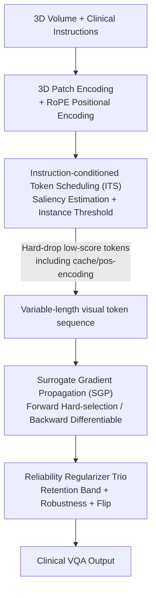

# Photon: Speedup Volume Understanding with Efficient Multimodal Large Language Models

**Conference**: ICLR 2026  
**OpenReview**: [https://openreview.net/forum?id=xsSJw6jJBL](https://openreview.net/forum?id=xsSJw6jJBL)  
**Code**: To be confirmed  
**Area**: Multimodal VLM / LLM Efficiency / Medical Imaging  
**Keywords**: 3D Medical MLLM, Visual Token Pruning, Variable-length Tokens, Instruction-aware, Surrogate Gradients

## TL;DR
Photon is a multimodal large model that directly processes full 3D medical volume data (CT/MRI). It utilizes "Instruction-conditioned Token Scheduling (ITS)" to adaptively determine the number of visual tokens to retain for each question, and "Surrogate Gradient Propagation (SGP)" to ensure discrete token dropping remains differentiable during training. This approach achieves SOTA accuracy on medical VQA while providing approximately 5x training speedup and two-thirds memory savings.

## Background & Motivation
**Background**: Multimodal Large Language Models (MLLMs) show promise in clinical VQA, but extending them to 3D imaging (CT, MRI) is computationally intensive—volume data partitioned into patches often results in tens of thousands of visual tokens. To save costs, mainstream approaches either follow a **slice-based** route (selecting only specific 2D slices) or compress the entire volume into a **fixed-length** set of few visual tokens.

**Limitations of Prior Work**: Slice sampling destroys the spatial continuity of volume data, loses voxel details, and introduces bias from manual frame selection. Fixed-length compression uses the same number of tokens regardless of scan complexity or question focus, which limits high-resolution details and risks compressing away small but clinically critical lesion tokens. General-domain token pruning methods (e.g., VisionZip, LLaVA-PruMerge) can accelerate inference but are typically score-based (attention/similarity) without being **instruction-aware**, and often use **fixed pruning ratios**. ATP-LLaVA introduced learnable thresholds but maintains soft masks during training, meaning compute and VRAM savings are only realized during inference.

**Key Challenge**: In medicine, "different questions focus on different organs/lesions and naturally require different token counts," but existing methods either prune without considering instructions, use fixed retention ratios, or fail to save training costs. The fundamental contradiction is that **discarding tokens discretely and per instruction** can save both training and inference costs, but once tokens are "hard-dropped," the step becomes non-differentiable, making it impossible to train a threshold predictor end-to-end.

**Goal**: Develop a native 3D medical MLLM using **variable-length** token sequences to represent volume data, maintaining voxel fidelity while adaptively pruning tokens based on each instruction, with identical pruning logic used for both training and inference.

**Core Idea**: Use "Instruction-conditioned Token Scheduling" to calculate which and how many tokens to retain per sample and **hard-discard** them (along with their KV cache and positional encodings). Then, use "Surrogate Gradient Propagation" to reconstruct gradients back to retention probabilities during backpropagation, making discrete token dropping differentiable and learnable as a whole.

## Method

### Overall Architecture
Photon combines a 3D visual encoder with a large language model to jointly process volume scans and clinical instructions. At the input, volume data is divided into $14\times14\times14$ non-overlapping patches, each linearly embedded as a token. To balance resolution and sequence length, spatial pooling is performed only on the $(H,W)$ plane with stride $S$, while depth $D$ remains unchanged, resulting in a visual token count $N_v = D\cdot\frac{H'}{S}\cdot\frac{W'}{S}$. **RoPE (Rotary Positional Embedding)** is used (distinguishing it from the absolute positional encoding APE commonly used in prior 3D methods). Visual and text tokens are concatenated into a hybrid sequence for the LLM.

The critical phase occurs at a selected LLM layer $\ell$: during the **forward pass**, ITS estimates the saliency of each visual token under the current instruction and predicts an instance-specific threshold. Tokens below the threshold—along with their cache and positional encodings—are hard-deleted, shortening the sequence. During the **backward pass**, SGP scatters gradients back to the original token positions via a straight-through surrogate path and constructs surrogate gradients for the threshold predictor, ensuring the same selection logic applies to both the forward hard-selection and backward differentiation. Training proceeds in two stages: Phase 1 finetunes only the modified 3D visual embedding layer for alignment (others frozen); Phase 2 finetunes all modules, learning the token pruning threshold via the backpropagation strategy described above, supplemented by three lightweight regularizers to stabilize training.

### Key Designs

**1. Instruction-conditioned Token Scheduling (ITS): Allowing each instruction to decide the token count**

This step addresses the pain point of "fixed pruning ratios ignoring instructions." ITS consists of two parts. The first is **Instruction-aware Saliency Estimation (ISE)**: a centrality $c_t=\sum_{t'\in Q}\max(\frac{\langle q_t,k_{t'}\rangle}{\sqrt{\alpha}},0)$ is calculated within instruction tokens (excluding diagonal self-matching, taking only positive reinforcement), normalized into weights $w_t=c_t/\sum_{t'}c_{t'}$ to identify the "core instruction tokens." These weights are then used to calculate the weighted alignment score $u_j=\sum_{t\in Q} w_t\frac{\langle q_t,k_j\rangle}{\sqrt{\alpha}}$ for each visual token relative to the instruction, resulting in saliency $\rho_j\in[0,1]$ via intra-instance min-max normalization. The second part is the **Instance-aware Threshold Predictor (ITP)**: saliency rankings alone do not determine the total count. Three complementary statistics (distribution shape, absolute scale, compressed tail) are extracted from $\rho$ and original logits $u$ to form a descriptor $z=[\Psi(\rho),\Phi(u),\Upsilon(u)]$, which a lightweight MLP maps to a scalar threshold $\theta=\sigma(W_2\phi(W_1 z+b_1)+b_2)$. Comparing the threshold with saliency yields the retention probability $q_j=\sigma(\frac{\rho_j-\theta}{\tau_{ce}})$ (where small $\tau_{ce}$ approximates a binary value), which is hardened into mask $M_j=\mathbb{1}\{q_j>0.5\}$. Tokens with $M_j=0$ are entirely deleted. Consequently, "how many to keep" is dynamically determined for each scan and instruction rather than being globally fixed.

**2. Surrogate Gradient Propagation (SGP): Making "hard dropping" differentiable during training**

Once $M_j$ hard-selection occurs, the threshold predictor receives no gradients—the root cause of the inability to train discrete pruning end-to-end. SGP solves this using a straight-through surrogate mask: $\widetilde{M}=\mathrm{sg}(M)-\mathrm{sg}(q)+q$, where the forward pass uses hard-selection and the backward pass allows gradients to flow through the continuous probability $q$. For retained tokens, upstream gradients are scattered back to original positions via a scatter operator $\frac{\partial L}{\partial T^\ell_{vis}}=S(\frac{\partial L}{\partial T^{\ell\prime}_{vis}};\widetilde{M})$, keeping decoder activations trainable. More critically, SGP **reconstructs gradients** for the threshold predictor: the authors use a first-order approximation to measure each token's contribution to the loss $\eta_j=\langle(T^\ell_{vis})_j,(\frac{\partial L}{\partial T^\ell_{vis}})_j\rangle$ (inner product of activation and gradient; higher means more important). After standardizing and pruning, a direction term $d_j=0.5-\mathrm{sg}(r_j)$ is obtained via monotonic mapping $\psi$, paired with a magnitude term $s_j$ derived from the accumulation of activation-gradient products. This synthesizes a surrogate gradient for the retention probability: $\frac{\partial L}{\partial q_j}\approx\beta\,d_j\,s_j\,\max\{q_j(1-q_j),\epsilon_{sat}\}$. Effectively, tokens judged more informative are pushed toward retention, while useless ones are suppressed, with $\epsilon_{sat}$ preventing gradient vanishing as $q_j$ approaches 0/1.

**3. Reliability Regularizer Trio: Preventing pruning degradation and "answering without looking"**

Relying solely on forward/backward learning might lead to "retaining all" or "over-pruning" degradation, or cause the model to hallucinate based on text priors. Photon adds three lightweight regularizers. **Soft Retention Band**: Constraints the average retention ratio $r=\frac{1}{N_v}\sum_j q_j$ within $[r_{min},r_{max}]$ via $L_{band}=\mathbb{E}[\max(0,r-r_{max})+\max(0,r_{min}-r)]$. **Robustness Regularizer**: Addresses "language-only hallucinations"—answering confidently even with insufficient visual evidence. Given a perturbed (masked/shuffled) volume $\tilde{x}$, the model is required to output higher uncertainty $L_{robust}=-\mathbb{E}_{\tilde{x}}[H(p_\theta(\cdot|\tilde{x}))]$, with only this term optimized on perturbed samples. **Flip Regularizer**: Reverses the retention mask with a certain probability (retaining what was dropped, dropping what was kept). If the model still answers correctly with high confidence under such a corrupted mask, it indicates reliance on text shortcuts rather than visual evidence, penalized by $L_{flip}=-\mathbb{E}_{\widetilde{M}_{flip}}[\log(1-p_\theta(y|x,\widetilde{M}_{flip})+\epsilon)]$. The total objective in Phase 2 is $L=(L_{CE}\,\text{or}\,L_{band}\,\text{or}\,L_{robust})+L_{flip}$.

### Loss & Training
Two-stage training. **Phase 1** involves lightweight alignment of the modified 3D visual patch embedding layer (paired volume-caption data; ViT backbone, MLP aligner, and LLM decoder frozen) supervised by cross-entropy $L_{CE}$. **Phase 2** unfroze modules for task finetuning, switching objectives among $L_{CE}$, $L_{band}$, and $L_{robust}$ based on sample type, overlaid with $L_{flip}$. This teaches the model instruction-driven token pruning thresholds. ITS/SGP operate at a selected LLM layer $\ell\in\ell_n$; ablation shows the best accuracy-efficiency tradeoff occurs at $\ell=\ell_n/4$.

## Key Experimental Results

### Main Results
On six categories of tasks in the 3D-RAD benchmark, Photon-3B achieved the best finetuned performance overall, with maximum gains in abnormality detection and image observation (~ +14%), medical measurement (+7.3%), and longitudinal temporal diagnosis (+3%).

| Benchmark / Task | Metric | Photon-3B | Best Baseline | Description |
|------|------|------|------|------|
| 3D-RAD Existence | Acc | 83.07 | 82.43 (M3D-L2) | Best finetuned setting |
| 3D-RAD Abnormality | BLEU | 42.33 | ~ baseline | Descriptive tasks +~14% |
| 3D-RAD Observation | ROUGE | 56.66 | 50.52 (M3D-P3) | Major lead in description |
| DeepTumorVQA MC Average | Acc | 0.686 | 0.662 (RadFM) | +~3.6% |
| DeepTumorVQA Free-text Avg | Acc | 0.619 | 0.555 (RadFM) | +~11.5% |

On DeepTumorVQA, the measurement sub-category (MRA evaluation) saw an improvement exceeding 35.3%, and visual reasoning sub-categories like lesion counting gained over 20.7%, indicating strong performance in quantitative accuracy and spatial analysis.

### Comparison
Under the same inference settings with a unified Qwen2.5-VL backbone, compared to pruning methods with fixed retention ratios (~30/50/70% tokens, i.e., ~2.1K/3.5K/4.9K visual tokens per sample):

| Method | E.D. Acc | S.T.D. Acc | Inf Speed (Tok/s) | Token Count |
|------|------|------|------|------|
| Qwen2.5-VL | 81.97 | 47.62 | 2.30 | 7.0K |
| VisionZip | 82.00 | 47.19 | 2.32 | 2.1K |
| HiPrune | 81.99 | 48.08 | 0.76 | 2.1K |
| **Photon** | **83.07** | **52.86** | **4.12** | Dynamic |

Fixed-ratio pruning hardly improved performance (not instruction-aware and not designed for training acceleration); HiPrune even slowed down decoding due to FlashAttention incompatibility. Photon improved accuracy while boosting inference to 4.12 Tok/s. Compared to the finetuned Qwen2.5-VL, Photon reduced inference VRAM from 26.0GiB to 9.2GiB (~2/3 reduction) and accelerated training from 0.15 to 0.85 iter/s (>5x), with ~1.9x inference speedup.

### Ablation Study

| Configuration | S.T.D. Acc | Training Speed | Retained Tokens | Description |
|------|------|------|------|------|
| Photon (full) | 52.86 | 0.85 | 0.39K | Full model |
| w/o ITS & SGP | 49.60 | 0.64 | 1.00K | >3% drop, tokens doubled, slower training |
| w/o Photon Phase 1 | 52.20 | 0.84 | 0.45K | Without visual alignment warm-up |
| w/o Robust Reg. | 48.18 | 0.87 | 0.29K | Accuracy drops without robust reg |
| w/o Flip Reg. | 52.09 | 0.85 | 0.38K | Slight drop/instability without flip reg |
| Vis. Ful. Ft. | 0.00 | — | — | Full visual stack finetuning → collapse |

### Key Findings
- **ITS+SGP is the core of performance and efficiency**: Removing them results in a >3% S.T.D. drop, average tokens increasing from 0.39K to 1.00K, and slower training, proving instruction-aware pruning saves compute while maintaining accuracy.
- **Regularizers do more than boost points**: Removing robust/flip regularizers not only drops accuracy but also destabilizes training and reduces reliability.
- **Do not finetune the full visual stack**: Continuing with full ViT+aligner finetuning from the Phase 1 checkpoint leads to overfitting and loss of instruction-following capability (Vis. Ful. Ft. collapses to 0), validating the "alignment before task-finetuning" approach.
- **Pruning is clinically focused**: Visualization shows that questions about plural effusion retain the thoracic region, while questions about renal cysts retain the kidney area; pruning adapts to the question's focus rather than being uniform.

## Highlights & Insights
- **Differentiable "hard token dropping"**: The combination of the straight-through surrogate mask $\widetilde{M}=\mathrm{sg}(M)-\mathrm{sg}(q)+q$ and importance-reconstructed gradients based on activation-gradient inner products allows forward compute savings while maintaining backward learnability. This approach can be transferred to any high-resolution multimodal task requiring discrete subset selection.
- **Variable-length vs. fixed-length tokens**: Moving beyond fixed ratios to provide different token budgets based on instruction complexity aligns naturally with the medical reality that different clinical questions focus on different organs.
- **Flip Regularizer as a diagnostic constraint**: Correctly answering with high confidence after a mask reversal exposes the model's reliance on text shortcuts. Penalizing this forces the model to "truly look at the image," which is highly relevant for mitigating medical hallucinations.
- **RoPE over APE for 3D**: Relative positional encoding provides more stable spatial relationships under variable-length sequences, serving as the engineering foundation for variable tokens.

## Limitations & Future Work
- The authors acknowledge that, due to KV Cache effects, inference speedup (1.9x) is more modest than training acceleration (>5x).
- The method depends on a one-time pruning at a selected layer $\ell$. The position $\ell=\ell_n/4$ is empirically optimal but may require re-searching for different backbones/tasks.
- Self-evaluation: Experiments were concentrated on two types of medical VQA benchmarks (3D-RAD, DeepTumorVQA); robustness across modalities and external clinical distributions requires larger-scale validation. The robust regularizer depends on manually designed perturbations, and the impact of perturbation types on hallucination suppression is not fully deconstructed.
- Future Work: Extending single-layer pruning to multi-layer progressive pruning or making the threshold predictor adaptive to perturbation types could further reduce inference costs.

## Related Work & Insights
- **vs VisionZip / LLaVA-PruMerge**: These prune tokens based on unified attention or similarity, use fixed ratios, and only save costs during inference. Photon uses instruction-aware scoring + instance-adaptive thresholds + hard token dropping during training, avoiding the loss of clinical lesions while saving training compute.
- **vs ATP-LLaVA**: Also pursues adaptive thresholds, but ATP-LLaVA retains soft masks during training, only reducing compute during inference; Photon uses SGP to allow hard dropping and differentiability during training.
- **vs RadFM / M3D (3D Medical MLLMs)**: These compress scans into **fixed-length** visual tokens, limiting high-resolution detail. Photon uses variable tokens to preserve voxel fidelity and crops dynamically based on instructions.
- **vs OmniV-Med**: Also supports variable-length sequences, but its pruning relies on coarse-grained criteria like L1 similarity of slice features, which easily misses small lesions. Photon’s instruction-visual saliency is grainier and better aligned with clinical focus.

## Rating
- Novelty: ⭐⭐⭐⭐⭐ Establishes instruction-conditioned variable-length pruning + differentiable discrete dropping for 3D medical MLLMs; original mechanism.
- Experimental Thoroughness: ⭐⭐⭐⭐ Two major medical VQA benchmarks + comparisons with various pruning methods + detailed ablation/visualization; could be further validated across more modalities/OOD scenarios.
- Writing Quality: ⭐⭐⭐⭐ Clear formulas and pipeline; well-reasoned motivation for the regularizer trio.
- Value: ⭐⭐⭐⭐⭐ Simultaneously improves accuracy, training speed, and VRAM savings; highly practical for clinical 3D MLLM deployment.

<!-- RELATED:START -->

## Related Papers

- [\[ICLR 2026\] PPE: Positional Preservation Embedding for Token Compression in Multimodal Large Language Models](ppe_positional_preservation_embedding_for_token_compression_in_multimodal_large_.md)
- [\[ICLR 2026\] iLLaVA: An Image is Worth Fewer Than 1/3 Input Tokens in Large Multimodal Models](illava_an_image_is_worth_fewer_than_13_input_tokens_in_large_multimodal_models.md)
- [\[ICLR 2026\] SURGE: Surprise-Guided Token Reduction for Efficient Video Understanding with VLMs](surge_surprise-guided_token_reduction_for_efficient_video_understanding_with_vlm.md)
- [\[ICLR 2026\] ST-SimDiff: Balancing Spatiotemporal Similarity and Difference for Efficient Video Understanding with MLLMs](st-simdiff_balancing_spatiotemporal_similarity_and_difference_for_efficient_vide.md)
- [\[CVPR 2026\] MASQuant: Modality-Aware Smoothing Quantization for Multimodal Large Language Models](../../CVPR2026/vlm_efficiency/masquant_modality-aware_smoothing_quantization_for_multimodal_large_language_mod.md)

<!-- RELATED:END -->
