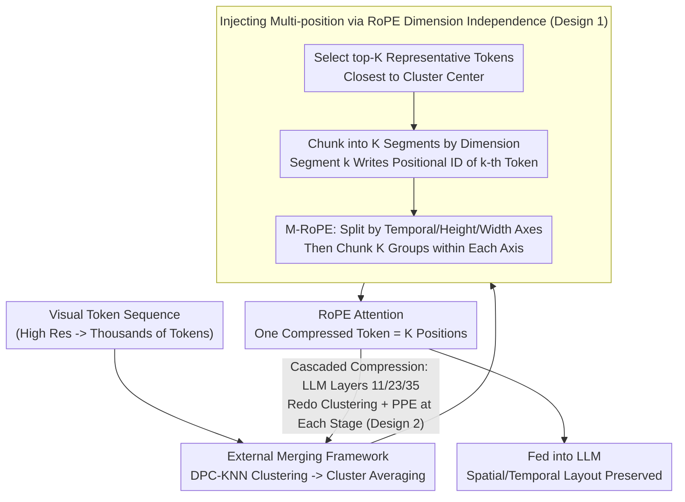

# PPE: Positional Preservation Embedding for Token Compression in Multimodal Large Language Models

**Conference**: ICLR 2026  
**arXiv**: [2510.22936](https://arxiv.org/abs/2510.22936)  
**Code**: [GitHub](https://github.com/MouxiaoHuang/PPE)  
**Area**: Multimodal VLM/Efficiency  
**Keywords**: Token Compression, Positional Encoding, RoPE, MLLM Efficiency, Spatio-temporal Preservation

## TL;DR

PPE (Positional Preservation Embedding) leverages the rotation independence of RoPE dimensions to encode multiple original position IDs into different dimension segments of a merged token, enabling a single compressed token to carry multiple spatial/temporal positional information. PPE is a zero-parameter, plug-and-play universal operator that yields only a 3.6% average performance drop on image tasks at 55% compression and maintains comparable performance at 90% compression through cascaded compression.

## Background & Motivation

**Background**: MLLMs (e.g., Qwen2.5-VL, LLaVA-OneVision) encode images/videos into dense visual tokens for joint reasoning within the LLM. However, dense representations are highly redundant—a high-resolution image can generate thousands of visual tokens, leading to massive computational and memory overhead. Token merging/pruning techniques reduce sequence length by clustering similar tokens.

**Limitations of Prior Work**:
1. **ChatUniVi**: Assigns **randomized position IDs** to compressed tokens after clustering and merging $\rightarrow$ results in complete loss of original spatial layout, causing significant performance degradation in layout-sensitive tasks (e.g., counting, OCR, temporal localization).
2. **PACT**: Retains only the position ID of the cluster center $\rightarrow$ each merged token has only one position $\rightarrow$ positional information is insufficient and imprecise.
3. **General Issue**: Higher compression rates $\rightarrow$ each merged token represents more original tokens $\rightarrow$ a single position ID loses more layout information.

**Key Challenge**: The fundamental conflict between high compression rates in token merging and the preservation of positional information—merging reduces token count but erases spatial/temporal structure.

**Key Insight**: It is observed that the rotation encoding of RoPE/M-RoPE is performed independently on each dimension ($\text{RoPE}(z_d, m) = e^{im\theta_d}z_d$). Thus, different dimensions of the same token can encode different position IDs. By dividing dimensions into $K$ groups and encoding the position of one merged token per group $\rightarrow$ a single compressed token carries $K$ positional information simultaneously.

## Method

### Overall Architecture

PPE is integrated after any token merging framework: the original framework (e.g., DPC-KNN in ChatUniVi) clusters similar visual tokens and averages them into a compressed token, then PPE reassigns position IDs to this compressed token. The process involves selecting the $K$ most representative original tokens from the cluster and writing their position IDs into different dimension segments of the compressed token embedding. Consequently, during attention computation, this single token is perceived as having $K$ spatial/temporal positions. This entire process involves no feature modification or additional parameters, only position ID reassignment. For extreme compression, PPE can repeat this "clustering $\rightarrow$ position reassignment" process across network depths (cascaded compression) to preserve layout information layer by layer.

### Key Designs

**1. Injecting Multiple Positions into One Token via RoPE Dimension Independence: Resolving the Single Position ID Paradox**

The cost of token merging lies in positioning—once a cluster is compressed into one token, multiple positions originally scattered across the frame are collapsed into one, causing layout-sensitive tasks (counting, OCR, temporal localization) to fail. The breakthrough of PPE is recognizing that RoPE rotates each dimension independently, $\text{RoPE}(z_d, m) = e^{im\theta_d}z_d$, meaning the position $m$ used for dimension $d$ does not interfere with others. Therefore, it is unnecessary for the entire token to share a single position: the $D$-dimensional embedding is split into $K$ segments, where the $k$-th segment is injected with the position ID of the $k$-th merged token in the cluster, denoted as $\hat{m}_d = m_{k,d}$ (where $d = (k-1)\frac{D}{K}+1, \ldots, k\frac{D}{K}$). Thus, one compressed token carries $K$ positions. The intuition is symmetric—if similar tokens can share feature embeddings (via average merging), they should also share positional information; PPE simply translates this idea from the feature dimension to the positional dimension. The $K$ position IDs are selected from the top-$K$ tokens closest to the cluster center to ensure the most representative layout anchors are preserved.

For spatio-temporal scenarios like video, the model uses M-RoPE, where the dimension $D$ is first allocated to temporal, height, and width axes as $[D_1, D_2, D_3]$. PPE further divides each axis into $K$ groups to encode $K$ positions independently, denoted as $\hat{m}_d^{3D} = m_{k,d}^{3D}$. Here, $K$ must divide the size of each section, so it is taken as the greatest common divisor (GCD) of the three section sizes—e.g., for $[16, 24, 24]$, GCD is 8, so $K=8$. When a cluster contains fewer than $K$ tokens, the position ID of the token with the highest weight is used for padding.

**2. Cascaded Compression: Multi-stage Compression for Extreme Rates**

To reach extreme compression rates like 90%, a single compression stage would force each token to represent too many original tokens, leading to an immediate information collapse. PPE adopts cascaded compression along the network depth: an initial PPE compression is performed between the vision encoder and the LLM, followed by additional PPE modules inserted at layers 11, 23, and 35 of the 36-layer Qwen2.5-VL-3B. Each stage re-clusters, re-calculates centers, and re-selects top-$K$ IDs. This allows shallow layers to preserve low-level semantics before more aggressive tightening in deeper layers. Using a 0.45 compression ratio per stage achieves an overall 90% rate. Crucially, PPE re-secures positional information at each stage, preventing the layout from being erased.

**3. Zero-parameter Plug-and-play: Position Preservation without Training or Inference Cost**

PPE only operates on position IDs and introduces no trainable parameters or significant computational overhead—the cost of selecting and writing position IDs is negligible. Since it only manages "which positions compressed tokens should use" and does not alter feature merging logic, it can be seamlessly integrated into any token merging framework like ChatUniVi, PACT, or ToMe as a universal operator without retraining.

## Key Experimental Results

### Main Results: Comprehensive Evaluation on Image and Video Benchmarks

Based on Qwen2.5-VL-3B-Instruct, comparing Dense (no compression), Chat-UniVi, and PPE:

| Benchmark | Dense (0%) | Chat-UniVi (55%) | PPE (55%) | Gain (PPE vs ChatUniVi) |
|:---|:---:|:---:|:---:|:---:|
| MMBench (EN) | 85.89 | 84.92 | 84.73 | -0.19 |
| MMBench (CN) | 86.07 | 83.71 | **84.87** | **+1.16** |
| TextVQA | 79.50 | 57.66 | **77.14** | **+19.48** |
| DocVQA | 89.44 | 52.48 | **76.79** | **+24.31** |
| ChartQA | 79.96 | 49.60 | **74.52** | **+24.92** |
| VideoMME (w/o) | 57.81 | 57.22 | **58.70** | **+1.48** |
| MVBench | 67.90 | 66.90 | **67.38** | **+0.48** |

**Key Findings**:
- Massive improvements (+19~25%) on layout-sensitive tasks (TextVQA/DocVQA/ChartQA), proving positional preservation is critical for OCR/document understanding.
- Minimal performance difference on general visual understanding (MMBench), though PPE still outperforms Chat-UniVi.
- On video tasks, PPE at 55% compression even surpasses the Dense baseline.

### Ablation Study: Cascaded Compression and Framework Compatibility

| Method | MMBench (EN) | TextVQA | Compression Rate |
|:---|:---:|:---:|:---:|
| PACT | 74.14 | 73.73 | 89% |
| PACT + PPE | **74.48** | **73.87** | 89% |
| ToMe | 74.31 | 74.94 | 57% |
| ToMe + PPE | **74.57** | **76.16** | 57% |

PPE consistently improves performance across PACT and ToMe frameworks, verifying its universal plug-and-play capability.

### Horizontal Comparison with SOTA MLLMs

| Model | VideoMME | MVBench | MMBench | TextVQA | Compression Rate |
|:---|:---:|:---:|:---:|:---:|:---:|
| InternVL2.5-4B | 62.30 | 71.60 | 81.10 | 76.80 | 0% |
| Qwen2.5-VL-3B | 61.50 | 67.00 | 79.10 | 79.30 | 0% |
| PACT-7B | 57.60 | - | 80.30 | 75.00 | 67% |
| **PPE-3B** | **58.70** | **67.38** | **84.78** | **77.08** | **55%** |
| **PPE*-3B (Cascaded)**| **58.48** | **67.35** | - | - | **90%** |

PPE-3B, with only 3B parameters and 55% compression, outperforms the 7B PACT and 4B InternVL2.5 on MMBench.

## Highlights & Insights

### Strengths

1. **Novel and Deep Insight**: The idea of using RoPE dimension independence to encode multiple positions is elegant, theoretically sound, and simple to implement.
2. **Zero-parameter Plug-and-play**: It requires no training cost and can be directly integrated into existing frameworks, offering high practical utility.
3. **Significant Gain on Layout-sensitive Tasks**: Improvements of over +20% on TextVQA/DocVQA confirm that positional preservation is indeed the key bottleneck in token compression.

### Limitations

1. The $K$ value is constrained by the GCD of M-RoPE sections (e.g., $[16, 24, 24] \rightarrow K=8$), which limits flexibility.
2. When the number of tokens in a cluster is $< K$, redundant padding of high-weight token IDs occurs, reducing informational diversity.
3. While thoroughly validated on Qwen2.5-VL, compatibility with other architectures (LLaVA, InternVL) requires further confirmation.

### Rating

⭐⭐⭐⭐

**Reason**: The study identifies the core bottleneck of token compression (loss of positional information) and provides an elegant solution. The mapping of RoPE dimension independence to multi-position encoding is natural, and its zero-parameter, plug-and-play design makes it highly valuable for real-world applications. Large gains on layout-sensitive tasks further validate the efficacy of the method.

<!-- RELATED:START -->

## Related Papers

- [\[ICLR 2026\] Photon: Speedup Volume Understanding with Efficient Multimodal Large Language Models](photon_speedup_volume_understanding_with_efficient_multimodal_large_language_mod.md)
- [\[CVPR 2026\] EvoComp: Learning Visual Token Compression for Multimodal Large Language Models via Semantic-Guided Evolutionary Labeling](../../CVPR2026/vlm_efficiency/evocomp_learning_visual_token_compression_for_multimodal_large_language_models_v.md)
- [\[ICLR 2026\] Mixing Importance with Diversity: Joint Optimization for KV Cache Compression in Large Vision-Language Models](mixing_importance_with_diversity_joint_optimization_for_kv_cache_compression_in_.md)
- [\[CVPR 2026\] Accelerating Streaming Video Large Language Models via Hierarchical Token Compression](../../CVPR2026/vlm_efficiency/accelerating_streaming_video_large_language_models_via_hierarchical_token_compre.md)
- [\[CVPR 2026\] Hybrid Token Compression for Vision-Language Models](../../CVPR2026/vlm_efficiency/hybrid_token_compression_for_vision-language_models.md)

<!-- RELATED:END -->
