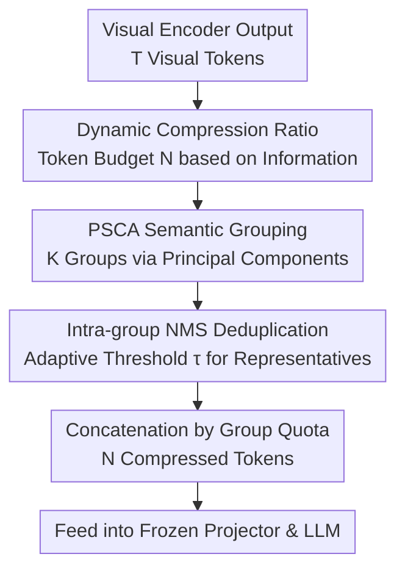

# Prune Redundancy, Preserve Essence: Vision Token Compression in VLMs via Synergistic Importance-Diversity

**Conference**: ICLR 2026  
**OpenReview**: [https://openreview.net/forum?id=i36E5Ezm0H](https://openreview.net/forum?id=i36E5Ezm0H)  
**Code**: https://github.com/ZhengyaoFang/PruneSID  
**Area**: Multimodal VLM / VLM Efficiency  
**Keywords**: Vision token compression, training-free, importance-diversity, semantic clustering, non-maximum suppression

## TL;DR
PRUNESID is a training-free vision token compression framework that balances token semantic importance and information diversity through a two-stage pipeline consisting of "Principal Semantic Component Analysis (PSCA) clustering + Intra-group Non-Maximum Suppression (NMS)". By dynamically allocating token budgets according to image complexity, it maintains 96.3% relative accuracy on LLaVA-1.5 with only 11.1% of tokens, and achieves 92.8% relative performance under extreme compression (5.6%) on LLaVA-NeXT.

## Background & Motivation
**Background**: Current Vision-Language Models (VLMs) encode images into a large number of visual tokens for Large Language Models (LLMs)—LLaVA-1.5 generates 576 tokens per image, while LLaVA-NeXT can generate up to 2880 tokens due to high-resolution sub-image partitioning. This quantity significantly exceeds what is required for semantic representation. Studies indicate that approximately 70% of visual tokens can be discarded with minimal accuracy loss, making training-free token compression a primary direction for improving inference efficiency.

**Limitations of Prior Work**: Existing compression methods fall into two categories, each with inherent flaws. One involves **attention-guidance** (e.g., SparseVLM, FastV, VisionZip), which preserves salient regions based on attention scores but systematically ignores background context. Furthermore, multiple high-attention patches often concentrate on the same object, leading to "redundant token preservation" and wasting model capacity on repetitive content. The other involves **deduplication-guidance** (e.g., DART, DivPrune), which removes repetitive tokens via similarity pruning to enhance diversity but fails to adequately consider token-level semantic importance, potentially deleting critical high-attention tokens and causing fragmented or distorted feature representations.

**Key Challenge**: These two approaches reveal a fundamental tension in token compression: attention-guidance preserves local saliency at the expense of information diversity, while deduplication-guidance improves diversity at the expense of saliency preservation. Satisfying both importance and diversity objectives under high compression ratios is difficult.

**Goal**: Design a training-free, task-agnostic compression framework that **simultaneously** optimizes importance preservation and information diversity at high compression ratios, while remaining applicable across different VLM architectures and both image and video modalities.

**Key Insight**: The authors observe that by first partitioning tokens into coherent groups based on "semantic concepts," they can ensure comprehensive concept coverage (with representatives for each concept). By then performing deduplication **within** each group, redundancy can be reduced without losing concepts. This approach of "inter-group diversity and intra-group importance" decomposes the two objectives into different stages rather than forcing a trade-off within a single scoring mechanism.

**Core Idea**: Replace single-score selection with a two-stage synergistic pipeline of "Semantic Grouping (diversity preservation) + Intra-group NMS (importance preservation and redundancy removal)," supplemented by an adaptive dynamic compression ratio mechanism that allocates token budgets based on image complexity.

## Method

### Overall Architecture
Given an input image, the VLM's visual encoder first produces a sequence of visual token embeddings $X=\{x_1,\dots,x_T\}\in\mathbb{R}^{T\times D}$. The objective is to compress this into a compact subset $\tilde{X}\in\mathbb{R}^{N\times D}$ ($N\ll T$), preserving both semantically salient visual patterns and information integrity for downstream language modeling. PRUNESID splits this process into two stages: first, using **Principal Semantic Component Analysis (PSCA)** to cluster tokens into several semantically coherent groups for comprehensive concept coverage; second, using **Non-Maximum Suppression (NMS)** within each group to prune redundant tokens and retain the most representative ones. On top of this, an **information-aware dynamic compression ratio** mechanism adjusts the retention budget $N$ according to content complexity. This training-free process is inserted between the visual encoder and the LLM (early compression), significantly reducing the sequence length fed into the LLM.

### Key Designs

**1. PSCA Semantic Grouping: Grouping tokens by semantic direction to ensure concept coverage**

This step addresses the issue where "attention-guidance ignores background and lacks concept coverage." Unlike standard PCA which identifies variance directions in the feature dimension, PSCA treats the **token dimension itself** as the semantic axis to be analyzed. It discovers global semantic directions (objects, background, textures) through variance across tokens. Process: Each element is passed through a sigmoid to scale features to a bounded range, followed by centering along the token dimension to obtain a zero-mean matrix $X_{ctr}=\sigma(X)-\mu$, where $\mu=\frac{1}{T}\sum_{i=1}^{T}\sigma(x_i)$. A low-rank PCA decomposition is performed on its transpose $X_{ctr}^{\top}\approx USV^{\top}$, where the columns of $V\in\mathbb{R}^{T\times K}$ are $\{v_1,\dots,v_K\}$, representing $K$ principal directions in the token space. The row $|V_{i,:}|$ indicates the contribution of the $i$-th token to each principal component. Each token is assigned to its highest contributing direction: $g(i)=\arg\max_j |V_{i,j}|$, partitioning $T$ tokens into $K$ semantically coherent groups $\{G_1,\dots,G_K\}$. This ensures that different concepts have representative tokens, preventing concentration solely on high-attention foregrounds.

**2. Intra-group NMS Redundancy Elimination: Deduplicating within groups to prune repetitive tokens**

This step addresses the issue where "multiple similar patches of the same object are redundantly preserved." Within a group, tokens in dense texture or salient object regions often exhibit significant spatial or semantic overlap. The authors adapt NMS from object detection for intra-group deduplication: each token $x_i$ uses its contribution to the group's principal direction as its selection score $s_i=|V_{i,g(i)}|$. Tokens are sorted by $s_i$ within the group, and a token is greedily retained only if its maximum similarity with already retained tokens is below a threshold $\tau$. Crucially, the threshold is adaptive rather than fixed, varying with the image's overall redundancy: the average pairwise similarity of the entire image is calculated as a redundancy score $\rho=\frac{2}{T(T-1)}\sum_{i=1}^{T}\sum_{j=i+1}^{T}\mathrm{sim}(x_i,x_j)$ (similarity is $\ell_2$-normalized cosine similarity), and the threshold is set as $\tau=\lambda\cdot\rho$, where $\lambda=\frac{N}{32}$ is determined by the global budget. Highly redundant images have larger thresholds and stronger suppression. Each group provides a refined subset $\tilde{G}_k$, and quotas $n_k$ are assigned proportionately ($\sum_k n_k=N$), with the final set being $\tilde{X}=\bigcup_{k=1}^{K}\mathrm{Top}_{n_k}(\tilde{G}_k)$.

**3. Information-Aware Dynamic Compression Ratio: Allocating budget across images by complexity**

This step addresses the "one-size-fits-all approach of fixed compression ratios," where fixed $N$ is insufficient for complex scenes and wasteful for simple ones. Reusing the redundancy $\rho$, the authors define an image information score $\phi=1-\rho$; a higher $\phi$ indicates higher semantic diversity and less redundancy. The number of tokens retained per image $N'$ is then set proportional to the information score ($N'\propto\phi$). While maintaining the same average token budget across benchmarks, this adaptive allocation significantly improves information retention for heterogeneous datasets, leading to overall performance gains (denoted as the PRUNESID-Dyn variant).

> Theoretically, the authors provide support by lower-bounding the information content of the token set using the inclusion-exclusion principle: $\mathrm{Inform}(S')\geq\sum_{s_i\in S'}I(s_i)-\sum R(s_i,s_j)$. PSCA maximizes the first term (semantic information) by selecting tokens with the largest projections, while NMS minimizes the second term (redundancy) via similarity constraints. Together, they approximate the solution to $\max_{|S'|=N}\sum I(s_i)\ \text{s.t.}\ R(s_i,s_j)\leq\epsilon$.

## Key Experimental Results

### Main Results
On LLaVA-1.5 (576 token upper bound), PRUNESID-Dyn achieved the best average performance across 64/128/192 token budgets. The table below compares the extreme 64 token setting (↓88.9%):

| Method | Tokens Kept | POPE | MME | SEED | Avg Relative Performance |
|------|-----------|------|------|------|------|
| Vanilla (Bound) | 576 | 85.9 | 1862 | 60.5 | 100% |
| DivPrune (CVPR25) | 64 | 85.6 | 1638 | 55.4 | 94.6% |
| VisionZip (CVPR25) | 64 | 77.0 | 1690 | 54.5 | 94.0% |
| **PRUNESID** | 64 | 83.8 | 1733 | 56.1 | 95.9% |
| **PRUNESID-Dyn** | 64 | 84.1 | 1734 | 56.2 | **96.3%** |

On high-resolution LLaVA-NeXT (2880 tokens), the advantage increases with more extreme compression: at 640/320/160 tokens, it outperforms VisionZip by 0.9/1.5/2.5 points respectively, retaining 92.8% relative performance at 160 tokens (only 5.6%) compared to VisionZip's 90.3%. The method generalizes to Mini-Gemini and Video-LLaVA: for the latter, compressing 256 tokens per frame to 17 (only 6.6%, 2048→136 tokens for the full video) still reaches 95.5% average performance, surpassing VisionZip's 93.2%. The paper also reports a 7.8× prefilling speedup compared to the original model.

### Ablation Study

| Config | Avg Relative Performance | Description |
|------|------|------|
| random grouping | 94.8% | Uniform grouping after shuffling tokens |
| KMeans grouping | 95.6% | Direct clustering on token features |
| **PSCA grouping** | **96.8%** | Utilizes local principal subspace structures for better coherence |

- **Grouping Mechanism**: PSCA consistently outperforms random grouping and KMeans across four benchmarks, demonstrating that semantic groups formed by principal component directions lead to more effective redundancy removal.
- **Number of Groups $K$**: Performance follows a bell curve—too few groups lead to insufficient redundancy modeling granularity, while too many groups result in unstable pruning. The optimal setting is approximately $K=\frac{N}{4}$.
- **ViT Layer Selection**: Using features from mid-to-late layers (16th, 22nd) yields the best PSCA grouping. Early layers (0, 2) have weak semantics, while the final layer (23rd) shows a slight decline as the 22nd layer features are directly used for LLM training and best match semantic grouping needs.

### Key Findings
- The gains of the dynamic compression ratio (-Dyn) are uneven across benchmarks, with higher benefits on datasets with high inter-image complexity variance, where "on-demand budget allocation" has more impact.
- As the compression ratio becomes more extreme, PRUNESID's relative advantage increases, indicating that the synergistic two-stage approach is more valuable under strict budgets.

## Highlights & Insights
- **Reversed PCA Dimensions**: Standard PCA identifies principal directions in feature dimensions; PSCA identifies them in the token dimension, effectively turning "unsupervised semantic clustering" into a low-rank decomposition without extra networks or training.
- **Objective Decoupling**: Rather than balancing importance and diversity in one function, the "inter-group diversity, intra-group importance" approach dissolves the trade-off. This logic is transferable to other selection problems (e.g., retrieval deduplication, keyframe selection).
- **Redundancy-Adaptive Threshold**: The NMS threshold $\tau=\lambda\rho$ allows deduplication intensity to calibrate with the data's inherent redundancy rather than being globally fixed.

## Limitations & Future Work
- The method requires a low-rank PCA decomposition and pairwise similarity calculations ($O(T^2)$) per image. While prefilling speedup is emphasized, the specific computational overhead of the grouping process should be monitored for extremely large token counts.
- Settings such as $\lambda=\frac{N}{32}$, $K=\frac{N}{4}$, and selecting the 22nd layer are empirical heuristics that may need re-validation for significantly different architectures.
- The dynamic compression ratio uses a simple linear allocation based on $\phi=1-\rho$; more optimal budget-to-complexity mappings could be explored.

## Related Work & Insights
- **vs. VisionZip / HiRED (Attention-guided)**: These rely on attention for saliency but ignore backgrounds and repeat tokens for the same object. PRUNESID ensures coverage and deduplicates, outperforming VisionZip by ~1.9 points at the 64-token level.
- **vs. DART / DivPrune (Deduplication-guided)**: These enhance diversity via similarity pruning but risk deleting high-importance tokens. PRUNESID uses principal direction contributions as importance scores for representative selection, preserving diversity without losing key semantics.

## Rating
- Novelty: ⭐⭐⭐⭐ Innovative use of PCA in the token dimension for semantic grouping and decoupling importance/diversity.
- Experimental Thoroughness: ⭐⭐⭐⭐⭐ Comprehensive coverage across LLaVA-1.5/NeXT, Mini-Gemini, Video-LLaVA, and thorough ablations on grouping, $K$, and layer selection.
- Writing Quality: ⭐⭐⭐⭐ Clear motivation, methodology, theory, and experimental chain.
- Value: ⭐⭐⭐⭐ Training-free, plug-and-play, cross-modal compatibility with clear utility for VLM inference efficiency.

<!-- RELATED:START -->

## Related Papers

- [\[ICLR 2026\] Mixing Importance with Diversity: Joint Optimization for KV Cache Compression in Large Vision-Language Models](mixing_importance_with_diversity_joint_optimization_for_kv_cache_compression_in_.md)
- [\[ICLR 2026\] IVC-Prune: Revealing the Implicit Visual Coordinates in LVLMs for Vision Token Pruning](ivc-prune_revealing_the_implicit_visual_coordinates_in_lvlms_for_vision_token_pr.md)
- [\[ICLR 2026\] SURGE: Surprise-Guided Token Reduction for Efficient Video Understanding with VLMs](surge_surprise-guided_token_reduction_for_efficient_video_understanding_with_vlm.md)
- [\[ICLR 2026\] VisionTrim: Unified Vision Token Compression for Training-Free MLLM Acceleration](visiontrim_unified_vision_token_compression_for_training-free_mllm_acceleration.md)
- [\[CVPR 2026\] ApET: Approximation-Error Guided Token Compression for Efficient VLMs](../../CVPR2026/vlm_efficiency/apet_approximation-error_guided_token_compression_for_efficient_vlms.md)

<!-- RELATED:END -->
