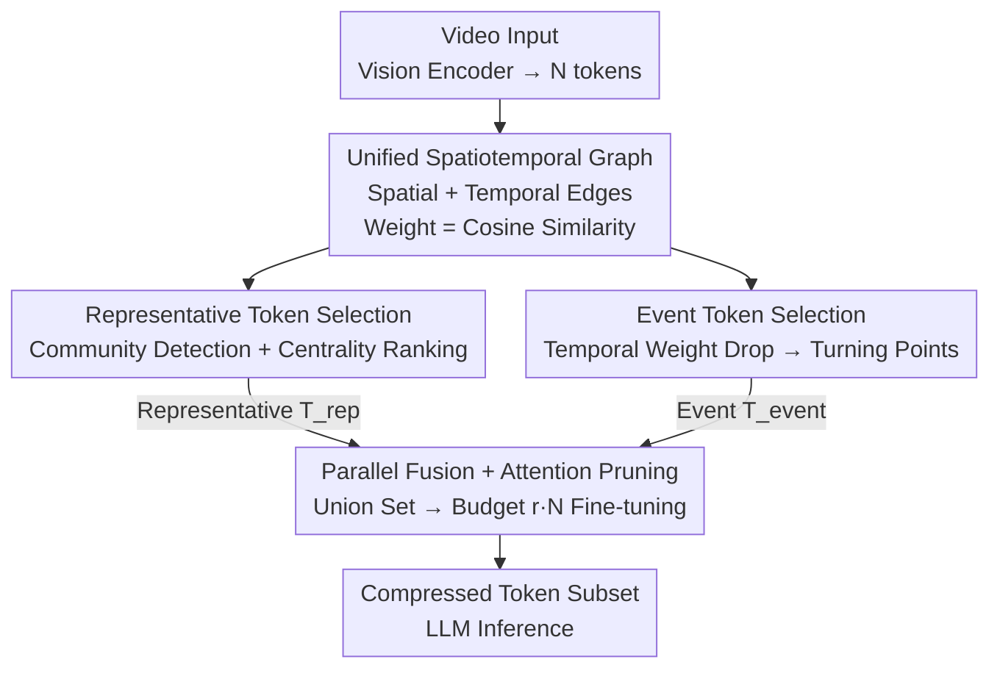

# ST-SimDiff: Balancing Spatiotemporal Similarity and Difference for Efficient Video Understanding with MLLMs

**Conference**: ICLR 2026  
**OpenReview**: [https://openreview.net/forum?id=he8kYNcoMA](https://openreview.net/forum?id=he8kYNcoMA)  
**Code**: https://github.com/bingjunluo/ST-SimDiff  
**Area**: Multimodal VLM / VLM Efficiency / Video Understanding  
**Keywords**: Video token compression, Spatiotemporal graph, Community detection, Difference detection, Training-free

## TL;DR
To address the visual token explosion in large multimodal models (LVLMs) when processing long videos, this paper proposes ST-SimDiff, a training-free framework. It constructs a spatiotemporal graph of all visual tokens and parallelly performs community detection via "similarity" to retain representative tokens and mutation detection via "difference" to retain event tokens. Finally, it fine-tunes the token budget using attention. At 30%/50% token budgets, it consistently outperforms SOTA methods like FastV and FrameFusion, even matching the performance of the full 100% token model on certain benchmarks.

## Background & Motivation

**Background**: Current Large Video Language Models (LVLMs) typically sample a video into dozens of frames, with each frame encoded into hundreds or thousands of visual tokens for the LLM. While effective, the token count explodes with video duration and resolution. Given the $O(N^2)$ complexity of self-attention, long video analysis and real-time interaction become computationally and memory-prohibitive.

**Limitations of Prior Work**: Existing efficiency methods fall into two categories. One is importance-based pruning (e.g., FastV, FasterVLM), which uses deep-layer attention scores to remove low-contribution tokens. The other is similarity-based merging/selection (e.g., FrameFusion for adjacent frame merging, VisionZip for dominant token selection in encoders). Both share two blind spots: first, they focus on either intra-frame spatial correlation or inter-frame temporal correlation at fixed positions, lacking a unified modeling of **spatiotemporal relationships** required for complex dynamic events; second, they focus exclusively on "information commonality" (similarity/importance) while **ignoring changes and turning points** in the video.

**Key Challenge**: Video narratives are often driven by "turning events"—the appearance of a new object, the start of an action, or a scene change. If compression algorithms only pursue similarity, they "smooth out" these mutations, leading to content misinterpretation. In other words, similarity and difference have been treated separately by existing methods, with the latter being almost entirely neglected.

**Goal**: Design a token selection function $f(T_{\text{full}}, r)$ that, given a compression rate $r$ (retaining $r \cdot N$ tokens), uses minimal tokens to represent stable content while precisely preserving key changes to maximize downstream performance.

**Key Insight**: The authors propose a new perspective—**similarity is for identifying redundancy, while difference is for capturing key events**. An ideal compression algorithm should achieve both: represent stable content with minimal tokens and accurately retain critical changes.

**Core Idea**: Construct a spatiotemporal graph of visual tokens for unified modeling of complex associations. Then, parallelly execute "redundancy compression via similarity community detection" and "event localization via temporal difference detection". The tokens selected from both paths are merged and fed into the LLM, marking the first time token similarity and difference are treated with equal importance.

## Method

### Overall Architecture
ST-SimDiff is a completely training-free visual token compression framework situated between the vision encoder and the LLM. Given a video, the vision encoder first encodes it into $N$ tokens $T=\{t_1,\dots,t_N\}$, each with spatiotemporal coordinates (frame index, spatial height/width index) and feature vectors. The process involves **constructing a spatiotemporal graph to describe token associations, running two complementary selection paths (Representative path for static redundancy and Event path for dynamic events), taking the union of the results, and performing a final attention-based pruning to meet the target budget**.

### Key Designs

**1. Unified Spatiotemporal Graph: Integrating Spatial and Temporal Redundancy**

Existing methods isolate spatial similarity (intra-frame) and temporal similarity (inter-frame), failing to capture complex redundancies like an object moving across the screen. This paper treats all visual tokens as vertices to build a sparse spatiotemporal graph $G=(V,E)$, where $E=E_S\cup E_T$. Spatial edges $E_S$ connect spatially adjacent tokens (Manhattan distance of 1) within the same frame, and temporal edges $E_T$ connect tokens at the same spatial position in adjacent frames. Edge weights are defined by cosine similarity $w(v_i,v_j)=\frac{x_i\cdot x_j}{\lVert x_i\rVert\lVert x_j\rVert}$. This sparse graph simultaneously encodes local spatial relationships and temporal continuity, with a linear complexity regarding the number of tokens.

**2. Spatiotemporal Representative Token Selection (SRTS): Compressing Redundant Content**

Static backgrounds and persistent objects form clusters of high-similarity tokens in the graph. SRTS leverages this by first pruning edges below a threshold $\tau_{\text{sim}}$ (set to 0.8) to get $G'$. A community detection algorithm (Connected Components for speed, though Louvain/Leiden are discussed) finds clusters $C=\{c_1,\dots,c_m\}$. Within each community $c_k$, tokens are ranked by centrality, defined as the average similarity to others in the cluster: $S_c(t_a)=\frac{1}{|c_k|-1}\sum_{t_b\in c_k,b\neq a} w(t_a,t_b)$. The top $\lceil |c_k|\cdot r\rceil$ tokens per community are retained in $T_{\text{rep}}$. This strategy ensures that each semantic cluster retains its most central representatives while purging redundancy.

**3. Difference-based Event Token Selection (DETS): Capturing Key Events via Temporal Mutations**

While similarity defines the "norm," difference defines the "event." DETS specifically analyzes temporal edges $E_T$. Using a dynamic threshold $\tau_{\text{diff}}$ (e.g., the 95th percentile of all difference scores, or 0.2), when the similarity of a temporal edge drops below the threshold $w(t_k,t_l)<\tau_{\text{diff}}$, the later token $t_l$ is marked as a key event token: $T_{\text{event}}=\{t_l\mid \exists t_k\ \text{s.t.}\ (v_k,v_l)\in E_T,\ T(t_l)>T(t_k),\ w(v_k,v_l)<\tau_{\text{diff}}\}$. This path acts as a "safety net" to recover turning points that similarity paths might discard.

**4. Parallel Fusion + Attention Pruning: Precise Budget Control**

After SRTS and DETS are computed, their union $T_{\text{candidate}}=T_{\text{rep}}\cup T_{\text{event}}$ is formed. Since the union size might not exactly equal the target budget $N_{\text{target}}=\lceil r\cdot N\rceil$, a final pruning step is applied: if the candidate set exceeds the budget, the least important tokens (measured by LLM early-layer attention scores following FastV) are removed. This two-stage logic combines structural preservation with flexible computational constraints. The complexity of all three stages remains $O(Nd)$.

## Key Experimental Results

### Main Results
Evaluated on LLaVA-Video-7B and NVILA-8B across three long video benchmarks (VideoMME, LongVideoBench, EgoSchema) using 64 input frames at 30%/50% retention rates. Selected results for LLaVA-Video-7B Overall (%):

| Retention | Method | VideoMME (Overall) | LongVideoBench | EgoSchema |
|-----------|--------|--------------------|----------------|-----------|
| 100%      | LLaVA-Video (Upper Bound) | 63.3 | 58.2 | 57.3 |
| r=30%     | FrameFusion (Prev. SOTA) | 61.3 | 56.0 | 53.0 |
| r=30%     | **Ours (ST-SimDiff)** | **63.2** | **57.5** | **56.0** |
| r=50%     | FrameFusion | 62.6 | 57.6 | 55.8 |
| r=50%     | **Ours (ST-SimDiff)** | **63.8** | **57.9** | **57.3** |

On NVILA-8B, the method also leads significantly: at r=50%, VideoMME Overall is 61.7 (vs 59.4 for FrameFusion). Notably, at r=50%, ST-SimDiff matches or even exceeds the 100% token model on several benchmarks.

### Ablation Study
Incremental improvements from an importance-pruning Baseline by adding similarity modules (+Sim) and the difference module (++Diff) on LLaVA-Video (r=30%):

| Configuration | VideoMME | LongVideoBench | EgoSchema | Detail |
|---------------|----------|----------------|-----------|--------|
| Baseline (Importance Pruning) | 60.3 | 56.2 | 54.8 | Start |
| + Sim (Spatial) | 61.5 | 56.5 | 55.2 | Spatial similarity only |
| + Sim (Temporal) | 61.7 | 56.8 | 55.1 | Temporal similarity only |
| + Sim (Spa.+Tem.) | 62.6 | 57.0 | 55.3 | Unified ST optimal |
| ++ Diff (Full Model) | 63.2 | 57.5 | 56.0 | Adding difference detection |

### Key Findings
- **Unified ST Similarity > Spatial or Temporal alone**: Modeling spatiotemporal associations together provides more efficient redundancy compression.
- **Difference module is critical at high compression**: The ++Diff configuration shows significant gains at r=30% (e.g., 62.6→63.2 on VideoMME), serving as an essential safety net when tokens are scarce.
- **Efficiency gains scale with video length**: At r=30%, inference time for 128 frames drops from 6.50s to 4.54s (30.2% reduction), with peak memory decreasing from 35.0GB to ~23.9GB.

## Highlights & Insights
- **Dual perspective of "Similarity for Redundancy, Difference for Events"**: While prior works focused solely on finding commonalities, this approach elevates "turning points" to equal prominence, providing a concrete detection method (temporal weight drops).
- **Elegant Unified Spatiotemporal Graph**: Building a single graph to serve both paths is architecturally clean. Community detection handles the representative path, while temporal edges handle the event path, maintaining linear complexity.
- **Training-free and Plug-and-play**: It requires no retraining and improves diverse architectures like LLaVA-Video and NVILA, offering low migration costs.

## Limitations & Future Work
- **Reliance on Manual Thresholds**: Hyperparameters $\tau_{\text{sim}}=0.8$ and $\tau_{\text{diff}}=0.2$ are fixed; the optimal values might shift across different models or data distributions.
- **Temporal-only Difference**: DETS defines turning points solely via inter-frame temporal edges. It might be less sensitive to gradual events or complex spatial "differences."
- **Community Detection Speed Trade-off**: Using Connected Components is a heuristic for speed. Whether more complex algorithms (Louvain/Leiden) yield significantly better compression quality remains to be analyzed.
- **Heuristic Splitting**: Large communities are split using a $\sqrt{N}$ heuristic to maintain complexity, the impact of which was not independently ablated.

## Related Work & Insights
- **vs. FastV / FasterVLM (Importance Pruning)**: These tend to retain "important but redundant" tokens. ST-SimDiff actively removes spatiotemporal redundancy while explicitly adding an event-capturing path.
- **vs. FrameFusion / VisionZip / PruMerge (Similarity-based)**: These typically merge or select based on "commonality," which can theoretically smooth out turning points. ST-SimDiff outperforms these by integrating a difference detection path and unified ST modeling.

## Rating
- Novelty: ⭐⭐⭐⭐⭐ 
- Experimental Thoroughness: ⭐⭐⭐⭐ 
- Writing Quality: ⭐⭐⭐⭐⭐ 
- Value: ⭐⭐⭐⭐⭐ 

<!-- RELATED:START -->

## Related Papers

- [\[ICLR 2026\] SURGE: Surprise-Guided Token Reduction for Efficient Video Understanding with VLMs](surge_surprise-guided_token_reduction_for_efficient_video_understanding_with_vlm.md)
- [\[ACL 2026\] HERMES: KV Cache as Hierarchical Memory for Efficient Streaming Video Understanding](../../ACL2026/vlm_efficiency/hermes_kv_cache_as_hierarchical_memory_for_efficient_streaming_video_understandi.md)
- [\[CVPR 2026\] TimeViper: A Hybrid Mamba-Transformer Vision-Language Model for Efficient Long Video Understanding](../../CVPR2026/vlm_efficiency/timeviper_a_hybrid_mamba-transformer_vision-language_model_for_efficient_long_vi.md)
- [\[ICLR 2026\] Photon: Speedup Volume Understanding with Efficient Multimodal Large Language Models](photon_speedup_volume_understanding_with_efficient_multimodal_large_language_mod.md)
- [\[ACL 2026\] APB-V: Accelerating Long-Video Understanding via Sequence-Parallelism-aware Approximate Attention](../../ACL2026/vlm_efficiency/apb-v_accelerating_long-video_understanding_via_sequence-parallelism-aware_appro.md)

<!-- RELATED:END -->
