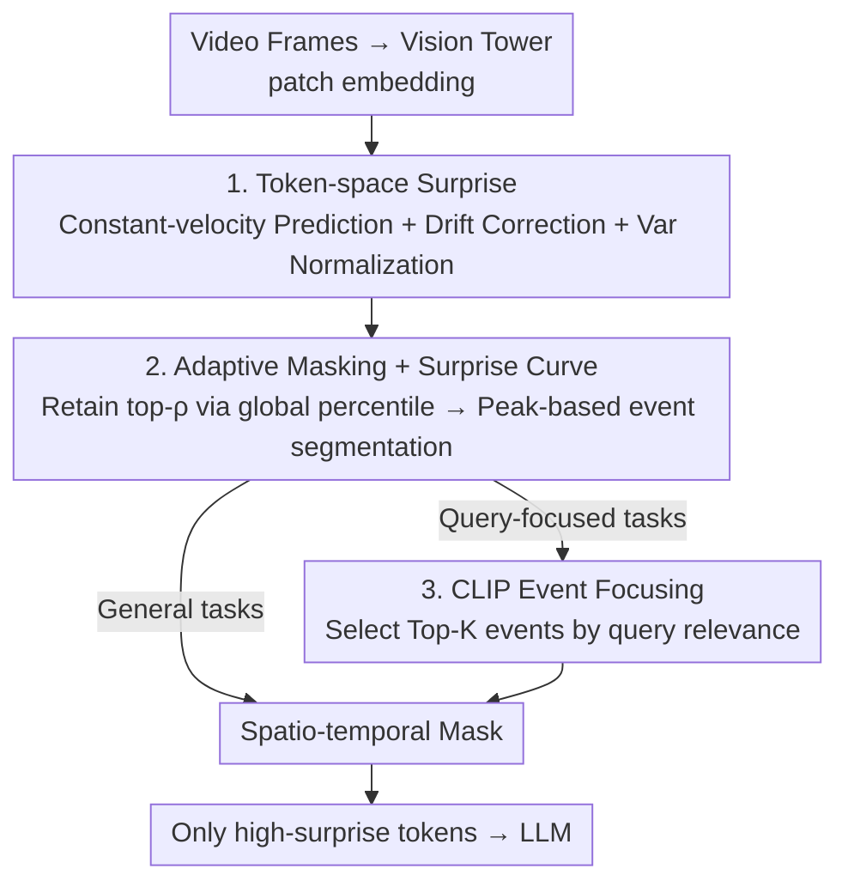

# SURGE: Surprise-Guided Token Reduction for Efficient Video Understanding with VLMs

**Conference**: ICLR 2026  
**OpenReview**: [https://openreview.net/forum?id=rCFPSIjqMf](https://openreview.net/forum?id=rCFPSIjqMf)  
**Code**: https://github.com/BarryTang22/SURGE  
**Area**: Multimodal VLM / Video Understanding / VLM Efficiency  
**Keywords**: token pruning, video VLM, temporal prediction, surprise, training-free

## TL;DR
SURGE measures surprise based on the "temporal predictability of tokens." Predictable redundant tokens are pruned while unpredictable informative tokens are retained. This training-free, backbone-agnostic method reduces tokens to 1/7 of the original and cuts prefill costs by 86–98% across five video understanding benchmarks, with accuracy staying within ±1 point of the full-token baseline.

## Background & Motivation

**Background**: Video VLMs (e.g., InternVL, Qwen-VL, LLaVA-Next) expand short clips into thousands of visual tokens. The quadratic complexity of attention makes long-video inference extremely expensive. To reduce costs, the community optimizes efficiency along three lines: keyframe selection in the temporal dimension, compressing frames into fewer tokens in the representation dimension, and merging or pruning redundant patches in the token dimension.

**Limitations of Prior Work**: Most existing methods incur additional costs: they either require training an auxiliary selector, fine-tuning the backbone, or relying on internal attention maps that are often inaccessible in deployed systems. Crucially, their proxy signals (attention weights, similarity scores) measure "what is important now" rather than "what changed compared to before." Consequently, redundant but "on-topic" segments continue to consume computation, while novel events might be neglected.

**Key Challenge**: Video naturally possesses temporal continuity; consecutive frames have similar backgrounds and predictable motion, leading to high redundancy. However, current efficiency methods lack a **training-free, attention-independent, and backbone-agnostic** signal to determine online "which tokens carry unpredictable new information worth computing."

**Key Insight**: The authors borrow concepts from cognitive science and reinforcement learning: predictive coding suggests that expected inputs are suppressed while unexpected ones are deeply processed; curiosity modules reward exploration via prediction error. This "surprise is prediction error" principle is applied directly to token space: tokens consistent with recent history have low information density, whereas those deviating from expectations mark significant changes.

**Core Idea**: A lightweight constant-velocity predictor estimates each token in the token space, defining **surprise as the prediction error**. High-surprise tokens are retained, while predictable ones are pruned. Token-level surprise is then aggregated temporally into a "surprise curve" to segment key events. Optionally, CLIP is used to further focus on query-related content, forming a compact spatio-temporal mask.

## Method

### Overall Architecture

SURGE is a training-free masking module inserted between the visual encoder and the language model. After the vision tower partitions each frame into $m$ patches and outputs patch embeddings, SURGE first calculates the surprise score for each token on **unprojected** raw patch features (using constant-velocity prediction → drift correction → variance normalization). It then performs two operations: first, retaining the top-$\rho$ most surprising tokens based on a global percentile (adaptive masking); second, aggregating the surprised token count per frame into a surprise curve to cut key event windows using peaks. This spatio-temporal mask can be used directly for efficient inference. For query-focused tasks, CLIP can compute similarity between the query and peak frames to keep only the Top-K most relevant events (denoted as SURGE⋆). Finally, only the "high-surprise tokens within key events" are fed into the LLM.

### Key Designs

**1. Token-space Surprise: Measuring "Predictability" with Constant-Velocity Prediction Error**

This is the foundation of the work, addressing the lack of a training-free, backbone-agnostic novelty signal. The authors provide a theoretical basis: natural videos evolve smoothly, $I_{t+1}\approx I_t+\Delta I_t$. A first-order Taylor expansion on a differentiable encoder $f_j$ yields approximately linear dynamics in token space, $z^{(j)}_{t+1}-2z^{(j)}_t+z^{(j)}_{t-1}\approx 0$, representing a **constant-velocity prior**. Smooth motion satisfies this, while abrupt events cause large deviations. Based on this, the predictor extrapolates the most recent displacement: $\hat z^{(j)}_t=z^{(j)}_{t-1}+\tilde\delta^{(j)}_{t-1}$, where $\tilde\delta^{(j)}_{t-1}\approx z^{(j)}_{t-1}-z^{(j)}_{t-2}$. This is causal, training-free, and treats all spatial locations equally, ensuring compatibility with any ViT backbone.

To prevent "false surprise" from large-scale consistent motion (e.g., camera panning), a **global drift correction** is added. Displacement fields are approximated as affine functions of spatial coordinates $\Delta z^{(j)}_t\approx c_0+c_x x_j+c_y y_j$. Coefficients are fitted using a closed-form least-squares solution $\hat C=(X^\top X)^{-1}X^\top\Delta Z_t$. Subtracting the global translation and first-order planar flow yields the detrended displacement $\tilde\delta^{(j)}_t$. Finally, the squared magnitude of the surprise vector $e^{(j)}_t=z^{(j)}_t-\hat z^{(j)}_t$ is **variance-normalized** using the exponential moving average (EMA) of historical variance $\sigma^{2,(j)}_t$ to produce a scalar surprise score:

$$s^{(j)}_t=\frac{\lVert e^{(j)}_t\rVert_2^2}{\sigma^{2,(j)}_t+\varepsilon}.$$

**2. Adaptive Masking and Surprise Curves: From Token Scores to Key Event Segmentation**

**Adaptive masking** uses a global percentile rather than a fixed threshold. By collecting all scores $S_B$ in the current buffer, the $p$-th percentile $q(p)$ is used to define the mask $M_{u,j}=\mathbb 1\{s^{(j)}_u\ge q(p)\}$, retaining a ratio of $\rho=1-p$ tokens. This global selection allows dynamic frames to contribute more tokens while redundant frames contribute fewer, automatically allocating the budget to high-variance segments.

To capture "key events," the count of tokens exceeding the threshold at time $u$, $S_u=\sum_j M_{u,j}$, forms a **surprise curve**. After smoothing with an EMA $\bar S_u$, peak detection is performed. Midpoints between adjacent peaks serve as event boundaries $b_k=\lfloor(\tau_k+\tau_{k+1})/2\rfloor$, naturally partitioning the video into events centered around surprise peaks $\tau_k$.

**3. CLIP Query-Aware Event Focusing: Combining "Novelty" and "Relevance"**

The mask alone only ensures "novelty." For query-focused retrieval, SURGE⋆ performs a CLIP forward pass on peak frames: the peak frame embedding $v_{\tau_k}$ is compared with the text query embedding to compute similarity $r_k=\mathrm{sim}(q,v_{\tau_k})$. The Top-K events $E_K$ are retained based on $r_k$, while other regions only keep a small "context floor" $C_{u,j}$ of top-$k_{ctx}$ tokens. The final mask is:

$$M^\star_{u,j}=A_u\cdot M_{u,j}+(1-A_u)\cdot C_{u,j},$$

where $A_u=\mathbb 1\{u\in\bigcup_{k\in E_K}I_k\}$. This significantly reduces tokens sent to the LLM and improves focus in long-context retrieval by combining surprise-driven "novelty" and query-driven "relevance."

## Key Experimental Results

### Main Results

Across five benchmarks (Video-MME, MLVU, MMBench-Video, TempCompass, LongVideoBench) and three VLMs (InternVL-3.5-VL 8B, Video-LLaVA-Qwen 7B, Qwen2.5-VL 7B), SURGE compresses visual tokens to ~26–27% (≈4×), and SURGE⋆ to ~14–16% (≈7×), while maintaining accuracy within ±1 point.

| Model (64 frames) | Tokens | V-MME | MLVU (M/G) | MMB-V | T-Compass | LVB |
|--------|------|------|----------|------|------|------|
| InternVL-3.5-VL (8B) | 17,124† | 66.0 | 71.7 / 3.44 | 1.54 | 68.9 | 61.3 |
| + SURGE | 4,674 | 64.9 | 71.5 / 3.45 | 1.57 | 69.0 | 61.7 |
| + SURGE⋆ | 2,932 | 65.8 | 71.7 / 3.69 | 1.57 | 69.7 | 62.2 |
| Video-LLaVA-Qwen (7B) | 12,246 | 63.4 | 72.9 / 3.30 | 1.53 | 66.9 | 58.3 |
| + SURGE⋆ | 1,884 | 64.5 | 72.7 / 3.20 | 1.60 | 66.9 | 61.9 |
| + FastV | 3,300 | 58.1 | 52.3 / 3.11 | 1.29 | 61.7 | 55.4 |
| Qwen2.5-VL (7B) | 41,590 | 62.2 | 65.8 / 4.26 | 1.60 | 70.5 | 60.0 |
| + SURGE⋆ | 5,207 | 62.7 | 66.1 / 4.24 | 1.70 | 67.7 | 61.3 |

On benchmarks emphasizing long-video and cross-event reasoning, SURGE⋆ even outperforms full-token baselines (e.g., +0.9 on LVB for InternVL). Compared to FastV (attention-based pruning), SURGE is significantly more stable at the same budget (64.5 vs 58.1 on V-MME for Video-LLaVA-Qwen), indicating that temporal surprise is a more reliable metric than attention magnitude.

### Ablation Study

Scanning the retention ratio $\rho$ on Qwen2.5-VL, SURGE shows a maximum relative fluctuation of ≤±1.1% even at radical ratios ($\rho=0.01$), whereas random pruning collapses when dropping >75% of tokens.

| Configuration (ρ=0.25) | MLVU (M/G) | T-Compass | MMB-V | Description |
|------|---------|------|------|------|
| SURGE (Full) | 65.7 / 4.26 | 70.5 | 1.72 | Full model |
| w/o Drift Correction (Eq.4) | 64.9 / 4.18 | 69.4 | 1.65 | No global drift detrending |
| w/o Var Normalization (Eq.5) | 65.1 / 4.22 | 69.7 | 1.70 | No variance calibration |
| w/o Temporal Predictor (Frame Diff Eq.3) | 63.4 / 4.17 | 66.9 | 1.55 | Degrades to frame difference |

### Key Findings
- **Temporal Predictor is crucial**: Removing it (reducing to frame difference) misinterprets smooth motion as novelty, leading to the largest performance drops.
- **Top-K Selection**: K=1 causes coverage collapse and severe performance drops. K=5–7 provides a robust default where SURGE⋆ often matches or exceeds baselines.
- **Long Context Scalability**: While baselines OOM on A100 80GB beyond ~230 frames, SURGE allows processing 1024 or even 3600 frames, increasing handling capacity by an order of magnitude.
- **Computation Gains**: At $\rho=0.25$, prefill FLOPs and latency decrease by 86% and 79% respectively on Qwen2.5-VL.

## Highlights & Insights
- **Applying "Surprise = Prediction Error" to token space**: This cognitive science principle provides a "novelty" signal that is training-free, backbone-agnostic, and attention-independent.
- **First-principles derivation**: Using Taylor expansion to translate "smooth video" into "near-zero second-order token difference" gives the constant-velocity prior formal grounding.
- **Global Percentile + Drift Correction**: This combination allows budgets to tilt towards high-change segments while suppressing false surprise from camera movements.
- **Decoupling "New" and "Relevant"**: Decoupling surprise masking from CLIP-based event selection allows for a modular design that is easily transferable to streaming scenarios.

## Limitations & Future Work
- SURGE⋆ requires an additional CLIP forward pass and is sensitive to the choice of K and query phrasing; future work may involve lighter relevance models or adaptive event selection.
- The constant-velocity prior assumes smooth evolution. Its performance on content with aggressive cuts or highly non-linear motion requires further stress testing.
- The primary experiments omit the "context floor" $C_{u,j}$ to isolate surprise-driven gains; its effectiveness in extreme pruning scenarios hasn't been systematically quantified.

## Related Work & Insights
- **vs FastV / SparseVLM (Attention-based pruning)**: These rely on attention maps and threshold tuning. SURGE uses temporal prediction error to select tokens that "changed since before," proving more robust at equivalent budgets.
- **vs AKS (Adaptive Keyframe Selection)**: AKS operates at the frame level. Combining SURGE with AKS improves both efficiency and accuracy, suggesting synergy between temporal selection and token masking.
- **vs ToMe / LLaMA-VID (Compression/Merging)**: These often require architectural changes or training. SURGE is a plug-and-play inference-time module with much lower deployment barriers.

## Rating
- Novelty: ⭐⭐⭐⭐⭐ Systematically applies "surprise as prediction error" to token space with drift correction.
- Experimental Thoroughness: ⭐⭐⭐⭐⭐ Covers three models, five benchmarks, radical compression ratios, and long-context scalability up to 3600 frames.
- Writing Quality: ⭐⭐⭐⭐ Clear motivation and pipeline diagrams; some notation for final masks requires cross-referencing the appendix.
- Value: ⭐⭐⭐⭐⭐ Training-free and backbone-agnostic, significantly increasing the practical context length of video VLMs.

<!-- RELATED:START -->

## Related Papers

- [\[CVPR 2026\] ApET: Approximation-Error Guided Token Compression for Efficient VLMs](../../CVPR2026/vlm_efficiency/apet_approximation-error_guided_token_compression_for_efficient_vlms.md)
- [\[ICLR 2026\] ST-SimDiff: Balancing Spatiotemporal Similarity and Difference for Efficient Video Understanding with MLLMs](st-simdiff_balancing_spatiotemporal_similarity_and_difference_for_efficient_vide.md)
- [\[CVPR 2026\] MeToM: Metadata-Guided Token Merging for Efficient Video LLMs](../../CVPR2026/vlm_efficiency/metom_metadata-guided_token_merging_for_efficient_video_llms.md)
- [\[CVPR 2026\] CoIn: Coverage and Informativeness-Guided Token Reduction for Efficient Large Multimodal Models](../../CVPR2026/vlm_efficiency/coin_coverage_and_informativeness-guided_token_reduction_for_efficient_large_mul.md)
- [\[ACL 2026\] HERMES: KV Cache as Hierarchical Memory for Efficient Streaming Video Understanding](../../ACL2026/vlm_efficiency/hermes_kv_cache_as_hierarchical_memory_for_efficient_streaming_video_understandi.md)

<!-- RELATED:END -->
