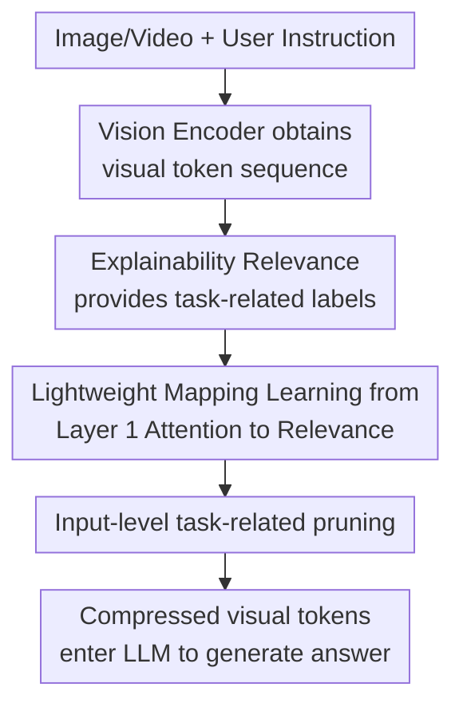

# Task-Related Token Compression in Multimodal Large Language Models from an Explainability Perspective

**Conference**: ICLR2026  
**OpenReview**: [https://openreview.net/forum?id=YULeQtSyiW](https://openreview.net/forum?id=YULeQtSyiW)  
**Code**: Undisclosed  
**Area**: Multimodal VLM / VLM Efficiency / Vision Token Compression  
**Keywords**: Visual token compression, MLLM inference acceleration, Explainability, Task-related pruning, KV-cache optimization  

## TL;DR
This paper utilizes Transformer explainability methods to estimate the task-relevance of visual tokens relative to the current instruction. It trains a lightweight convolutional compressor to prune low-relevance tokens at the LLM input stage, significantly reducing FLOPs, prefill time, and KV-cache on Qwen2-VL, LLaVA-OneVision, and VILA1.5 while maintaining image and video understanding performance.

## Background & Motivation
**Background**: Mainstream multimodal large language models (MLLMs) typically use a vision encoder to convert image patches or video frames into a large number of visual tokens, which are then fed into the LLM alongside system prompts and user instructions. High-resolution images, long videos, and multi-frame inputs cause visual token counts to expand rapidly, directly increasing attention computation, prefill latency, and KV-cache memory usage.

**Limitations of Prior Work**: Existing visual token compression generally falls into two categories: task-agnostic merging or pooling, which reduces redundancy based on similarity between visual tokens, and task-related compression, which usually relies on shallow LLM attention to prune visual tokens in intermediate layers. The former ignores the specific requirements of the current question, while the latter assumes that shallow visual tokens must fully enter the LLM, leading to unavoidable prefill costs and initial KV-cache overhead.

**Key Challenge**: While the primary goal is to save the entire computation and caching after LLM input, task-related importance judgment seemingly requires visual-language interaction within the LLM. Consequently, methods like FastV tend to compress after shallow layers, assuming visual tokens should not be deleted before alignment is completed in early layers. This paper questions this assumption: if the relevance of visual tokens to the current instruction can be known before entering the LLM, input-stage compression can simultaneously reduce burdens in both the prefill and decoding phases.

**Goal**: The authors aim to answer two questions. First, whether a reliable task-related importance metric exists that can explain the contribution of each visual token to the answer at the output level, proving that input-stage compression is not inherently unfeasible. Second, since full explainability computation requires generation and backpropagation, whether a small substitute module can be trained to predict this importance during real-time inference.

**Key Insight**: The paper chooses to start from explainability rather than empirical model structure. Transformer explainability methods can combine attention with gradients to propagate relevance maps across layers, obtaining global relevance scores of input visual tokens for the generated answer. This approach is model-agnostic: it does not rely on specific architecture observations of an MLLM but utilizes the response path of the model itself to label which visual tokens truly influence the answer.

**Core Idea**: First, use the explainability relevance $R_v$ from gradient-weighted attention to verify the feasibility of "input-stage task-related pruning." Then, train a lightweight 1D convolutional network $f_\theta$ to predict $\tilde{R}_v$ from the first-layer text-to-vision attention, using predicted relevance to retain the most important visual tokens before LLM input.

## Method

### Overall Architecture
The proposed method is divided into two pipelines: "Offline Explainable Label Generation" and "Online Lightweight Prediction & Compression." In the offline stage, the original MLLM processes the input completely, calculating visual token relevance $R_v$ using attention and gradients during answer generation to verify the pruning strategy. During training, the first-layer instruction-to-vision attention is used as input to learn a small convolutional network that approximates $R_v$. In the inference stage, only this lightweight compressor is run to directly compress visual tokens from $E_v$ to $\hat{E}_v$ at the LLM input.

Formally, the vision encoder and projection layer encode input visual signals $V$ into $E_v=VM(V)\in\mathbb{R}^{N_v\times C}$. System prompts and user instructions are $E_s$ and $E_u$, respectively. The original model generates the answer as $Y=LM(E_s,E_v,E_u)$. The objective is to learn a compressor $Comp$ such that $\hat{E}_v=Comp(E_v\mid E_u)\in\mathbb{R}^{\hat{N}_v\times C}$ where $\hat{N}_v\ll N_v$, without modifying the vision encoder or LLM, followed by inference using $Y=LM(E_s,\hat{E}_v,E_u)$.

The key to this framework is not performing another round of general visual redundancy removal but specifically deleting tokens "unimportant to the current question." For example, in an image of a chart, if a user asks about three specific curves, the tokens corresponding to those curves should be retained; if the question changes to other columns or objects, the important regions should change accordingly. This task-conditional selection distinguishes this work from pure visual similarity merging.

### Key Designs
**1. Explainability Relevance: Measuring visual token contribution via gradient-weighted attention**

The hardest part of input-stage compression is knowing which visual tokens can be deleted before actually running the LLM. The paper establishes a credible upper-bound metric using explainability. For each generated token $y_t$, the relevance map $R_t$ is initialized as an identity matrix and propagated layer-by-layer. For the $l$-th layer multi-head attention $A_t^l$ and its gradient $\nabla A_t^l$, the update rule is:

$$
R_t = R_t + E_h((A_t^l \odot \nabla A_t^l)^+)\cdot R_t
$$

Where $\odot$ is element-wise multiplication, $(\cdot)^+$ denotes keeping only positive contributions, and $E_h$ denotes averaging across attention heads. Intuitively, attention shows where information flows, while gradients show whether those flows are useful for the current output; their product, accumulated across layers, better identifies the input visual tokens supporting the answer than attention alone.

After obtaining $R_t$ for each generation step, the method extracts the visual token positions $R_t[-1,N_s:N_s+N_v]$ from the last row and averages them across all generation steps to obtain the global visual relevance $R_v\in\mathbb{R}^{1\times N_v}$. Sorting by $R_v$ to keep top tokens allows for input-stage pruning. Experiments show that multiple models maintain high performance even at 50% or 25% retention when guided by the actual $R_v$, suggesting the assumption that early visual tokens cannot be deleted is not absolute.

**2. Lightweight Mapping from Layer 1 Attention: Distilling expensive explainability into a deployable compressor**

Calculating true $R_v$ requires full generation and backpropagation, which is unusable during inference. The authors train an independent module $f_\theta$ to predict explainability relevance using the LLM's first-layer attention map. Specifically, they take the sub-graph of user instruction tokens looking at visual tokens $A^0_{u\to v}\in\mathbb{R}^{N_u\times N_v}$ from the first-layer attention $A^0$, then average along the instruction token dimension to get the instruction attention received by each visual token $A^0_v\in\mathbb{R}^{1\times N_v}$.

This $A^0_v$ is fed into a 5-layer 1D depthwise separable convolution network to output the predicted relevance $\tilde{R}_v=f_\theta(A^0_v)$, normalized via softmax. A CNN is chosen because the input and output are 1D sequences ordered by visual tokens; convolutions can capture local spatial importance more cheaply than another large Transformer. The paper emphasizes that each MLLM uses its own $f_\theta$ to fit its unique explainability patterns.

The training labels are not a direct softmax of $R_v$. The authors mask the bottom 50% of values in $R_v$, normalize the remainder to sum to one as $R_v^*$, and train using KL divergence: $\mathcal{L}_{KL}=KL(R_v^*\Vert \tilde{R}_v)$. This simplifies the task from "reconstructing continuous relevance" to "identifying the most important regions," fitting the pruning requirement.

**3. Input-level task-related pruning: Simultaneously reducing prefill and decode overhead**

Many intermediate compression methods send full visual tokens to initial LLM layers and prune later. This reduces FLOPs in subsequent layers, but the first prefill stage still handles the full sequence. By moving compression to the LLM input, visual tokens are scored by $f_\theta$, and only the top-$\hat{N}_v$ tokens are concatenated with prompts to enter the LLM.

This shift provides two benefits: first, prefill handles shorter sequences from the start, reducing attention and FFN computation; second, Fewer visual tokens need to be stored in the KV-cache during decoding, reducing memory pressure in long-output or multi-turn scenarios. On Qwen2-VL's MMStar benchmark, at 25% retention, KV-cache drops from 71.2MB to 17.8MB, and prefill time drops from 6min36s to 4min08s, while maintaining higher scores than FastV, PDrop, or Dart.

**4. Model-agnostic but Model-specific: Unifying different architecture paradigms**

The method is a paradigm ("explainable label generation + lightweight compressor fitting") applied across LLaVA-OneVision, Qwen2-VL, and VILA1.5. These models vary significantly in visual token organization (e.g., dynamic resolution in Qwen2-VL, existing spatial compression in VILA1.5). The method still reduces task-related redundancy, proving it targets "instruction-irrelevant information" rather than general redundancy already handled by vision encoders.

### Loss & Training
Training data is sourced from high-quality image and video instruction datasets (Infinity-MM, LLaVA-Video, NeXT-QA, etc.). The authors only use samples where the target MLLM answers correctly to generate labels, as relevance maps for correct answers are more reliable.

The compressor $f_\theta$ is a 5-layer 1D depthwise separable convolution network with increasing channels (32, 64, 128, 256, 512). Training uses Adam with a batch size of 128 for approximately 100 epochs. Training the image compressor takes ~0.5 hours on an A100, and the video compressor takes <4 hours, which is negligible compared to MLLM retraining.

## Key Experimental Results

### Main Results
The authors first use ground-truth $R_v$ to check pruning feasibility, then evaluate the trained $\tilde{R}_v$ against FastV, PyramidDrop, and Dart.

| Model / Scenario | Retention | FLOPs | Average Retention Rate | Comparison |
| :--- | :--- | :--- | :--- | :--- |
| LLaVA-OneVision (Image) | 50% | 0.48× | 97.4% | Dart 95.0%, PDrop 95.1% |
| LLaVA-OneVision (Image) | 25% | 0.24× | 92.1% | Dart 87.5%, PDrop 86.3% |
| Qwen2-VL (Image) | 50% | 0.49× | 97.4% | Dart 96.4%, PDrop 95.2% |
| Qwen2-VL (Image) | 25% | 0.24× | 92.9% | Dart 91.1%, PDrop 89.7% |
| LLaVA-OneVision (Video) | 25% | 0.22× | 97.3% | Dart 93.3%, PDrop 93.6% |
| VILA1.5 (Video) | 25% | 0.23× | 99.0% | Dart 97.7%, PDrop 97.4% |

At 25% retention on MMStar for Qwen2-VL:

| Method | Retention | FLOPs | Total Inference | Prefill Time | KV Cache | MMStar |
| :--- | :--- | :--- | :--- | :--- | :--- | :--- |
| Qwen2-VL | 100% | 1.00× | 15min24s | 6min36s | 71.2MB | 61.1 |
| FastV | 25% | 0.27× | 12min19s | 4min14s | 19.7MB | 39.6 |
| PDrop | 25% | 0.25× | 12min15s | 4min10s | 18.1MB | 53.1 |
| Dart | 25% | 0.30× | 12min20s | 4min16s | 21.6MB | 54.3 |
| Ours | 25% | 0.24× | 12min16s | 4min08s | 17.8MB | 55.8 |

### Ablation Study
Ablations show that gradient-weighted attention is more stable than simple head averaging. A 5-layer CNN strikes a balance between capacity and overfitting. Using only the first-layer attention provides the lowest overhead while being nearly as effective as multi-layer inputs.

| Ablation Item | Config | Performance | Description |
| :--- | :--- | :--- | :--- |
| Aggregation | Mean-weighted | ~96-97% | Averaging heads mixes in weak-contribution heads. |
| Aggregation | Grad-weighted | ~98.8-99.3% | Gradients better reflect positive output contribution. |
| CNN Depth | 3 Layers | 95.5% | Insufficient capacity to fit relevance distribution. |
| CNN Depth | 5 Layers | 96.9% | Main config, balanced performance/complexity. |
| CNN Depth | 7/10 Layers | 96.5%/96.0% | No gain; possible overfitting. |
| Input Layer | Layer 1 Attn | 91.7% | Lowest cost, consistent with target. |

### Key Findings
- Explainability relevance $R_v$ is extremely effective: pruning with ground-truth $R_v$ at 50% is nearly lossless.
- Training the $\tilde{R}_v$ compressor does not require perfect point-wise reconstruction; identifying top regions is sufficient.
- Video tasks are more resilient to compression due to higher temporal/spatial redundancy.
- Qwen2-VL's performance drops more sharply than others, suggesting its attention patterns are harder for a CNN to fit.
- The benefit of input-stage pruning extends beyond FLOPs to KV-cache reduction, crucial for long-video/multi-turn scenarios.

## Highlights & Insights
- Moving "task-related compression" to the LLM input stage is the most significant contribution, challenging the "shallow tokens are essential" assumption.
- Using explainability signals as training labels allows the model's own decision path to teach a mini-module how to pre-screen tokens.
- Task-conditional selection is key: the same image is compressed differently based on the user's question.
- Validation of Explainability: If relevance maps can guide pruning without performance loss, it proves they capture genuine visual evidence rather than just being "pretty heatmaps."

## Limitations & Future Work
- **Limitations**: High cost of generating $R_v$ labels (requires backpropagation). The need to train a specific compressor for each model. Fixed retention ratios instead of dynamic budgeting.
- **Future Work**: Developing dynamic token budgets based on task complexity. Testing on extremely detail-dependent tasks (OCR, fine-grained localization). Integrating with speculative decoding or long-video retrieval.

## Related Work & Insights
- **vs. FastV**: While FastV prunes in middle layers after "alignment," this work proves input-stage pruning can save prefill and KV-cache costs that FastV already incurred.
- **vs. PyramidDrop / Dart**: These methods focus on layer-wise or repetitive token reduction. This work emphasizes task-conditional usage through explainability.
- **vs. Task-agnostic Merging**: Similarity-based merging (ToMe) might delete visually redundant but task-critical regions; this work preserves tokens specifically requested by the instruction.

## Rating
- **Novelty**: ⭐⭐⭐⭐⭐ Innovative move of task-related pruning to the input stage using explainability as supervision.
- **Experimental Thoroughness**: ⭐⭐⭐⭐⭐ Extensive benchmarks across 3 models and 13 datasets.
- **Writing Quality**: ⭐⭐⭐⭐ Method is clear, though results tables are dense.
- **Value**: ⭐⭐⭐⭐⭐ Highly practical for deployment, especially for high-res/long-video MLLM scenarios.

<!-- RELATED:START -->

## Related Papers

- [\[CVPR 2026\] EvoComp: Learning Visual Token Compression for Multimodal Large Language Models via Semantic-Guided Evolutionary Labeling](../../CVPR2026/vlm_efficiency/evocomp_learning_visual_token_compression_for_multimodal_large_language_models_v.md)
- [\[ICLR 2026\] PPE: Positional Preservation Embedding for Token Compression in Multimodal Large Language Models](ppe_positional_preservation_embedding_for_token_compression_in_multimodal_large_.md)
- [\[CVPR 2026\] Hybrid Token Compression for Vision-Language Models](../../CVPR2026/vlm_efficiency/hybrid_token_compression_for_vision-language_models.md)
- [\[CVPR 2026\] Accelerating Streaming Video Large Language Models via Hierarchical Token Compression](../../CVPR2026/vlm_efficiency/accelerating_streaming_video_large_language_models_via_hierarchical_token_compre.md)
- [\[ICLR 2026\] Photon: Speedup Volume Understanding with Efficient Multimodal Large Language Models](photon_speedup_volume_understanding_with_efficient_multimodal_large_language_mod.md)

<!-- RELATED:END -->
