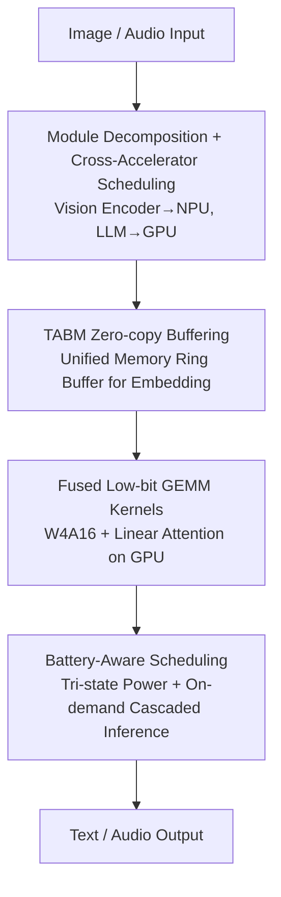

# Tiny but Mighty: A Software-Hardware Co-Design Approach for Efficient Multimodal Inference on Battery-Powered Small Devices

**Conference**: ICLR 2026  
**OpenReview**: [https://openreview.net/forum?id=ql30VWGyda](https://openreview.net/forum?id=ql30VWGyda)  
**Area**: Multimodal VLM / Edge Inference Efficiency  
**Keywords**: Software-Hardware Co-design, Heterogeneous Accelerators, Zero-copy, Edge Multimodal, Low-bit Quantization

## TL;DR
This paper proposes NANOMIND, which decomposes Large Multimodal Models (LMM) into four independent "building blocks": vision, projection, language, and audio. These blocks are scheduled across heterogeneous accelerators (NPU/GPU/CPU) based on their strengths. A Token-Aware Buffer Manager (TABM) facilitates zero-copy embedding transfer on unified memory. Combined with custom hardware, low-bit fused GEMM kernels, and battery-aware scheduling, the system enables a 2000 mAh battery-powered device to perform fully offline multimodal inference. The end-to-end energy consumption is reduced by 42.3% compared to mainstream edge frameworks, achieving nearly 18.8 hours of battery life in low-power mode.

## Background & Motivation
**Background**: Deploying LLM/VLM on the edge (phones, wearables, robots) is increasingly critical—cloud deployment carries privacy risks, while local inference ensures data privacy and real-time response. Significant work has been done: parameter-efficient small models (SmolVLM, Gemma-3-1B, Phi-3), aggressive quantization (AWQ, BitNet), and lightweight inference frameworks (llama.cpp, MLC LLM).

**Limitations of Prior Work**: Existing efforts focus almost entirely on software/algorithm optimizations, specifically low-bit quantization, while ignoring the hardware layer and software-hardware co-design. Consequently: ① Treating the entire model as a monolith forces it into a single accelerator, failing to utilize heterogeneous accelerators on modern SoCs (NPUs excel at INT4/INT8 tensor operations but are slow for floating-point; GPUs excel at large-scale parallel floating-point). ② Most frameworks follow the "separate CPU and GPU memory" assumption from servers/PCs, whereas modern edge SoCs use Unified Memory Architecture (UMA) where CPU/GPU/NPU share DRAM—frameworks like llama.cpp still rely on CPU-managed data movement in UMA, increasing memory overhead with more offloaded layers. ③ Power consumption is rarely considered.

**Key Challenge**: LMM internal modules (vision encoder, projection layer, language decoder) have distinct computational characteristics and are naturally loosely coupled, matching the varying strengths of heterogeneous accelerators. However, current deployments use a "one-size-fits-all" approach by squeezing the entire model into a single accelerator, leading to hardware idling, increased latency, and inefficient inference.

**Goal**: To build an end-to-end, fully offline, module-level dynamic scheduling inference system under strict power and memory budgets, bridging the gap between "model modularity" and "hardware heterogeneity."

**Key Insight**: The authors observe that LMMs are inherently modular, allowing independent execution of components, and that different accelerators have specific strengths. Instead of altering model algorithms, they perform software-hardware co-design at the inference system layer: decomposing the model into "building blocks," mapping each to the most suitable computing unit, and redesigning cross-accelerator data paths and power strategies for UMA.

**Core Idea**: Replace the "monolithic single-accelerator model" with "module-level cross-accelerator scheduling + unified memory zero-copy transfer + battery-aware execution" to maximize heterogeneous hardware efficiency and minimize power consumption on edge devices.

## Method

### Overall Architecture
NANOMIND is an end-to-end, software-hardware co-designed edge inference framework. It consists of three top-down layers: first, **model decomposition**, breaking the LMM into vision encoder (SigLip ViT), projection layer, language backbone (Qwen2-0.5B), and audio (Whisper for STT + Piper for TTS); second, **software-hardware coordination**, where the vision encoder is offloaded to the NPU and the LLM decoder to the GPU, using a Token-Aware Buffer Manager (TABM) for zero-copy embedding transfer on unified DRAM, orchestrated by a lightweight CPU scheduler; finally, **custom hardware** (RK3566 SoC + parallel LPDDR4x + dedicated Power Management Unit PMU).

The multimodal inference pipeline proceeds as: Camera/Microphone input → Vision encoder on NPU encodes image to embedding → TABM transfers embedding to GPU via zero-copy → LLM on GPU decodes via fused low-bit GEMM kernels → Audio output via TTS. The battery-aware scheduler reads real-time battery levels from the PMU to arbitrate between three power modes, degrading to sequential "on-demand cascaded inference" under extremely low battery.

### Key Designs

**1. Module Decomposition and Cross-Accelerator Scheduling: Optimizing Each Block**

Addressing the "monolithic single-accelerator" bottleneck, the paper decomposes LMMs into four module types and maps them to optimal units. The fixed strategy is: Vision Encoder (SigLip ViT) to NPU, and LLM Decoding to GPU. The rationale is that mobile NPUs typically support only static input shapes, requiring firmware recompilation for varying sizes—a weakness for LLM dynamic prompts but a perfect fit for fixed-resolution vision encoders (images pre-processed to $448\times736$ or $384\times384$). Furthermore, official RKNN drivers for CLIP/SigLip are more efficient than open-source implementations. Conversely, LLMs handle runtime-variable prompt lengths, making them unsuitable for static NPUs, thus they are assigned to GPUs which excel at parallel floating-point computation.

**2. Token-Aware Buffer Manager (TABM): Zero-copy Embedding Transfer in UMA**

When the vision encoder completes embedding calculation on the NPU, the LLM on the GPU requires it as input. Traditional llama.cpp in UMA still relies on the CPU for buffer management and data movement, causing redundant copies and CPU stalls. TABM is a lightweight CPU runtime maintaining a shared ring buffer in unified DRAM, coordinating the NPU as a producer and the GPU as a consumer. It tracks buffer slots with four states (`FREE`, `ALLOCATED_FOR_WRITE`, `READY_TO_READ`, `ALLOCATED_FOR_READ`) and uses lightweight signals for synchronization. The NPU writes embeddings directly to a slot, which the GPU immediately binds as LLM input, eliminating redundant copies, reducing CPU load, and smoothing producer-consumer rate mismatches to maintain a high-throughput token pipeline.

**3. Fused Low-bit GEMM Kernels and Mixed Quantization: Maximizing Cycles on Mobile GPUs**

Mobile GPUs rarely feature fast INT8 tensor cores; naive "dequantize-then-GEMM" approaches involve repeated memory access to intermediate buffers, slowing inference. This work extends a Set of OpenCL backends for the GGUF format with two features: ① **Fused dequant-GEMM**—unpacking and scaling int4 weights directly in registers within the GEMM loop followed by FP16 FMA, eliminating intermediate buffers and multi-pass memory access using tiled vector loads and scale tables in constant/LDS memory. ② **Linear Attention**—replacing standard quadratic attention with kernelized linear attention to avoid explicit $T\times T$ matrix construction, reducing memory traffic and stabilizing long-sequence latency without statistically significant accuracy loss. **Mixed Quantization** is applied: Vision encoders (RKNN format) use FP16 or 8-bit to maintain understanding accuracy, while LLMs (GGUF format) use 4-bit (W4A16) or even 2/3-bit, as 4-bit offers the best balance for edge scenarios.

**4. Battery-Aware Scheduling and On-demand Cascaded Inference: Power as a First-Class Citizen**

NANOMIND uses the onboard PMU to monitor battery level $B$ and employs a tri-state strategy: ① **Unconstrained Performance State** ($B>T_{high}$) with full parallel offloading. ② **Proportional Throttling State** ($T_{low}<B\le T_{high}$) linearly interpolating camera frame rates and memory access rates via a factor $\alpha=(B-T_{low})/(T_{high}-T_{low})$. ③ **Critical Survival State** ($B\le T_{low}$) enabling "On-demand Cascaded Inference." This is an event-triggered mode where the system stays in ultra-low power standby until a CPU core detects an event (e.g., wake word). It then triggers a "load → execute → release" cycle for each module (Whisper, ViT, LLM), releasing hardware immediately after each step and passing only minimal outputs (text or embeddings) to the next stage, minimizing peak memory and power. This reduces average power to 0.375 W, extending battery life to nearly 18.8 hours.

### Loss & Training
The paper does not modify model algorithms or perform training; it is purely a software-hardware co-design for the inference system. All gains stem from scheduling, memory paths, kernels, and power strategies. Model weights are taken directly from LLaVA-OneVision / Qwen2-VL.

## Key Experimental Results

Evaluation is "bottom-up" across three dimensions: resource usage, accuracy under offload strategies, and power consumption. Datasets include InfoVQA, DocVQA, MMBench, MME, and MMLU. Platforms: NANOMIND (RK3566), Orange Pi 5 Ultra (RK3588), and Nvidia Jetson Nano/AGX.

### Main Results

| Dimension | Configuration | Result | Comparison |
|------|------|------|------|
| E2E Energy | NANOMIND vs. Mainstream Edge Frameworks | Reduced by **42.3%** | — |
| E2E Latency | Qwen2-VL-2B(4-bit), InfoVQA | **36.2%** lower than Orange Pi 5 Ultra (rkllm) | Throughput ≈ Jetson Nano + NanoVLM(CUDA) 35.7 tok/s |
| Battery Life | On-demand Cascade, 2000 mAh | Avg **0.375 W**, approx **18.8 hours** | Parallel mode lasts only ~2.4 hours |
| Vision Encoding Latency | SigLip / ArcFace | NPU < GPU < CPU | NPU is fastest, validating the offload strategy |

### Ablation Study

| Configuration | Key Metric | Description |
|------|---------|------|
| TABM vs. llama.cpp copy-based offload | Memory/CPU usage | TABM shows lower memory and significantly reduced CPU load during embedding transfer. |
| Fused GEMM vs. llama.cpp / MLC-LLM / PowerInfer-2 | Throughput (tok/s) | This work's kernel achieves the highest throughput; PowerInfer-2 is close; MLC-LLM performs worse on Qualcomm GPUs. |
| Mixed Quantization (em-/vis-/dec- precision) | MMBench/MMLU/MME | Accuracy depends primarily on ViT precision; keeping ViT high while using 4-bit LLM is optimal. |

### Key Findings
- **TABM is the driver of edge memory optimization**: llama.cpp consumes more memory on all platforms; NANOMIND uses ring buffers in shared memory to keep overhead low. Offloading more layers in llama.cpp increases memory usage (e.g., Llama-3-8B 2-bit from 2.9GB to 5.5GB), highlighting the inefficiency of copy-based offloading in UMA.
- **Module splitting enables mixed quantization**: Accuracy in vision tasks depends almost entirely on the ViT, making "High-precision ViT + Aggressively quantized LLM" the best cost-performance ratio.
- **Power mode switching yields orders of magnitude in battery life**: The jump from 2.4 hours to 18.8 hours is achieved by the "standby + event-trigger + load/execute/release" cascaded design.

## Highlights & Insights
- **Aligning "Modular Models" with "Heterogeneous Hardware"**: While others treat VLMs as monoliths, this work identifies that the static nature of vision encoders perfectly complements the "static-only" limitation of mobile NPUs.
- **Redesigning Data Paths for UMA**: Moving beyond server-based "separated memory" thinking, the use of ring buffers and state machines for zero-copy consumer-producer communication directly addresses why llama.cpp slows down when offloading in UMA.
- **Power as a First-class Citizen**: The tri-state battery-aware scheduling and cascaded execution life cycle provide a practical engineering paradigm for wearable and IoT devices.
- **Fused dequant-GEMM in registers**: This technique is universally applicable to any mobile GPU lacking low-bit tensor cores and can be reused for other edge LLM deployments.

## Limitations & Future Work
- **Hardware Stack Binding**: The prototype is based on RK3566; ports to Apple Silicon or Qualcomm would require rewriting offload strategies and driver adaptations.
- **Static Scheduling**: The mapping (Vision→NPU, LLM→GPU) is fixed. Per-operator NPU/CPU splitting (like llm.npu) is complementary but not yet integrated.
- **System-centric Metrics**: Accuracy evaluation is relatively simple, primarily proving that mixed quantization doesn't "break" the model.
- **Future Work**: Combine per-module placement with per-operator/per-neuron splitting (PowerInfer-2 style) for joint end-to-end scheduling.

## Related Work & Insights
- **vs. llm.npu / PowerInfer-2**: These perform heterogeneous offloading *within* a single LLM (operator/tensor/neuron level); this work performs offloading *across multimodal modules* (vision/projection/language). These approaches are complementary.
- **vs. llama.cpp / MLC LLM**: llama.cpp has inefficient workload distribution in UMA (GPU execution still depends on CPU data management); MLC LLM has high resource overhead. This work reuses the GGUF ecosystem but implements a zero-copy backend for UMA.
- **vs. Pure Quantization (AWQ / BitNet / GPTQ)**: These focus on the algorithm level; this work focuses on the inference system layer, incorporating these methods as optional backends.

## Rating
- Novelty: ⭐⭐⭐⭐ The combination of module-level scheduling, UMA zero-copy, and battery-aware systems is innovative engineering.
- Experimental Thoroughness: ⭐⭐⭐⭐ Extensive cross-platform and system ablation, though accuracy analysis is secondary.
- Writing Quality: ⭐⭐⭐⭐ Clear top-down design and bottom-up experimental structure.
- Value: ⭐⭐⭐⭐ Provides a deployable co-design paradigm for edge multimodal AI with significant battery life gains.

<!-- RELATED:START -->

## Related Papers

- [\[CVPR 2026\] SegMo: Co-Designing Content-Aware Sparsity and Locally-Cohesive Segment Parallelism for Efficient VLM Inference](../../CVPR2026/vlm_efficiency/segmo_co-designing_content-aware_sparsity_and_locally-cohesive_segment_paralleli.md)
- [\[ACL 2026\] MACS: Modality-Aware Capacity Scaling for Efficient Multimodal MoE Inference](../../ACL2026/vlm_efficiency/macs_modality-aware_capacity_scaling_for_efficient_multimodal_moe_inference.md)
- [\[ICLR 2026\] Photon: Speedup Volume Understanding with Efficient Multimodal Large Language Models](photon_speedup_volume_understanding_with_efficient_multimodal_large_language_mod.md)
- [\[CVPR 2026\] NuWa: Deriving Lightweight Class-Specific Vision Transformers for Edge Devices](../../CVPR2026/vlm_efficiency/nuwa_deriving_lightweight_class-specific_vision_transformers_for_edge_devices.md)
- [\[ACL 2025\] HotelMatch-LLM: Joint Multi-Task Training of Small and Large Language Models for Efficient Multimodal Hotel Retrieval](../../ACL2025/vlm_efficiency/hotelmatch_llm_retrieval.md)

<!-- RELATED:END -->
