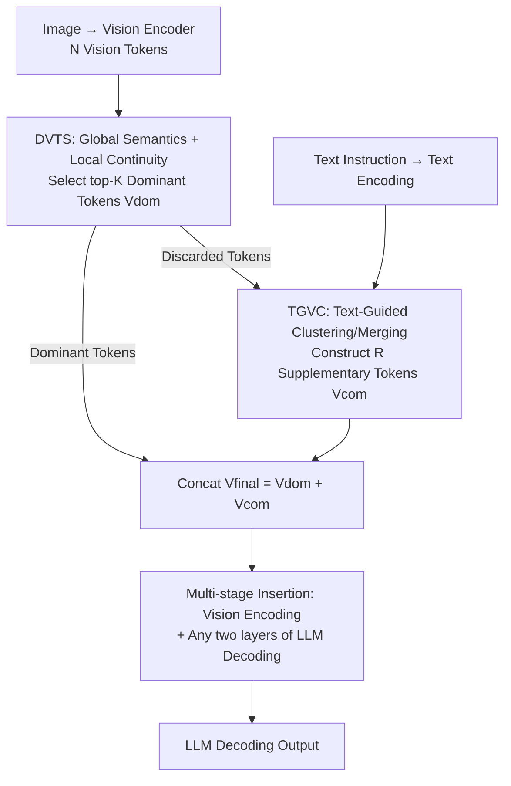

# VisionTrim: Unified Vision Token Compression for Training-Free MLLM Acceleration

**Conference**: ICLR 2026  
**OpenReview**: [https://openreview.net/forum?id=57IXIg6nZ0](https://openreview.net/forum?id=57IXIg6nZ0)  
**Code**: https://github.com/hanxunyu/VisionTrim  
**Area**: Multimodal VLM / Vision Token Compression / MLLM Inference Acceleration  
**Keywords**: Vision Token Compression, Training-free Acceleration, Text-guided Pruning, Local Spatial Continuity, Multi-stage Pruning

## TL;DR
VisionTrim is a training-free acceleration framework for Multi-modal Large Language Models (MLLMs). It employs two plug-and-play modules: DVTS (selecting dominant vision tokens by balancing global semantics and local spatial continuity) and TGVC (re-clustering discarded tokens into supplementary tokens via text guidance). By compressing vision tokens during both vision encoding and LLM decoding stages, it maintains 98.8% average performance on LLaVA-1.5 while removing 88.9% of vision tokens.

## Background & Motivation

**Background**: Current MLLMs encode images or videos into a long sequence of vision tokens for the LLM. However, vision tokens often dominate the total input sequence length—especially in high-resolution image and long-video scenarios—leading to exploding inference costs due to the quadratic complexity of Transformers. Consequently, training-free vision token compression methods have been proposed, such as FasterVLM and VisionZip, which pick dominant tokens using [CLS] attention after vision encoding, or FastV and SparseVLM, which prune tokens based on attention weights during LLM decoding.

**Limitations of Prior Work**: Nearly all these methods focus on an **isolated segment** of the MLLM pipeline—either the vision encoding stage or the LLM decoding stage—without optimizing the entire forward pass as a whole. Even concurrent multi-stage methods like VScan ignore the assistance of text queries during vision encoding and directly prune vision tokens based on their attention with the last instruction token during decoding, which easily mis-deletes critical vision tokens strongly related to the text.

**Key Challenge**: The fundamental issue is that **the alignment between vision token selection and text instructions is overlooked**. Text-agnostic methods like PyramidDrop prune tokens without considering text, losing crucial context for LLM decoding. Conversely, methods like CrossGET and Turbo, which directly use text-vision attention, go to the other extreme by overemphasizing text tokens, leading to hallucinations and compromised multi-turn interactions. Balancing the integrity of the visual itself with alignment to text instructions remains an unresolved tension.

**Goal**: To build a unified framework capable of compressing tokens at both vision encoding and LLM decoding stages, ensuring compression both preserves global semantics/local spatial structures and aligns with text instructions.

**Key Insight**: The authors decompose vision token compression into two complementary tasks: first, **selecting dominant tokens** (considering both global importance and local spatial continuity, rather than relying solely on [CLS] attention), and second, **avoiding the waste of discarded tokens** (re-aggregating question-relevant content from them using text instructions).

**Core Idea**: Utilizing two plug-and-play modules—"Global+Local Dual-Perspective Dominant Token Selection" and "Text-Guided Discarded Token Completion"—to cover the entire MLLM pipeline for training-free acceleration.

## Method

### Overall Architecture

The goal of VisionTrim is to compress the vision token sequence from $N$ to $K+R$ tokens without retraining the MLLM, while preserving key visual information and aligning with text. It consists of two plug-and-play modules connected in series, which can be inserted between the vision encoder and LLM or between any two LLM layers.

The process is as follows: images are encoded into $N$ vision tokens, and text is processed into text tokens. The **DVTS module** first assigns an importance score to each vision token by fusing global semantics ([CLS] attention) and local spatial continuity (LTAM) to select the top-$K$ dominant tokens $V_{dom}$. The remaining discarded tokens are passed to the **TGVC module**, which uses text guidance to cluster and merge them into $R$ supplementary tokens $V_{com}$. Finally, both are concatenated as $V_{final}=[V_{dom};V_{com}]$ for subsequent layers. This "dominant selection + text completion" combination can be used in the vision encoding stage (pre-LLM) or between LLM decoding layers—the latter replaces [CLS] attention with attention from the "first generated token" as the global semantic metric, forming multi-stage pruning.

### Key Designs

**1. DVTS Dominant Token Selection: Dual-Perspective Scoring of Global Semantics and Local Spatial Continuity**

Selecting tokens based only on [CLS] attention (e.g., FasterVLM) biases towards globally salient regions, losing details that are spatially continuous but not individually salient. DVTS addresses this by calculating a fused score. **Global semantic importance** follows [CLS] token attention: attention from [CLS] to all vision tokens is extracted from the penultimate layer of the CLIP encoder, averaged across $H$ heads as $S^g_i=\frac{1}{H}\sum_{h=1}^{H}A^{L-1}_{[CLS],i,h}$, and softmax-normalized to $\hat{S}^g_i$. **Local spatial continuity** is characterized by the proposed LTAM (Local Token Affinity Measurement) algorithm: within a $k\times k$ neighborhood around each token, a dual-kernel affinity measures feature similarity $\kappa_{feat}$ and positional proximity $\kappa_{pos}$:

$$\kappa^{xy,uv}_{feat}=-\left(\frac{\lVert F_{xy}-F_{uv}\rVert}{w_1\sigma_f}\right)^2,\quad \kappa^{xy,uv}_{pos}=-\left(\frac{\lVert P_{xy}-P_{uv}\rVert}{w_2\sigma_p}\right)^2,$$

The two are weighted and synthesized into $\kappa^*$, then averaged over the neighborhood to obtain the local score $S^l_i$. This preserves both semantically important tokens and spatially continuous visual details, avoiding fragmentation of target regions.

**2. Adaptive Variance Weighting: Automatic Dominance of More Reliable Signals**

Determining the weights for global vs. local scores is difficult without prior knowledge; fixed weights may be inappropriate across different images. The authors use the variance of the two score types for adaptive allocation:

$$S_i=\alpha\hat{S}^g_i+(1-\alpha)S^l_i,\quad \alpha=\frac{\sigma^2_l}{\sigma^2_g+\sigma^2_l}.$$

The intuition is: whichever signal has higher variance (higher discriminative power) should occupy a larger weight in the fused score. This automatically biases toward the more reliable perspective for the current image. The fused $\{S_i\}$ is used to select the top-$K$ dominant tokens $V_{dom}$. Ablations show this adaptive weighting significantly outperforms fixed strategies like "CLS only," "Element-wise Max," or "Geometric Mean" (POPE increased from 74.2 to 86.2).

**3. TGVC Text-Guided Visual Completion: Re-aggregating Discarded Tokens via Text Relevance**

Dominant tokens capture primary visual information but might not cover all details relevant to the specific question. Discarded tokens from DVTS may contain content necessary for an answer. TGVC uses text instructions to re-aggregate relevant parts of discarded tokens. Specifically, for remaining tokens $V_r$, similarity with text features is calculated as $S_{t2v}=\text{softmax}(TV_r^T/\sqrt{d})$. Token-level importance scores are averaged across all text tokens, and the top-$R$ are selected as cluster centers $C=\{c_1,...,c_R\}$. Each remaining token is then assigned to the most similar center using text-guided similarity $a_{ij}=S^i_{v2t}S^j_{t2c}$ and aggregated via weighted similarity:

$$v^{com}_j=c_j+\sum_{v_i\in cluster(j)}\frac{a_{ij}}{\sum_{v_k}a_{kj}}v_i.$$

After $T$ iterations of refinement, $R$ supplementary tokens $V_{com}$ are obtained and concatenated with $V_{dom}$. Unlike CrossGET/Turbo which use text-vision attention to prune tokens directly, TGVC uses text only to **guide the secondary aggregation of discarded tokens**, rather than dominating the primary selection. This enhances vision-text alignment without causing text-over-reliance hallucinations. Adding TGVC alone increases POPE by 3.7 points on average, with larger gains at lower token counts (+4.1 at 64 tokens).

**4. Multi-stage Pruning Strategy: Unified Modules Covering Vision Encoding and LLM Decoding**

While the first three points address "how to select tokens," this point addresses "where to prune." The authors design DVTS+TGVC to be inserted at two stages: the **vision encoding stage** compresses $N$ tokens to $K+R$ before the LLM; the **LLM decoding stage** dynamically prunes tokens between specific Transformer layers. In the latter, since no [CLS] token is present, the attention of the "first generated token" to all image tokens $S^g=\text{softmax}(H^l_{gen}H^{l\top}_v/\sqrt{D})$ is used as the global semantic measure, and vision-text cross-attention $\alpha_i=\frac{1}{N_t}\sum_j A_{i,j}$ provides text guidance for TGVC. Ablations show pruning in both stages (Both in ViT and LLM) is superior to pruning in only one—at 64 tokens, GQA 58.8 / POPE 86.2 is achieved, which is significantly higher than single-stage results, while KV Cache is reduced to 30.2 MB (↓90.1%).

## Key Experimental Results

### Main Results

Comparison of LLaVA-1.5-7B (original 576 tokens) with SOTA at different token budgets (Average of 10 benchmarks, percentage relative to vanilla):

| Tokens | SparseVLM | VisionZip | PDrop | VScan | Ours |
|--------|------|------|------|------|------|
| 192 (↓66.7%) | 96.4% | 98.3% | 97.6% | 98.9% | **100.6%** |
| 128 (↓77.8%) | 94.2% | 97.2% | 96.5% | 98.6% | **99.9%** |
| 64 (↓88.9%) | 86.7% | 94.4% | 90.8% | 96.8% | **98.8%** |

The advantage becomes more pronounced as more tokens are removed: at 64 tokens, the method leads the runner-up VScan by 2 percentage points, with benchmarks like POPE/SQA/TextVQA even improving, confirming significant redundancy in vision tokens for LLMs. On high-resolution LLaVA-NeXT-7B (2880 tokens), 99.9% performance is maintained using only 22.2% of tokens; at 160 tokens (↓94.4%), it still reaches 94.0%, 3.3 points higher than VisionZip. On Video-LLaVA-7B, it maintains 100.9% average performance. On Qwen2-VL / Qwen2.5-VL, it remains almost lossless with roughly 1/3 tokens (MMBench 82.8 vs vanilla 80.7).

### Ablation Study

| Configuration | GQA | MMB | POPE | KV Cache | Note |
|------|------|------|------|------|------|
| Vanilla (576 tokens) | 61.9 | 64.7 | 85.9 | 303.6 MB | Full Model |
| ViT only, w/ DVTS | 52.8 | 55.6 | 76.1 | 25.4 MB | Single stage, selection only |
| ViT only, w/ DVTS+TGVC | 56.9 | 60.2 | 80.2 | 25.4 MB | Clear recovery with TGVC |
| LLM only, w/ DVTS+TGVC | 57.4 | 61.1 | 79.2 | 43.5 MB | Single stage (Decoding side) |
| **Both in ViT and LLM** | **58.8** | **63.0** | **86.2** | 30.2 MB | Full VisionTrim |

Adaptive variance weighting is critical: using [CLS] tokens alone yields a POPE of 74.2, element-wise max 77.6, and geometric mean 80.2, while adaptive variance weighting reaches 86.2. TGVC shows larger gains at lower token counts (POPE +4.4 at 32 tokens, +3.7 on average).

### Key Findings
- **Double stage > Single stage**: Pruning at both vision encoding and LLM decoding stages is better than pruning at either one alone for the same token budget (64 tokens). KV Cache drops to 30.2 MB (↓90.1%), indicating complementary redundancy in both stages.
- **Adaptive variance weighting is the core of DVTS**: Replacing fixed fusion with variance-based adaptation jumps POPE from 74.2 to 86.2, far exceeding heuristic methods.
- **Text guidance is more valuable with fewer tokens**: TGVC's gain at 32 tokens (+4.4) is significantly larger than at 192 tokens (+3.1), as "recovering discarded tokens" proves vital under extreme compression.

## Highlights & Insights
- **The "Select Dominant + Complete from Discarded" perspective is clever**: While most methods focus only on "selecting the right ones to keep," VisionTrim goes further—by using text to aggregate relevant content even from discarded tokens, it transforms "pruning" into "pruning + completion." 
- **Adaptive weighting via variance**: This is an exceptionally clean trick for training-free frameworks—relying purely on the statistics of the two score sources to decide trust levels without adding learnable parameters.
- **Cross-stage module reuse**: Seamlessly replacing [CLS] attention with the "first generated token" attention during decoding allows one design to serve both vision encoding and LLM decoding stages.

## Limitations & Future Work
- The method relies on CLIP-style encoders to provide [CLS] attention and text-vision similarity; architectures without explicit [CLS] tokens may require additional adaptation.
- TGVC re-clustering involves $T$ iterations and text-vision similarity matrix calculations, which may introduce overhead for long text instructions or many remaining tokens.
- Several hyperparameters ($K$, $R$, $k\times k$, weights, iterations $T$) require tuning per model/task; it is training-free but not "parameter-tuning-free."

## Related Work & Insights
- **vs FasterVLM / VisionZip**: These select tokens using [CLS] attention after vision encoding. This work introduces LTAM for local continuity + adaptive variance weighting and adds TGVC for completion, covering the full pipeline.
- **vs FastV / SparseVLM**: These prune by attention during LLM decoding. This work is dual-stage and uses the "first generated token" attention during decoding rather than the last instruction token, reducing the accidental deletion of text-relevant vision tokens.
- **vs VScan**: Also dual-stage, but VScan ignores text queries during encoding and prunes based on the last instruction token during decoding. This work introduces text guidance in both stages.
- **vs CrossGET / Turbo**: These allow text-vision attention to dominate selection, risking hallucinations. This work uses text only to guide "secondary aggregation of discarded tokens," while primary selection remains visual-signal-driven.

## Rating
- Novelty: ⭐⭐⭐⭐ The dual perspective of "dominant selection + completion" and adaptive variance weighting are innovative, though it remains within the mature track of token compression.
- Experimental Thoroughness: ⭐⭐⭐⭐⭐ Covers 5 MLLM categories, 10+ image and 4 video benchmarks with complete ablations.
- Writing Quality: ⭐⭐⭐⭐ Clear framework, complete formulas, and intuitive module naming.
- Value: ⭐⭐⭐⭐⭐ Plug-and-play, training-free, and nearly lossless under extreme compression, offering direct value for MLLM deployment.

## Related Papers

- [\[AAAI 2026\] Filter, Correlate, Compress: Training-Free Token Reduction for MLLM Acceleration](../../AAAI2026/vlm_efficiency/filter_correlate_compress_training-free_token_reduction_for_.md)
- [\[ICLR 2026\] Enhancing Visual Token Representations for Video Large Language Models via Training-free Spatial-Temporal Pooling and Gridding](enhancing_visual_token_representations_for_video_large_language_models_via_train.md)
- [\[CVPR 2026\] UniCompress: Token Compression for Unified Vision-Language Understanding and Generation](../../CVPR2026/vlm_efficiency/unicompress_token_compression_for_unified_vision-language_understanding_and_gene.md)
- [\[ICLR 2026\] Prune Redundancy, Preserve Essence: Vision Token Compression in VLMs via Synergistic Importance-Diversity](prune_redundancy_preserve_essence_vision_token_compression_in_vlms_via_synergist.md)
- [\[ICLR 2026\] PPE: Positional Preservation Embedding for Token Compression in Multimodal Large Language Models](ppe_positional_preservation_embedding_for_token_compression_in_multimodal_large_.md)

<!-- RELATED:END -->

<!-- RELATED:START -->

## Related Papers

- [\[AAAI 2026\] Filter, Correlate, Compress: Training-Free Token Reduction for MLLM Acceleration](../../AAAI2026/vlm_efficiency/filter_correlate_compress_training-free_token_reduction_for_.md)
- [\[ICLR 2026\] Prune Redundancy, Preserve Essence: Vision Token Compression in VLMs via Synergistic Importance-Diversity](prune_redundancy_preserve_essence_vision_token_compression_in_vlms_via_synergist.md)
- [\[CVPR 2026\] UniCompress: Token Compression for Unified Vision-Language Understanding and Generation](../../CVPR2026/vlm_efficiency/unicompress_token_compression_for_unified_vision-language_understanding_and_gene.md)
- [\[ICLR 2026\] HiDrop: Hierarchical Vision Token Reduction in MLLMs via Late Injection, Concave Pyramid Pruning, and Early Exit](hidrop_hierarchical_vision_token_reduction_in_mllms_via_late_injection_concave_p.md)
- [\[ICLR 2026\] Enhancing Visual Token Representations for Video Large Language Models via Training-free Spatial-Temporal Pooling and Gridding](enhancing_visual_token_representations_for_video_large_language_models_via_train.md)

<!-- RELATED:END -->
