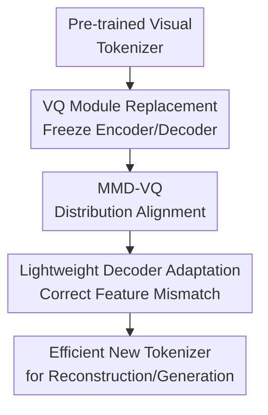

# VQ-Transplant: Efficient VQ-Module Integration for Pre-trained Visual Tokenizers

**Conference**: ICLR2026  
**OpenReview**: [https://openreview.net/forum?id=eETer3lrOQB](https://openreview.net/forum?id=eETer3lrOQB)  
**Code**: To be released  
**Area**: VLM Efficiency / Visual Tokenizer / Vector Quantization  
**Keywords**: Visual Tokenizer, Vector Quantization, VQ Module Replacement, MMD-VQ, Efficient Training  

## TL;DR
VQ-Transplant freezes the encoder-decoder of a pre-trained visual tokenizer and only replaces and adapts the VQ module with lightweight adjustments. This allows new quantization algorithms to be integrated into strong tokenizers like VAR with a training cost of approximately 22 hours. Using MMD-VQ, it achieves an r-FID of 0.81 on ImageNet-1K, surpassing the 0.92 r-FID of the original VAR tokenizer.

## Background & Motivation
**Background**: Discrete visual tokenizers are critical front-end components in autoregressive image generation, video generation, and multimodal models. They compress continuous image features into discrete tokens for use by subsequent generative or understanding models. Modern high-quality tokenizers usually follow the VQGAN/VAR paradigm: an encoder produces latent features, a VQ module looks up a codebook for discrete representations, and a decoder reconstructs the quantized features into an image, relying on perceptual loss and adversarial training to enhance visual quality.

**Limitations of Prior Work**: The issue is that while researchers often want to study "better VQ algorithms," practical training requires treating the encoder, VQ module, and decoder as a single unit to be trained from scratch. For tokenizers like VAR, UniTok, or ImageFolder, training frequently demands multiple A100 GPUs and dozens to hundreds of hours. Additionally, adversarial training itself is unstable with high hyperparameter tuning costs. Consequently, VQ algorithm research is bottlenecked by the training budget of the entire tokenizer, making it difficult for researchers with fewer resources to quickly validate new codebook update rules or distribution alignment losses.

**Key Challenge**: Structurally, the VQ module is just a middle component of the tokenizer, but it is highly coupled with the input distribution of the decoder. Simply removing the original VQ module and replacing it with a new algorithm might lower quantization error, but the decoder may not correctly interpret the new quantized latents because it was trained on the feature distribution produced by the old codebook. This creates a contradiction between "replaceability" and "decoder compatibility."

**Goal**: Instead of redesigning a complete tokenizer, the authors aim to solve a more engineering-oriented and research-valuable question: Can VQ algorithm development be decoupled from large-scale tokenizer training? Specifically, the method should support inserting any new VQ module into a pre-trained tokenizer, preserve the capabilities of the original encoder-decoder as much as possible, use minimal training to eliminate the mismatch between the new quantization space and the old decoder, and ensure that the final reconstruction quality is not significantly lower than that of tokenizers trained from scratch.

**Key Insight**: The key observation is that the most expensive and valuable parts of a pre-trained tokenizer are the image priors already learned by the encoder-decoder, which do not necessarily need to be relearned for every VQ study. As long as the new VQ module first learns a reasonable codebook within the frozen encoder's feature space, followed by a short-term decoder adaptation to the new quantization space, the training cost can be reduced from "retraining the entire tokenizer" to "replacing the middle module + small-step calibration."

**Core Idea**: VQ-Transplant employs a two-stage pipeline consisting of "freezing the pre-trained tokenizer, transplanting the new VQ module, and performing lightweight decoder adaptation." This allows new quantization algorithms to be plugged into existing visual tokenizers like an organ transplant. Simultaneously, it proposes MMD-VQ, which uses non-parametric distribution matching to improve the compatibility between the new codebook and encoder features.

## Method

### Overall Architecture
VQ-Transplant targets a pre-trained discrete visual tokenizer comprising an encoder $E_{\theta^*}$, a native VQ module $Q_{\phi^*}^{pretrain}$, and a decoder $D_{\varphi^*}$. The method first freezes the pre-trained encoder and decoder, replaces the native VQ module with a new module $Q_{\phi}^{new}$, and trains it independently. Subsequently, it keeps the encoder and the new VQ module frozen while fine-tuning only the decoder to adapt to the statistical characteristics of the new quantized latents.

The emphasis of this workflow is not on optimizing all parameters simultaneously, but on consciously separating "learning a new codebook" from "calibrating the decoder." The first stage aligns the VQ module with the feature distribution of the frozen encoder output, while the second stage propagates this change in quantization space to the decoder, preventing blurred results, loss of detail, or r-FID degradation after direct replacement.

### Key Designs
**1. VQ Module Replacement: Decoupling VQ Research from Full Tokenizer Retraining**

Traditional VQ tokenizer training binds the encoder, codebook, decoder, and adversarial discriminator together for optimization. When researchers want to test a new VQ loss, they are often forced to bear the cost of full retraining. The first step of VQ-Transplant reverses this: given a pre-trained tokenizer, it retains only the encoder $E_{\theta^*}$ and decoder $D_{\varphi^*}$, replacing the native VQ module $Q_{\phi^*}^{pretrain}$ with a new module $Q_{\phi}^{new}$. For an input image $x$, the frozen encoder produces $z_e=E_{\theta^*}(x)$, and the new VQ module outputs the quantized latent $z_q(\phi)=Q_{\phi}^{new}(z_e)$.

Only the new VQ module is trained in this stage, with the goal of making the codebook close to the encoder features while avoiding codebook collapse. The objective is defined as $L_{VQ}(\phi)=\|sg(z_e)-z_q(\phi)\|_2^2+\gamma L_{unique}(Q_{\phi}^{new})$, where $sg(\cdot)$ is the stop-gradient and $L_{unique}$ can be Wasserstein VQ or the distribution alignment term of the proposed MMD-VQ. The advantage is direct: new VQ algorithms can be evaluated in the latent space of a strong tokenizer without retraining an encoder-decoder every time. However, since the decoder has not yet adapted to the new quantization space after the first stage, reconstruction quality may not improve immediately.

**2. MMD-VQ: Improving Portability via Non-parametric Distribution Matching**

The authors argue that a transplantable VQ module should not only reduce nearest-neighbor quantization error but also ensure that the codebook distribution is as consistent as possible with the encoder feature distribution. While existing Wasserstein VQ also approaches this via distribution matching, it assumes the features and codebook are approximately Gaussian for trainability, primarily aligning the mean and covariance. This assumption is sometimes sufficient for standard visual latents, but if features are multi-modal, heavy-tailed, or clearly non-Gaussian, first- and second-order statistics miss higher-order structures.

MMD-VQ replaces this Gaussian-based Wasserstein alignment with Maximum Mean Discrepancy. Let the feature vectors collected by the encoder be $X=\{z_1,\ldots,z_N\}$ and the codebook vectors be $Y=\{e_1,\ldots,e_K\}$. The MMD distance is $D^2_{MMD}(X,Y)=\frac{1}{N^2}\sum_{i,j}k(z_i,z_j)+\frac{1}{K^2}\sum_{i,j}k(e_i,e_j)-\frac{2}{NK}\sum_{i,j}k(z_i,e_j)$. When $k(\cdot,\cdot)$ is a characteristic kernel, $D^2_{MMD}=0$ if and only if the two distributions are identical. The paper uses a multi-Gaussian kernel and sets $L_{unique}$ to $D^2_{MMD}(X,Y)$. Intuitively, MMD-VQ does not just pull the codebook's mean and variance toward the features but makes the codebook cover the overall shape of the feature distribution in the kernel space, making it a quantization module more suitable for "consumption by the decoder after transplantation."

**3. Lightweight Decoder Adaptation: Converting Low Quantization Error into Reconstruction Quality**

Simply replacing the VQ module exposes an often-overlooked problem: smaller quantization error does not equate to better image reconstruction. Table 3 shows that after replacing with MMD VAR, the quantization error drops from the original VAR's 0.283 to 0.234, but the r-FID remains at 1.49, worse than the original 0.92. This indicates that the decoder's priors are still built around the latent distribution produced by the old VQ module; feeding it "better but different" quantized features leads to a loss of visual detail and high-frequency structures.

Therefore, the second stage fixes the encoder $E_{\theta^*}$ and the already-trained new VQ module $Q_{\phi^*}^{new}$, initializing and fine-tuning only the decoder $D_\varphi$ from the original parameters $\varphi^*$. The reconstruction is $\hat{x}(\varphi)=D_\varphi(Q_{\phi^*}^{new}(E_{\theta^*}(x)))$, and the optimization objective is $L_{Decoder}(\varphi)=\|\hat{x}(\varphi)-x\|_2^2+\lambda_P L_{Per}(\varphi)+\lambda_G L_{GAN}(\varphi)$. The authors follow the DINO-S style frozen discriminator used in the VAR/LlamaGen series, supplemented by DiffAug, consistency regularization, and LeCAM regularization. The core point is the small training volume: on ImageNet-1K, only 5 epochs of decoder adaptation can pull the r-FID of MMD VAR with an 8192 codebook from 1.49 down to 0.81.

**4. Unifying Fixed-Scale and Multi-Scale VQ Integration**

The native quantization of the VAR tokenizer is multi-scale VQ, whereas many traditional VQ methods are fixed-scale. To prove that VQ-Transplant does more than just replace isomorphic modules, the authors implemented both multi-scale and fixed-scale transplantations. For multi-scale experiments, the VAR multi-scale VQ is directly replaced. For fixed-scale experiments, the 32-dimensional features are split into two 16-dimensional sub-vectors, which pass through independent VQ modules before being concatenated back for the decoder input.

This design allow the same framework to evaluate various quantization algorithms including Vanilla VQ, EMA VQ, Online VQ, Wasserstein VQ, and MMD-VQ. Experimental results lead to a consistent conclusion: regardless of being multi-scale or fixed-scale, distribution-alignment-type VQs are more suitable for transplantation; however, for any VQ, if only substitution is performed without decoder adaptation, reconstruction metrics are limited by decoder-latent mismatch. In other words, the contribution of VQ-Transplant is not a single codebook trick, but combining "replacement, alignment, and adaptation" into a reusable, low-cost tokenizer research pipeline.

### Step-by-Step Example
Suppose a researcher wants to integrate MMD-VQ into a pre-trained VAR tokenizer. After the original tokenizer receives a $256\times256$ image, a U-Net encoder generates latent features with a $16\times16$ spatial resolution and 32 dimensions. The native VAR VQ module maps these features to multi-scale discrete tokens, which the decoder then reconstructs.

In VQ-Transplant, the researcher first removes the native VQ module, freezes the encoder and decoder, and trains only the MMD-VQ. During training, encoder features $X$ and codebook vectors $Y$ are collected for each batch. The researcher minimizes $\|sg(z_e)-z_q\|_2^2$ using a nearest-neighbor quantization term while using MMD to push the distribution of $Y$ toward $X$. After this stage, an MMD VAR with an 8192 codebook can achieve a quantization error of 0.234 and 100% codebook utilization, but the reconstruction r-FID remains stuck at 1.49 because the decoder is unfamiliar with the new codebook.

Next, the researcher fine-tunes the decoder for 5 epochs, with the encoder and MMD-VQ no longer updated. The input seen by the decoder always comes from the new MMD-VQ, so it gradually migrates the reconstruction priors previously oriented toward the old VAR codebook to the new quantization space. After 5 epochs, the r-FID of the same MMD VAR drops to 0.81 and the r-IS improves to 201.0; if adaptation continues to 20 epochs, the r-FID can drop further to 0.74, though training time increases accordingly.

### Loss & Training
The main training strategy of VQ-Transplant is divided into Stage I and Stage II. The substitution stage of Stage I trains only the new VQ module with the loss $L_{VQ}=\|sg(z_e)-z_q\|_2^2+\gamma L_{unique}$; for MMD-VQ, $L_{unique}$ is the MMD distribution distance. The main scheme for Stage II is decoder-only adaptation, where only the decoder is trained. The loss is a combination of pixel reconstruction, perceptual, and GAN terms: $L_{Decoder}=\|\hat{x}-x\|_2^2+\lambda_P L_{Per}+\lambda_G L_{GAN}$.

Regarding implementation details, all experiments use the VAR tokenizer's encoder-decoder architecture with 16x downsampling and inputs resized to $256\times256$. Training uses two H100 GPUs with AdamW and a batch size of 32 per card. VQ module substitution uses an initial learning rate of $10^{-4}$ linearly decayed to $10^{-5}$, while decoder adaptation uses a fixed learning rate of $10^{-5}$. On ImageNet-1K, substitution is trained for 2 epochs and adaptation for 5 epochs; for FFHQ/CelebA-HQ, it is 30+30 epochs, and for LSUN-Churches, it is 20+20 epochs. Loss weights are set to $\lambda_P=1$, $\lambda_G=0.5$ for multi-scale, $\lambda_G=0.4$ for fixed-scale, $\gamma=0.2$ for Wasserstein distance, and $\gamma=0.5$ for MMD distance.

The appendix also compares a joint optimization approach where Stage II updates the encoder, decoder, and VQ module simultaneously, combining VQ reconstruction, commitment, distribution alignment, pixel reconstruction, perceptual loss, and GAN loss. On ImageNet-1K, this slightly outperforms decoder-only (e.g., MMD VAR 8192 r-FID drops from 0.81 to 0.79), but total training time increases from 22 to 29.5 hours. The authors choose decoder-only as the primary scheme as it better aligns with the "low-cost transplantation" objective of VQ-Transplant.

## Key Experimental Results

### Main Results
| Method | VQ Type | Tokens | Codebook | Codebook Utilization | r-FID↓ | r-IS↑ | Cost/Notes |
|--------|--------|--------|----------|----------------|--------|------|-------------|
| VAR Tokenizer | MS VQ | 680 | 4096 | 100% | 0.92 | 198.6 | Original baseline, OpenImages trained |
| MMD VAR | MS VQ | 680 | 4096 | 100% | 0.91 | 199.2 | VQ-Transplant, ~22 hours |
| MMD VAR | MS VQ | 680 | 8192 | 100% | 0.81 | 201.0 | VQ-Transplant, beats original VAR |
| MMD VQ | FS VQ | 512 | 16384 | 99.8% | 1.05 | 191.2 | Fixed-scale transplant |
| MMD VQ | FS VQ | 512 | 32768 | 99.9% | 0.97 | 194.1 | Fixed-scale transplant |
| MMD VQ | FS VQ | 512 | 65536 | 99.9% | 0.86 | 197.1 | Fixed-scale transplant |
| Llama GEN | FS VQ | 256 | 16384 | 97.0% | 2.19 | - | 2×A100 trained for 200h |

In the ImageNet-1K main table, the most significant point is not just that MMD VAR is 0.11 r-FID lower than the original VAR, but that it was not obtained by training a tokenizer from scratch. VQ-Transplant reaches 0.81 r-FID by plugging a new MMD quantization module into VAR using only 2×H100s for about 22 hours; compared to the 16×A100 60h training scale of the original VAR, the reported equivalent speedup is 21.8×.

| Tokenizer / Method | Dataset | GPU Config | Training Hours | Relative Cost to VQ-Transplant |
|------------------|--------|---------|----------|----------------------------|
| Llama GEN | ImageNet-1K | 2×A100 | 200 | ~9.1× |
| ImageFolder | ImageNet-1K | 32×A100 | 40 | ~29.1× |
| VAR | OpenImages | 16×A100 | 60 | ~21.8× |
| UniTok | OpenImages | 256×A100 | 50 | ~290.9× |
| VQ-Transplant | ImageNet-1K | 2×A100 | 22 | 1× |

This cost table highlights the positioning of this paper: VQ-Transplant does not just chase a reconstruction metric but treats the "ability to explore new VQ algorithms at low cost" as a core metric. It does not completely replace large-scale tokenizer pre-training but significantly lowers the entry barrier for research-stage trial and error.

### Ablation Study
| Config | Stage | Codebook | Quant. Error E↓ | Utilization U↑ | r-FID↓ | r-IS↑ | Description |
|------|------|----------|-------------|-----------|--------|------|------|
| VAR Tokenizer | Original | 4096 | 0.283 | 100% | 0.92 | 198.6 | Original VAR baseline |
| MMD VAR | Substitution | 4096 | 0.255 | 100% | 1.52 | 189.4 | E drops, but decoder unadapted |
| MMD VAR | Adaptation | 4096 | 0.255 | 100% | 0.91 | 199.2 | Beats original VAR after 5-epoch adaptation |
| MMD VAR | Substitution | 8192 | 0.234 | 100% | 1.49 | 190.4 | Larger codebook further reduces error |
| MMD VAR | Adaptation | 8192 | 0.234 | 100% | 0.81 | 201.0 | Strongest result, mismatch corrected |
| Wasserstein VAR | Adaptation | 8192 | 0.240 | 100% | 0.83 | 198.8 | Close to MMD, but MMD more robust for non-Gaussian |

This ablation supports the core causal chain of the paper: VQ module replacement reduces quantization error, but replacement alone is insufficient for good reconstruction; decoder adaptation is what converts low quantization error into r-FID and r-IS improvements. Without the second stage, one might wrongly assume "lower E but worse r-FID" means the new VQ is useless; in reality, it indicates a shift in the decoder's input distribution.

| Method | Non-Gaussian Intensity $\zeta=0.0$ Quant. Error↓ | $\zeta=2.0$ Quant. Error↓ | $\zeta=4.0$ Quant. Error↓ | $\zeta=0.0$ Util.↑ | $\zeta=2.0$ Util.↑ | $\zeta=4.0$ Util.↑ |
|------|-------------------------------|----------------------|----------------------|----------------------|----------------------|----------------------|
| Wasserstein VQ | 0.976 | 1.318 | 1.502 | 99.9% | 62.7% | 34.8% |
| MMD VQ | 0.968 | 1.171 | 1.240 | 99.9% | 92.5% | 75.6% |

Synthetic non-Gaussian experiments explain why the authors proposed MMD-VQ. On standard visual benchmarks, the gap between MMD and Wasserstein is not always large; however, when the latent distribution becomes bimodal and $\zeta$ increases, Wasserstein VQ’s codebook utilization collapses significantly, while MMD-VQ maintains higher utilization. This shows that MMD's advantage lies in more complex feature distributions rather than a guaranteed massive lead on all natural datasets.

### Key Findings
- **Distribution-alignment-type VQs are more transplantable**: Vanilla/EMA/Online VQ tend to suffer from low utilization or poor reconstruction during the substitution phase, whereas Wasserstein and MMD-VQ consistently maintain nearly 100% utilization and achieve better r-FID after adaptation.
- **Decoder adaptation is the critical bottleneck fix**: MMD VAR 8192 has an r-FID of 1.49 during substitution, which drops to 0.81 after 5 epochs of adaptation. Training for 20 epochs can reach 0.74, though this begins to compromise the efficiency goal.
- **Short-duration from-scratch training is not cost-effective**: Training MMD VAR from scratch for 25-35 hours only yields 1.26-1.40 r-FID, which is notably worse than VQ-Transplant's 0.81. This highlights the importance of reusing image priors from the pre-trained encoder-decoder.
- **Strong cross-dataset generalization**: Fixed-scale Wasserstein/MMD-VQ achieved high-quality reconstruction on FFHQ, CelebA-HQ, and LSUN-Churches. For instance, Wasserstein VQ adaptation on FFHQ reached 1.21 r-FID, outperformed baselines like RQVAE and VQGAN.
- **Dependency on base tokenizer quality**: While it works when connected to the LDM-16 continuous tokenizer, the r-FID is noticeably worse than on VAR. The authors explain that the VAR decoder is inherently adapted to quantized latents, whereas the LDM decoder was only exposed to continuous latents, making adaptation more difficult.

## Highlights & Insights
- The ingenuity of VQ-Transplant lies in decoupling "VQ algorithm research" from "full visual tokenizer training." Many tokenizer papers default to training all components together, making VQ method comparisons equivalent to comparing large-scale system training. This paper turns middle-module replacement into a standard workflow, lowering the experimental barrier for new VQ research.
- The paper honestly distinguishes between quantization error and reconstruction quality. After substitution, MMD VAR shows a lower E than original VAR but a worse r-FID; this serves as a reminder that subsequent work shouldn't just report codebook metrics but must check if the decoder can consume the new discrete representation.
- The value of MMD-VQ is more than just "another VQ loss"; it addresses the Gaussian assumption weakness of Wasserstein VQ. While they are close on standard benchmarks, synthetic experiments demonstrate MMD's ability to maintain utilization under multi-modal distributions, providing a direction for VQ research on more complex visual or multimodal latents.
- Decoder-only adaptation is a practical engineering compromise. Joint optimization is slightly stronger but increases training time from 22 to 29.5 hours. The main text prioritizes decoder-only, showing a consistent focus on the efficiency goal.
- This framework can be transferred to multimodal tokenizers and front-end compression for generative VLMs. As long as the existing tokenizer's encoder-decoder is strong enough, new VQ modules can be rapidly tested as replaceable components before deciding if full retraining is warranted.

## Limitations & Future Work
- VQ-Transplant does not completely escape dependency on strong pre-trained tokenizers. It enables low-cost replacement because base tokenizers like VAR have already invested significant resources in training. If the base encoder-decoder capability is insufficient, the ceiling for transplantation will be limited.
- Experiments focused primarily on reconstruction metrics and did not fully demonstrate gains in downstream generation or VLM tasks. Since visual tokenizers ultimately serve tasks like autoregressive generation or multimodal modeling, future work needs to verify if MMD-VQ transplantation truly improves downstream generation quality, training stability, or semantic representation.
- Decoder adaptation still utilizes perceptual and GAN losses; although the number of training rounds is low, implementation complexity and instability have not completely vanished. Investigating GAN-free adaptation targets for even more resource-constrained environments is a worthwhile direction.
- While the advantage of MMD-VQ is clear in synthetic experiments, its improvement over Wasserstein VQ on real data like ImageNet/FFHQ is sometimes small. Future work could systematically characterize the distribution shapes of real tokenizer latents to determine where MMD is truly necessary.
- The paper demonstrated compatibility with LDM-16, but results were significantly weaker than on VAR. Specialized adaptation strategies for continuous tokenizers could be researched, such as bridging continuous-to-discrete latents, introducing projectors, or allowing the decoder to see mixed continuous/discrete features.

## Related Work & Insights
- **vs VQGAN / VAR**: Both VQGAN and VAR train the VQ module end-to-end within the full tokenizer, yielding high-quality tokens at high cost. VQ-Transplant reuses VAR's encoder-decoder and performs short-range adaptation, offering lower trial-and-error costs at the expense of dependency on base tokenizer priors/architectures.
- **vs Wasserstein VQ**: Wasserstein VQ interprets codebook learning as distribution matching but uses a Gaussian assumption to simplify the problem to mean/covariance alignment. MMD-VQ uses non-parametric MMD for alignment and is more robust on non-Gaussian latents, though reconstruction gaps on standard images are not always substantial.
- **vs VQGAN-LC / Large Codebook Methods**: VQGAN-LC improves fixed-scale VQGAN by increasing codebook utilization and size but still targets full training. The fixed-scale version of MMD VQ in this framework can achieve lower r-FID with 512 tokens and larger codebooks, suggesting "high-utilization codebook + pre-trained decoder adaptation" is a viable alternative path.
- **vs Training MMD VAR from Scratch**: While from-scratch training allows simultaneous updates to all components, it produces poor reconstruction under short training budgets. VQ-Transplant suggests that early algorithm research does not need to chase end-to-end optimality immediately; reusing strong priors for module-level evaluation is more efficient.
- **Insights for Future Research**: Future tokenizer papers could include "VQ module portability" as a standalone evaluation dimension. A good quantization algorithm should not only perform well in its own pipeline but should also be transplantable into existing tokenizers while maintaining high utilization and low distortion after minimal adaptation.

## Rating
- Novelty: ⭐⭐⭐⭐☆ The two-stage transplant workflow is highly practical; MMD-VQ builds on proven distribution matching ideas with a clear focus.
- Experimental Thoroughness: ⭐⭐⭐⭐☆ Main experiments, multi/fixed-scale, cross-dataset, non-Gaussian analysis, and strategy comparisons are comprehensive, though downstream generation/VLM validation is missing.
- Writing Quality: ⭐⭐⭐⭐☆ Problem definition is clear, and the experimental chain supports core claims; some tables are dense, and there are minor typos in symbols/appendix.
- Value: ⭐⭐⭐⭐⭐ Extremely valuable for visual tokenizer and VQ research, especially for researchers wanting to validate new modules without the means to retrain massive tokenizers.

<!-- RELATED:START -->

## Related Papers

- [\[CVPR 2026\] AdaptVision: Efficient Vision-Language Models via Adaptive Visual Acquisition](../../CVPR2026/vlm_efficiency/adaptvision_efficient_vision-language_models_via_adaptive_visual_acquisition.md)
- [\[ICML 2025\] MMInference: Accelerating Pre-filling for Long-Context VLMs via Modality-Aware Permutation Sparse Attention](../../ICML2025/vlm_efficiency/mminference_accelerating_pre-filling_for_long-context_vlms_via_modality-aware_pe.md)
- [\[CVPR 2026\] FocusUI: Efficient UI Grounding via Position-Preserving Visual Token Selection](../../CVPR2026/vlm_efficiency/focusui_efficient_ui_grounding_via_position-preserving_visual_token_selection.md)
- [\[ICLR 2026\] Enhancing Visual Token Representations for Video Large Language Models via Training-free Spatial-Temporal Pooling and Gridding](enhancing_visual_token_representations_for_video_large_language_models_via_train.md)
- [\[ICML 2025\] SparseVLM: Visual Token Sparsification for Efficient Vision-Language Model Inference](../../ICML2025/vlm_efficiency/sparsevlm_visual_token_sparsification_for_efficient_vision-language_model_infere.md)

<!-- RELATED:END -->
