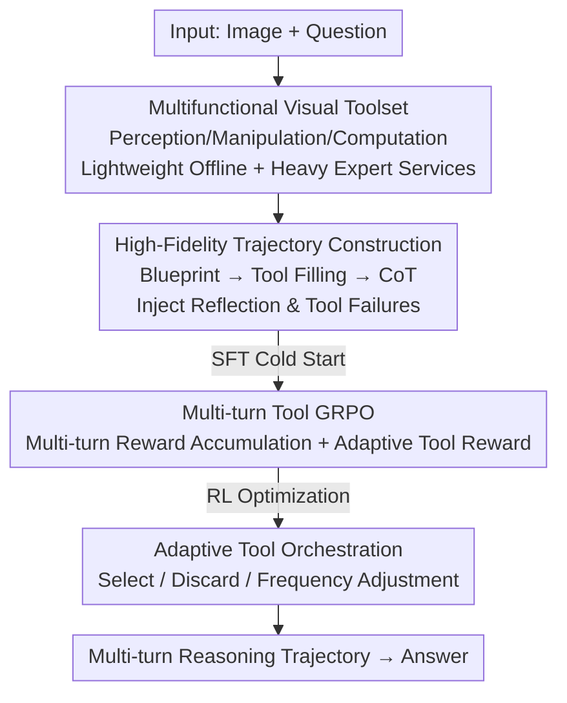

# AdaReasoner: Dynamic Tool Orchestration for Iterative Visual Reasoning

**Conference**: ICLR2026  
**OpenReview**: [https://openreview.net/forum?id=nUGPEmQ2ut](https://openreview.net/forum?id=nUGPEmQ2ut)  
**Code**: https://github.com/ssmisya/AdaReasoner  
**Area**: Multimodal VLM / Visual Reasoning / Tool Augmentation  
**Keywords**: Multimodal Reasoning, Tool Orchestration, Multi-turn GRPO, Visual Tools, Adaptive Tool Use

## TL;DR
AdaReasoner teaches Multimodal Large Language Models (MLLMs) to **dynamically orchestrate a set of visual tools** during multi-turn visual reasoning. Through a two-stage training process of "Tool Cold Start + Multi-turn Tool GRPO," it enables a 7B small model to autonomously select, discard, and adjust tool usage frequency. It achieves an average performance gain of +38.7%, reaching a near-perfect score of 97.6% on VSP, surpassing GPT-5 and Claude Sonnet 4.

## Background & Motivation
**Background**: Equipping MLLMs with external tools is a popular direction for enhancing visual reasoning. Early SFT/prompt methods (CogCoM, TACO, LLaVA-Plus) used predefined tools with scripted calls. Recent RL methods (DeepEyes, Pixel-Reasoner) utilize crop/zoom-in searches to enhance perception.

**Limitations of Prior Work**: These works are mostly restricted to **single, atomic tools** and **single-step trajectories**. They neither address multi-turn planning nor select effective **tool combinations** for complex tasks. More critically, pure R1-style rule-based rewards only optimize the "reasoning process" without directly improving the model's underlying **perception capability**. Perceptual errors accumulate into hallucinations, a phenomenon termed "guided guessing": the model roughly locates relevant regions but misses key details, causing linguistic capabilities to lose visual anchors and regress into semantic-prior-based guessing.

**Key Challenge**: Visual reasoning fundamentally lacks **iterative exploration and refinement of visual evidence**. The decision-making process—"which tool to use, when to use it, and how to combine them"—is itself a multimodal reasoning capability that prior methods have failed to treat as a learnable objective.

**Goal**: Transform tools from "static appendages" into "supports for active manipulation and refinement of visual representations," enabling models to learn multi-turn planning and dynamic combination over a **diverse set of candidate tools**. This requires solving three sub-problems: (1) Generating high-quality multi-turn tool trajectory data; (2) Designing RL to optimize multi-turn tool invocation; (3) Ensuring the toolset accommodates both lightweight offline tools and compute-intensive expert models.

**Key Insight**: The authors leverage Extended Mind Theory (Clark & Chalmers 1998), where external tools are viewed as organic components of cognition. By following an iterative "Observe → Manipulate → Verify → Reflect" workflow, the model can delegate difficult sub-tasks to high-precision tools while focusing on judgment and synthesis.

**Core Idea**: A two-stage approach—"Tool Cold Start (learning how and when to use tools) + Multi-turn Tool GRPO (optimizing multi-turn tool trajectories)"—to train a reasoning agent capable of **adaptive tool orchestration**, allowing it to autonomously devise optimal strategies from a broad toolset.

## Method

### Overall Architecture
AdaReasoner formalizes "tool-augmented multimodal reasoning" as a **sequential decision process**. A policy $\pi_\theta$ (the MLLM) generates a reasoning trajectory $\tau = \{(s_0, a_0, o_0), \dots, (s_T, a_T, o_T)\}$, where $s_t$ is the state, $a_t \in T$ is a tool-calling action, and $o_t$ is the tool observation. The toolset $T = \{t_1, \dots, t_n\}$ covers three core functions: **Perception** (POINT, OCR), **Manipulation** (DRAW2DPATH, INSERTIMAGE), and **Computation** (ASTAR).

The pipeline comprises three components: a persistent **Tool Server** hosting various tools; a **Tool Cold Start** phase using synthetic high-fidelity multi-turn trajectories for SFT; and a **Multi-turn Tool GRPO** phase using reinforcement learning tailored for tool trajectories.

### Key Designs

**1. Multifunctional Visual Toolset: Integrating Lightweight and Expert Service Tools**

Addressing the "single atomic tool" limitation, AdaReasoner designs a toolset matrix across **three functional categories × two compute types**. Functions include Perception (POINT, OCR), Manipulation (DRAW2DPATH, INSERTIMAGE, CROP, DETECTBLACKAREA), and Computation (ASTAR). The tools are unified via a **central Tool Server**. This allows compute-intensive expert models to be accessed via the same interface as lightweight tools, making it feasible for the model to "use expert models as tools." Table 3 shows that while Qwen2.5-VL accuracy for origin positioning is low (2.47%-50.0%), it reaches 100.0% when using the expert POINT tool.

**2. High-Fidelity Multi-turn Trajectory Construction: Blueprints and Reflection**

To enable planning, the authors generate multi-turn trajectories via a **three-stage pipeline**: (1) **Abstract Trajectory Design** (creating blueprints for tasks like VSP or Jigsaw); (2) **Tool Call Filling** (executing actual tools to populate inputs/outputs); (3) **CoT Generation** (using a strong LLM to fill reasoning chains). Crucially, they inject **Reflection & Backtracking** and **Explicit Tool Failures** to teach the model how to handle errors and when to rely on its internal capabilities.

**3. Multi-turn Tool GRPO: Optimizing Long Trajectories**

Standard GRPO is adapted for multi-turn tool trajectories using a multiplicative-additive structure:
$$R_{\text{total}} = R_{\text{format}} \cdot (\lambda_{\text{tool}} \cdot R_{\text{tool}} + \lambda_{\text{acc}} \cdot R_{\text{acc}})$$
Where $R_{\text{format}}$ is a product over all turns (zeroing out if any turn fails format), $R_{\text{tool}}$ is the average hierarchical score of all tool calls, and $R_{\text{acc}}$ is the final answer accuracy.

**4. Adaptive Tool Reward: Asymmetric Incentives**

To prevent over-reliance on tools while encouraging necessary help-seeking, an **asymmetric reward** is used. **Correct trajectories** receive a full reward (8 points) regardless of tool use. **Incorrect trajectories** are penalized severely if they guessed without tools (0 points), but receive partial credit (up to 4 points) if they correctly utilized tools. This teaches the model: "Answer directly if certain; use a structured tool-assisted process if uncertain."

## Key Experimental Results

### Main Results
Evaluation across six benchmarks (VSPO, VSP, Jigsaw, etc.). TC = Tool Cold Start, TG = Tool GRPO.

| Model | VSP Overall | Jigsaw | BLINK-J | Description |
|------|-------------|--------|---------|------|
| Qwen2.5-VL-7B (Base) | 31.64 | 45.70 | 52.67 | Starting Point |
| + Direct SFT | 46.64 | 86.40 | 88.00 | Strong Baseline |
| + Direct GRPO | 30.18 | 64.90 | 80.00 | Strong Baseline |
| + Ours TC + TG | **97.64** | **96.60** | **96.00** | Full AdaReasoner |
| GPT-5 | 55.64 | 80.10 | 73.33 | Closed-source |
| Claude Sonnet 4 | 56.27 | 58.60 | 65.33 | Closed-source |

### Ablation Study

| Configuration | VSP Overall | Key Finding |
|------|-------------|---------|
| TG Only (7B) | 35.09 | RL alone has limited effect |
| TC Only (7B) | 64.91 | Cold start is the foundation |
| TC + TG (Full) | 97.64 | Both stages are essential |
| $\lambda_{\text{tool}}:\lambda_{\text{acc}}=0:1$ | 71.45 | No tool reward |
| $\lambda_{\text{tool}}:\lambda_{\text{acc}}=2:1$ | 93.27 | Higher tool reward weight is better |

### Key Findings
- **Adaptive tool use is an emergent behavior**: During RL, the model learns to **adopt** beneficial tools (e.g., ASTAR in navigation) and **discard** irrelevant ones.
- **Zero-shot tool introduction**: The model can successfully generalize to unseen tools (e.g., ASTAR) during inference, though RL is needed to suppress interference.
- **Three roles of tools**: Perception tools help the model "see," manipulation tools help "verify," and computation/trajectories help "plan."

## Highlights & Insights
- **Tool selection as learnable multimodal reasoning**: Treats "which tool to use" as a learnable skill that emerges through RL.
- **Asymmetric adaptive reward**: Effectively balances tool reliance and direct answering by encoding preferences into the reward structure.
- **Tool Server abstraction**: Decouples heavy expert models from the execution environment, providing a scalable interface for agentic workflows.
- **Small Model + Good Tools = SOTA**: Demonstrates that performance bottlenecks are shifting from model scale to tool quality.

## Limitations & Future Work
- **Reflection data trade-off**: Training on reflection data can lead to "rigidity," making the model less flexible in adopting new tools at inference time.
- **Toolset/Task coupling**: Human-designed blueprints and specific tools make generalization to open-domain visual reasoning challenging.
- **Expert tool dependency**: The framework relies on the high precision of expert tools; gains diminish if the tools themselves are inaccurate.

## Related Work & Insights
- **vs DeepEyes / Pixel-Reasoner**: AdaReasoner moves beyond single-step/atomic tools to multi-turn planning and dynamic combinations.
- **vs CogCoM / TACO**: Evolves from scripted SFT to adaptive RL-based orchestration.
- **vs Rule-based GRPO**: Addresses the "perceptual bottleneck" by using external tools as visual anchors, preventing hallucinations.

## Rating
- Novelty: ⭐⭐⭐⭐⭐ Systematizes dynamic tool orchestration as a learnable capability.
- Experimental Thoroughness: ⭐⭐⭐⭐⭐ Extensive benchmarks, scale comparisons, and behavior analysis.
- Writing Quality: ⭐⭐⭐⭐ Clear storyline and well-defined reward structures.
- Value: ⭐⭐⭐⭐⭐ Provides a benchmark strategy for tool-augmented agent training.

<!-- RELATED:START -->

## Related Papers

- [\[CVPR 2026\] CodeDance: A Dynamic Tool-integrated MLLM for Executable Visual Reasoning](../../CVPR2026/vlm_reasoning/codedance_a_dynamic_tool-integrated_mllm_for_executable_visual_reasoning.md)
- [\[ICLR 2026\] Transductive Visual Programming: Evolving Tool Libraries from Experience for Spatial Reasoning](transductive_visual_programming_evolving_tool_libraries_from_experience_for_spat.md)
- [\[ICLR 2026\] Efficient Multimodal Spatial Reasoning via Dynamic and Asymmetric Routing](efficient_multimodal_spatial_reasoning_via_dynamic_and_asymmetric_routing.md)
- [\[ICLR 2026\] Empowering Small VLMs to Think with Dynamic Memorization and Exploration](empowering_small_vlms_to_think_with_dynamic_memorization_and_exploration.md)
- [\[ICLR 2026\] VTool-R1: VLMs Learn to Think with Images via Reinforcement Learning on Multimodal Tool Use](vtool-r1_vlms_learn_to_think_with_images_via_reinforcement_learning_on_multimoda.md)

<!-- RELATED:END -->
