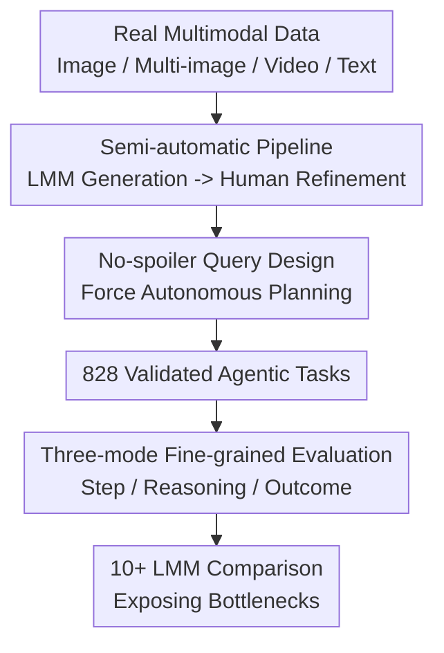

# Agent-X: Evaluating Deep Multimodal Reasoning in Vision-Centric Agentic Tasks

**Conference**: ICLR2026  
**OpenReview**: [https://openreview.net/forum?id=Vjruxvp1Xd](https://openreview.net/forum?id=Vjruxvp1Xd)  
**Code**: https://github.com/mbzuai-oryx/Agent-X  
**Area**: Multimodal VLM / Agent / Evaluation Benchmark  
**Keywords**: Vision-centric Agent, Deep Multimodal Reasoning, Tool Calling, Step-level Evaluation, Benchmark

## TL;DR
Agent-X is a large-scale benchmark for "vision-centric agents," covering 6 types of scenarios with 828 real-world multimodal tasks (image/multi-image/video/instructional text). It features a fine-grained "step-level + reasoning chain + outcome" three-mode evaluation system. Results indicate that even the strongest models from GPT, Gemini, and Qwen series achieve full-link success rates below 50%, exposing significant flaws in current LMMs regarding multi-step visual reasoning and tool invocation.

## Background & Motivation
**Background**: The mainstream paradigm for building agents involves using Large Multimodal Models (LMMs) as "controllers" connected to external callable tools, enabling them to perceive inputs, plan steps, and execute actions (e.g., LangChain, AutoGPT, and various vision-centric agents). To solve complex tasks correctly, perception and tools alone are insufficient; the crux lies in "reasoning"—the ability to perform logical inference, make decisions, and adjust to contexts across text, images, videos, and temporal sequences.

**Limitations of Prior Work**: Evaluation metrics have failed to keep pace. Existing agentic benchmarks are predominantly text-based with weak multimodal support. The few that extend to multimodality are often limited to static single images, synthetic environments, or narrow domains. Two critical issues persist: first, queries are often "fully synthetic + single-turn" and explicitly name the tools/steps required (e.g., "count the objects in the image" directly suggests `ObjectCounter`), meaning models do not need to self-plan. Second, evaluations typically focus only on the final answer, lacking principled metrics to measure the "logical self-consistency of multi-step reasoning." This makes it impossible to distinguish whether a reasoning chain is genuinely progressive or merely "confabulation"—looking plausible but actually disconnected.

**Key Challenge**: Real-world agent tasks are "vision-first, multi-step, and require autonomous planning of toolchains." Current evaluations fail to simultaneously address visual depth, reasoning chain quality, and the realism/scalability of data.

**Goal**: To create a benchmark that satisfies "large-scale real multimodal input + tool-augmented step-level reasoning evaluation + cross-scenario realism" while providing fine-grained metrics to analyze failures at each step.

**Key Insight**: Emphasizing two principles—multimodal reasoning and vision-first evaluation. Tasks are derived from real user-style queries without explicit tool references to force model planning. Evaluation decomposes "intermediate steps" and "overall coherence" rather than focusing solely on the final answer.

**Core Idea**: Approximating real-world agent scenarios through "real multimodal tasks + no-spoiler queries + three-mode fine-grained metrics" to quantify the bottlenecks of current LMM agents in deep reasoning and tool usage.

## Method

### Overall Architecture
Agent-X is not a model but a benchmark and evaluation protocol. The method defines how tasks are structured, synthesized, and evaluated.

A task is formalized as a structured tuple $S_i = (V_i, Q_i, T_i, R_i, A_i, J_i)$: where $V_i$ is the multimodal context (single image / text / multi-image / video frames), $Q_i$ is the query requiring multi-step reasoning and tool calls, $T_i \subseteq T_c=\{t_k\}_{k=1}^{N}$ is the subset of tools used (with $N=14$ tools covering perception, visual manipulation, math, generation, etc.), $R_i=\{(t_j, a_j, r_j)\}_{j=1}^{m}$ is the reasoning trajectory (a triple of tool $t_j$, input arguments $a_j$, and output $r_j$), $A_i$ is the final answer, and $J_i$ is the natural language justification. Queries are categorized into: factual (unique answer), interpretive (descriptive text), and generative (where $A_i=\varnothing$ and only tool parameters are evaluated).

The data is produced via a semi-automatic pipeline and evaluated using three-mode metrics.

### Key Designs

**1. Vision-first, No-spoiler Task Design: Mirroring Real Agents Instead of Fill-in-the-Blanks**

This is the fundamental philosophy of Agent-X, distinguishing it from GAIA or GTA. Every task must satisfy three rules: (a) It must be solvable by a toolkit subset $T \subseteq T_c$. (b) Queries $Q_i$ must never explicitly list the tools or the sequence—avoiding phrases like "count the objects" in favor of "what is this shop in the video, and what role does the attire correspond to?" (c) Tasks are rooted in meaningful scenarios across 6 environments: general visual reasoning, web browsing, security surveillance, autonomous driving, sports, and mathematical reasoning.

**2. Semi-automatic Pipeline (LMM + Human Refinement): Balancing Scale and Quality**

To avoid the non-scalability of pure manual labeling and the unreality of pure synthesis, a two-stage process is used. Phase 1 (Query Construction): LMMs generate candidate queries based on visual inputs $V_i$ and the toolset $T_c$. Annotators select the best versions based on criteria like "requires multi-step reasoning" and "cannot be answered by input alone," resulting in 828 tasks. Real-time search tasks are specifically validated for source credibility. Phase 2 (Trajectory Construction): LMMs generate the JSON reasoning trajectories, answers $A$, and justifications $J$. Human auditors then rigorously verify logical consistency, tool selection accuracy, and factual alignment, correcting errors or replacing improper tools.

**3. Three-mode Fine-grained Evaluation Metrics: Decoupling the "How" from the "What"**

To distinguish genuine reasoning from "confabulation," the system evaluates three modes using 10 metrics (with GPT-4o as the primary judge, cross-checked by Qwen-14B and humans). **Step-by-Step Mode** measures individual steps: Grounding Score $G_s$, Tool Precision $T_p$, and Tool Accuracy $T_a$. **Deep Reasoning Mode** measures the chain quality: Faithfulness $F_{acc}$, Context Score $C_s$, Factual Precision $F_p$, and Semantic Accuracy $S_{acc}$. **Outcome Mode** measures the destination: Goal Accuracy $G_{acc}$ (for factual/interpretive) and $G^{*}_{acc}$ (for generative), along with Toolset Accuracy $T^{s}_{acc}$ (F1 score of tool selection).

### Mechanism
Consider a task where the input is a radar chart (`AgentX_181.jpg`) and the query is "Which model performs best in Visual Knowledge Acquisition? How many different models are in the chart?" The model must autonomously plan: 1. Use `SceneDescriber` to understand the structure. 2. Locate the peak on the specific axis. 3. Use `LocateObjectByText` or `OverlayText` for confirmation. 4. Use `OCR` to enumerate model names. 5. Use `Calculator` to count unique items. Agent-X evaluates each step's $G_s/T_p/T_a$ and the chain's $F_{acc}/C_s$ to ensure the answer isn't just a lucky guess through hallucinated processes.

## Key Experimental Results

### Main Results
The authors evaluated 10+ mainstream LMMs across the 10 metrics. The core finding is that "even the strongest models are far from reaching the target":

| Model | $G_s$ (Step Grounding) | $T^{s}_{acc}$ (Toolset) | $F_{acc}$ (Faithfulness) | $G_{acc}$ (Goal Acc) |
|--------|------|------|------|------|
| OpenAI o4-mini | 0.42 | 0.63 | 0.71 | **0.45** (Best) |
| GPT-4o | **0.60** | 0.68 | **0.81** | 0.37 |
| Gemini-2.5-Pro | 0.40 | 0.62 | 0.72 | 0.40 |
| Qwen2.5-VL-7B | 0.54 | 0.67 | 0.75 | 0.36 (Best Open) |
| InternVL2.5-8B | 0.45 | 0.58 | 0.68 | 0.28 |
| Phi-4-VL-Instruct | 0.13 | 0.42 | 0.61 | 0.11 |

Crucially, no model exceeded 50% in $G_{acc}$, and most open-source models remain below 30%.

### Ablation Study
The study performs error categorization to attribute failures:

| Error Type | GPT-4o | Gemini-1.5-Pro | InternVL3-8B | Description |
|------|---------|---------|---------|------|
| Planning: No action/No response | 157 (17.6%) | 3 (0.2%) | 172 (12.8%) | Direct failure to plan |
| Formatting: Invalid JSON/Params | 235 (26.4%) | 755 (44.5%) | 454 (33.8%) | Most common technical hurdle |
| Formatting: Multiple calls per step | 118 (13.2%) | 172 (10.1%) | 126 (9.4%) | Protocol violation |
| Reasoning: Misread visual content | 165 (18.5%) | 581 (34.3%) | 189 (14.1%) | Visual misunderstanding |

### Key Findings
- **Real-world Tool Tasks remain difficult** (Insight 1): All models showed $G_{acc} < 50\%$, indicating "tool usage + final answer consistency" is a universal weakness.
- **Reasoning Strength correlates with Success** (Insight 2): Models stable in reasoning metrics perform better at the outcome. GPT-4o's $F_{acc}=0.81$ correlates with its higher success rate.
- **Tool Invocation and Parameter Prediction are Bottlenecks** (Insight 3): Formatting and connecting tools are the weakest links, dragging down the reliability of the entire pipeline.
- **Four Typical Errors**: Shallow reasoning in video tasks, hallucinating tools not in metadata, formatting violations (non-JSON), and planning-level logic failures.

## Highlights & Insights
- **Quantifying Reasoning Chain Quality**: The transition from evaluating binary outcomes to a multi-layered (Step + Chain + Result) approach is highly valuable for identifying "disconnected" reasoning.
- **The "No-spoiler" Design**: By forcing models to plan without hints, the benchmark reveals a much more realistic—and lower—success rate than prior benchmarks.
- **Efficiency of Semi-automatic Pipelines**: Using LMMs for drafts and humans for refinement provides a reproducible template for high-quality data generation.
- **Actionable Error Analysis**: Identifying JSON formatting as a primary failure point suggests that engineering robustness is as critical as scaling reasoning capabilities.

## Limitations & Future Work
- **Generative Task Evaluation**: Since LMMs currently describe rather than generate images, generative evaluation is limited to parameter correctness.
- **LMM-as-Judge Dependency**: Reliance on GPT-4o for scoring may introduce inherent biases or blind spots regarding certain descriptive queries.
- **Limited Toolset Size**: 14 tools, while broad, do not represent the vast and dynamic APIs available to real-world agents.
- **Pipeline Ceiling**: The diversity of tasks may be bounded by the inherent "thought patterns" of the seed LMM used in the pipeline.

## Related Work & Insights
- **vs GAIA / GTA**: Unlike GAIA (conceptual focus) or GTA (real toolchains), Agent-X adds multimodal depth and rigorous reasoning chain metrics.
- **vs ToolBench / AgentBench**: Agent-X fills the gap where visual context and "no-spoiler" planning were previously absent.
- **Insight**: Evaluation is shifting from "what" the result is to "how" the result was achieved. Process-oriented metrics are becoming the true differentiator as model performance on simple outcomes converges.

## Rating
- Novelty: ⭐⭐⭐⭐
- Experimental Thoroughness: ⭐⭐⭐⭐⭐
- Writing Quality: ⭐⭐⭐⭐
- Value: ⭐⭐⭐⭐⭐

<!-- RELATED:START -->

## Related Papers

- [\[CVPR 2026\] Think360: Evaluating the Width-centric Reasoning Capability of MLLMs Beyond Depth](../../CVPR2026/vlm_reasoning/think_360_evaluating_the_width-centric_reasoning_capability_of_mllms_beyond_dept.md)
- [\[ICLR 2026\] Ref-Adv: Exploring MLLM Visual Reasoning in Referring Expression Tasks](ref-adv_exploring_mllm_visual_reasoning_in_referring_expression_tasks.md)
- [\[ICLR 2026\] MMR-V: What's Left Unsaid? A Benchmark for Multimodal Deep Reasoning in Videos](mmr-v_whats_left_unsaid_a_benchmark_for_multimodal_deep_reasoning_in_videos.md)
- [\[ICLR 2026\] Agentic Jigsaw Interaction Learning for Enhancing Visual Perception and Reasoning in Vision-Language Models](agentic_jigsaw_interaction_learning_for_enhancing_visual_perception_and_reasonin.md)
- [\[ICLR 2026\] GTR-Bench: Evaluating Geo-Temporal Reasoning in Vision-Language Models](gtr-bench_evaluating_geo-temporal_reasoning_in_vision-language_mod.md)

<!-- RELATED:END -->
