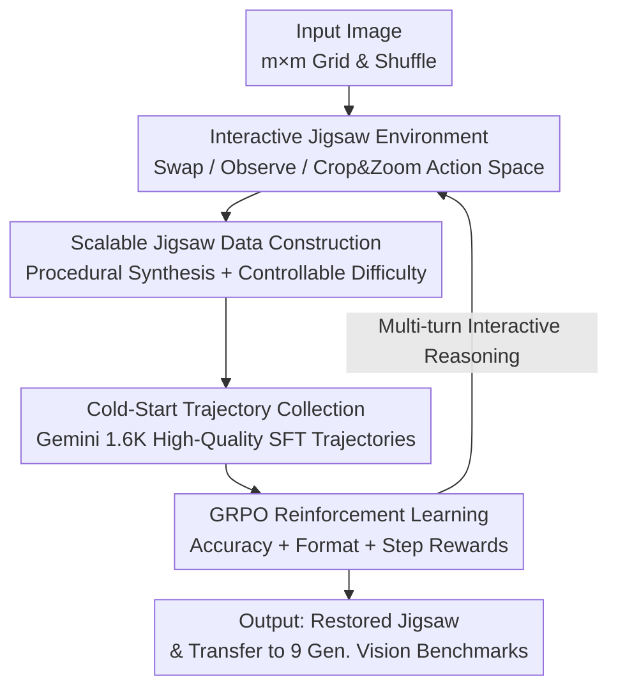

# Agentic Jigsaw Interaction Learning for Enhancing Visual Perception and Reasoning in Vision-Language Models

**Conference**: ICLR2026  
**OpenReview**: [https://openreview.net/forum?id=3kouij8BWi](https://openreview.net/forum?id=3kouij8BWi)  
**Code**: https://github.com/yuzeng0-0/AGILE  
**Area**: Multimodal VLM / LLM Reasoning  
**Keywords**: Vision-Language Models, Jigsaw Agent, Interactive Reinforcement Learning, GRPO, Perception and Reasoning

## TL;DR
AGILE redefines "jigsaw puzzle solving" as an interactive process where the model generates code and observes feedback. Combined with infinitely scalable procedurally synthesized data, cold-start SFT, and GRPO reinforcement learning, it improves Qwen2.5-VL-7B accuracy on 2×2 puzzles from 9.5% to 82.8% and achieves an average gain of 3.1% across 9 general vision benchmarks.

## Background & Motivation
**Background**: Large Vision-Language Models (VLMs) have progressed rapidly in image captioning, VQA, and document understanding, demonstrating strong multimodal perception and reasoning. Recently, Reinforcement Learning (RL) has emerged as a mainstream path to further enhance reasoning through trial-and-error feedback, inspired by DeepSeek-R1's success in mathematical reasoning.

**Limitations of Prior Work**: The authors identify a sobering fact: even on simple 2×2 jigsaw puzzles, current VLMs (including GPT-4o, Gemini-2.5-Pro, and Qwen2.5-VL-72B) perform near chance levels. This suggests that while existing pre-traing/fine-tuning strategies provide superficial capabilities, low-level perception precision and structured reasoning remain weak. Scaling RL to bridge this gap is hindered by data: high-quality vision-language RL data is either manually annotated (expensive and small) or synthesized by closed-source models (limited quality and high API costs).

**Key Challenge**: Utilizing RL to reinforce perception and reasoning requires massive, high-quality, verifiable training data with controllable difficulty; current data construction methods fail to satisfy "scale + quality + ground truth" simultaneously.

**Goal**: Find a proxy task that precisely characterizes "perception + reasoning," is infinitely scalable, and provides intrinsic ground truths to train basic VLM capabilities.

**Key Insight**: Jigsaw puzzles naturally satisfy these requirements. They force models to achieve accurate perception (identifying fragments and edges) and logic (inferring spatial relationships). Difficulty is precisely adjustable via grid size $m$ and the initial number of correct pieces. Since the shuffling process is programmatically recorded, ground truth is always available. Crucially, the authors treat jigsaw puzzles not as a one-shot "visual Q&A" but as a **multi-turn interactive process**: the model generates executable code to manipulate the environment, receives fine-grained visual feedback, and decides the next move.

**Core Idea**: Model "jigsaw solving" as step-by-step model-environment interaction (Python code for actions → environment returns new image → further reasoning). Use procedurally synthesized jigsaw data for cold-start SFT and GRPO reinforcement learning to fundamentally improve VLM visual perception and reasoning.

## Method

### Overall Architecture
AGILE (Agentic jiGsaw Interaction Learning for Enhancing) addresses the inability of VLMs to solve simple puzzles and the lack of scalable RL data. The pipeline consists of three layers: defining the puzzle as an **interactive environment** (model acts via code and observes feedback); using **procedural data construction + cold-start trajectory collection** to equip the model with basic instruction following and code generation; and finally, using **GRPO reinforcement learning with three rewards** for self-improvement on large-scale synthetic puzzles, transferring these capabilities to general vision tasks.

Given an image, it is split into an $m \times m$ grid, numbered $1 \sim m^2$ in row-major order, and shuffled. The model must restore it to the ground truth layout within $T$ steps. For each step, the model outputs a response with `<think>`, `<code>`, and `<answer>` tags. The `<code>` calls predefined APIs (Swap / Observe / Crop / Zoom), and the environment returns a new image as the next user input, looping until the model outputs `<answer>`.

### Key Designs

**1. Jigsaw Environment & Action Space: Converting "Answering" to "Operating"**

This design targets the failure of VLMs on static puzzles. Instead of one-shot guessing, the model uses Python APIs. The action space includes: **Swap** (exchange two fragments), **Observe** (get current state $I_{Obs}$), and **Crop & Zoom** (enlarge a local area for fine-grained details). Formally, the shuffled state is $I_{Shuffle}=\{I_1,\dots,I_{m^2}\}$, the goal is $I_{GT}=\{I_{\pi(1)},\dots,I_{\pi(m^2)}\}$, and the model maintains a current state $I_{State}$. This closed-loop "Observation-Interaction" decomposes a complex global problem into small decisions with immediate visual feedback, allowing the model to learn structural relationships rather than guessing the permutation.

**2. Scalable Procedural Data Construction: Bypassing Scarcity with Rules**

To address RL data scarcity, AGILE uses code and rules. This provides: (1) **Precise Difficulty Control**: By adjusting initial correct pieces ($L_N$) and grid size $m$, samples can be generated from easy to hard. (2) **Intrinsic Ground Truth**: Since shuffling is programmatic, the correct arrangement is known, allowing the synthetic dataset to scale infinitely under strict supervision. For RL, 15.6K cross-domain images (Visual Search, OCR, Scene, Charts) were used, each 2×2 and fully shuffled. This represents a sustainable solution where data volume is limited by compute, not annotation budgets.

**3. Cold-Start SFT: Establishing Basic Code and Instruction Following**

Direct RL is inefficient because the base Qwen2.5-VL-7B has weak instruction following and frequently generates invalid Python code. To fix this, Gemini-2.5-Pro (Preview-05-06) was used to solve puzzles via interaction and collect expert trajectories. Two quality filters were applied: keeping only correct final answers and manual verification of interaction consistency. To ensure the model uses all actions during RL, trajectories were balanced by **step count (4–8 steps)** and **action types (Swap/Observe/Crop/Zoom)**, resulting in 1.6K high-quality trajectories for SFT. This step provides the foundation for interaction.

**4. GRPO & Three Rewards: Realizing Capabilities through Process Feedback**

Group Relative Policy Optimization (GRPO) is used for RL. It calculates advantages $\hat{A}_{i,t}$ relative to group mean rewards. The reward function includes: **Accuracy Reward** (1 if all pieces are correct, else 0), **Format Reward** (1 if `<think>`, `<code>`, and `<answer>` tags are correct), and **Step Reward** (encouraging fewer steps). The step reward is specifically applied only if the puzzle is correctly solved, otherwise, it penalizes with maximum steps:

$$R_{step} = \lambda \cdot \left( \mathbb{I}_{\{R_{acc}=1\}} \cdot step_{num} + \mathbb{I}_{\{R_{acc}=0\}} \cdot step_{max} \right)$$

where $\lambda=-0.05$. This ensures accuracy is the primary goal while enforcing concise, parsable interactions.

### Loss & Training
The process involves two full-parameter tuning stages: Cold-start SFT (llama-factory) with 1.6K trajectories, followed by RL (verl) using GRPO on 15.6K images. Inference uses VLMEvalKit under strict single-turn protocols for general benchmarks to ensure fairness. All experiments were conducted on 8x 80GB A100 GPUs.

## Key Experimental Results

### Main Results
Evaluation was conducted on 300 test images (2×2 and 3×3) using Acc (1 if perfect) and Score (correct blocks / total).

| Model | 2×2 Acc | 2×2 Score | 3×3 Acc | 3×3 Score |
|------|---------|-----------|---------|-----------|
| Random | 4.1 | 24.9 | 0.0 | 11.2 |
| GPT-4o | 41.1 | 59.0 | 4.9 | 41.5 |
| Gemini-2.5-Pro | 46.4 | 59.0 | 14.6 | 45.1 |
| Qwen2.5-VL-72B | 27.4 | 47.6 | 3.9 | 36.0 |
| Qwen2.5-VL-7B (Base) | 9.5 | 29.4 | 0.4 | 31.1 |
| + Cold-Start | 22.0 | 43.8 | 0.2 | 11.0 |
| **+ RL (AGILE)** | **82.8** | **89.0** | **20.8** | **62.1** |

The 7B base model achieves only 9.5% Acc on 2×2. AGILE boosts this to 82.8%, outperforming the closed-source Gemini-2.5-Pro and the much larger Qwen2.5-VL-72B.

Transfer performance across 9 general vision benchmarks (Strict single-turn):

| Benchmark | Qwen2.5-VL-7B | + RL | ∆ |
|------|---------------|------|---|
| HRBench4K | 68.8 | 73.0 | +4.2 |
| HRBench8K | 65.3 | 70.5 | +5.2 |
| VStarBench | 76.4 | 80.6 | +4.2 |
| MMVP | 74.3 | 78.0 | +3.7 |
| MME-RealWorld | 44.6 | 48.4 | +3.8 |
| **9-Bench Avg.** | **62.1** | **65.2** | **+3.1** |

Jigsaw training is not mere overfitting; it transfers fundamental visual relationship capturing to downstream tasks.

### Ablation Study

| Configuration | 2×2 Acc | Note |
|------|---------|------|
| Qwen2.5-VL-7B Base | 9.5 | Baseline |
| + Cold-Start (SFT only) | 22.0 | Basic interaction established, but 3×3 performance drops |
| + RL (Full AGILE) | 82.8 | RL is the primary driver of performance gains |

Data scaling analysis shows clear improvements: increasing RL data from 0 to 15.6K raises jigsaw Acc from 22.0% to 82.8%, and HRBench4K from 68.8 to 73.0.

### Key Findings
- **RL is critical for capability jumps**: SFT only enables basic interaction (22.0% on 2×2), while GRPO drives the surge to 82.8%.
- **Transferable jigsaw skills**: Perception/reasoning skills from puzzles transfer to 9 distinct general vision benchmarks (avg. +3.1% gain).
- **Procedural scaling is a core dividend**: Since data is programmatic and verifiable, volume is compute-limited rather than budget-limited, effectively mitigating multimodal RL data scarcity.

## Highlights & Insights
- **Proxy Task + Interaction**: Combining puzzles (infinitely scalable + verifiable) with interactive modeling (solving weak static reasoning) allows a 7B model to surpass much larger LLMs.
- **Conditional Step Reward**: Locking step rewards behind the $\mathbb{I}_{\{R_{acc}=1\}}$ condition prevents models from hacking rewards by failing quickly, a useful insight for any interaction-based RL task.
- **Role of Cold-Start**: SFT is used purely to establish the "interface" between the model and the environment, allowing RL to focus on capability acquisition rather than learning to format outputs.
- **Procedural Synthesis as a Paradigm**: Tasks with naturally verifiable answers and tunable difficulty are ideal proxy tasks for bypassing data bottlenecks in multimodal RL.

## Limitations & Future Work
- **Coverage of Capabilities**: Puzzles mainly target spatial perception and arrangement reasoning; impact on semantic common sense or cross-modal alignment may be limited.
- **3×3 Performance**: Despite gains, 3×3 Acc remains at 20.8%, suggesting bottlenecks in scalability as search space and interaction turns grow.
- **Dependency on Closed Teacher**: The 1.6K cold-start trajectories rely on Gemini-2.5-Pro and manual verification, which is not yet "fully self-supervised."
- **Single Base Model**: The method was only validated on Qwen2.5-VL-7B.

## Related Work & Insights
- **vs Jigsaw-R1**: While both use puzzles, Jigsaw-R1 lacks strong interactive modeling, leaving it far behind AGILE's 82.8% performance.
- **vs Perception-oriented RL (Perception-R1, DeepEyes)**: These focus on specific tasks like counting or grounding; AGILE uses a proxy task to unify the training of low-level perception and reasoning.
- **vs Logic-RL / Enigmata**: These use text/code puzzles for LLMs; AGILE brings "verifiable proxy tasks" to the **visual perception** domain via interactive rollouts.

## Rating
- Novelty: ⭐⭐⭐⭐⭐ 
- Experimental Thoroughness: ⭐⭐⭐⭐ 
- Writing Quality: ⭐⭐⭐⭐ 
- Value: ⭐⭐⭐⭐⭐ 

<!-- RELATED:START -->

## Related Papers

- [\[ICLR 2026\] MedVR: Annotation-Free Medical Visual Reasoning via Agentic Reinforcement Learning](medvr_annotation-free_medical_visual_reasoning_via_agentic_reinforcement_learnin.md)
- [\[ICLR 2026\] VisionReasoner: Unified Reasoning-Integrated Visual Perception via Reinforcement Learning](visionreasoner_unified_reasoning-integrated_visual_perception_via_reinforcement_.md)
- [\[CVPR 2026\] BOP-Ask: Object-Interaction Reasoning for Vision-Language Models](../../CVPR2026/vlm_reasoning/bop-ask_object-interaction_reasoning_for_vision-language_models.md)
- [\[CVPR 2026\] MoE-GRPO: Optimizing Mixture-of-Experts via Reinforcement Learning in Vision-Language Models](../../CVPR2026/vlm_reasoning/moe-grpo_optimizing_mixture-of-experts_via_reinforcement_learning_in_vision-lang.md)
- [\[ICLR 2026\] InternSpatial: A Comprehensive Dataset for Spatial Reasoning in Vision-Language Models](internspatial_a_comprehensive_dataset_for_spatial_reasoning_in_vision-language_m.md)

<!-- RELATED:END -->
