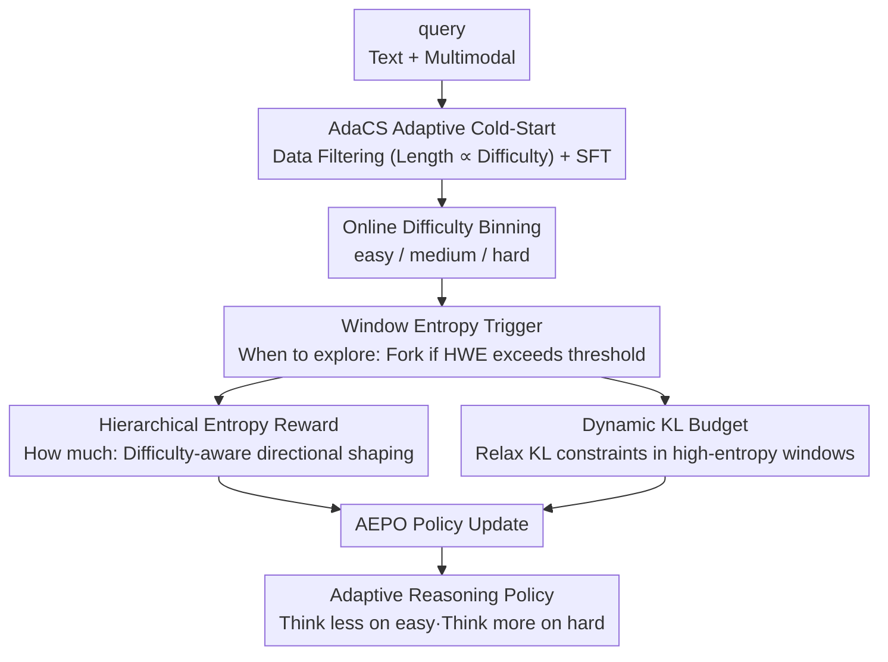

markdown
# ARES: Multimodal Adaptive Reasoning via Difficulty-Aware Token-Level Entropy Shaping

**Conference**: ICLR2026  
**OpenReview**: [https://openreview.net/forum?id=2g945Ngc7l](https://openreview.net/forum?id=2g945Ngc7l)  
**Code**: https://github.com/shawn0728/ARES  
**Area**: Multimodal VLM / LLM Reasoning  
**Keywords**: Adaptive Reasoning, Window Entropy, Difficulty Awareness, Entropy Reward Shaping, Reinforcement Learning

## TL;DR
ARES utilizes "window entropy" as an exploration trigger and controls exploration depth through a difficulty-aware hierarchical entropy reward. This allows multimodal reasoning models to think less on simple problems and more on difficult ones, simultaneously improving accuracy and reasoning efficiency across mathematical, logical, and multimodal benchmarks.

## Background & Motivation
**Background**: Multimodal large reasoning models (MLRMs) demonstrate strong performance on complex textual and visual tasks through long Chain-of-Thought (long CoT) and reflection. The prevailing approach involves cold-start SFT followed by RLVR (Reinforcement Learning from Verifiable Rewards) to train models capable of "deliberative thinking."

**Limitations of Prior Work**: Such models suffer from an imbalance: **overthinking simple problems**, which generates unnecessary reasoning tokens and increases inference costs/latency, and **under-exploring difficult problems**, leading to premature convergence on incorrect solutions. Existing "token-saving" methods (training-free truncation or training-based length penalties) mitigate verbosity but generally **degrade accuracy**.

**Key Challenge**: A trade-off exists between exploration cost (response length) and accuracy. Current adaptive methods (adjusting cold-start data by difficulty or adding difficulty-aware penalties in RL) often **encourage exploration on hard problems indiscriminately**, resulting in long traces with marginal gains. The underlying issue is that they do not adequately address two fundamental questions: **when** should exploration occur, and **how much** exploration is required?

**Key Insight**: The authors observe that single-token entropy is noisy (punctuation, formulas, and stop words can have high entropy, while logical transitions like "but/however" may have low entropy), making it unreliable for marking "reasoning bifurcation points." However, averaging the entropy of consecutive tokens within a sliding window—**window entropy**—reliably identifies critical reasoning moments of sustained model uncertainty. Further experiments reveal an "entropy-difficulty interaction": **reducing High Window Entropy (HWE) tokens for simple problems improves both brevity and accuracy, whereas increasing HWE tokens for hard problems is necessary for resolution.**

**Core Idea**: HWE tokens are employed as exploration triggers (determining "when"), while difficulty-aware hierarchical entropy rewards and dynamic KL budgets control exploration intensity (determining "how much"). This is implemented via a two-stage training pipeline to achieve "difficulty-adaptive reasoning compute allocation."

## Method

### Overall Architecture
ARES aims to enable a multimodal policy to autonomously adjust reasoning depth based on task difficulty: outputting short answers for easy questions and long exploration chains for hard ones. The framework consists of two sequential phases: **AdaCS (Adaptive Cold-Start SFT)**, which encodes the "difficulty ↔ length" mapping into the model to establish initial difficulty awareness, and **AEPO (Adaptive Entropy Policy Optimization)**, which uses RLVR to refine this awareness into an online, adaptive exploration control mechanism.

AEPO incorporates three synergistic components: **online difficulty binning** (easy/medium/hard) for each batch of rollouts; a **window entropy trigger** to decide "when" to fork extra exploration trajectories at high-uncertainty points; and **hierarchical entropy rewards + dynamic KL** to determine "how much" to explore—suppressing over-exploration on simple tasks and encouraging deep exploration on hard ones. Rewards are computed in closed-form using batch-level statistics without additional hyperparameters.

### Key Designs

**1. AdaCS Adaptive Cold-Start: Encoding "Higher Difficulty, Longer Thinking"**

It is challenging for RL to learn difficulty awareness from zero. Therefore, SFT is first used to establish an initial policy where length is explicitly correlated with difficulty. Unlike prior methods that discard simple samples (pass rate=1) or oversample difficult ones, ARES **retains the full difficulty spectrum** and deliberately differentiates lengths. Specifically, for each data source, the pass rate of each question is estimated via 8 samples, and target response lengths are set based on pass rate tiers. The target length is linearly interpolated between the median lengths of the easiest (pass rate=1) and hardest (pass rate=0) responses:

$$L_{\text{target}}(p) = (1-p)\cdot L(0) + p\cdot L(1)$$

where $L(0)$ and $L(1)$ are the median token lengths for pass rates 0 and 1, respectively. Responses with lengths closest to the target are then **uniformly sampled** for each tier. This maximizes the "variance in response length across difficulties," training the model to associate perceived difficulty with reasoning verbosity and learn HWE tokens and reflection capabilities. This stage covers approximately 224K samples (ARES-SFT-224K), including high-quality text RLVR data and multimodal STEM tasks.

**2. Window Entropy Trigger: Determining "When to Explore" via HWE Regions**

This design addresses the noise inherent in single-token entropy. ARES averages token-level entropy within a sliding window to compute window entropy $\bar{H}_{t:w}=\frac{1}{w}\sum_{\tau=t}^{t+w-1}H_\tau$ (empirical tests show windows of 4–8 are optimal for F1, smoothing noise without diluting signals). To make this an actionable trigger, a threshold is required: the **95th percentile** of token entropy for each rollout is taken as the high-entropy threshold (as RLVR primarily reshapes the distribution of the top 5% entropy tokens). These values are then averaged across the mini-batch to obtain a stable cutoff:

$$\tau_{\text{high}} = \frac{1}{|D|}\sum_{y\in D}\text{Quantile}_{0.95}\big(\{H_t(y)\}_{t=1}^{|y|}\big)$$

$\tau_{\text{high}}$ is dynamically updated batch-by-batch. During rollout, if the window entropy $\bar{H}_{t:w}$ exceeds $\tau_{\text{high}}$, an additional trajectory is branched at position $t$ (constrained to one branch per high-entropy window and a maximum trajectory limit). This concentrates compute on critical moments of sustained uncertainty rather than wasting branches on stable, low-entropy segments.

**3. Hierarchical Entropy Reward: Controlling "How Much" via Closed-Form Lagrange Multipliers**

Triggering only solves "when"; intensity must also be controlled. ARES defines a "target high-entropy token count" for each online difficulty bin as the batch mean $N_{\text{HE}}^{\text{target}}(d)=\mathbb{E}_{\text{batch}}[N_{\text{HE}}\mid d]$. For deviations from this target, a **closed-form Lagrange multiplier** automatically scales the penalty intensity without manual tuning:

$$\lambda_d = \max\!\left(0,\ \frac{\mathbb{E}_{\text{batch}}[N_{\text{HE}}\mid d] - N_{\text{HE}}^{\text{target}}(d)}{\text{Var}_{\text{batch}}[N_{\text{HE}}\mid d] + \varepsilon}\right)$$

Crucially, **the shaping direction varies with difficulty**. Letting $\Delta(y;d)=N_{\text{HE}}-N_{\text{HE}}^{\text{target}}(d)$, the direction functions are: $g_{\text{easy}}=\max(0,\Delta)$ (penalizing only positive deviation/over-exploration) for easy tasks, $g_{\text{med}}=|\Delta|$ (symmetric penalty) for medium tasks, and $g_{\text{hard}}=\max(0,-\Delta)$ (penalizing only negative deviation/under-exploration) for hard tasks. The final hierarchical reward unifies accuracy and entropy regularization:

$$R(x,y;d) = R_{\text{acc}}(x,y) - \mathbb{1}[\text{acc}(x,y)=0]\,\lambda_d\, g_d\big(\Delta(y;d)\big)$$

Note that the entropy penalty is **only applied to incorrect answers**—correct solutions are not penalized, while incorrect ones are pushed to adjust exploration volume based on difficulty. The entire mechanism runs on batch-level statistics, achieving adaptive control without additional hyperparameters.

**4. Dynamic KL Budget: Token-Level "Thinking Budget Allocator"**

Post-cold-start RL is prone to collapse or high variance if KL constraints are poorly handled. The authors utilize **KL loss** (rather than KL penalty, which can amplify variance) as an effective "thinking budget." On this basis, they introduce token-adaptive weights:

$$\beta_{i,t} = \beta_d \cdot \rho_t,\qquad \rho_t = \begin{cases}\rho\ (<1), & t\in W_{\text{valid}}\\ 1, & \text{otherwise}\end{cases}$$

where $\beta_d$ is the difficulty-related baseline weight, and $\rho_t$ **relaxes** the KL constraint (multiplied by $\rho<1$) within validated high-entropy windows. This tightens KL on stable, low-entropy tokens to prevent drift while allowing exploration in critical high-entropy segments, effectively acting as a per-token thinking budget allocator.

## Key Experimental Results

### Main Results
Training utilized ~224K cold-start samples (text RLVR + multimodal STEM), with the RLVR phase using ViRL39K verifiable QA pairs. Baselines include closed-source models (GPT-4.1, Gemini-2.5-Pro-Thinking, Claude-4-Sonnet) and open-source MLLMs (mostly fine-tuned from Qwen2.5-VL-3B/7B-Instruct).

| Model | MathVision | MMMU-Pro | Multimodal 10-task Avg | Notes |
|------|-----------|----------|------------------|------|
| Qwen2.5-VL-3B-Instruct | 21.2 | 31.6 | 34.8 | 3B Base |
| VLAA-Thinker-3B | 24.4 | 33.3 | 37.7 | Strong 3B Baseline |
| **ARES-3B** | **44.2** | **45.2** | **46.1** | +8.4 vs Open-Source 3B SoTA |
| Qwen2.5-VL-7B-Instruct | 25.1 | 38.3 | 43.3 | 7B Base |
| **ARES-7B** | — | — | — | MathVision +19.0, MMMU-Pro +11.5 vs best Open-Source |

In text reasoning, ARES-7B achieved **61.7** on AIME25, while most 7B baselines scored below 3.3, demonstrating that ARES enhances core reasoning capabilities beyond multimodal task overfitting.

### Ablation Study

| Configuration | Focus | Conclusion |
|------|--------|------|
| ARES-CS-7B (AdaCS only) | Length vs Difficulty | Cold-start can already adjust length by difficulty |
| ARES-RL-7B (+AEPO) | Adaptive Enhancement | Longer reasoning for hard (AIME25) and shorter for easy (GSM8K) tasks; gains in both accuracy and token efficiency |
| w/o Hierarchical Reward | Exploration Control | Exploration volume for easy/hard tasks becomes uncontrolled |
| w/o Dynamic KL | Budget Allocation | High-entropy segments cannot relax, limiting exploration |

### Key Findings
- **Window Entropy vs. Single-token Entropy**: Moderate windows (4–8) yield the highest F1 in detecting critical reasoning tokens; windows that are too large (16–32) dilute signals with low-entropy tokens.
- **Entropy-Difficulty Interaction is the core law**: Simple problems are more accurate and shorter with "less exploration," while hard problems require "more exploration" for accuracy (at the cost of length). Within each difficulty tier, correct samples show diverging high-entropy token counts.
- **AEPO automates this law**: It encourages exploration only when necessary (hard tasks), allowing the model to approach closed-source performance at lower inference costs.

## Highlights & Insights
- **Window Entropy as Trigger**: The noise of single-token entropy is resolved via sliding window averages, providing a reliable signal for locating bifurcation points. This "signal engineering" approach is transferable to any RL task requiring exploration timing.
- **Directional Difficulty-Aware Shaping**: Using different penalty directions ($\max(0,\Delta)$, $|\Delta|$, $\max(0,-\Delta)$) for different difficulty tiers uniquely addresses "when/how much" to explore. Achieving this via closed-form equations without extra hyperparameters is elegant.
- **"Penalize Only Incorrect" Design**: Entropy penalties only apply when $\text{acc}=0$, avoiding the discouragement of concise, correct solutions. This detail is crucial for balancing efficiency without losing accuracy.
- **KL Loss vs. KL Penalty**: The authors distinguish these and argue that penalties amplify variance, instead opting for token-level relaxed KL loss as a "thinking budget allocator"—a valuable insight for RLVR training stability.

## Limitations & Future Work
- **Difficulty Binning Dependence**: AdaCS relies on 8-sample pass rate estimation, and RL uses online binning; noise in difficulty labels directly impacts the correctness of directional shaping.
- **Empirical Hyperparameters**: While supported by experiments, window size (4–8) and 95th percentile thresholds are empirical; their robustness across tasks or model scales requires further verification.
- **Limited Scale**: The study focuses on 3B/7B models; whether the "entropy-difficulty interaction" holds and yields similar gains on larger models remains to be fully explored.
- **Future Directions**: Potential for combining window entropy triggers with fine-grained step-level difficulty modeling or extending the framework to non-STEM, open-ended multimodal tasks.

## Related Work & Insights
- **vs. Training-free Truncation/Early Exit**: These rely on rules to compress length and hurt accuracy; ARES uses entropy signals for adaptive exploration, gaining both efficiency and accuracy.
- **vs. Difficulty-aware RL Penalties**: Prior methods often encourage exploration on hard tasks indiscriminately, leading to verbose traces; ARES's directional shaping is more precise.
- **vs. Variable Difficulty Cold-start**: While some discard easy samples, ARES retains the full spectrum and deliberately widens length differences to establish a strong "difficulty ↔ length" correlation.
- **vs. GRPO / DAPO**: AEPO builds on their surrogate objectives by adding token-level dynamic KL weights and hierarchical entropy-shaped advantages, explicitly encoding "exploration control" into the RL objective.

## Rating
- Novelty: ⭐⭐⭐⭐⭐ Window entropy triggers + directional entropy shaping provides an original answer to "when/how much" to explore.
- Experimental Thoroughness: ⭐⭐⭐⭐ Covers multiple benchmarks and two model scales with ablations, though verification on larger models is missing.
- Writing Quality: ⭐⭐⭐⭐ Clear logic from motivation to discovery to method; some details reside in the appendix.
- Value: ⭐⭐⭐⭐⭐ Open-source framework + dataset, achieving a win-win for efficiency and accuracy; highly practical for MLRM training.

<!-- RELATED:START -->

## Related Papers

- [\[ICLR 2026\] DIVA-GRPO: Enhancing Multimodal Reasoning through Difficulty-Adaptive Variant Advantage](diva-grpo_enhancing_multimodal_reasoning_through_difficulty-adaptive_variant_adv.md)
- [\[ICLR 2026\] What "Not" to Detect: Negation-Aware VLMs via Structured Reasoning and Token Merging](what_not_to_detect_negation-aware_vlms_via_structured_reasoning_and_token_mergin.md)
- [\[ICLR 2026\] Mixture-of-Visual-Thoughts: Exploring Context-Adaptive Reasoning Mode Selection for General Visual Reasoning](mixture-of-visual-thoughts_exploring_context-adaptive_reasoning_mode_selection_f.md)
- [\[CVPR 2026\] See Less, See Right: Bi-directional Perceptual Shaping For Multimodal Reasoning](../../CVPR2026/vlm_reasoning/see_less_see_right_bi-directional_perceptual_shaping_for_multimodal_reasoning.md)
- [\[ICLR 2026\] Perception-Aware Policy Optimization for Multimodal Reasoning](perception-aware_policy_optimization_for_multimodal_reasoning.md)

<!-- RELATED:END -->
