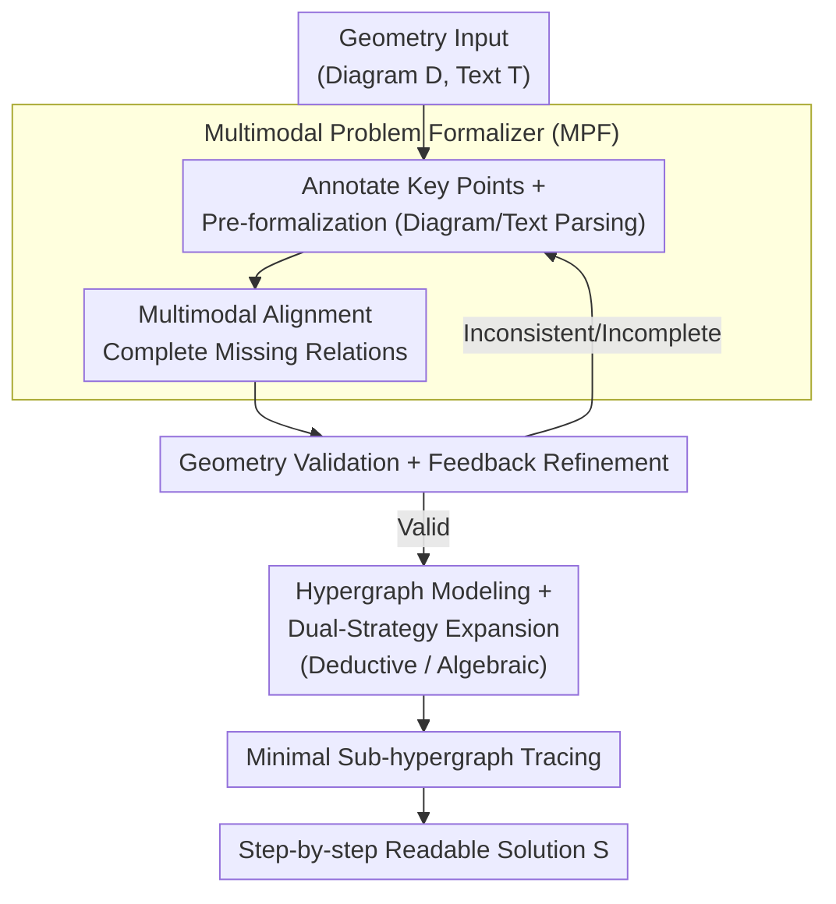

# AutoGPS: Automated Geometry Problem Solving via Multimodal Formalization and Deductive Reasoning

**Conference**: ICLR2026  
**OpenReview**: [https://openreview.net/forum?id=PVtZnUh04m](https://openreview.net/forum?id=PVtZnUh04m)  
**Code**: To be confirmed  
**Area**: Multimodal VLM / Geometry Reasoning / Neuro-Symbolic  
**Keywords**: Geometry Problem Solving, Multimodal Formalization, Deductive Symbolic Reasoning, Hypergraph Expansion, Neuro-Symbolic Synergy

## TL;DR
AutoGPS utilizes a neuro-symbolic synergistic framework consisting of a "Multimodal Problem Formalizer (MPF) + Deductive Symbolic Reasoner (DSR)." It first translates plane geometry problems into formal language and then performs rigorous deduction via hypergraph expansion. This process yields both a correct answer and a traceable step-by-step solution, achieving SOTA on Geometry3K / PGPS9K and improving human-evaluated logical accuracy from ~71% to 99%.

## Background & Motivation

**Background**: Geometry Problem Solving (GPS) is inherently a multimodal task, requiring an understanding of diagrams (points, lines, circles, perpendicularity/parallelism/tangency) and textual problem statements, followed by rigorous mathematical derivation. Current approaches are divided into neural methods—including specialized neural solvers (PGPSNet, LANS) and Multimodal Large Language Models (Qwen2.5-VL, InternVL3, GPT-4o)—and symbolic methods (Inter-GPS, E-GPS), which convert problems into formal languages for rule-based and algebraic solving.

**Limitations of Prior Work**: Neural methods excel at multimodal understanding but suffer from "hallucinations," generating intermediate steps that seem plausible but are logically incorrect. This leads to wrong conclusions and untraceable reasoning chains. Symbolic methods provide mathematical rigor but face two bottlenecks: first, **incomplete formalization**, where MLLMs or rule-based parsers often miss global information like shaded areas or diameters; second, they often treat solving as a "global algebraic system," which lacks traceability and fails to provide human-readable step-by-step proofs.

**Key Challenge**: Reliability and interpretability are split between neural and symbolic approaches—neural methods have understanding but lack reliability, while symbolic methods offer rigor but suffer from incomplete formalization and opaque processes.

**Goal**: The authors decompose this into two sub-problems: (1) how to achieve **complete and accurate** formalization of multimodal geometry problems; (2) how to perform **rigorous and human-readable** step-by-step derivation based on that formalization.

**Key Insight**: Let the neural component handle "understanding and formalization" while the symbolic component handles "rigorous deduction." Furthermore, the symbolic component should **verify the formalization** provided by the neural component to create a closed loop. Simultaneously, the solving process is explicitly modeled as a traceable graph structure rather than a black-box algebraic solver.

**Core Idea**: A synergistic framework using "MPF for multimodal formalization + DSR for modeling solving as a hypergraph expansion task." This converts geometry solving into a deduction chain where every node and hyperedge is traceable, ensuring both reliability and interpretability.

## Method

### Overall Architecture
AutoGPS takes a pair of geometry problem inputs $(D, T)$ (where $D$ is the diagram and $T$ is the text). The goal is to produce the correct answer $a^*$ and a step-by-step reasoning process $S = \{s_1, s_2, \dots, s_n\}$. The pipeline consists of two serial components with a feedback loop: the **MPF (Multimodal Problem Formalizer)** translates $(D, T)$ into a set of formal languages $L = \{l_1, \dots, l_k, \text{Find}(t)\}$ (where each $l_i$ is a formal statement like $\text{Line}(A,B)$ and $\text{Find}(t)$ specifies the target); the **DSR (Deductive Symbolic Reasoner)** first validates the self-consistency and completeness of $L$, providing feedback for iterative refinement. Once validated, the DSR models the solving as a **hypergraph expansion task**—facts are nodes and derivation steps are hyperedges—using both deductive and algebraic reasoning to expand the graph until the solution $a^*$ is reached. Finally, it extracts the **minimal sub-hypergraph** and converts it into a human-readable solution.

### Key Designs

**1. MPF: Decomposing "Diagram-Text Understanding" into Annotation, Pre-formalization, and Alignment to solve incomplete formalization.**

To address the issue of MLLMs missing information, MPF is designed as a multimodal agent with a tool library executing three steps. **Annotation**: Geometry diagrams often lack point labels required for formalization. A pre-trained FPN model $M_a$ detects intersections and centers, outputting $Pt, Y = M_a(D)$ to get $D' = (D, Pt, Y)$. **Pre-formalization**: A graph parser $M_d$ based on PGDP-Net extracts primitives $P_g, R = M_d(D')$ (e.g., segments, circles, $BD \perp BC$), while a rule-based text parser $M_t$ converts the problem text into pseudo-formal language $T'$. **Multimodal Alignment**: To fix omissions and clarify ambiguities, $D'$ and $F = (P_g, R, T')$ are fed into an MLLM to produce the final set $L$. Ablations show that removing pre-formalization drops accuracy by 50.9%–62.4%, highlighting its criticality.

**2. Geometry Validation + Feedback Refinement Loop: Symbolic error correction for neural outputs.**

Symbolic solvers are sensitive to incomplete or contradictory inputs. DSR performs **Geometry Validation** before solving, checking if $L$ is self-consistent and complete. If it can be completed with known knowledge (e.g., inferring $PH \perp AH$ from $PH \perp AB$), it does so automatically. If a contradiction occurs (e.g., asserting collinearity while defining a triangle), it is flagged. In this **closed loop**, inconsistent formalizations are sent back to MPF with error messages for refinement until a consistent version is received or the iteration limit is reached.

**3. Hypergraph Modeling + Dual-Strategy Expansion: Traceable deduction instead of black-box algebra.**

DSR borrows from AlphaGeometry by modeling reasoning as a hypergraph. Each step $s_i$ follows a syllogistic structure: theorem $t \in T$, premises $P$, and conclusions $Q$, denoted as $P \xrightarrow{\;t\;} Q$. **Dual-Strategy Expansion**: Beyond geometric deduction, the authors decompose algebraic solving into **step-by-step transformations** (equivalent substitution, constant evaluation, nonlinear solving, and linear systems). Each transformation is treated as a hyperedge, e.g., $\{a=b, b=\sin(x)\} \xrightarrow{\text{substitution}} \{a=\sin(x)\}$. This ensures every step is explicit and traceable.

**4. Minimal Sub-hypergraph Tracing: Extracting concise proofs from redundant expansions.**

Expanded hypergraphs are often bloated with irrelevant derivations. DSR performs **Minimal Solution Generation (MSG)** by finding the smallest sub-hypergraph connecting the input to $a^*$ with the fewest hyperedges. Since the graph is a Directed Acyclic Hypergraph (DAH), this can be solved in polynomial time. The result is topologically sorted and translated into a concise human-readable proof $S$. On Geometry3K, this reduces average reasoning steps from 237.15 to 16.69 (a ~93% reduction) without sacrificing rigor.

## Key Experimental Results

### Main Results
AutoGPS (GPT-4o version) outperforms Prev. SOTA on Geometry3K and PGPS9K, particularly in the Completion format:

| Dataset | Metric | AutoGPS(GPT-4o) | Prev. SOTA (LANS) | Gain |
|--------|------|-----------------|----------------|------|
| Geometry3K | Completion | 75.4 | 71.3 | +4.1% |
| PGPS9K | Completion | 75.3 | 66.1 | +9.2% |
| Geometry3K | Choice | 81.6 | 82.3 | -0.7% (Comparable) |
| PGPS9K | Choice | 81.5 | 73.8 | +7.7% |

Compared to pure MLLMs, it leads by 18.0% and 26.4% in Completion. While neural methods drop significantly without choice constraints, AutoGPS maintains stability due to rule-based symbolic reasoning.

### Ablation Study

| Configuration | Key Metric (Completion) | Description |
|------|----------------------|------|
| Full model (GPT-4o) | 75.4% | Complete model |
| w/o Pre-formalization | 22.6% | Direct formalization from diagram/text; dropped ~52.8% |
| w/o Multimodal Alignment | 64.1% | Pre-formalization only; dropped ~8.6% |
| w/o MSG | Steps: 237.15 | Average steps increased from 16.69 to 237.15 |

### Key Findings
- **Pre-formalization is the bottleneck**: Removing it causes accuracy to plummet, as MLLMs struggle with basic geometric relations like collinearity.
- **Formalization quality dictates success**: AutoGPS achieves a Jaccard similarity of 0.868 for formalization vs. 0.395 for InterGPS, leading to a 27.6% lead in Completion accuracy.
- **Reliability is the standout feature**: Human evaluation of step-by-step correctness on 100 correctly answered problems shows MLLMs score 67%–71%, while AutoGPS reaches 99%.
- **Noise Robustness**: DSR can automatically detect geometric contradictions during reasoning, adding value for educational scenarios.

## Highlights & Insights
- **Symbolic-to-Neural feedback**: The MPF↔DSR loop blocks formalization errors at the source, moving beyond simple "neural generation, symbolic execution" to a teacher-student relationship.
- **Algebra as syllogism**: Treating algebraic steps as atomic hyperedges allows algebra and deduction to be unified in a single hypergraph, achieving 99% readability.
- **Decoupling expansion from proof**: Expanding broadly (237 steps) but outputting minimally (16.7 steps) optimizes for both search success and explanation clarity.
- **The "Skeleton" Effect**: GPT-4o alone is only ~68% logically correct; with AutoGPS, it hits 99%. The bottleneck is not the "math power" of the model, but the lack of a rigorous external reasoning framework.

## Limitations & Future Work
- **Dependency on specialized modules**: Keypoint detection and graph parsing depend on plane-geometry-specific pre-trained models, limiting generalization to 3D geometry or function graphs.
- **Predefined Rule/Theorem set**: DSR depends on a manual theorem library $T$. Problems exceeding these rules result in formalization failure or "unsolvable" status.
- **Evaluation Sample Size**: 99% accuracy was evaluated on a subset of 100 samples; larger-scale validation of robustness in failure cases is needed.
- **Future Work**: Replacing rule-based components with learnable, verifiable modules or automated theorem induction.

## Related Work & Insights
- **vs. Pure MLLMs**: MLLMs have strong understanding but hallucinate reasoning chains. AutoGPS limits the MLLM to formalization and delegates derivation to a symbolic engine.
- **vs. Pure Symbolic (Inter-GPS)**: Symbolic methods have rigor but struggle with incomplete formalization (0.395 Jaccard). AutoGPS improves this to 0.868 and adds human-readable steps.
- **vs. AlphaGeometry**: AlphaGeometry excels at proofs but lacks general algebraic solving. AutoGPS unifies algebraic solving into the hypergraph framework.
- **vs. Neuro-Symbolic (GeoDRL)**: While others use neural modules for search efficiency, AutoGPS focuses on formalization completeness and explanation readability.

## Rating
- Novelty: ⭐⭐⭐⭐ MPF↔DSR loop and algebraic-hypergraph unification are practical extensions of the AlphaGeometry paradigm.
- Experimental Thoroughness: ⭐⭐⭐⭐⭐ Comprehensive covering of two datasets, multiple formats, human evaluation, and noise robustness.
- Writing Quality: ⭐⭐⭐⭐ Clear framework with rigorous hypergraph formulations.
- Value: ⭐⭐⭐⭐⭐ 99% logical correctness has direct impact on educational technology and reliable tutoring systems.

<!-- RELATED:START -->

## Related Papers

- [\[AAAI 2026\] AStar: Boosting Multimodal Reasoning with Automated Structured Thinking](../../AAAI2026/vlm_reasoning/astar_boosting_multimodal_reasoning_with_automated_structure.md)
- [\[ICLR 2026\] No Labels, No Problem: Training Visual Reasoners with Multimodal Verifiers](no_labels_no_problem_training_visual_reasoners_with_multimodal_verifiers.md)
- [\[ICLR 2026\] Evaluating Cross-Modal Reasoning Ability and Problem Characteristics with Multimodal Item Response Theory](evaluating_cross-modal_reasoning_ability_and_problem_characteristics_with_multim.md)
- [\[CVPR 2026\] SpatialStack: Layered Geometry-Language Fusion for 3D VLM Spatial Reasoning](../../CVPR2026/vlm_reasoning/spatialstack_layered_geometry-language_fusion_for_3d_vlm_spatial_reasoning.md)
- [\[CVPR 2026\] G$^2$VLM: Geometry Grounded Vision Language Model with Unified 3D Reconstruction and Spatial Reasoning](../../CVPR2026/vlm_reasoning/g2vlm_geometry_grounded_vision_language_model_with_unified_3d_reconstruction_and.md)

<!-- RELATED:END -->
