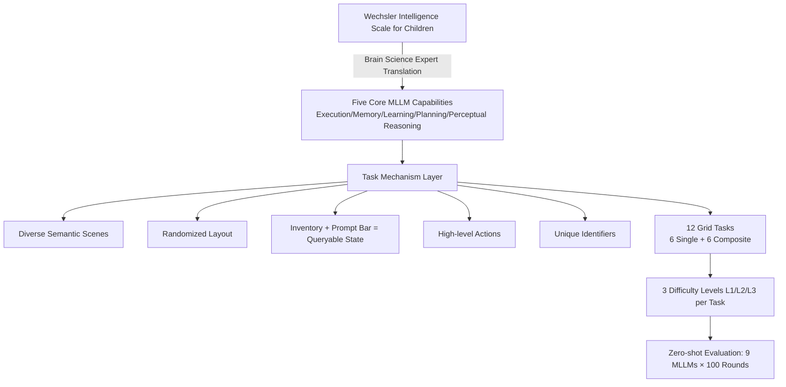

# Children's Intelligence Tests Pose Challenges for MLLMs? KidGym: A 2D Grid-Based Reasoning Benchmark for MLLMs

**Conference**: ICLR 2026  
**OpenReview**: [https://openreview.net/forum?id=Hj8Dc14nk1](https://openreview.net/forum?id=Hj8Dc14nk1)  
**Code**: [https://kidgym.github.io/KidGym-Website/](https://kidgym.github.io/KidGym-Website/)  
**Area**: MLLM Evaluation / Cognitive Ability Benchmark / Interactive Reasoning  
**Keywords**: MLLM Benchmark, Wechsler Intelligence Scale, 2D Grid Interaction, Cognitive Ability Assessment, Dynamic Tasks  

## TL;DR
Inspired by the Wechsler Intelligence Scale for Children, "General Intelligence" is decomposed into five measurable abilities: Execution, Perceptual Reasoning, Learning, Memory, and Planning. KidGym is constructed with 12 2D grid interaction tasks, three difficulty levels, and a customizable dynamic benchmark. It systematically reveals significant shortcomings of current top MMLMs in non-semantic abstract vision, quantity perception, and composite ability tasks.

## Background & Motivation
**Background**: Multimodality Large Language Models (MLLMs) extend language model capabilities to modalities such as images and videos, aiming to approach human-like "general" cognition. Psychometric AI has long argued that using validated human capability scales to test AI reflects general reasoning levels more accurately than stacking task-specific benchmarks. Children's intelligence tests (e.g., Wechsler Scales) decompose intelligence into an interpretable and measurable set of sub-abilities, naturally fitting the demand for profiling multiple collaborative capabilities.

**Limitations of Prior Work**: Current MLLM benchmarks suffer from three structural flaws: (1) **Dominance of static Q&A**, where information remains constant throughout the task, lacking dynamic tasks that require continuous interaction with the environment and state-evolving decision-making; (2) **Isolated single-ability assessment**, failing to characterize how abilities like memory and planning interact and collaborate in real-world scenarios; (3) Difficulty in excluding pre-training data leakage (models memorizing similar scenarios). Existing interactive environments (e.g., MiniGrid, Crafter) are mostly designed for Reinforcement Learning (RL) or convert scenes into pure text descriptions, making them unsuitable for directly evaluating MLLMs on visual decision-making.

**Key Challenge**: While human intelligence can be mapped one-to-one to Wechsler subtests, MLLMs differ fundamentally from humans in embodiment and interaction modalities. **Directly copying Wechsler subtests is unreasonable**; each capability must be "tailored" according to the model's architecture and functional characteristics.

**Goal**: Construct a dynamic, interactive, unified 2D benchmark capable of simultaneously evaluating multidimensional capabilities with customizable extensions, thereby diagnosing the true capability boundaries of top-tier MLLMs.

**Core Idea**: `Capability Decomposition + Gamified Interaction`. In collaboration with experts in pediatric brain science, the most important indicators of the Wechsler Scale were translated into five core abilities applicable to MLLMs (Execution / Memory / Learning / Planning / Perceptual Reasoning). These were implemented via Gym APIs as 12 randomized-layout, multi-difficulty grid game tasks, allowing models to be evaluated while "playing," much like children.

## Method

### Overall Architecture
The design of KidGym is divided into three layers: the top layer consists of **five core MLLM capability definitions** distilled from the Wechsler Scale; the middle layer is a **task mechanism** specifically designed for MLLM strengths and weaknesses (diverse semantic scenes, randomized layout, inventory and prompt bars, high-level actions, unique identification); the bottom layer includes **12 Gym-style tasks** (6 single-ability + 6 composite tasks, each with 3 difficulty levels L1/L2/L3). In each step, the model observes an image of the "scene map + inventory + prompt bar," outputs a high-level action, and completes the task through multiple rounds of interaction.

### Key Designs

**1. "MLLM-ified" Redefinition of Five Core Capabilities: From Human Scales to Model-Measurable Indicators.** This serves as the cognitive foundation of the work. Instead of copying Wechsler subtests, the authors rewrite definitions to suit MLLMs: **Execution** refers to the ability to translate inferred goals and constraints into specific behaviors (connecting abstract goals with verifiable actions); **Memory** emphasizes maintaining long-range context dependency—since MLLMs can re-read the full interaction history at each step, "memory" is about maintaining contextual consistency rather than reconstructing fragmented segments; **Learning** refers to absorbing new, previously unseen rules and instantly reconciling conflicts with existing knowledge without fine-tuning; **Planning** refers to systematically organizing tasks, predicting action consequences, executing multi-step strategies, and balancing short-term actions with long-term goals; **Perceptual Reasoning** refers to making inference decisions directly from visual input, moving beyond object recognition to construct coherent logical chains. This set of definitions ensures each task is anchored to a clear, actionable capability dimension.

**2. Task Mechanisms: "Deliberate Design" Against MLLM Weaknesses.** The interaction mechanisms encode an understanding of MLLM failure modes. **Randomized Layouts** initialize item positions and agent starting points randomly each session, which, combined with **Diverse Semantic Scenes** (supermarkets, cafeterias, farms, etc.), ensures models cannot pass by memorizing similar scenarios from pre-training, mitigating data contamination and reducing evaluation variance. **Inventory and Prompt Bars** explicitly present hidden states like "picked-up items" and "rule prompts" as queryable task components, solving the context disconnection issue where MLLMs might "pick up a key in the previous step but forget it in the next." **High-level Actions** allow models to execute macro actions like "pick up basketball" rather than atomic operations like "move forward/turn left"—since MLLMs often struggle with fine-grained control, this focuses evaluation on outcome-relevant decision-making. **Unique Identifiers** assign numbers/letters to every item, allowing instructions like "put the item from slot A into position 2" to unambiguously map visual elements to text descriptions.

**3. 12 Tasks: Graduated Structure of Single-Ability Anchoring + Composite Ability Superposition.** Following psychometric conventions of the Wechsler Scale, each task is dominated by one (or two) target capabilities. Six **Single-ability Tasks** anchor individual capabilities: Categorization (CL) tests Execution; Selection (SE) tests Memory; Sorting (SO) tests Learning via rules that may violate common sense; Maze (MA) tests Planning via minimal steps; Filling (FI) tests Perceptual Reasoning by choosing the missing quarter of an image (containing nameable objects); Puzzle (PU) tests Abstract Perceptual Reasoning by assembling random blocks into shapes that cannot be described verbally. Six **Composite Tasks** stack a second capability onto a single-ability base, such as Decoded Maze (DMA, Learning + Planning), Memory Maze (MMA, Memory + Planning), Memory Filling (MFI), and Memory Decoding (MDE). This structure precisely exposes failure points in capability interaction.

## Key Experimental Results

### Main Results
Evaluation of 9 SOTA MLLMs (Closed-source: o3 / GPT-5 / GPT-4o / Gemini-2.5-Pro / Gemini-2.5-Flash / Claude-3.7-Sonnet; Open-source: DeepSeekVL-2 / QwenVL-2.5 / InternVL-3), 100 zero-shot rounds per task. Metrics are success rates relative to the optimal solution. Representative data (L = Difficulty level):

| Model | L | CL (Exec) | SE (Mem) | SO (Learn) | MA (Plan) | FI (Perc) | PU (Abs Perc) | CO (Count) | MMA (Mem+Plan) |
|------|---|------|------|------|------|------|------|------|------|
| o3 | 1 | 1.00 | 1.00 | 0.97 | 0.87 | 0.83 | 0.26 | 0.30 | 0.44 |
| o3 | 3 | 0.92 | 1.00 | 0.97 | 0.27 | 0.30 | 0.06 | 0.13 | 0.05 |
| GPT-5 | 1 | 1.00 | 1.00 | 1.00 | 0.97 | 0.74 | 0.30 | 0.36 | 0.62 |
| Gemini-2.5-Pro | 1 | 0.99 | 1.00 | 0.99 | 0.95 | 0.81 | 0.19 | **0.72** | 0.66 |
| GPT-4o | 1 | 0.46 | 1.00 | 0.48 | 0.33 | 0.66 | 0.26 | 0.00 | 0.00 |
| GPT-4o | 3 | 0.13 | 0.50 | 0.08 | 0.00 | 0.15 | 0.03 | 0.01 | 0.00 |

The random baseline for PU-L1 is approximately 0.25; humans achieve 1.00 across all three levels of the CO task.

### Ablation Study
Comparison of zero-shot, CoT, and ICL reasoning methods on selected tasks and models:

| Reasoning Method | Observation |
|---------|------|
| CoT vs Zero-shot (Gemini-2.5-Flash) | CoT brings significant improvements. |
| CoT vs Zero-shot (o3) | Almost no difference (o3 has built-in CoT). |
| ICL vs Zero-shot (Mem/Learn tasks) | ICL sometimes performs worse—when scenes are randomized, models rely too much on examples and ignore dynamic scene changes. |
| Increasing Image Resolution (CO task) | Counting accuracy improves for multiple models, whereas humans do not require clearer images. |

### Key Findings
- **Closed-source models dominate open-source counterparts**, with o3, GPT-5, and Gemini-2.5-Pro achieving near-perfect scores on CL, SE, and MDE. However, success rates generally drop as difficulty moves from L1 to L3, validating the effectiveness of the difficulty grading.
- **Non-semantic abstract vision is a major weakness**: While FI (containing nameable objects) reaches 0.83, PU (random blocks) peaks at only 0.30 (barely 5 percentage points above random), indicating that frontier models still struggle with abstract images that cannot be verbalized.
- **Quantity perception is unreliable**: The CO task is trivial for humans (1.00), but the strongest Gemini-2.5-Pro only achieves 0.72 at the simplest level. Models frequently group multiple adjacent objects as one and rely on high-resolution visual cues rather than robust number sense representations.
- **Significant performance drop in composite tasks**: MMA and MFI show sharp declines compared to MA and FI when memory requirements are added, suggesting MLLMs struggle to process multiple types of information or adhere to multiple interrelated rules simultaneously.
- Overall, models perform worst on **Perceptual Reasoning and Planning** tasks.

## Highlights & Insights
- **Leveraging psychometry to find a reliable yardstick for "General Intelligence Evaluation"**: Using child intelligence scales for capability decomposition provides more theoretical support and interpretability than task-specific benchmarks.
- **"Redefining capabilities for MLLMs" rather than copying human scales**: Working with brain science experts avoids anthropomorphic misuse, reflecting methodological restraint and rigor.
- **Triple defense against data contamination**: Dynamic interaction + randomized layout + diverse semantic scenes make "memorizing answers" far more difficult than in static QA, leading to more credible evaluations.
- **Gym API-based, fully customizable, and extensible**: Adjustable difficulty and expandable scenes allow the benchmark to keep pace with rapid MLLM iterations.
- The revealed weaknesses (abstract vision, number sense, composite capabilities) carry high diagnostic value, providing directions for future model improvements.

## Limitations & Future Work
- **Limited to 2D grids and high-level actions**: Atomic-level fine control and 3D/embodied scenarios are deliberately avoided; the "planning/execution" measured is still distant from real robot control.
- **Zero-shot focus**: CoT/ICL were only tested on a subset of tasks/models; the impact of prompt engineering and agent frameworks (e.g., multi-round reflection, tool calling) on scores has not been fully explored.
- **Subjectivity in capability definition**: The "translation" from Wechsler scales and task anchoring involves designer judgment, which may affect the universality of the conclusions.
- **Success rate as a coarse metric**: It lacks fine-grained attribution of failure modes (though some qualitative analysis is provided, such as "perceiving multiple objects as one").
- Future Work: Expansion to 3D, continuous control, and multi-agent collaboration, while introducing more detailed process metrics and failure diagnostics.

## Related Work & Insights
- **Psychometric AI / Universal Psychometrics** (Voudouris et al.): Advocates for testing AI using validated human capability scales. KidGym is a specific implementation of this idea for MLLMs.
- **Interactive RL Environments** (MiniGrid, Crafter, Procgen, SmartPlay): Provides a dynamic gamified evaluation paradigm, but mostly for RL or text-based models. KidGym redesigns this for "visual decision-making" MLLMs.
- **Static MLLM Benchmarks** (Counting: Countgd; Reasoning: CompBench/MaRs-VQA; Abstraction: ARC-AGI-2; Planning: EgoPlan; Memory: MileBench): These evaluate isolated capabilities; KidGym differentiates itself through dynamics, extensibility, and simultaneous composite assessment.
- **Insight**: Using child cognitive development stages as an evaluation scaffold is a transferable paradigm for "hierarchically mapping" AGI evaluation. The identified weaknesses in number sense and abstract vision provide clear targets for improving vision encoders and representation learning.

## Rating
- **Novelty**: ⭐⭐⭐⭐ — Systematically translating the Wechsler Scale for children into five MLLM capabilities and implementing them as a dynamic interaction benchmark is a novel perspective with a solid theoretical foundation.
- **Experimental Thoroughness**: ⭐⭐⭐⭐ — Covers 9 major closed/open models, 12 tasks × 3 difficulties, and 100 zero-shot rounds, supplemented by CoT/ICL, resolution, and human/random baseline comparisons.
- **Writing Quality**: ⭐⭐⭐⭐ — Capability definitions, task mechanisms, and challenge summaries are logically organized; figures and tables are intuitive.
- **Value**: ⭐⭐⭐⭐ — Provides an interpretable, contamination-resistant, and extensible evaluation tool. The revealed weaknesses in abstract vision, number sense, and composite capabilities offer clear guidance to the community.

<!-- RELATED:START -->

## Related Papers

- [\[ICLR 2026\] OCR-Reasoning Benchmark: Unveiling the True Capabilities of MLLMs in Complex Text-Rich Image Reasoning](ocr-reasoning_benchmark_unveiling_the_true_capabilities_of_mllms_in_complex_text.md)
- [\[ICLR 2026\] SophiaVL-R1: Reinforcing MLLMs Reasoning with Thinking Reward](sophiavl-r1_reinforcing_mllms_reasoning_with_thinking_reward.md)
- [\[ICLR 2026\] Math Blind: Failures in Diagram Understanding Undermine Reasoning in MLLMs](math_blind_failures_in_diagram_understanding_undermine_reasoning_in_mllms.md)
- [\[ICLR 2026\] VideoReasonBench: Can MLLMs Perform Vision-Centric Complex Video Reasoning?](videoreasonbench_can_mllms_perform_vision-centric_complex_video_reasoning.md)
- [\[ICLR 2026\] VidGuard-R1: AI-Generated Video Detection and Explanation via Reasoning MLLMs and RL](vidguard-r1_ai-generated_video_detection_and_explanation_via_reasoning_mllms_and.md)

<!-- RELATED:END -->
