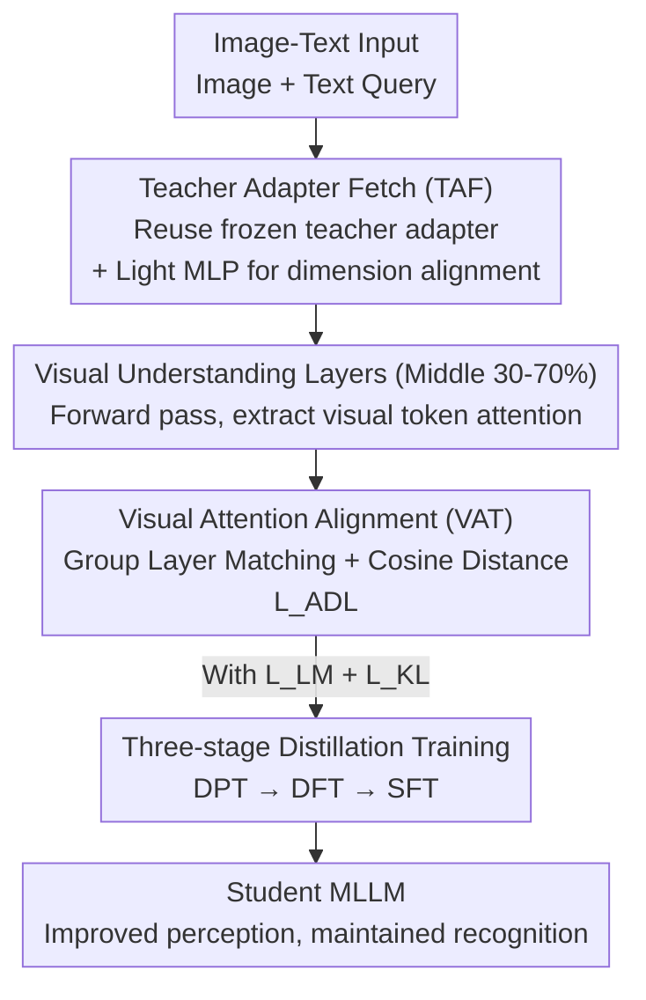

# CompoDistill: Attention Distillation for Compositional Reasoning in Multimodal LLMs

**Conference**: ICLR2026  
**OpenReview**: [https://openreview.net/forum?id=Wa9Bg9b50B](https://openreview.net/forum?id=Wa9Bg9b50B)  
**Code**: To be confirmed  
**Area**: Multimodal VLM / LLM Reasoning / Knowledge Distillation  
**Keywords**: Multimodal Large Language Models, Knowledge Distillation, Visual Attention Alignment, Compositional Reasoning, Visual Perception

## TL;DR
CompoDistill finds that existing knowledge distillation (KD) for Multimodal Large Language Models (MLLMs) only acquires "visual recognition" but fails in "visual perception," rooted in the misalignment of visual attention distributions between teacher and student. It introduces a VAT module to align student visual attention to the teacher and a TAF module to reuse the teacher's adapter. With a three-stage training strategy, it elevates a 2B student's Compositional Reasoning (CR) average from 61.5 to 66.7, approaching a 4B teacher without degrading VQA performance.

## Background & Motivation
**Background**: MLLMs have achieved power through scaling laws, but high deployment costs make Knowledge Distillation (KD) the mainstream route for creating smaller models—transferring visual and linguistic knowledge from a large teacher (e.g., LLaVA-4B) to a smaller student (e.g., 2B). Existing KD methods (LLaVA-KD, LLaVADI, LLaVA-MoD, etc.) significantly outperform scale-matched supervised fine-tuning (SFT) models on tasks like VQA.

**Limitations of Prior Work**: The authors identify an overlooked issue—visual capability is split into two levels: **visual recognition** (identifying objects) and **visual perception** (understanding relationships and accurately capturing attributes). When tested on CR datasets (SugarCrepe, SADE, BiVLC, Winoground), existing KD methods perform similarly to non-distilled SFT models. In essence, KD captures "recognition" but misses "perception."

**Key Challenge**: Why does KD work for VQA but fail for CR? Visualizing attention maps reveals that for the same text (e.g., "A woman is on the table"), the teacher focuses on relevant image regions while the student's attention drifts to irrelevant areas. This mismatch is termed **visual attention misalignment**. The authors argue that existing KD via logit/feature distillation does not help the student inherit the teacher's visual attention mechanism, leading to failed perception transfer.

**Goal**: Prove that "attention misalignment" is the direct cause of CR failure and design a distillation framework that explicitly aligns teacher-student visual attention to improve perception without losing recognition.

**Key Insight**: Leveraging hierarchical functional analysis of MLLMs—where early layers perform modality alignment, **middle layers (30%–70% of total layers) perform fine-grained semantic integration**, and late layers generate answers—the authors focus on these "visual understanding layers." They posit that teacher-student attention similarity in these layers is the key criterion for successful visual distillation.

**Core Idea**: Align the student's attention on visual tokens to the teacher's within visual understanding layers, while first aligning the teacher-student visual feature spaces to enable effective attention transfer.

## Method

### Overall Architecture
CompoDistill takes image-text pairs as input with the goal of training a student MLLM that masters compositional reasoning while maintaining VQA performance. The pipeline starts with a **diagnostic analysis**, followed by two modules integrated into a three-stage training process.

The diagnostic phase (Section 3) provides empirical evidence: ① Measuring cosine similarity of attention in visual understanding layers shows "teacher-student" similarity is higher on VQA than "teacher-SFT," but equivalent on CR—suggesting high similarity drives improvement. ② Grouping 5000 GQA samples by attention similarity reveals that higher similarity correlates with higher accuracy, confirming the "alignment $\rightarrow$ performance" causal chain. ③ Replacing student attention with a "teacher-student average" during inference immediately yields CR gains, proving that narrowing the attention gap is beneficial. However, total replacement of student attention with teacher attention causes degradation, as the teacher's attention is optimized for its own feature space. This observation leads to the design of the following modules.

The core method consists of the **VAT module**, which aligns student visual attention to the teacher in understanding layers (using group matching for depth differences), and the **TAF module**, which aligns visual feature spaces by reusing teacher adapters.

### Key Designs

**1. Visual Attention Alignment (VAT): Distilling "Where to Look"**

To address perception failure caused by attention drift, VAT distills the **attention matrix** directly. The attention $A = \mathrm{softmax}(QK^\top/\sqrt{d}) \in \mathbb{R}^{(N_v+N_t)\times(N_v+N_t)}$ encodes token importance. The authors extract sub-matrices related to visual tokens: for each layer $l$, they keep columns where the key is a visual token, yielding $\tilde{A}_l = A_l[:, :N_v]$. Distillation uses the **cosine distance**: $1 - \mathrm{sim}(\tilde{A}^t, \tilde{A}^s)$. Cosine distance outperforms MSE/KL because the student should learn the **relative importance ranking** of patches rather than absolute values.

**2. Group Layer Matching: Handling Depth Disparity**

Since teacher layers $m$ exceed student layers $k$, layer-wise correspondence is impossible. Traditional uniform sampling (e.g., student 5 layers matching teacher layers $\{1,3,5,7,9\}$) loses information. The authors use a **one-to-many sliding window group matching**: each student layer $l_s^j$ corresponds to a group of $n$ consecutive teacher layers $G_j$. Distances are calculated using the group-averaged attention:

$$\mathcal{L}_{ADL} = 1 - \frac{1}{k}\sum_{j=1}^{k}\mathrm{sim}\left(\bar{A}^t_j, \tilde{A}^s_{l_s^j}\right), \quad \bar{A}^t_j = \frac{1}{n}\sum_{l\in G_j}\tilde{A}^t_l.$$

To utilize all teacher layers, the window size is set as $n = m - k + 1$. This allows the student to absorb broader knowledge across multiple teacher layers while maintaining sequential order.

**3. Teacher Adapter Fetch (TAF): Feature Space Alignment**

This design stems from the observation that "replacing teacher attention directly causes degradation." The adapter projects visual features into the LLM space. The teacher's attention is tightly coupled to its own adapter output. Forcing this attention onto a student with an incompatible visual space creates conflict. TAF resolves this by letting the student **directly reuse the teacher’s frozen pretrained adapter** $P^t_{\psi^t}$, followed by a lightweight trainable MLP $P^s_{\psi^s}$ for dimension alignment:

$$x_v = P^s_{\psi^s}\left(P^t_{\psi^t}(z_p)\right) \in \mathbb{R}^{N_v \times d_s}.$$

This ensures the student "sees" through the same lens as the teacher, making VAT effective. The contribution lies in identifying the **visual attention misalignment** criterion and solving the modality space mismatch specific to MLLMs.

**4. Three-stage Distillation: Consolidating Knowledge**

The pipeline uses two base objectives: language modeling loss $\mathcal{L}_{LM}$ and logit-level KL divergence $\mathcal{L}_{KL}$. The stages are: ① **DPT (Distillation Pre-training)**: Aligns visual spaces using TAF (frozen teacher adapter) by only training $P^s_{\psi^s}$ with $\mathcal{L}_{LM} + \mathcal{L}_{KL}$; ② **DFT (Distillation Fine-tuning)**: Adds VAT to align attention, fine-tuning the student LLM and adapter with $\mathcal{L}_{LM} + \mathcal{L}_{KL} + \mathcal{L}_{ADL}$; ③ **SFT (Supervised Fine-tuning)**: Solidifies knowledge and enhances instruction following using only $\mathcal{L}_{LM}$.

## Key Experimental Results

Models use SigLIP visual encoders + Qwen1.5 (Student 1.8B, Teacher 4B). Metrics are accuracy on VQA (VQAv2/VizWiz/GQA/TextVQA/MME) and CR (SugarCrepe/SADE/BiVLC/Winoground).

### Main Results

| Model (2B Range) | Training Samples | VQA Avg | CR Avg |
|--------------|---------|---------|---------|
| LLaVA-2B (SFT) | 1.2M | 54.9 | 60.7 |
| LLaVA-KD-2B | 1.2M | 61.6 | 61.5 |
| LLaVA-MoD-2B | 5.0M | 58.9 | 62.6 |
| **CompoDistill-2B (Ours)** | **1.2M** | **61.9** | **66.7** |
| LLaVA-4B (Teacher) | 1.2M | 62.6 | 70.3 |

Key takeaway: Standard KD (LLaVA-KD) achieves 61.6 on VQA but only 61.5 on CR (near SFT). CompoDistill reaches an average CR of 66.7, nearing the 4B teacher's 70.3 while maintaining top-tier VQA performance. It is also highly data-efficient (1.2M samples).

### Ablation Study

Impact of VAT and TAF (VQA Avg here uses GQA/TextVQA/MME):

| Config | VAT | TAF | VQA Avg | CR Avg |
|------|-----|-----|---------|---------|
| (a) Baseline | ✗ | ✗ | 56.8 | 62.9 |
| (b) +VAT | ✓ | ✗ | 57.9 | 65.0 |
| (c) +TAF | ✗ | ✓ | 61.3 | 63.8 |
| (d) Full | ✓ | ✓ | 62.9 | 66.7 |

Fine-grained VAT ablation: Cosine similarity (CR 66.7) is superior to MSE (65.2) and KL (65.5). Targeted middle layers (30–70%, CR 66.7) outperform early (63.7) or all layers (66.6). Group mapping (66.7) is more effective than Simple (65.6) or Adaptive (65.7).

### Key Findings
- **VAT focuses on CR; TAF enables VAT**: Adding VAT increases CR significantly; adding TAF increases VQA. Combining them (d) is optimal, proving attention transfer fails without space alignment.
- **Middle layers are visual understanding layers**: Restricting distillation to the 30–70% range validates the analysis of visual-semantic integration.
- **Mitigating Relational Hallucinations**: CompoDistill-2B (F1 78.6/66.7 on R-Bench/Reefknot) significantly exceeds other KD models, approaching teacher performance (79.1/67.9).
- **Scalability**: Performance increases with data (1.2M $\rightarrow$ 2.4M, CR 69.9) and teacher size (7B teacher $\rightarrow$ 1.8B student, CR 67.8).

## Highlights & Insights
- **Diagnostic Approach**: The transition from "why KD fails" to a measurable criterion (attention similarity) makes the argument highly persuasive. Section 3's causality checks serve as a valuable diagnostic toolkit for MLLM distillation.
- **The "Teacher Adapter Fetch" Insight**: Pointing out that direct attention transfer fails due to space incompatibility is a significant observation. Reusing the teacher's "lens" (adapter) ensures the mechanism transfer has a foundation.
- **Robust Group Layer Matching**: The sliding window one-to-many approach ($n=m-k+1$) is more robust than adaptive pairing for cross-depth distillation.

## Limitations & Future Work
- The contribution is the identification of the criterion and TAF design; VAT and KL distillation themselves are established techniques.
- Experiments are concentrated on LLaVA/Qwen1.5; generalizability to much larger teachers (13B+) or newer backbones (Qwen2.5-VL) remains to be fully verified.
- TAF assumes the teacher and student share the same visual encoder. If encoders differ, the TAF premise needs modification.
- A gap (66.7 vs 70.3) still exists, indicating attention alignment alone does not fully close the perception gap.

## Related Work & Insights
- **vs existing MLLM KD**: Methods like LLaVA-KD focus on logit/feature/response distillation for recognition. Ours explicitly targets perception via attention and space alignment.
- **vs general Attention KD**: Standard models share the same representation space. Ours addresses the unique MLLM problem where modality spaces must be aligned before attention mechanisms can be transferred.
- **vs Adaptive Layer Matching**: Group matching provides a more stable transfer signal compared to finding single "best" layer pairs in depth-mismatched scenarios.

## Rating
- Novelty: ⭐⭐⭐⭐ 
- Experimental Thoroughness: ⭐⭐⭐⭐⭐ 
- Writing Quality: ⭐⭐⭐⭐⭐ 
- Value: ⭐⭐⭐⭐ 

<!-- RELATED:START -->

## Related Papers

- [\[ICLR 2026\] Test-Time Matching: Unlocking Compositional Reasoning in Multimodal Models](test-time_matching_unlocking_compositional_reasoning_in_multimodal_models.md)
- [\[CVPR 2026\] VOLD: Reasoning Transfer from LLMs to Vision-Language Models via On-Policy Distillation](../../CVPR2026/vlm_reasoning/vold_reasoning_transfer_from_llms_to_vision-language_models_via_on-policy_distil.md)
- [\[ICLR 2026\] NePTune: A Neuro-Pythonic Framework for Tunable Compositional Reasoning on Vision-Language](neptune_a_neuro-pythonic_framework_for_tunable_compositional_reasoning_on_vision.md)
- [\[CVPR 2026\] Self-Critical Distillation Network for Video-based Commonsense Captioning](../../CVPR2026/vlm_reasoning/self-critical_distillation_network_for_video-based_commonsense_captioning.md)
- [\[ICLR 2026\] IV-Bench: A Benchmark for Image-Grounded Video Perception and Reasoning in Multimodal LLMs](iv-bench_a_benchmark_for_image-grounded_video_perception_and_reasoning_in_multim.md)

<!-- RELATED:END -->
