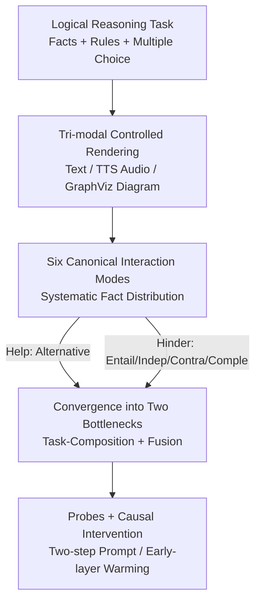

# Compose and Fuse: Revisiting the Foundational Bottlenecks in Multimodal Reasoning

**Conference**: ICLR 2026  
**OpenReview**: [https://openreview.net/forum?id=oIvIsK5AwB](https://openreview.net/forum?id=oIvIsK5AwB)  
**Code**: To be confirmed (stated as attached in the paper)  
**Area**: Multimodal VLM / LLM Reasoning  
**Keywords**: Multimodal reasoning, modality fusion, logical reasoning evaluation, interpretability, attention analysis

## TL;DR
This paper employs an evaluation framework based on propositional logic and "six interaction modes" that split facts across modalities. It systematically demonstrates that the true bottleneck of Multimodal Large Language Model (MLLM) reasoning lies in "integration" rather than "perception." Through attention probes and causal interventions, two root causes are identified: the **task-composition bottleneck** (identification and reasoning cannot be jointly performed in a single forward pass) and the **fusion bottleneck** (modality fusion in early layers introduces bias). The authors also provide two lightweight remedies: "two-step prompting" and "early-layer attention warming."

## Background & Motivation

**Background**: MLLMs unify signals such as vision, audio, and text into language models, claiming to form richer and more grounded world representations than unimodal models, thereby supporting complex reasoning. Intuitively, "more information is better," and adding a modality should theoretically help rather than hinder.

**Limitations of Prior Work**: In reality, conclusions regarding whether "adding modalities helps reasoning" are contradictory. Some works report performance gains with supplementary vision or audio, while others find that extra modalities introduce interference and confusion. These observations are mostly anecdotal or restricted to specific domains, lacking a unified framework to systematically answer "under what conditions and why" adding a modality yields positive or negative outcomes.

**Key Challenge**: The authors point out that the root of the problem is that **previous evaluations never controlled "which modality the decisive facts appear in" and "how these facts must be logically combined."** When an MLLM is treated as a black box and only external accuracy is observed, the true mechanisms of inter-modal interaction are averaged out. Furthermore, even when "performance drop upon adding modalities" is observed, rarely is there an investigation into how the model internally encodes modality identity, evaluates evidence relevance, or performs cross-modal integration. A deeper suspicion is that current MLLMs are mostly trained with alignment-based objectives (paired supervision, contrastive learning, instruction tuning), which prioritize "perceptual matching" over "cognitive composition," reinforcing shallow correlations rather than deep reasoning.

**Goal**: To decompose the vague question of "whether adding modalities helps reasoning" into two measurable dimensions—**where** facts are distributed across modalities and **how** these facts must be logically combined—and further attribute surface phenomena to interpretable internal mechanisms.

**Key Insight**: Using **logical reasoning as a lens**. Borrowing from the single-step deductive setting of RuleTaker (e.g., given "Bob is curious" + rule "Curious people are purple," infer "Bob is purple"), the authors express each fact using three controlled renderings: text sentences, neural TTS synthesized audio, and GraphViz-generated entity-attribute diagrams. The advantage of controlled rendering is that it minimizes low-level perceptual difficulty, thereby isolating the variables to "reasoning + modality integration" itself.

**Core Idea**: To perform diagnostic evaluation using a set of **six canonical interactions based on propositional logic that systematically vary the cross-modal distribution of facts**, combined with attention probes and causal interventions to substantiate the claim that "integration, not perception, is the primary obstacle to multimodal reasoning" from the phenomenal level down to the mechanistic level.

## Method

### Overall Architecture

This is an **analytical/diagnostic** paper. The "method" is not a new model architecture but a proposed evaluation and probing pipeline to measure "when it helps, when it hurts, and why." The pipeline consists of three stages: first, rendering facts into three modalities using a unified logical reasoning task template; second, running the full spectrum of "added modality value" by systematically varying fact placement and combination via six interaction modes; finally, converging surface failures into two bottlenecks and verifying root causes through internal probes and causal interventions to provide remedies.

### Key Designs

**1. Logic-driven controlled task base: Minimizing perception to isolate "integration"**

To determine whether reasoning failure is due to perception or integration, low-level perceptual confounding must be eliminated. The authors use a **single-step deduction** setting (to avoid multi-hop complexity), where each instance consists of facts + rules (rules are always text) + a four-option multiple-choice question. The same fact is rendered into three **intentionally simple** modalities: a short text sentence, speech synthesized by CosyVoice2, and an entity-attribute diagram drawn by GraphViz. The significance is that if the model still fails reasoning on these "easy-to-understand" controlled inputs, the failure cannot be blamed on perception. The metric is accuracy (chance baseline 25%), with 1000 instances per condition for statistical stability. Prompts contain fact blocks in randomized modality order, followed by textual rules and the question, with brief CoT prompts and noisy facts to test robustness.

**2. Six canonical interactions: Systematically switching "where" and "how"**

This is the core mechanism of the framework. Six interactions are defined based on propositional logic, each corresponding to a typical cross-modal relationship:

- **Equivalence ($\equiv$):** All modalities redundantly encode the same fact, testing if "redundant evidence" helps.
- **Alternative ($\lor$):** Each modality provides a different fact that can independently satisfy a disjunctive rule, testing the ability to use multiple independent reasoning paths.
- **Entailment ($\to$):** A multi-hop reasoning chain ($A \to B \to C \to \text{Answer}$) is split across modalities, where only the last hop directly supports the answer, testing cross-modal chain reasoning.
- **Independence ($\emptyset$):** Only one modality contains the decisive fact while others are noise, testing unimodal reasoning and robustness to irrelevant signals.
- **Contradictory ($\oplus$):** Modalities lead to different conclusions, testing the model's **default preference** under conflict.
- **Complementary ($\land$):** Each modality contributes one fact, and all **must be combined** to satisfy a conjunctive rule, testing true multi-source fusion.

By comparing against unimodal baselines (all facts in one modality), the "net value brought by extra modalities" ($\Delta$) can be directly measured. The first three ($\equiv/\lor/\to$) answer "if it helps," while the latter three ($\emptyset/\oplus/\land$) expose "how it hinders."

**3. Converging five observations into two bottlenecks: Structural conclusions**

The results are synthesized into two orthogonal bottlenecks. First, the **task-composition bottleneck**: models reliably identify facts in each modality (Observation 1) and reason near-ceiling on a single strong modality (Observation 5), but accuracy plunges when "identification" and "reasoning" must be jointly executed cross-modally—indicating the weakness is the "composition" of these abilities. Second, the **fusion bottleneck**: Independence exposes **performance bias** (weak modalities dilute strong ones), Contradictory exposes **preference bias** (biases toward specific modalities regardless of strength), and Complementary exposes **fusion bias** (combining three understandable facts performs worse than any single modality). Together, these point to a lack of internal mechanisms for reliable, unbiased selection and weighting of heterogeneous evidence.

**4. Internal Probes + Causal Intervention: Verifying root causes**

To verify mechanisms, the authors use interpretability methods. For the task-composition bottleneck: a **linear probe** trained on decoder attention distributions to classify whether a fact is "useful for reasoning" yielded only moderate accuracy, suggesting attention patterns do not encode "utility." Conversely, **two-step prompting** (explicitly extracting all facts before reasoning) significantly recovered performance, proving the bottleneck is "composition." For the fusion bottleneck: a logistic regression probe for "modality identity" found that modality types are **fully recoverable**, with the strongest signals in the first four decoder layers—indicating fusion occurs early. Following this, a **causal intervention** was performed by increasing the softmax temperature of the first four layers (scanning $0.4 \to 1.8$). Making early-layer attention "softer" and more balanced significantly improved reasoning accuracy, whereas adjusting middle or late layers had almost no effect. This contrast provides strong evidence that early fusion is a causal root.

## Key Experimental Results

### Main Results: Does Multimodality Help? ($\equiv / \lor / \to$)

Four open-source omni-modal models (Baichuan-Omni-1.5d 7B, Qwen2.5-Omni 7B, MiniCPM-o-2.6 8B, Phi-4 Multimodal 5.6B) accuracy(%) and $\Delta$ relative to unimodal baselines (V/A/T denote decisive facts in Vision/Audio/Text):

| Interaction Type | Avg Acc | $\Delta_V$ | $\Delta_A$ | $\Delta_T$ | Conclusion |
|------------------|---------|-----------|-----------|-----------|------------|
| Equivalence ($\equiv$) | 90.7 | +9.7 | +10.9 | -5.7 | Redundancy helps only if the original modality is weak; it hurts when text is already strong. |
| Alternative ($\lor$) | 98.7 | +12.7 | +14.8 | +1.7 | Consistent improvement; multiple independent semantic paths are utilized. |
| Entailment ($\to$) | ~79.8 | -7.8 | -7.1 | -12.8 | Splitting reasoning chains across modalities significantly drops accuracy. |

**Observation 1**: Multimodal input helps only when it provides **extra, semantically independent** reasoning paths; redundancy is of little benefit (especially if text suffices), and splitting multi-step chains often degrades performance. This suggests the bottleneck is not "fact recognition." These patterns were also replicated on the real-world benchmark IsoBench (T+V vs. strong text baseline).

### Failure Mode Breakdown: How Multimodality Hinders ($\emptyset / \oplus / \land$)

| Interaction Type | Best/Worst Unimodal | Multimodal Acc | Exposed Bias |
|------------------|---------------------|----------------|--------------|
| Independence ($\emptyset$) | T 94.5 / V 65.3 | 70.3 | **Performance Bias**: Falls between best and worst unimodal; weak modality introduces noise. |
| Contradictory ($\oplus$) | — | Preference ratios below | **Preference Bias**: Bias toward specific modalities, often unrelated to actual strength. |
| Complementary ($\land$) | T 94.6 / V 73.2 | 52.0 | **Fusion Bias**: Lower than **any** unimodal; true composition failure. |

Preference ratios in Contradictory settings show distinct, "counter-intuitive" biases: Baichuan favors vision (49.0%), Qwen favors audio (44.6%), while MiniCPM and Phi-4 favor text (49.0% / 46.1%). More critically, in Complementary settings, the average accuracy (52.0%) is **lower than the worst single modality (Vision 73.2%)**, suggesting a new failure mode where models cannot synthesize multiple necessary signals into a coherent chain.

### Key Findings

- **Attention does not encode "utility"**: Linear probes only distinguish relevant from distracting facts with moderate precision, evidencing the task-composition bottleneck; two-step prompting significantly recovers accuracy.
- **Modality identity is fully recoverable in early layers**: Probes for modality type achieve near-perfect classification in the first four decoder layers—fusion is an early-stage process.
- **Only early-layer warming is effective**: Increasing attention temperature in the first four layers improves reasoning significantly, while doing so in later layers is ineffective.
- **Text unimodality is near ceiling**: In almost all settings, the best performance comes from the pure text baseline, confirming that the models "can reason and can recognize, but cannot integrate."

## Highlights & Insights
- **Turning "Does adding modality help" into a measurable science**: The six propositional logic interactions control "fact location $\times$ logical combination," allowing $\Delta$ to measure net value directly. This is a highly clever design transferable to any "multi-source integration" evaluation (e.g., multi-doc RAG).
- **Full loop from phenomenon to remedy**: The paper doesn't just report performance drops; it uses probes to locate causes and causal interventions to verify them, finally offering zero-training-cost remedies (two-step prompting, early-layer warming).
- **"Early-layer attention warming" is a cheap repo-ready trick**: Adjusting softmax temperature in only the first four layers improves fusion at near-zero cost.
- **The "Aha!" moment**: Complementary performance being **lower than the worst single modality** proves that fusion failure is not just "being dragged down by weak modalities" but a fundamental lack of synthesis mechanism.

## Limitations & Future Work
- **Reliance on controlled synthesis**: Core conclusions are based on intentionally simple synthetic rendering; real-world perception is more difficult, and the relative weight of perception vs. integration may vary.
- **Single-step deduction focus**: Multi-hop complexity was avoided to isolate variables, but real-world reasoning often involves multiple hops interleaved with perception.
- **Remedies are diagnostic**: Two-step prompting and warming are "probes of existence" rather than production-ready solutions; the authors leave the real solutions (compositional perception training, evidence selection supervision, early-fusion architectural control) for future work.
- **Limited model scale**: Tests were conducted on four 5–8B models; it is unknown if larger-scale or closed-source models share these bottlenecks.

## Related Work & Insights
- **vs. General Multimodal Benchmarks (MMBench, MME, MMMU)**: These measure overall capacity but **do not control information distribution**, failing to explain "when" and "why" modalities help or hinder.
- **vs. Recognition-Reasoning Gap (VERIFY, STARE, EMMA)**: These point out that models can recognize but not reason; this paper further splits the failure into "task-composition" and "modality fusion" bottlenecks.
- **vs. Multimodal Bias Analysis**: Previous works are often qualitative; this paper provides a systematic framework to isolate logical relationships and invalidate hypotheses through causal intervention.

## Rating
- Novelty: ⭐⭐⭐⭐⭐ Six propositional interactions + closed-loop diagnosis from phenomenon to mechanism.
- Experimental Thoroughness: ⭐⭐⭐⭐ Four models $\times$ six interactions $\times$ 1000 instances + probing/causal intervention + IsoBench, though model scale is small.
- Writing Quality: ⭐⭐⭐⭐⭐ Clear logical progression, well-defined observations, and falsifiable conclusions.
- Value: ⭐⭐⭐⭐⭐ The conclusion that "integration rather than perception is the main obstacle" is a hard conclusion for the direction of multimodal reasoning.

## Related Papers

- [\[CVPR 2026\] Downscaling Intelligence: Exploring Perception and Reasoning Bottlenecks in Small VLMs](../../CVPR2026/vlm_reasoning/downscaling_intelligence_exploring_perception_and_reasoning_bottlenecks_in_small.md)
- [\[ICML 2026\] Reason, Then Re-reason: Cross-view Revisiting Improves Spatial Reasoning](../../ICML2026/vlm_reasoning/reason_then_re-reason_cross-view_revisiting_improves_spatial_reasoning.md)
- [\[ICML 2026\] Breaking Dual Bottlenecks: Evolving Unified Multimodal Models into Self-Adaptive Interleaved Visual Reasoners](../../ICML2026/vlm_reasoning/breaking_dual_bottlenecks_evolving_unified_multimodal_models_into_self-adaptive_.md)
- [\[CVPR 2026\] Dr. Seg: Revisiting GRPO Training for Visual Large Language Models through Perception-Oriented Design](../../CVPR2026/vlm_reasoning/dr_seg_revisiting_grpo_training_for_visual_large_language_models_through_percept.md)
- [\[ICLR 2026\] Perception-Aware Policy Optimization for Multimodal Reasoning](perception-aware_policy_optimization_for_multimodal_reasoning.md)

<!-- RELATED:END -->

<!-- RELATED:START -->

## Related Papers

- [\[CVPR 2026\] Downscaling Intelligence: Exploring Perception and Reasoning Bottlenecks in Small VLMs](../../CVPR2026/vlm_reasoning/downscaling_intelligence_exploring_perception_and_reasoning_bottlenecks_in_small.md)
- [\[ICML 2026\] Breaking Dual Bottlenecks: Evolving Unified Multimodal Models into Self-Adaptive Interleaved Visual Reasoners](../../ICML2026/vlm_reasoning/breaking_dual_bottlenecks_evolving_unified_multimodal_models_into_self-adaptive_.md)
- [\[ICML 2026\] Reason, Then Re-reason: Cross-view Revisiting Improves Spatial Reasoning](../../ICML2026/vlm_reasoning/reason_then_re-reason_cross-view_revisiting_improves_spatial_reasoning.md)
- [\[ICLR 2026\] Reasoning-Driven Multimodal LLM for Domain Generalization](reasoning-driven_multimodal_llm_for_domain_generalization.md)
- [\[ICLR 2026\] Perception-Aware Policy Optimization for Multimodal Reasoning](perception-aware_policy_optimization_for_multimodal_reasoning.md)

<!-- RELATED:END -->
