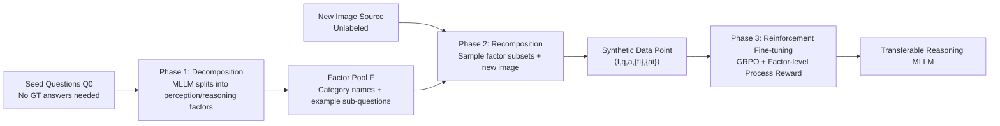

# Composition-Grounded Data Synthesis for Visual Reasoning

**Conference**: ICLR 2026  
**OpenReview**: [https://openreview.net/forum?id=FnF3UjiN11](https://openreview.net/forum?id=FnF3UjiN11)  
**Code**: [https://cogsynthesis.github.io](https://cogsynthesis.github.io)  
**Area**: Multimodal Visual Reasoning / Data Synthesis  
**Keywords**: MLLM, Visual Reasoning, Data Synthesis, Compositionality, Chart QA, GRPO, Process Reward  

## TL;DR
COGS decomposes a small set of seed questions into atomic "perception + reasoning" factors, then recombines these factors with new images to generate large-scale synthetic QA pairs containing sub-questions/intermediate answers. Using factor-level process rewards for reinforcement learning, it enables MLLMs to acquire transferable complex reasoning capabilities in "image-rich but annotation-scarce" artificial image domains like charts and webpages.

## Background & Motivation
**Background**: Pre-trained Multimodal Large Language Models (MLLMs) perform strongly on general tasks but remain weak in complex reasoning within "artificial image domains" such as charts, tables, infographics, rendered documents, and webpages. These images are ubiquitous online, but associated reasoning-type QA annotations are extremely scarce.

**Limitations of Prior Work**: Relying on manual annotation for large-scale reasoning data is prohibitively expensive. Existing data synthesis methods either operate purely in text space (disconnected from visual features) or rely on manual templates/strong LLM heuristics, leading to limited diversity and overfitting. While chart-expert models are specialized, they are limited by narrow architectures and training distributions, often failing on new distributions.

**Key Challenge**: While the surface forms of complex reasoning problems are infinitely varied (hard to exhaustively annotate), their underlying structure is **compositional**—a complex problem is often a finite combination of atomic steps (reading values, comparing, arithmetic, counting). How to leverage this compositionality to "bootstrap" large-scale, diverse, and visually grounded reasoning data from minimal seed questions is the core challenge.

**Goal**: To bootstrap large-scale synthetic QA datasets using only a small set of seed questions from the target domain (**without requiring ground-truth answers for the seeds**), thereby filling the missing complex reasoning gap in MLLMs and ensuring capabilities are transferable across datasets rather than overfitted.

**Core Idea (Composition-Grounded Data Synthesis)**: Decompose each seed question into atomic "factors" (perception + reasoning steps), then systematically recombine these factors with new images to generate massive amounts of composite questions. Each generated question naturally includes sub-questions and intermediate answers, supporting factor-level process reward reinforcement learning.

## Method

### Overall Architecture
COGS (COmposition-Grounded data Synthesis) is a three-stage data-efficient framework: **Decomposition → Recomposition → Reinforcement Fine-tuning**. Given a set of seed questions from the target domain, MLLMs first decompose each question into factors with category labels and sub-questions, forming a factor pool $\mathcal{F}$. Then, randomly sampled factor subsets are paired with any new images and fed into an MLLM to generate composite QA pairs with sub-questions/intermediate answers. Finally, the pre-trained MLLM is fine-tuned using GRPO, utilizing factor annotations to construct fine-grained process rewards.

### Key Designs

**1. Seed Question Decomposition: Reducing complex questions to grounded factor structures.** The system provides the MLLM with decomposition task descriptions, several in-context examples of (question → factor list) pairs, the question to be decomposed, and its corresponding image, making the process **visually grounded**. The MLLM outputs a category label (e.g., Calculation, Counting, Comparison) and a sub-question describing its role for each factor. For instance, "the absolute difference between energy growth % and public service growth % in 2019–2023" is reduced to $q \mapsto \{\text{Perception}_1, \text{Perception}_2, \text{Calculation}_1\}$. Aggregating all factors from $Q_0$ yields the factor space $\mathcal{F}$, where each factor is represented by a category name and a set of example sub-questions—serving as both "building blocks" for recomposition and labels for process rewards. Crucially, this step **does not require ground-truth answers** for seed questions, making data collection scalable.

**2. Factor Recomposition for New Questions: Building new problems with old bricks on new images.** Inputs include a recomposition description with an example, a new image $I$ from any source, and a sampled list of factors from $\mathcal{F}$. The MLLM first generates grounded sub-questions for the new image based on the factor categories, then combines them into a coherent overall question; it also generates the answers—**first for each sub-question, then for the final question**. Thus, each data point is formalized as $\langle I, q, a, \{f_i\}, \{a_i\}\rangle$, where $q \mapsto \{f_1, \dots, f_k\}$ and $a_i = \text{Answer}(f_i \mid I)$. For domains like charts that often have underlying metadata (e.g., data tables), this metadata is utilized to improve answer accuracy. Recomposition allows for **expanding the training distribution along the compositional dimension** using only unlabeled images.

**3. GRPO Fine-tuning with Factor-level Process Rewards: Using max instead of sum to resist noisy sub-rewards.** GRPO is employed for fine-tuning. Because each composite question includes sub-questions and sub-answers, process rewards can be defined beyond simple "final answer correctness." For a data point $\langle I,q,a,\{f_i\},\{a_i\}\rangle$, an LLM reward model checks the model's Chain-of-Thought (CoT) for correct intermediate answers, yielding binary scores $c_i\in\{0,1\}$, and defines sub-question hit rate $r_{\text{sub}}(y)=\frac{1}{N}\sum_{i=1}^{N}c_i$. The paper compares three rewards: $\text{StandardRM}: r=r_{\text{final}}$; $\text{ProcessRM-sum}: r=r_{\text{final}}+\lambda\cdot r_{\text{sub}}$; $\text{ProcessRM-max}: r=\max(r_{\text{final}}, \lambda\cdot r_{\text{sub}})$. Since an overall question may have multiple valid decompositions and sub-rewards can be noisy, the sum reward might misalign policies. Proposition 3.1 proves that **max reward is rank-preserving for final answer accuracy**—meaning when $r_{\text{final}}\in\{0,1\}$ and $\lambda\in(0,1)$, $\mathbb{E}[r_{\max}\mid\pi]=(1-\lambda c)V_f(\pi)+\lambda c$ is a strictly monotonic affine transformation of $V_f$, whereas the sum reward may reverse rank due to $\lambda(\mathbb{E}_{\pi_1}[\varepsilon]-\mathbb{E}_{\pi_2}[\varepsilon])$ terms.

**4. Factor-level Data Mixing: Merging at the atomic level for better transferability.** When training across datasets, two mixing strategies are compared: Data-level mixing $\text{Recompose}(\text{Decompose}(A)) + \text{Recompose}(\text{Decompose}(B))$ simply concatenates synthetic sets; Factor-level mixing $\text{Recompose}(\text{Decompose}(A)\cup\text{Decompose}(B))$ merges factors from $A$ and $B$ into a single pool before recomposition. The latter allows different domains to share "atomic representations," providing a common basis that captures shared structures and mitigates the issue of models overfitting to the dominant distribution in multi-dataset training.

## Key Experimental Results

### Main Results
On ChartQAPro (using 33% of the test set as seeds/validation and the remaining 67% as a completely unseen test set), all methods were evaluated using Qwen2.5-VL-7B as a base and GRPO for fairness:

| Model | Factoid | MCQ | Convers. | FactChk. | Hypoth. | Overall |
|------|---------|-----|----------|----------|---------|---------|
| GPT-5-nano (Proprietary) | 45.95 | 63.64 | 49.40 | 63.58 | 49.82 | 50.74 |
| GPT-4o-mini (Proprietary) | 43.63 | 66.43 | 45.48 | 59.88 | 45.20 | 48.32 |
| Qwen2.5-VL-7B (Base) | 42.07 | 62.59 | 44.88 | 60.78 | 50.72 | 47.36 |
| ChartMoE (Expert) | 19.03 | 35.66 | 32.97 | 45.68 | 27.08 | 27.28 |
| Decompositional CoT (Prompt) | 42.08 | 65.03 | 42.57 | 56.53 | 45.55 | 46.36 |
| Chart-R1 (Synthesis) | 42.17 | 46.85 | 50.53 | 61.11 | 55.55 | 47.32 |
| In-Context Q Example (Synthesis) | 46.33 | 62.94 | 46.91 | 61.11 | 61.72 | 50.58 |
| **COGS (Ours)** | **46.88** | 65.73 | **51.16** | 61.85 | 58.25 | **52.02** |

COGS achieves a 52.02% overall accuracy, surpassing all open-source MLLMs, chart experts, prompting strategies, and other synthesis methods, even outperforming proprietary small models like GPT-5-nano and GPT-4o-mini. Chart-expert models performed poorly due to domain gaps and narrow architectures.

Cross-dataset training (ChartQAPro as A, MMC as B):

| Model | ChartQAPro | MMC |
|------|-----------|-----|
| Qwen2.5-VL | 47.36 | 85.65 |
| + ChartQAPro | 52.02 | 85.69 |
| + MMC | 49.93 | 88.10 |
| + Data-level Mixing | 50.72 | 86.99 |
| + **Factor-level Mixing** | **52.33** | 87.55 |

Factor-level mixing outperformed data-level mixing on both domains and approached the respective "expert upper bounds," indicating positive transfer rather than overfitting. On the webpage domain VisualWebBench, COGS reached 88.04%, the highest among non-proprietary models (Base 85.65, Decompositional CoT 86.12, MultiUI-WQA 86.60).

### Ablation Study

| Reward Model / Training Setting | Overall Acc. |
|----------------------|--------------|
| StandardRM | 50.96 |
| ProcessRM-sum | 50.35 |
| **ProcessRM-max** | **52.02** |
| SFT + ProcessRM-max | 46.62 |

ProcessRM-sum slightly decreased performance, while ProcessRM-max provided a stable boost, consistent with Proposition 3.1. Adding an extra SFT round decreased performance to 46.62, suggesting direct GRPO is more robust.

### Key Findings
- **Gains scale with reasoning chain length**: Grouped by factor count, COGS shows more significant improvements as the chain length increases (consistent across factoid/MCQ/fact-check), verifying that it learns compositionality rather than memorization. The exception is Hypothetical, where difficulty is often dominated by the initial counterfactual factor.
- **Hard factors benefit most**: Significant gains were observed in Extrapolation (+7.62%), Compare (+4.47%), Count (+4.25%), and Calculation (+3.04%). Qualitative examples show the base model often takes "shortcuts" (e.g., misjudging 56 > 60), whereas COGS correctly follows every step.
- **Process Reward vs. Inference-time Decomposition**: Error accumulation in inference-time decomposition limits its gains, whereas COGS rewards correct intermediate steps during training to reduce error compounding without being restricted to a single prompt's reasoning path.

## Highlights & Insights
- **Turning "Compositionality" into a Data Engine**: Previously, compositionality was used mainly for diagnostics; COGS treats it as a generation mechanism—decompose then recompose, using minimal seeds to leverage diverse data.
- **Theoretical + Empirical Closure for Process Rewards**: Instead of simple weighting, Proposition 3.1 proves the rank-preserving property of max reward under noise, validated by ablations showing $r_{\max}$ beats $r_{\text{sum}}$.
- **New Paradigm for Data Mixing**: Merging heterogeneous datasets at the atomic factor level provides a shared representation basis, offering a solution to the long-standing "data mixing" problem in foundation model training.
- **High Scalability**: Seeds require no ground-truth answers, and images can be collected without labels; the framework generalizes from charts to webpage GUIs.

## Limitations & Future Work
- **Heavy Reliance on Teacher MLLM**: The quality of synthetic data depends on the teacher model's ability to decompose, recompose, and generate answers, which can introduce systematic bias or noise.
- **Domain Focus**: Validated primarily on artificial image domains (charts + webpages); effectiveness on natural images or open-domain reasoning is yet to be demonstrated.
- **Moderate Absolute Gains**: In the chart domain, the gain is ~4.7 points (47.36→52.02), with gains concentrated on long-chain/hard factor problems.
- **Unstructured Factor Ontology**: Factor categories are generated freely by the MLLM, lacking a unified ontology, which may impact consistency across domain merging.
- Future work: Incorporating stronger answer verification (e.g., symbolic/program execution), structuring factor ontologies, and extending to broader multimodal reasoning domains.

## Related Work & Insights
- **Text-side Synthesis** (Self-Instruct, WizardLM): Mostly searches reasoning trajectories in text; COGS differs by grounding factors in visual features.
- **Chart Expert Models** (ChartLLaMA, ChartMoE, Chart-R1): Often rely on manual templates or structured intermediate representations; COGS automatically extracts factors to customize data.
- **GUI/Webpage Understanding** (VisualWebBench, MultiUI): COGS utilizes these sources to verify cross-domain generalization.
- **GRPO and Process Rewards** (Shao et al. 2024): COGS couples the compositional nature of synthetic data with rank-preserving factor-level process rewards.
- **Insight**: When tasks have decomposable structures, "Decompose-Recompose" is a more principled synthesis paradigm than templates; reward design must prioritize rank preservation under noise rather than simple linear addition of signals.

## Rating
- **Novelty**: ⭐⭐⭐⭐ — The three-stage pipeline (Decompose → Recompose → Max Reward) effectively turns compositionality into a data engine with solid theoretical grounding.
- **Experimental Thoroughness**: ⭐⭐⭐⭐ — Covers charts and webpages, compares against diverse baselines, and includes fine-grained factor analysis; however, absolute gains are somewhat moderate.
- **Writing Quality**: ⭐⭐⭐⭐ — Clear description of the three phases; Proposition 3.1 provides strong motivation for the reward design; qualitative examples are persuasive.
- **Value**: ⭐⭐⭐⭐ — Addresses the scarcity of reasoning data in artificial image domains; factor-level mixing is an insightful direction for data mixing in general.

<!-- RELATED:START -->

## Related Papers

- [\[ICLR 2026\] ReWatch-R1: Boosting Complex Video Reasoning in Large Vision-Language Models through Agentic Data Synthesis](rewatch-r1_boosting_complex_video_reasoning_in_large_vision-language_models_thro.md)
- [\[ICLR 2026\] VGR: Visual Grounded Reasoning](vgr_visual_grounded_reasoning.md)
- [\[CVPR 2026\] CRIT: Graph-Based Automatic Data Synthesis to Enhance Cross-Modal Multi-Hop Reasoning](../../CVPR2026/vlm_reasoning/crit_graph-based_automatic_data_synthesis_to_enhance_cross-modal_multi-hop_reaso.md)
- [\[ICLR 2026\] Latent Visual Reasoning](latent_visual_reasoning.md)
- [\[ICLR 2026\] Mixture-of-Visual-Thoughts: Exploring Context-Adaptive Reasoning Mode Selection for General Visual Reasoning](mixture-of-visual-thoughts_exploring_context-adaptive_reasoning_mode_selection_f.md)

<!-- RELATED:END -->
