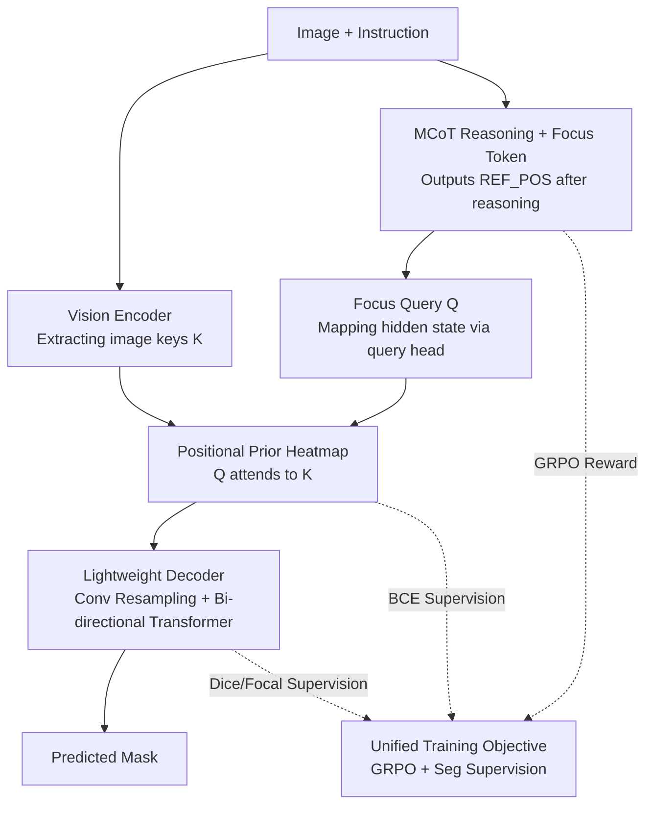

# CoPRS: Learning Positional Prior from Chain-of-Thought for Reasoning Segmentation

**Conference**: ICLR2026  
**OpenReview**: [https://openreview.net/forum?id=Fcsop01h40](https://openreview.net/forum?id=Fcsop01h40)  
**Code**: https://github.com/ZhenyuLU-Heliodore/CoPRS  
**Area**: Multimodal VLM / Reasoning Segmentation  
**Keywords**: Reasoning Segmentation, Chain-of-Thought, Positional Prior, Heatmap, GRPO

## TL;DR
CoPRS enables multimodal large models to perform chain-of-thought reasoning before outputting a "focus token," which is converted into a dense, differentiable heatmap serving as a positional prior. A lightweight decoder سپس refines this prior into a segmentation mask, achieving SOTA performance on RefCOCO series and ReasonSeg with interpretably aligned reasoning and segmentation.

## Background & Motivation
**Background**: Reasoning segmentation requires models to understand free-form instructions with compositional constraints (e.g., "segment the trailing quadcopter partially obscured by trees") and output the corresponding object mask. This represents the evolution of segmentation from semantic → instance → open-vocabulary segmentation, where the core challenge lies in coupling linguistic reasoning with spatial localization. Existing methods are divided into two main camps.

**Limitations of Prior Work**: The first category involves **implicit reasoning** (e.g., LISA, PerceptionGPT), which directly connects the hidden features of the language model to a mask decoder. The issue is that the intermediate decision-making is a black box—one cannot see "why" the model selected a specific region, making it difficult to diagnose or intervene. The second category involves **textual reasoning** (e.g., Seg-Zero, Text4Seg), which has the MLLM output discrete textual coordinates (bbox / point / patch index) via chain-of-thought (CoT) before feeding them to SAM. While "explicit," these sparse discrete coordinates cannot carry fine-grained visual semantics and are fragile to engineering issues like formatting errors or out-of-bounds coordinates.

**Key Challenge**: Both extremes have drawbacks—implicit methods are expressive but uninterpretable, while textual methods are interpretable but lose expressive power. The fundamental problem is the **lack of an intermediate interface that is both interpretable and densely differentiable** to connect reasoning and segmentation.

**Goal**: To build an end-to-end, single-stage model that performs reasoning before producing a positional representation that is directly supervisable and interpretable, serving as a positional prior to enhance mask decoding.

**Key Insight**: The authors observe that "position" does not necessarily need to be expressed via hidden features (uninterpretable) or textual coordinates (too sparse). Instead, a **dense heatmap** can be used—it is naturally differentiable (allowing end-to-end backpropagation), interpretable via visualization (red areas indicate focus), and carries significantly more information than a few coordinate points.

**Core Idea**: Use a learnable "focus token" to aggregate the context of the image and reasoning text into a query. This query attends to image features to generate a heatmap positional prior, which is then refined into a mask by a lightweight decoder. This "differentiable heatmap" interface replaces both "black-box hidden features" and "sparse textual coordinates."

## Method

### Overall Architecture
CoPRS is built upon a Multimodal LLM (MLLM) + vision backbone + query head + mask decoder. Given image-text input $(x_{img}, x_{txt})$, the policy model $\pi_\theta$ generates a token sequence via next-token prediction, containing both a `<think>...</think>` chain-of-thought (CoT) and a special focus token `<REF_POS>`. The model extracts the hidden state $e_{conc}$ corresponding to this focus token and maps it to a "focus query" $Q$ via a query head $F_{head}$. Simultaneously, the vision encoder $F_{enc}$ encodes the image into "image keys" $K$. The query $Q$ uses multi-head attention to attend to these keys, producing a heatmap $H_{prior}$ as the positional prior. Finally, a lightweight mask decoder $F_{dec}$ decodes this prior into a predicted mask $\hat{M}$. The entire system is trained end-to-end: the language path uses GRPO reinforcement learning to enhance reasoning, while the vision path uses segmentation supervision to refine mask quality. Both paths are connected via the differentiable heatmap and share a single backward pass.

### Key Designs

**1. MCoT-driven focus token: Explicitly connecting reasoning to position**

To address the issue where implicit methods lack reasoning transparency and textual methods use sparse coordinates, CoPRS requires the MLLM (using Qwen2.5-VL) to first reason through the instructions within a `<think>...</think>` block before outputting a focus token `<REF_POS>`. This step draws inspiration from DeepSeek-R1, using prompts to induce the model to perform multimodal CoT for compositional instructions. Crucially, the model does not pass hidden features directly to the decoder; it completes the reasoning process first, then uses a specialized token to "condense" the reasoning's judgment regarding the target location. Formally, the policy $\pi_\theta$ generates a sequence $y_{1:T}$, and $F_{conc}$ identifies the focus token position to extract its hidden state:

$$y_t \sim \pi_\theta(\cdot \mid y_{0:t-1}, x_{img}, x_{txt}), \quad e_{conc} = F_{conc}(y_{1:T})$$

The benefit is that the reasoning process remains transparent due to CoT, and the embedding of the focus token carries "post-reasoning" semantics rather than shallow encodings of the original prompt.

**2. From keys and queries to positional prior: Replacing text coordinates with differentiable heatmaps**

This is the core interface design of CoPRS. The vision backbone (using SAM's ViT-H encoder) encodes the image into keys $K \in \mathbb{R}^{H\times W \times d_k}$. The query head (MLP) projects the focus token embedding into a query $Q \in \mathbb{R}^{d_q}$. Scaled dot-product multi-head attention is computed between $Q$ and $K$, and the multi-head results are aggregated into a single heatmap using a stack of two 2D convolutional layers $F_{fuse}$:

$$H_{prior} = F_{fuse}\left(\left[(QW_i^Q)(KW_i^K)^\top / \sqrt{d_c}\right]_{i=1}^{n_{head}}\right)$$

This dense, differentiable heatmap serves as the positional prior—it is more interpretable than black-box features (red areas show where the model focuses), carries more fine-grained semantics than discrete text coordinates, and is fully differentiable for end-to-end segmentation supervision. Essentially, it transforms "position" from a string of fragile numerical coordinates into a dense map that supports backpropagation and visualization.

**3. Lightweight two-stage decoder: Refining priors into precise masks**

The heatmap provides a "rough focus" rather than precise boundaries. The decoder consists of two sub-modules: first, a stack of three 2D convolutional blocks resamples the fused prior to the decoding resolution; then, a bi-directional Transformer (Two-Way Transformer), modeled after the SAM decoder, performs cross-attention between image features and the positional prior. With only 4.7M parameters, this decoder allows the prior to guide dense segmentation:

$$\hat{M} = F_{dec}(K, H_{prior})$$

Correlation analysis shows that most samples during inference fall above the $y=x$ line, implying the prior itself focuses well, while the decoder further refines it into a more accurate mask.

**4. Unified Training Objective: GRPO for Reasoning + Seg Supervision for Masks**

Reasoning and segmentation are jointly optimized rather than trained in stages. For each $(x_{img}, x_{txt})$, the policy $\pi_\theta$ generates a group $G$ of responses using GRPO (Group Relative Policy Optimization), and $L_{GRPO}$ is calculated from the relative advantage within the group. Simultaneously, the positional prior $H_{prior}$ and predicted mask $\hat{M}$ are supervised by the ground truth mask $M_{gt}$ to produce $L_{SEG}$. The total objective is:

$$L = L_{GRPO}\left(\{y_{1:T_i}^{(i)}\}_{i=1}^G\right) + \lambda_{SEG} L_{SEG}\left(H_{prior}, \hat{M}, M_{gt}\right)$$

The GRPO component follows the clipping and KL regularization of PPO, with rewards derived from a "mask quality score" (weighted soft IoU 0.5, soft Dice 0.2, hard IoU 0.3) and a "CoT format score" (regex matching) at a 0.7/0.3 ratio. The segmentation loss combines three complementary terms: BCE for the heatmap $H_{prior}$, Dice for direct mask quality, and Focal for mask logits to emphasize difficult pixels:

$$L_{SEG} = L_{BCE}(H_{prior}, M_{gt}) + \lambda_d L_{DICE}(\hat{M}, M_{gt}) + \lambda_f L_{FOCAL}(\hat{M}, M_{gt})$$

### Loss & Training
During training, each image-text pair is replicated $G$ times for $\pi_\theta$ to generate $G$ responses. The reward function assigns a scalar score to each, which is converted into an advantage for the GRPO loss. In the same batch, images are resized and padded to $1024\times1024$, processed by the vision backbone, and decoded into $\hat{M}$ for the segmentation loss. Hyperparameters: $\lambda_{SEG}=0.3$, $\lambda_d=3.0$, $\lambda_f=10$; GRPO group size $G=8$; MLLM base learning rate 2e-6, focus query head at 25×, and decoder modules at 10×/5×. OneCycleLR scheduler is used. Inference performs deterministic next-token generation for a single response. Training is conducted on 8 A100 (80GB) GPUs using the VERL codebase.

## Key Experimental Results

### Main Results
On the RefCOCO series (cIoU), CoPRS-7B achieves the best performance across most splits, only trailing the larger RAS-13B on 2 out of 8 splits in RefCOCO:

| Dataset/split | Metric | CoPRS-7B | CoPRS-3B | Prev. SOTA |
|--------|------|------|------|----------|
| RefCOCO testA | cIoU | **85.3** | 83.9 | RAS-13B 83.5 |
| RefCOCO+ val | cIoU | **75.9** | 71.8 | RAS-13B 75.1 |
| RefCOCO+ testA | cIoU | **80.3** | 78.9 | RAS-13B 80.0 |
| RefCOCOg val | cIoU | **76.2** | 74.8 | RAS-13B 76.0 |

On ReasonSeg zero-shot (testing generalization on complex reasoning scenarios):

| Dataset/split | Metric | CoPRS-7B | CoPRS-3B | Seg-Zero-7B |
|--------|------|------|------|----------|
| ReasonSeg val | gIoU | **65.2** | 61.3 | 62.6 |
| ReasonSeg val | cIoU | **64.5** | 60.6 | 62.0 |
| ReasonSeg test | gIoU | **59.8** | 57.8 | 57.5 |
| ReasonSeg test | cIoU | **55.1** | 52.7 | 52.0 |

Notably, CoPRS-3B outperforms the 7B versions of Seg-R1 and Seg-Zero, demonstrating the effectiveness of the learnable focus query.

### Ablation Study

| Configuration | Key Metric (RefCOCO+) | Description |
|------|---------|------|
| Full Model (Qwen2.5-VL-7B + ViT-H) | val 75.9 / testA 80.3 | Default |
| MLLM to LLaVA-1.5-7B | val 73.1 / testA 79.0 | Slight drop, showing model agnostic nature |
| Vision Backbone to ViT-B | val 73.2 / testA 77.3 | ~2.7-3.0 drop vs ViT-H |
| Only RL / Only Seg | Significantly lower | Joint objective is superior |
| Mask Reward Coeff 0→0.7→1.0 | 0.7 is optimal | Pure mask reward (1.0) decreases performance slightly; format score is needed for regularization |

### Key Findings
- **Interpretable Alignment**: Authors used least squares regression to quantify the correlation between CoT trajectories, heatmaps $H_{prior}$, and masks $\hat{M}$. During training, the correlation $R$ between the heatmap and mask exceeds 0.7. Using Gemini-2.5-Flash as an independent scorer for CoT consistency, they found that higher CoT quality correlates directly with better heatmap and mask IoU ($R=0.65$/$0.44$).
- **GRPO Group Size**: Increasing $G$ consistently improves performance, but efficiency peaks at $G=8$.
- **Failure Modes**: Errors primarily occur with extremely small objects that vanish at the current resolution or dense clusters of similar instances where text cannot reliably disambiguate the target.

## Highlights & Insights
- **Heatmap as a Differentiable Interface**: This elegantly reconciles the conflict between implicit (differentiable but black-box) and textual (interpretable but sparse) methods. It can be extended to any task requiring "LLM Reasoning → Spatial/Structural Prediction."
- **Focus Token Design**: Instead of adding heavy modules, it uses the hidden state of a single token to "crystallize" post-reasoning judgments before attending to visual features.
- **Small Model Performance**: CoPRS-3B outperforming 7B competitors suggests the gains come from architectural choices (interface design) rather than simple parameter scaling.

## Limitations & Future Work
- **Resolution and Ambiguity**: Performance degrades on tiny objects or dense, identical instances. Higher input resolutions or multi-scale priors may help.
- **Reasoning Reliance**: Segmentation quality is heavily dependent on CoT quality. Errors in MLLM reasoning propagate directly to the mask.
- **Evaluation Range**: Primarily tested on natural images; performance in specialized domains (medical, remote sensing) or video remains unknown.

## Related Work & Insights
- **vs LISA (Implicit)**: LISA uses a `<SEG>` token to connect features to a decoder blindly; CoPRS makes the process transparent via CoTs and heatmaps.
- **vs Seg-Zero (Textual)**: These models are fragile due to coordinate parsing and sparse signals. CoPRS uses dense heatmaps that are more robust and differentiable.
- **vs SAM**: CoPRS replaces manual box/point prompts with reasoning-generated heatmap priors to guide the SAM-style decoder.

## Rating
- Novelty: ⭐⭐⭐⭐⭐ (Cleanly reconciles two camps using heatmaps as an interface)
- Experimental Thoroughness: ⭐⭐⭐⭐⭐ (Broad datasets, zero-shot, extensive ablations, and quantitative alignment analysis)
- Writing Quality: ⭐⭐⭐⭐ (Clear methodology and visualization)
- Value: ⭐⭐⭐⭐⭐ (SOTA performance, 3B > 7B, and a transferable interface philosophy)

<!-- RELATED:START -->

## Related Papers

- [\[ICLR 2026\] Rex-Thinker: Grounded Object Referring via Chain-of-Thought Reasoning](rex-thinker_grounded_object_referring_via_chain-of-thought_reasoning.md)
- [\[CVPR 2026\] Reinforcing Structured Chain-of-Thought for Video Understanding](../../CVPR2026/vlm_reasoning/reinforcing_structured_chain-of-thought_for_video_understanding.md)
- [\[CVPR 2026\] Grounded Chain-of-Thought for Multimodal Large Language Models](../../CVPR2026/vlm_reasoning/grounded_chain-of-thought_for_multimodal_large_language_models.md)
- [\[ICLR 2026\] ThinkMorph: Emergent Properties in Multimodal Interleaved Chain-of-Thought Reasoning](thinkmorph_emergent_properties_in_multimodal_interleaved_chain-of-thought_reason.md)
- [\[CVPR 2026\] UniT: Unified Multimodal Chain-of-Thought Test-time Scaling](../../CVPR2026/vlm_reasoning/unit_unified_multimodal_chain-of-thought_test-time_scaling.md)

<!-- RELATED:END -->
