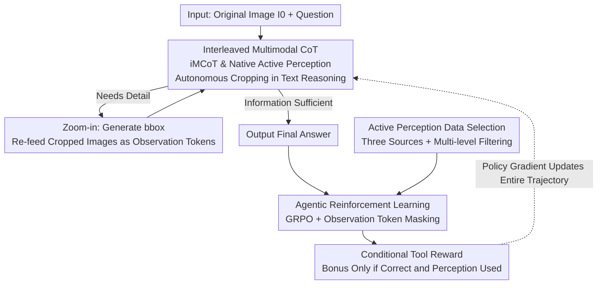

# DeepEyes: Incentivizing "Thinking with Images" via Reinforcement Learning

**Conference**: ICLR 2026  
**OpenReview**: [https://openreview.net/forum?id=xUyMXkI958](https://openreview.net/forum?id=xUyMXkI958)  
**Code**: https://github.com/Visual-Agent/DeepEyes  
**Area**: Multimodal VLM / LLM Reasoning  
**Keywords**: Visual Language Models, Reinforcement Learning, Active Perception, Interleaved Multimodal Chain-of-Thought, Visual Grounding

## TL;DR
DeepEyes enables Visual Language Models (VLM) to internalize "zooming into images" as an inherent action within the reasoning chain. Without relying on SFT cold-start or external tools, end-to-end reinforcement learning allows the model to learn to actively crop and zoom into key regions during reasoning. This elevates a 7B model from 71.2% to 90.1% on the V* high-resolution benchmark.

## Background & Motivation
**Background**: Current mainstream VLMs (Qwen2.5-VL, LLaVA series, InternVL, etc.) possess the ability to perform long Chain-of-Thought (CoT) reasoning on multimodal inputs, decomposing complex tasks into step-by-step textual derivations.

**Limitations of Prior Work**: The "thinking" process in these models occurs almost exclusively within the language modality. Once an image is encoded into tokens, subsequent reasoning rotates only within the text space, making it impossible to "re-examine" image details mid-reasoning. This leads to frequent errors when locating small objects or performing fine-grained comparisons in ultra-high-resolution images (2K–8K). Worse, models are prone to hallucinations influenced by language priors (e.g., associating "beach" with "stones," even if none exist in the image).

**Key Challenge**: Human visual reasoning is a process of "thinking while looking"—repeatedly acquiring information through a series of visual fixations before making a judgment. In contrast, existing VLMs decouple "perception" from "reasoning," where perception occurs only once at the very beginning. Existing attempts to remedy this either use predefined workflows (locating ROI first, then re-feeding features), which require hard-to-collect SFT data and suffer from poor generalization due to rigid designs, or call external specialized detection/segmentation models as tools. These external tools cannot be jointly optimized with the main model, leading only to local optima. While OpenAI o3 demonstrated the ability to naturally interleave image operations into CoT, its mechanisms remain closed to the research community.

**Goal**: To allow a unified VLM to autonomously decide "when and where to zoom" during the reasoning process and feed the zoomed visual evidence back into the reasoning chain, without relying on SFT cold-start or external models.

**Key Insight**: The authors observe that mainstream VLMs (such as Qwen2.5-VL) inherently possess visual grounding capabilities—they can output bbox coordinates based on descriptions. Since this capability is built-in, it can be encapsulated as an "internal tool," allowing the model to use its own grounding ability to crop images rather than relying on external attachments. This allows tool calls to be implicitly optimized within the same gradient framework.

**Core Idea**: Use end-to-end reinforcement learning (based only on outcome rewards) to incentivize the model to use its "native grounding capability" as a magnifying glass. By interleaving visual actions—"generate coordinates → crop → re-examine"—into the textual CoT, an interleaved Multimodal Chain-of-Thought (iMCoT) is formed, allowing "thinking with images" to emerge natively.

## Method

### Overall Architecture
DeepEyes is a unified multimodal large model that takes an original image $I_0$ and a question as input to produce a final answer. The core challenge is enabling the model to decide to "zoom in and look at a specific region" when text-only reasoning fails, and to reintegrate the cropped image back into the reasoning process.

The entire flow is an agentic multi-turn interaction: the model first generates a segment of text-CoT and, at the end of each step, autonomously judges whether to provide a direct answer or trigger a "zoom-in" action. The input for a zoom action is a set of bbox coordinates, and the output consists of sub-images ($I_{t_1}, I_{t_2}$) cropped from those regions. These cropped images are appended to the ongoing trajectory as "observation tokens." The model then continues reasoning over the full context including the original image, all historical text, and all historical crops. This loop of "thinking → deciding to zoom → re-examining the crop → thinking again" can repeat up to 6 times. The entire trajectory (all text CoT and action decisions) is optimized end-to-end via policy gradients based on outcome rewards, without intermediate supervision or SFT cold-start.

### Key Designs

**1. iMCoT & Native Active Perception: Encapsulating Grounding as an Internal Magnifier**

This design directly addresses the decoupling of perception and reasoning. DeepEyes introduces no external detectors; instead, it encapsulates the VLM's inherent grounding capability as an internal tool. At any step of text reasoning, the model can generate grounding coordinates $\{\text{bbox}\}$, triggering the system to crop regions from the original image and feed them back as new visual observations. The state at each step is formalized as an interleaved sequence of text and image tokens $s_t = \{(X_0, I_0), (X_1, I_1), \dots, (X_t, I_t)\} = \{X_{\le t}; I_{\le t}\}$, and the action $a_t \sim \pi_\theta(a \mid s_t)$ is the next token. Because the zoom uses the model's own capability and the crops return to the same trajectory, visual and textual reasoning are naturally coupled. This allows the model to perform fine-grained perception on small, blurry, or unrecognizable targets. Compared to workflow methods (requiring heavy SFT data) and external tool methods (lacking joint optimization), this "native tool calling" allows perception actions and text reasoning to be optimized by the same gradient.

**2. Agentic RL: End-to-End Optimization via GRPO with Observation Token Masking**

Traditional text-only CoT RL defines the state as generated tokens and the action as the next token. iMCoT introduces "observation tokens" originating from function calls (cropping) rather than model generation. If losses were calculated on all tokens, the model would be forced to "fit" cropped image tokens it did not generate, polluting the optimization signal. To solve this, the authors use Group Relative Policy Optimization (GRPO) and apply a token-wise loss mask to multi-turn trajectories, calculating losses only on tokens truly generated by the model while ignoring observation tokens. Thus, all text CoT and action decisions are jointly optimized toward global optimality, while injected visual observations are not incorrectly treated as learning targets. Training is performed on Qwen2.5-VL-7B for 80 iterations, with 256 prompts per batch and 16 rollouts per prompt.

**3. Conditional Tool Reward: Rewarding Only "Correct and Effective Zooming"**

In early attempts, the authors found the model was reluctant to zoom actively and often chose incorrect regions, leading to low rewards and unstable training. This design pushes the model from "lazy perception" to "active and effective perception." The total reward consists of three parts: accuracy reward $R_{acc}$, format reward $R_{format}$, and a conditional tool reward $R_{tool}$:

$$R(\tau) = R_{acc}(\tau) + R_{format}(\tau) + \mathbb{I}_{R_{acc}(\tau)>0}\, R_{tool}(\tau)$$

The indicator function $\mathbb{I}_{R_{acc}(\tau)>0}$ is critical—the tool reward is only granted if the answer is correct and at least one active perception action was triggered. Ablations (Table 5) show this condition is vital: without tool rewards, models stop zooming; with unconditional rewards, models maintain only minimal, static perception. Only when rewards are tied to correctness do active perception counts increase and responses become more informative.

**4. Active Perception Data Selection: Ensuring Initial Sampling Efficiency Without SFT Cold-Start**

The biggest challenge of skipping SFT cold-start is the extremely low sampling efficiency in early RL—the model rarely samples successful trajectories that solve problems via zooming. This design uses a curated dataset to guide the model. Data is merged from three sources: V* training set (fine-grained), ArxivQA (charts/diversity), and ThinkLite-VL (complex reasoning). Multi-level filtering is applied: difficulty screening (removing 100% correct/0% correct samples), format unification with label verification, and "Perception Utility Filtering." The latter retains only samples where active perception of ground-truth regions is necessary to solve the problem, maximizing information gain and boosting initial RL sampling efficiency.

### Loss & Training
The optimization objective is the group relative policy gradient of GRPO. The reward used is $R(\tau)=R_{acc}+R_{format}+\mathbb{I}_{R_{acc}>0}R_{tool}$. Token-wise masking is used to ignore observation tokens in multi-turn trajectories. Hyperparameters: Qwen2.5-VL-7B, 80 iterations, batch size 256 prompts × 16 rollouts, max 6 zooms, KL coefficient 0, max response length 20,480 tokens.

## Key Experimental Results

### Main Results

| Benchmark (7B) | Metric | DeepEyes | Qwen2.5-VL 7B | Gain |
| :--- | :--- | :--- | :--- | :--- |
| V\* | Overall | 90.1 | 71.2 | +18.9 |
| HR-Bench 4K | Overall | 75.1 | 68.8 | +6.3 |
| HR-Bench 8K | Overall | 72.6 | 65.3 | +7.3 |
| MME-RealWorld-Lite | Overall | 53.2 | 42.3 | +10.9 |
| MathVista | Acc | 70.1 | 68.3 | +1.9 |
| POPE | Overall | 87.7 | 85.9 | +1.8 |

DeepEyes-7B significantly outperforms text-only SOTA open-source models and even surpasses complex pipelines with manual workflows (SEAL, DyFo, ZoomEye). It also beats the 32B version of Qwen2.5-VL on MME-RealWorld-Lite.

### Ablation Study

| Configuration | V\* | HR-4K | HR-8K | Description |
| :--- | :--- | :--- | :--- | :--- |
| DeepEyes (iMCoT, Full) | 90.1 | 75.1 | 72.6 | Full model |
| RL w. Text-only CoT | 88.5 | 75.4 | 60.8 | Remove visual interleaving; HR-8K drops 11.8 |
| w/o Tool Reward | 87.4 | 53.4 | 55.4 | Model soon stops zooming |
| Unconditional Tool Reward | 87.4 | 72.1 | 71.8 | Maintains static/minimal perception |
| Conditional Tool Reward | 90.1 | 75.1 | 72.6 | Full reward design |

### Key Findings
- **Value of iMCoT peaks at ultra-high resolutions**: Text-only CoT scores 60.8% on HR-8K; adding visual interleaving boosts this to 72.6% (+11.8).
- **Rewards must tie to correctness**: Removing tool rewards causes HR-4K to drop to 53.4%. Unconditional rewards prevent stagnation but underperform conditional rewards.
- **Three-stage training dynamics**: Model goes from "Ineffective Exploration (Steps 0–20, random zoom, low IoU)" to "High-frequency Participation (Steps 20–45, broad but inefficient)" to "Efficient Utilization (Steps 45–80, selective precise zoom, lower count but higher IoU)."
- **Scalability**: Performance gains over the baseline widen at 32B. Simply adding a "rotate" tool to the system prompt (without retraining) improved zero-shot HR-OCR-Rot by 3.5%.

## Highlights & Insights
- **Encapsulating native capabilities vs. external models**: Using the VLM's own grounding as an internal tool allows joint optimization, which is the fundamental reason it outperforms "external detector" routes.
- **Conditional indicator rewards**: The $\mathbb{I}_{R_{acc}>0}R_{tool}$ logic gate prevents "zooming for the sake of zooming" (reward hacking) and distinguishes between using a tool and using it correctly.
- **Observation token masking**: A critical engineering detail for multi-turn multimodal RL. Observations should not be treated as prediction targets.
- **The "Aha" Moment**: Without any step-by-step supervision, diverse "thinking with images" patterns (visual search, comparison, confirmation, hallucination suppression) emerged spontaneously from outcome rewards.

## Limitations & Future Work
- **Minimal Toolset**: Currently limited primarily to "crop/zoom." Performance under richer toolsets (scaling parameters, enhancement, external search) is unverified.
- **Dependence on Base Model Grounding**: The method assumes the base model (e.g., Qwen2.5-VL) already has strong grounding. Its applicability to weaker base models is unknown.
- **Data Curation Cost**: While SFT cold-start is avoided, "Perception Utility Filtering" requires ground-truth regions to determine helpfullness, which may be a bottleneck for scaling.
- **Sparse Outcome Rewards**: Long-range credit assignment remains a challenge if early zoom decisions are incorrect.

## Related Work & Insights
- **vs. SEAL / DyFo / ZoomEye (Workflow Methods)**: These use rigid workflows or auxiliary models. DeepEyes allows autonomous decisions and end-to-end optimization, proving "simple RL" beats "complex workflows."
- **vs. Pixel-Reasoner**: Also 7B with pixel-level operations, but DeepEyes performs better on V* (90.1 vs 80.6) due to the conditional tool reward and curated data.
- **vs. OpenAI o3**: o3 first showed "thinking with images," but its mechanism is closed. DeepEyes provides an open-source, reproducible path.

## Rating
- Novelty: ⭐⭐⭐⭐⭐ Encapsulating internal grounding as a tool with pure outcome rewards for emergent "thinking with images" is a clean and reproducible path.
- Experimental Thoroughness: ⭐⭐⭐⭐⭐ Covers resolution, perception, grounding, hallucination, and math. Comprehensive ablations on rewards, data, and scale.
- Writing Quality: ⭐⭐⭐⭐ Mechanism and motivation are clear; analysis of training dynamics is insightful.
- Value: ⭐⭐⭐⭐⭐ Provides a practical open-source paradigm for "VLM Active Perception + Agentic RL," directly applicable to reducing hallucinations and improving high-res reasoning.

<!-- RELATED:START -->

## Related Papers

- [\[ICLR 2026\] Medical Thinking with Multiple Images](medical_thinking_with_multiple_images.md)
- [\[ICLR 2026\] VTool-R1: VLMs Learn to Think with Images via Reinforcement Learning on Multimodal Tool Use](vtool-r1_vlms_learn_to_think_with_images_via_reinforcement_learning_on_multimoda.md)
- [\[CVPR 2026\] Incentivizing Versatile Video Reasoning in MLLMs via Data-Efficient Reinforcement Learning](../../CVPR2026/vlm_reasoning/incentivizing_versatile_video_reasoning_in_mllms_via_data-efficient_reinforcemen.md)
- [\[ICLR 2026\] STVG-R1: Incentivizing Instance-Level Reasoning and Grounding in Videos via Reinforcement Learning](stvg-r1_incentivizing_instance-level_reasoning_and_grounding_in_videos_via_reinf.md)
- [\[ICLR 2026\] VisionReasoner: Unified Reasoning-Integrated Visual Perception via Reinforcement Learning](visionreasoner_unified_reasoning-integrated_visual_perception_via_reinforcement_.md)

<!-- RELATED:END -->
## Related Papers

- [\[ICLR 2026\] Medical Thinking with Multiple Images](medical_thinking_with_multiple_images.md)
- [\[CVPR 2026\] Incentivizing Versatile Video Reasoning in MLLMs via Data-Efficient Reinforcement Learning](../../CVPR2026/vlm_reasoning/incentivizing_versatile_video_reasoning_in_mllms_via_data-efficient_reinforcemen.md)
- [\[ICLR 2026\] VTool-R1: VLMs Learn to Think with Images via Reinforcement Learning on Multimodal Tool Use](vtool-r1_vlms_learn_to_think_with_images_via_reinforcement_learning_on_multimoda.md)
- [\[ICLR 2026\] VisionReasoner: Unified Reasoning-Integrated Visual Perception via Reinforcement Learning](visionreasoner_unified_reasoning-integrated_visual_perception_via_reinforcement_.md)
- [\[ICLR 2026\] ReVisual-R1: Advancing Multimodal Reasoning from Optimized Cold Start to Staged Reinforcement Learning](revisual-r1_advancing_multimodal_reasoning_from_optimized_cold_start_to_staged_r.md)

<!-- RELATED:END -->
