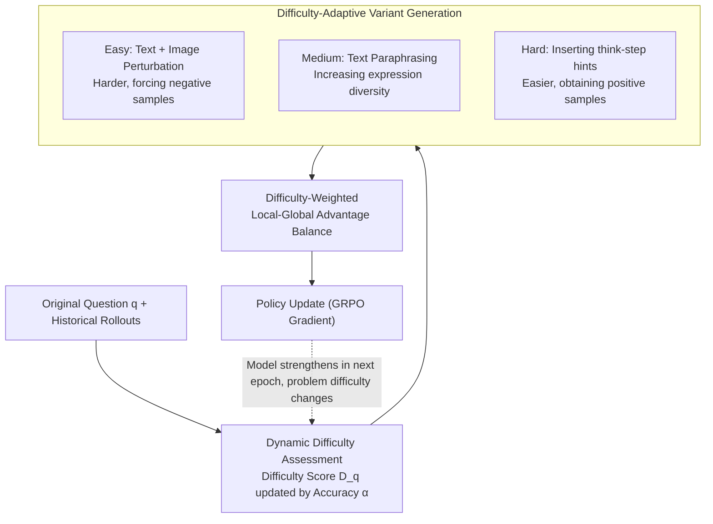

# DIVA-GRPO: Enhancing Multimodal Reasoning through Difficulty-Adaptive Variant Advantage

**Conference**: ICLR 2026  
**arXiv**: [2603.01106](https://arxiv.org/abs/2603.01106)  
**Code**: [Siaaaaaa1/DIVA-GRPO](https://github.com/Siaaaaaa1/DIVA-GRPO)  
**Area**: Multimodal VLM  
**Keywords**: GRPO, Reinforcement Learning, Multimodal Reasoning, Difficulty Adaptation, Advantage Vanishing, Variant Augmentation

## TL;DR

Ours proposes DIVA-GRPO, which addresses reward sparsity and advantage vanishing in GRPO training by dynamically evaluating question difficulty, adaptively generating semantically consistent variants of different difficulty levels, and combining difficulty-weighted local-global advantage estimation. It achieves SOTA multimodal reasoning performance on 7B-scale models.

## Background & Motivation

**Widespread Application of GRPO in Multimodal Reasoning**: GRPO enables long-chain reasoning training without a critic model through intra-group relative advantage estimation, becoming a mainstream method for enhancing MLLM reasoning capabilities.

**Advantage Vanishing as a Core Bottleneck**: When a question is too easy or too difficult for the current model, all responses in a group are either all correct or all incorrect. This leads to zero advantage, vanishing optimization signals, and crashing training efficiency.

**Reward Sparsity Aggravates the Issue**: In early training stages or when facing difficult problems, only a few reasoning paths receive positive rewards. The scarcity of positive feedback leads to slow learning.

**Limitations of Prior Work**: (a) Sample augmentation methods (e.g., adding prompts, generating variants) do not control difficulty distribution, potentially worsening advantage vanishing; (b) Selective sample utilization methods discard data, reducing diversity; (c) Indirect reward design methods may introduce bias misaligned with the final objective.

**Dynamics of Difficulty Neglected**: As training progresses and model capability increases, questions that were originally of medium difficulty become easy, worsening advantage vanishing. Existing methods fail to consider the dynamic evolution of difficulty.

**Key Insight**: The key lies in ensuring that the intra-group reward distribution for each question has sufficient variance to produce clear optimization signals. This requires dynamically adjusting the difficulty distribution of variants based on problem difficulty.

## Method

### Overall Architecture

DIVA-GRPO aims to solve a persistent issue in standard GRPO: when a problem is too easy or too difficult for the current model, the intra-group responses are either all correct or all incorrect, causing the relative advantage to zero out and optimization signals to disappear (advantage vanishing). As the model grows stronger, medium problems become easy, aggravating this issue. The core idea is to proactively construct a set of difficulty-controlled, semantically consistent variants to ensure the intra-group reward of each problem always maintains sufficient variance.

To achieve this, it wraps standard GRPO with a closed loop that iterates with training: each epoch first assigns a "relative to current model" dynamic difficulty score based on the historical rollout accuracy of the problem. Based on this score, variants are generated in three tiers—adding perturbations to easy problems to make them harder, paraphrasing medium problems, and inserting reasoning hints into hard problems to make them easier. Finally, the "original problem + variants" are aggregated into an extended space for difficulty-weighted local-global advantage estimation to update the policy. The updated model then changes the difficulty of each problem in the next epoch, continuing the cycle.

### Key Designs

**1. Dynamic Difficulty Assessment: Aligning Difficulty with Model Capability**

The root cause of worsening advantage vanishing during training is treating difficulty as an inherent property. A problem that is "hard" for a beginner model becomes "easy" as training progresses, leading to all-correct responses and zero advantage. DIVA-GRPO maintains a dynamic difficulty score $D_q$ (initially $D_q=5$, range 1–9) for each problem, recalibrated each epoch using the empirical accuracy $\alpha$ from historical rollouts:

$$D^{\text{new}} = \text{clip}\big(D^{\text{old}} + \eta \cdot (0.5 - \alpha)\big), \quad \eta=4$$

If the accuracy is higher than 50%, the difficulty is decreased; if lower, it is increased. This pushes the difficulty score toward a level where accuracy is approximately 50%—the point where positive and negative samples are most balanced and optimization signals are strongest. This ensures the difficulty score reflects the "true difficulty relative to the current model," preventing variant strategies from missing their targets.

**2. Difficulty-Adaptive Variant Generation: "Manufacturing" Reward Variance**

With the difficulty score, specific types of missing samples can be supplemented to ensure the group contains both correct and incorrect responses. The strategy uses three tiers: for easy problems ($D_q < D_{\text{mid}}$), both text and images are perturbed (rotation, noise, blurring, etc.) to make them harder and force negative samples; for medium problems ($D_q \approx D_{\text{mid}}$), only text paraphrasing is performed to increase diversity without changing difficulty; for hard problems ($D_q > D_{\text{mid}}$), partial reasoning steps are inserted as "think-step" hints in the prompt to reduce difficulty and obtain positive samples. All variants maintain the same answer (semantical consistency). Thus, the extended intra-group reward distribution naturally possesses variance, stopping advantage vanishing at the source. Text paraphrasing and reasoning hints are generated offline via GPT-o3, while image perturbations are applied online.

**3. Difficulty-Weighted Local-Global Advantage Balance: Making Correct Answers on Hard Problems More Valuable**

The extended space offers two advantage perspectives: a "local" view within a single question group and a "global" view combining all variants of that question. These vary significantly in scale due to sample size differences. DIVA-GRPO first applies batch-level z-score normalization to both to eliminate scale differences, yielding $\tilde{A}$, and then adds a layer of difficulty weighting:

$$\hat{A} = \exp\big(k \cdot (D_q^{(i)} - \bar{D}_q) \cdot \text{sgn}(\tilde{A})\big) \cdot \tilde{A}$$

Intuitively, this amplifies the advantage of correct responses and reduces the impact of incorrect ones for variants above average difficulty, and vice-versa for those below average. Consequently, the model gains more from answering hard problems correctly, naturally tilting optimization toward difficult tasks and achieving difficulty-adaptive policy updates.

### Loss & Training

The overall loss follows the standard GRPO policy gradient, replacing the advantage with the aforementioned difficulty-weighted and normalized $\hat{A}$. A plug-and-play **Reward-Range-Based Advantage Rescaling (RRB)** is introduced: $\hat{A}_{\text{range}} = \Delta r_q \cdot \tilde{A}$, where $\Delta r_q = (\max(\mathcal{R}_q) - \min(\mathcal{R}_q)) / R_{\max}$. When intra-group rewards are highly concentrated, z-score normalization might wrongly amplify negligible differences; $\Delta r_q$ uses the actual reward span to compress such pseudo-signals. The flatter the rewards, the stronger the compression. The base model is Qwen2.5-VL-7B-Instruct, trained with the AdamW optimizer and a learning rate of $10^{-6}$.

## Key Experimental Results

### Table 1: Main Results on Six Multimodal Mathematical Reasoning Benchmarks

| Model | MathVista | MathVerse | MathVision | OlympiadBench | WeMath | MMK12test | Avg. |
|---|---|---|---|---|---|---|---|
| GPT-4o | 63.8 | 50.2 | 30.4 | 35.0 | 68.8 | 49.9 | 49.68 |
| Qwen2.5-VL-7B (base) | 68.2 | 47.9 | 25.4 | 20.2 | 62.1 | 53.6 | 46.23 |
| Qwen2.5-VL-72B | 74.8 | 57.6 | 38.1 | 40.4 | 72.4 | 70.5 | 59.0 |
| R1-ShareVL-7B | 73.5 | 52.8 | 29.5 | 21.3 | 67.9 | 68.8 | 52.30 |
| MM-Eureka-7B | 71.7 | 50.3 | 26.9 | 20.1 | 66.1 | 64.5 | 49.93 |
| **DIVA-GRPO-7B (Ours)** | **74.2** | **57.6** | **32.1** | **23.1** | **69.3** | **70.2** | **54.58** |

- Achieves SOTA across all six benchmarks at the 7B scale, with an average score of 54.58.
- Performance on MathVista/MathVerse/WeMath approaches 72B-level models.
- Average gain of **+8.35** compared to the base Qwen2.5-VL-7B.

### Table 2: Ablation Study

| Method | MathVista | MathVerse | MMK12test | Avg. |
|---|---|---|---|---|
| w/o Variant Generation | 70.0 | 53.7 | 61.1 | 61.6 |
| w/o Difficulty-Weighting | 69.9 | 55.7 | 66.5 | 64.0 |
| w/o RRB-Rescaling | 71.5 | 55.2 | 64.7 | 63.8 |
| w/o G-L Balance | 70.8 | 55.4 | 66.0 | 64.1 |
| **Full DIVA-GRPO** | **73.2** | **56.3** | **68.8** | **66.1** |

- Removing any component leads to performance degradation, with Variant Generation having the largest impact (-4.5 avg).
- Regarding training efficiency: steps required to reach optimal performance decreased by **2.55×**, with a **1.76×** end-to-end speedup.

## Highlights & Insights

- **Precise Problem Definition**: Unifies the understanding of advantage vanishing from the perspective of "how to ensure sufficient intra-group reward variance," providing a more fundamental solution than existing categories of methods.
- **Difficulty-Adaptive Closed Loop**: Assessment -> Generation -> Weighting forms a complete loop, where difficulty evolves dynamically with training.
- **Strong Theoretical Support**: Provides theorem proofs for accelerated convergence via variance reduction and mathematical analysis showing strongest signals when the positive-to-negative ratio is approximately 1:1.
- **Significant Training Efficiency**: 2.55× step reduction + 1.76× end-to-end speedup, offering high practical value.
- **Generalizable RRB-Rescaling**: Can be independently applied to any GRPO framework.

## Limitations & Future Work

- Variant text reasoning hints rely on offline generation by GPT-o3, introducing dependency on closed-source models and additional costs.
- Significant gaps remain on competition-level math tasks (OlympiadBench 23.1 vs. o1's 68.0), where 7B model capacity is a clear constraint.
- Image perturbation methods (rotation, noise) are relatively simple and may be insufficient for scenarios requiring fine-grained visual understanding.
- Difficulty assessment is based on accuracy and lacks distinction for partially correct results or cases with correct reasoning but wrong final answers.

## Related Work & Insights

- **vs. GRPO/DAPO**: Standard GRPO and DAPO do not consider difficulty adaptation, leading to advantage signal decay in later training; DIVA-GRPO maintains reward variance via variant generation.
- **vs. GSPO**: GSPO introduces semantically consistent variants but fails to adjust difficulty distribution dynamically; DIVA-GRPO matches variant difficulty with the model's current capability.
- **vs. Adora/MM-Eureka**: These methods alleviate the issue through sample selection or indirect rewards but risk data waste and optimization bias, respectively.
- **vs. R1-ShareVL**: Compared to this 7B SOTA competitor, DIVA-GRPO shows clear advantages in MathVerse (+4.8) and MMK12test (+1.4).

## Rating

- Novelty: ⭐⭐⭐⭐ — The combination of difficulty-adaptive variant generation, three-tier strategy, and RRB rescaling is novel.
- Experimental Thoroughness: ⭐⭐⭐⭐ — Comprehensive coverage across six benchmarks, detailed ablation, efficiency analysis, and theoretical proofs.
- Writing Quality: ⭐⭐⭐⭐ — Clear problem articulation and well-motivated methodology.
- Value: ⭐⭐⭐⭐ — Effectively addresses practical pain points in GRPO training; the RRB component is plug-and-play.

<!-- RELATED:START -->

## Related Papers

- [\[ICLR 2026\] ARES: Multimodal Adaptive Reasoning via Difficulty-Aware Token-Level Entropy Shaping](ares_multimodal_adaptive_reasoning_via_difficulty-aware_token-level_entropy_shap.md)
- [\[ICLR 2026\] ReVisual-R1: Advancing Multimodal Reasoning from Optimized Cold Start to Staged Reinforcement Learning](revisual-r1_advancing_multimodal_reasoning_from_optimized_cold_start_to_staged_r.md)
- [\[CVPR 2026\] Dr. Seg: Revisiting GRPO Training for Visual Large Language Models through Perception-Oriented Design](../../CVPR2026/vlm_reasoning/dr_seg_revisiting_grpo_training_for_visual_large_language_models_through_percept.md)
- [\[ICLR 2026\] Mixture-of-Visual-Thoughts: Exploring Context-Adaptive Reasoning Mode Selection for General Visual Reasoning](mixture-of-visual-thoughts_exploring_context-adaptive_reasoning_mode_selection_f.md)
- [\[ICLR 2026\] Play to Generalize: Learning to Reason Through Game Play](play_to_generalize_learning_to_reason_through_game_play.md)

<!-- RELATED:END -->
