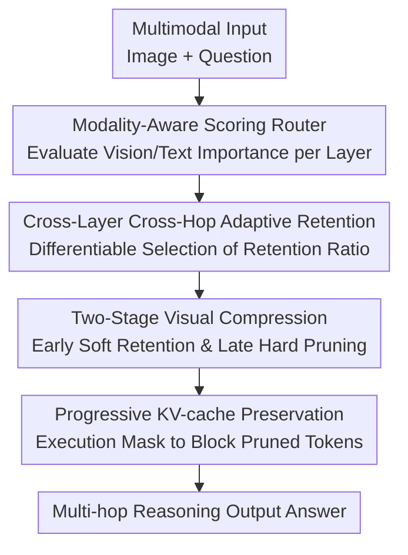

# Efficient Multimodal Spatial Reasoning via Dynamic and Asymmetric Routing

**Conference**: ICLR 2026  
**OpenReview**: [https://openreview.net/forum?id=BQASoLmREU](https://openreview.net/forum?id=BQASoLmREU)  
**Code**: None (No public repository link provided in the main text)  
**Area**: Multimodal VLM / Spatial Reasoning / Inference Acceleration  
**Keywords**: Dynamic Routing, Asymmetric Pruning, Multi-hop Reasoning, KV-cache Compression, Multimodal Spatial Reasoning

## TL;DR
This paper proposes DARE, which utilizes "differentiable dynamic routing across layers and hops" for asymmetric preservation of vision and text tokens. On multimodal spatial reasoning tasks, it reduces FLOPs by an average of 40.37% and KV-cache by 46.07%, while accuracy in most tasks actually improves.

## Background & Motivation
**Background**: Recent multimodal spatial reasoning frameworks (e.g., VoT, MVoT) adopt a "think-while-looking" multi-hop mechanism, where intermediate visual and textual thoughts are continuously appended back into the context for the next round of reasoning. While effective for complex spatial tasks, this paradigm causes sequence lengths to grow with each hop, leading to a near-quadratic increase in attention computation and making memory, especially KV-cache, a major bottleneck.

**Limitations of Prior Work**: Existing compression methods mostly operate within a single modality or a single forward pass. Common practices include fixed layer retention rates, uniform cross-modal pruning, or heuristic token selection. The issue is that token importance is unstable in multi-hop reasoning: a token critical in early layers may become redundant in deep layers; visual tokens typically lose marginal value faster after cross-modal fusion, while text tokens often still carry semantic reasoning responsibilities in deep layers.

**Key Challenge**: The root cause of the conflict between efficiency and performance is not simply that the "total number of tokens is too large," but rather that "effective information density varies differently across modalities, layers, and hops." Using a single global pruning strategy either retains too much redundancy, wasting computation, or inadvertently deletes critical information needed for subsequent reasoning.

**Goal**: The authors decompose the problem into three sub-objectives:
1. Dynamically model token importance within layers and across hops instead of using fixed retention rates.
2. Distinguish between visual and textual redundancy patterns to perform asymmetric compression.
3. Link token pruning with KV-cache management to genuinely reduce inference memory and latency.

**Key Insight**: The authors observe a stable phenomenon: the importance of visual tokens significantly drops in middle and late layers, whereas text tokens remain active. This "visual information flowing toward text" pattern suggests that vision and text should not be treated as identically distributed objects; instead, modality-aware retention strategies should be adopted.

**Core Idea**: The core of DARE is "differentiable, cross-layer/cross-hop, modality-asymmetric token routing + progressive KV-cache preservation." This involves retaining richer cross-modal signals in early layers while aggressively pruning visual redundancy in later layers, all while maintaining the textual semantic chain.

## Method

### Overall Architecture
DARE can be viewed as a "lightweight router system" inserted into each Transformer layer. In every layer, the router scores visual and text tokens separately to decide which will propagate forward. Differentiable approximations are used during training to maintain end-to-end learning, while deterministic top-k retention is used during inference.

Unlike many "one-time compression" methods, DARE adapts across two dimensions: the **intra-layer depth dimension** (retention changes across layers within the same hop) and the **inter-hop dimension** (retention strategies update as reasoning rounds progress). This avoids over-pruning in early stages and prevents retaining excessive visual redundancy that has already been absorbed by the language channel in later stages.

### Key Designs
**1. Modality-Aware Dynamic Routing: Turning "Who to Keep" into a Learnable Decision**

In layer $l$ for modality $m\in\{t,v\}$, the router produces an importance score for the $i$-th token:
$s^{(i,m)}_l=\sigma(W^{(m)}_l x^{(i,m)}_l+b^{(m)}_l)$.
The sigmoid function maps the score to $[0,1]$, directly interpretable as a retention tendency. During training, selected tokens are not just "passed/blocked" but are scaled by their scores, facilitating joint optimization of "structural selection + representation strength." Consequently, gradients can flow back through the routing process to the backbone and router heads, avoiding the training difficulties of purely discrete decisions.

This design addresses the limitation that static rules cannot express fine-grained differences across "current layer, current hop, and current modality." DARE allows the model to learn where to keep spatial evidence and where to keep only semantic summaries.

**2. Cross-Layer Cross-Hop Differentiable Retention: Fine-Grained Scheduling under a Global Budget**

The authors define a learnable retention rate $\rho^{(m)}_{h,l}$ for each hop-layer-modality pair and use Gumbel-Softmax to approximate discrete selection:

$$
q^{(i,m)}_{h,l} = \frac{\exp((s^{(i,m)}_{h,l}+g_i)/\tau)}{\sum_j \exp((s^{(j,m)}_{h,l}+g_j)/\tau)}
$$

where $g_i\sim\text{Gumbel}(0,1)$ and $\tau$ controls the softness. Straight-Through Estimators (STE) maintain differentiability during training; during inference, tokens are selected based on the top-$\rho^{(m)}_{h,l}$ scores. An MSE regularization term is introduced to constrain retention rates (e.g., 70% for text, 40% for vision), ensuring a total compression budget while allowing local deviations for "elastic budget control."

The value of this mechanism is that it does not force all layers into the same sparsity but allows different reasoning stages to have different information bandwidths, matching the reality of information flow in multi-hop reasoning.

**3. Two-Stage Asymmetric Visual Compression: Pruning Along the Direction of Cross-Modal Fusion**

DARE employs a "two-stage strategy" for visual tokens. Soft retention is utilized in early layers ($l\le l_c$) to allow the model to leverage spatial details; hard suppression is applied in later layers ($l>l_c$) using:
$L^{(v)}_{hard}=\sum_{h}\sum_{l=l_c+1}^{L}\sum_i \mu\max(0,s^{(i,v)}_{h,l}-\epsilon)$
This punishes residual high-score visual tokens, driving aggressive pruning.

Intuitively, this acknowledges the "early fusion, late abstraction" pipeline: the front end needs image evidence, while the back end focuses on linguistic reasoning. Experiments confirm that visual retention rates drop rapidly with depth, whereas text retention stays stable or slightly increases. This asymmetric design is the primary source of DARE's performance gains over symmetric pruning baselines like UniPrune.

**4. Progressive KV-cache Preservation: Translating Computation Compression into Memory Gains**

Reducing forward FLOPs alone is insufficient, as multi-hop reasoning often hits KV-cache bottlenecks first. DARE removes pruned tokens from both the attention visibility set and the cache writing path via an execution mask:
$M_{h,l}=M_{causal}+E_{h,l}$, where $E_{h,l}$ applies $-\infty$ to pruned tokens.

The authors also preserve a prefix of $\kappa$ tokens (eventually $\kappa=2$) for each hop to maintain the stability of BOS/CLS and early cross-modal alignment. This design allows cache overhead to be approximated as:
$\mathbb{E}[mem_{h,l}] = \rho^{(v)}_{h,l}mem^{full-v}_{h,l}+\rho^{(t)}_{h,l}mem^{full-t}_{h,l}$,
directly mapping "retention rate learning" to predictable memory savings.

### A Complete Example
Below is a typical "kitchen spatial QA" workflow illustrating how DARE operates during multi-hop reasoning:

The input question is: "Which way should a person standing at the sink turn to reach the oven, and what is the basis?"

Hop 1 (Early Layers): The model needs to locate the sink, oven, and traversable areas. Visual token retention is high (near the target cap), and text tokens are preserved synchronously to ensure "what is seen" and "how it is described" remain aligned.

Hops 2-3 (Middle Layers): The router discovers that visual tokens for background textures and walls have declining scores and are gradually pruned, while text clues related to "left/right, adjacent wall" are retained.

Hops 4-5 (Deep Layers): The visual side enters the hard pruning stage, and conclusion integration is completed primarily through the textual semantic chain. The final output is "turn left," with the reasoning being "the oven is on the adjacent wall to the left with no obstructions in between."

This process reflects DARE's core strategy: instead of one-time compression, the "retention focus" shifts with reasoning progress.

### Loss & Training
The total loss is defined as:
$L=L_{task}+L^{(t)}_{ratio}+L^{(v)}_{soft}+L^{(v)}_{hard}$.

Where $L_{task}$ is the original task loss, $L^{(t)}_{ratio}$ constrains the text retention rate to the target, and $L^{(v)}_{soft}$ and $L^{(v)}_{hard}$ handle soft retention and late-stage hard suppression for vision, respectively.

Implementation-wise, the authors validated DARE on two interleaved multimodal architectures: VolCano and Anole-7B. Training utilized AdamW, with common objective retention rates in the main report set to 40% for vision and 70% for text, conducted on A100 GPUs.

## Key Experimental Results

### Main Results
DARE consistently delivers "significant efficiency gains + stable or improved accuracy" across four evaluation categories. The following table summarizes core comparisons (selected representative figures from the paper):

| Task | Baseline | Baseline Acc | DARE Config | DARE Acc | FLOPs Change | Latency Change | Memory/KV Change |
|------|------|---------|----------|----------|-----------|----------|-------------|
| VSR | VolCano | 67.18 | DARE-LH | 68.09 | 19842G → 11310G (-43.0%) | 0.63s → 0.41s | 8.91GB → 6.13GB |
| V-Star | VolCano | 58.40 | DARE-LH | 60.07 | 21785G → 13585G (-37.6%) | 0.69s → 0.43s | 9.37GB → 6.62GB |
| EmbSpatial | VolCano | 58.29 | DARE-LH | 68.09 | 26543G → 17965G (-32.3%) | 0.72s → 0.45s | 9.73GB → 7.09GB |
| MAZE (Anole-7B) | VoT | 86.56 | DARE-LH | 93.32 | 25640G → 12740G (-50.3%) | 0.79s → 0.43s | See KV table below |

Trends indicate that DARE-LH (Layer + Hop routing) generally outperforms DARE-L (Layer-only routing), demonstrating that dynamic retention along the hop dimension is a valid gain.

### Ablation Study
Ablations focus on three questions: which components are useful, how to set retention rates, and whether the KV strategy is robust.

| Ablation Setting | Representative Result | Conclusion |
|---------|---------|------|
| Removing visual hard suppression or using symmetric pruning (UniPrune) | VSR: 63.71 (UniPrune) vs 68.09 (DARE-LH) | Asymmetric late-stage visual pruning is a key source of improvement |
| Retention Rate Grid Search | Best accuracy near 70% Text + 40% Vision | Vision can be pruned more aggressively; text requires semantic chains |
| Prefix Token Count $\kappa$ Scan | $\kappa=0/1$ significantly drops accuracy; $\kappa=2$ restores performance with low cache | Small prefix stabilizes decoding and cross-modal alignment |
| KV-cache Comparison (VSR) | VoCoT 5.45GB, DARE-L 3.28GB, DARE-LH 2.97GB | DARE provides real memory gains, not just FLOPs reductions |

### Key Findings
- DARE is not a "trade-off of accuracy for speed"; it achieves dual improvements in many tasks, especially in multi-hop spatial reasoning.
- Visual token value decays very stably with depth, supporting the "soft-early, hard-late" two-stage visual strategy; text tokens remain the reasoning backbone in deep layers.
- Hop-aware routing significantly outperforms layer-only routing, suggesting that the "time dimension (reasoning rounds)" must be modeled in compression strategies for multi-hop tasks.
- KV-cache management is a decisive factor for practical deployment; DARE’s execution mask and prefix retention make long-chain reasoning more scalable.

## Highlights & Insights
- DARE elevates "compression" from a static engineering trick to a "decision-making problem that evolves with the reasoning process." This is closer to the true information flow structure of multimodal reasoning than fixed pruning rates.
- The value of asymmetric routing is intuitive: vision "reads the world in," and text "pushes the conclusion out." They should not be pruned identically. This insight is transferable to many VLM acceleration works.
- Designing KV-cache as a first-class citizen rather than just reporting FLOPs is highly pragmatic. In real reasoning systems, memory constraints often peak before computational ones.
- The "small but stable prefix" trick is worth reusing. It adds negligible memory overhead while significantly reducing decoding instability from over-pruning.
- Methodologically, DARE proves that "interpretable token importance heatmaps + differentiable learned routing" can coexist, providing a feasible path for controlled reasoning budget allocation.

## Limitations & Future Work
- Currently validated primarily on spatial reasoning, VQA, and hallucination detection. While there are signs of generalization, systematic evaluation on video sequences or multi-turn dialogues is still needed.
- The visual two-stage boundary layer $l_c$ uses a data-driven threshold; while effective, its transferability across different architecture depths and vision encoders requires further study.
- The router itself adds minimal parameter overhead, but the training pipeline is more complex (multiple regularizations, Gumbel-Softmax temperature scheduling), necessitating extra tuning experience for deployers.
- The paper focuses on optimizing inference-stage calculation and caching; it has not deeply explored end-to-end throughput improvements during training (e.g., more aggressive training-time sparse execution).
- Future work could explore linking routing decisions with task difficulty estimation to achieve "sample-adaptive budgets," making simple samples more efficient and difficult ones more robust.

## Related Work & Insights
- **vs SoT / Prompt Compression**: SoT constrains output length via prompts, essentially an external strategy. DARE is an internal learned routing that adapts across layers and hops, offering a more stable accuracy-efficiency trade-off.
- **vs LightFastV / SparseVLM**: These are typically "single-modality or single-stage compression" methods that might lose cross-hop dependencies in multi-hop scenarios. DARE explicitly models cross-hop retention and splits vision/text strategies.
- **vs Heima (Latent Reasoning)**: Heima is more aggressive in compression but may sacrifice the interpretability of spatial details. DARE retains explicit multimodal chains of thought, balancing interpretability and performance.
- **vs UniPrune (Symmetric Differentiable Pruning)**: UniPrune proves differentiable pruning works but ignores modality heterogeneity. DARE’s asymmetric strategy and late-stage hard visual suppression are key to its further improvements.

The insight for my own work is: when accelerating multimodal reasoning, do not ask "how many tokens should be deleted," but "at this step, in this modality, which tokens are still creating information increments." DARE provides a trainable and deployable framework for that answer.

## Rating
- Novelty: ⭐⭐⭐⭐☆ DARE combines cross-layer cross-hop dynamic routing, asymmetric compression, and KV-cache strategies into a unified framework with strong combinatorial innovation.
- Experimental Thoroughness: ⭐⭐⭐⭐⭐ Covers multiple benchmarks, two architectures, main results, ablations, sensitivity, and stability; the evidence chain is complete.
- Writing Quality: ⭐⭐⭐⭐☆ Narrative is clear with sufficient diagrams, although some method details are scattered between the main text and appendices, creating a slight entry barrier.
- Value: ⭐⭐⭐⭐⭐ Highly practical for systems requiring long-chain multimodal reasoning under memory/latency constraints.

<!-- RELATED:START -->

## Related Papers

- [\[ICLR 2026\] SketchThinker-R1: Towards Efficient Sketch-Style Reasoning in Large Multimodal Models](sketchthinker-r1_towards_efficient_sketch-style_reasoning_in_large_multimodal_mo.md)
- [\[ICLR 2026\] Empowering Small VLMs to Think with Dynamic Memorization and Exploration](empowering_small_vlms_to_think_with_dynamic_memorization_and_exploration.md)
- [\[CVPR 2026\] Learning to Reason in 4D: Dynamic Spatial Understanding for Vision Language Models](../../CVPR2026/vlm_reasoning/learning_to_reason_in_4d_dynamic_spatial_understanding_for_vision_language_model.md)
- [\[ICLR 2026\] AdaReasoner: Dynamic Tool Orchestration for Iterative Visual Reasoning](adareasoner_dynamic_tool_orchestration_for_iterative_visual_reasoning.md)
- [\[CVPR 2026\] Geoint-R1: Formalizing Multimodal Geometric Reasoning with Dynamic Auxiliary Constructions](../../CVPR2026/vlm_reasoning/geoint-r1_formalizing_multimodal_geometric_reasoning_with_dynamic_auxiliary_cons.md)

<!-- RELATED:END -->
