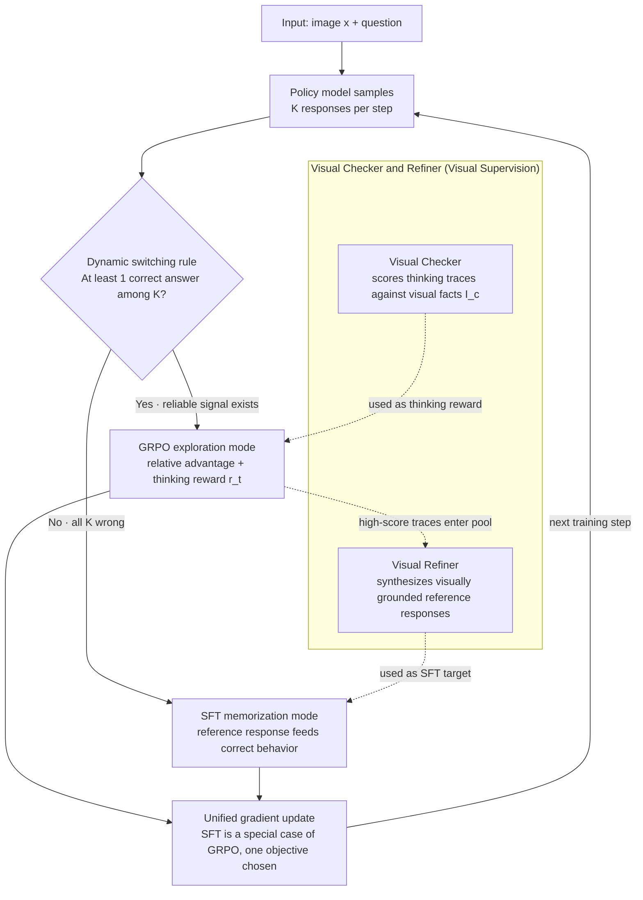

# Empowering Small VLMs to Think with Dynamic Memorization and Exploration

**Conference**: ICLR 2026  
**arXiv**: [2506.23061](https://arxiv.org/abs/2506.23061)  
**Code**: [Available](https://github.com/HKUST-LongGroup/DyME)  
**Area**: Multimodal VLM  
**Keywords**: Small-scale Vision-Language Models, Reasoning Capability, Dynamic Switching, SFT and RLVR Fusion, Visual Supervision

## TL;DR
The paper proposes DyME (Dynamic Memorize-Explore), which enables small-scale vision-language models (<1B parameters) to achieve reasoning capabilities on specific tasks for the first time by dynamically switching between SFT memorization and GRPO exploration modes.

## Background & Motivation
- While large models (e.g., Qwen2.5-VL-32B) can acquire reasoning capabilities through SFT or RLVR, **small models (SVLM, <1B) fail under both paradigms**:
    - SFT failure: CoT data is often verbose and contains significant vision-irrelevant content; SVLMs lack the capacity to absorb this, leading to "pseudo-thought trajectories."
    - RLVR failure: SVLMs exhibit poor instruction-following, frequently generating unverifiable outputs, which triggers "advantage collapse."
- The static balancing window for two-stage training (SFT→RL) is extremely narrow, making success nearly impossible for SVLMs.
- Practical Demand: SVLMs are suitable for edge device deployment, making it highly significant to empower them with reasoning capabilities.

## Method

### Overall Architecture
DyME transforms SFT and GRPO from a "two-stage sequential" process into a "step-wise dynamic switch": at each training step, the policy model samples $K$ responses for input $x$. The quality of these responses determines whether the step proceeds with "Memorization" or "Exploration." Gradients from both modes are unified into a single objective; thus, the switch introduces no additional balancing terms. On top of this backbone, a visual supervision layer is added—using visual facts extracted from images to check the quality of exploration trajectories and, in turn, refine the learning objectives for the memorization mode, allowing the two modes to mutually reinforce each other as data quality self-improves during training.

### Key Designs

**1. Dynamic Switching Rule: Using a binary signal to decide between memorization and exploration at each step**

The fundamental dilemma for SVLMs is that the effective windows for both SFT and RL are very narrow—when all outputs are incorrect, GRPO's advantage values are dominated by noise, leading to training collapse; meanwhile, blind SFT forces vision-irrelevant content from lengthy CoTs into low-capacity models. DyME's solution is simple: perform rule-based verification on $K$ sampled responses. If **at least one answer is correct**, the model enters GRPO exploration mode, driving improvement based on relative advantages. If **all $K$ are incorrect** (including invalid formats), it indicates a lack of reliable signals for exploration, and the model switches to SFT memorization mode to be "fed" correct behavior using reference responses. This switch requires no thresholds, annealing coefficients, or budget hyperparameters, yet precisely utilizes each paradigm within its most stable range.

**2. Gradient Unification of SFT and GRPO: Enabling seamless integration into a single objective**

The binary switch is valid because the authors demonstrate that both are essentially isomorphic at the gradient level: the SFT gradient is a log-probability gradient under an external data distribution, while the GRPO gradient is a log-probability gradient weighted by advantage values under an internal sampling distribution. SFT is effectively a special case of GRPO where "samples come from ground truth references and the advantage value is a constant unit." Thus, the complete objective can be written as a binary selection between GRPO loss and SFT loss via an indicator function per step. This introduces no extra balancing terms and is theoretically equivalent to a continuous walk within the same gradient space. On the GRPO side, two simplifications are made: an auxiliary reward $r_t$ for the thought trajectory is introduced (comparing token-level F1 with reference CoT), and **KL penalties and clipping are removed**—since dynamically switching back to SFT provides implicit stability, eliminating the need for clipping.

**3. Visual Checker and Refiner: Converting "Exploration Success" into better "Memorization Targets"**

Text-only switching based solely on answer correctness can lead small models to learn "floating" pseudo-reasoning that is not anchored to the image. DyME first uses domain tools to extract visual facts $I_c$ (fine-grained components like objects, attributes, and states; e.g., BiomedGPT for medical, DePlot for charts). The **Visual Checker** scores exploration trajectories along two dimensions: whether they contain sufficient correct visual elements and whether they adhere to style examples. This score serves directly as a thought reward for GRPO, forcing the model to ground reasoning on real visual evidence. High-scoring trajectories enter a dynamic exemplar pool, from which the **Visual Refiner** samples and combines structural templates with $I_c$ to synthesize vision-anchored reference responses for the next SFT mode. Consequently, a positive feedback loop is formed: "Exploration Success → Enhanced Memorization Target → Memorization Supports Better Exploration," allowing training data quality to self-improve. The extraction, checking, and refining of visual facts are unified via structured prompting of Qwen2.5-14B, and the entire training requires only a few thousand samples.

## Key Experimental Results

### Main Results (Across Three Domains)

| Model | Method | Medical | Chart | Geometry | Avg |
|------|------|---------|-------|----------|-----|
| SmolVLM (0.5B) | Baseline | 72.1 | 63.2 | 14.6 | 49.9 |
| SmolVLM | + SFT | 60.1 | 57.7 | 14.5 | 44.1 (↓) |
| SmolVLM | + GRPO | 61.1 | 53.8 | 17.1 | 44.0 (↓) |
| SmolVLM | + Two-stage | 59.4 | 60.1 | 16.7 | 45.4 (↓) |
| SmolVLM | **+ DyME** | **78.1** | **69.7** | **18.9** | **55.6 (+5.7)** |
| LLaVA-OV-S (0.5B) | Baseline | 74.9 | 61.4 | 15.9 | 50.7 |
| LLaVA-OV-S | **+ DyME** | **78.3** | **67.5** | **20.4** | **55.4 (+4.7)** |
| InternVL2-S (0.5B) | Baseline | 78.3 | 71.9 | 18.7 | 56.3 |
| InternVL2-S | **+ DyME** | **80.0** | **74.5** | **19.8** | **58.1 (+1.8)** |

SVLMs trained with DyME outperform the 7B-parameter MoVA (54.2).

| Switching Strategy Comparison (Medium Data) | Acc | Extra Cost |
|--------------------------|-----|---------|
| Reward Thresholding (t=0.5) | 52.4 | None |
| SFT Annealing (Cosine) | 64.0 | +25% |
| SFT Budget (Hard Mining) | 59.6 | Budget Dep. |
| **Binary Switch (DyME)** | **64.9** | Baseline |

### Ablation Study

| DyME Variant | Medical | Chart | Geometry | Avg |
|-----------|---------|-------|----------|-----|
| DyME (Full) | 78.3 | 67.5 | 20.4 | 55.4 |
| w/o Memorization Mode | 63.2 | 53.4 | 15.0 | 43.9 (↓20.6%) |
| w/o Exploration Mode | 75.5 | 61.3 | 14.5 | 50.4 (↓9.0%) |
| w/o Visual Refiner | 75.6 | 62.3 | 16.8 | 51.6 (↓6.9%) |
| w/o Visual Checker | 76.9 | 64.3 | 17.1 | 52.8 (↓4.7%) |

### Key Findings
1. Memorization mode is the foundation (performance ↓20.6% when removed), while exploration mode is the gain engine (↓9.0% when removed).
2. Open-source models (Qwen2.5-14B) + Full DyME achieve performance comparable to GPT-4o data + Pure DyME.
3. DyME is cross-modally generalizable: Pure text Qwen2.5-0.5B gained +5.8% on GSM8K; it also gained +2.3% on 7B models.
4. Training Efficiency: Pure DyME speed is comparable to standard GRPO (~14s/step), while Full DyME incurs ~1.6x overhead.
5. Replacing the external assistant model from 14B to 7B results in negligible performance loss (67.5% vs 66.8%).

## Highlights & Insights
- **Parameter-free switching rule**: No requirement for hyperparameters like thresholds or annealing coefficients; the binary switch itself is the optimal strategy.
- **Gradient compatibility proof** between SFT and GRPO provides a theoretical foundation for the unified loss function.
- The **Visual Refiner** enables a positive feedback loop where successful exploration improves memorization targets, allowing data quality to self-evolve.
- Demonstrates the intuition that "weaker models require smarter training paradigms."
- Using low-quality (Undesigned) CoT data with DyME still yields significant improvements, lowering the data barrier.

## Limitations & Future Work
- Visual supervision relies on the extractability of visual facts $I_c$, which may fail in scenarios involving abstract semantics (e.g., meme irony) or unstructured perception.
- Validated only on models $\le$ 7B; whether larger models require DyME remains to be studied.
- Currently dependent on an external LLM (Qwen2.5-14B) for visual refinement; a fully closed-loop autonomous improvement would be ideal.
- Training samples in the three domains are limited to a few thousand; behavior under larger-scale data is yet to be observed.

## Related Work & Insights
- Direct motivation from DeepSeek-R1: Pure RL can incentivize reasoning but requires strong base model capabilities.
- Complementary to visual RLVR works like R1-V and LMM-R1: those focus on large models, while DyME focuses on small models.
- Failure analysis of two-stage training (SFT→RL) provides empirical evidence for understanding SVLM capability boundaries.
- Multimodal-CoT was an early attempt with limited data scale; G-LLaVA and LLaVA-CoT rely on large-scale CoT data.

## Rating
- Novelty: 5/5 (First to solve SVLM reasoning capability issues with an elegant dynamic switching design)
- Experimental Thoroughness: 5/5 (Dual-track algorithm and system validation, across three domains and three models, exhaustive ablations)
- Writing Quality: 5/5 (Clear motivation, excellent analysis of SFT/GRPO gradient unification)
- Value: 5/5 (Highly practical, directly advances edge-side SVLM deployment)

<!-- RELATED:START -->

## Related Papers

- [\[CVPR 2026\] Downscaling Intelligence: Exploring Perception and Reasoning Bottlenecks in Small VLMs](../../CVPR2026/vlm_reasoning/downscaling_intelligence_exploring_perception_and_reasoning_bottlenecks_in_small.md)
- [\[ICLR 2026\] VTool-R1: VLMs Learn to Think with Images via Reinforcement Learning on Multimodal Tool Use](vtool-r1_vlms_learn_to_think_with_images_via_reinforcement_learning_on_multimoda.md)
- [\[ICLR 2026\] ProxyThinker: Test-Time Guidance Through Small Visual Reasoners](proxythinker_test-time_guidance_through_small_visual_reasoners.md)
- [\[ICLR 2026\] Efficient Multimodal Spatial Reasoning via Dynamic and Asymmetric Routing](efficient_multimodal_spatial_reasoning_via_dynamic_and_asymmetric_routing.md)
- [\[ICLR 2026\] Small Drafts, Big Verdict: Information-Intensive Visual Reasoning via Speculation](small_drafts_big_verdict_information-intensive_visual_reasoning_via_speculation.md)

<!-- RELATED:END -->
