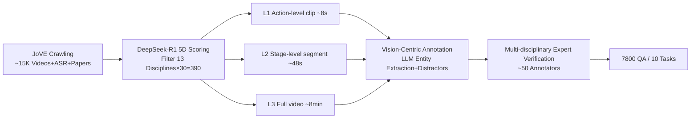

# ExpVid: A Benchmark for Experiment Video Understanding & Reasoning

**Conference**: ICLR 2026  
**OpenReview**: [https://openreview.net/forum?id=bj0ahFM4P0](https://openreview.net/forum?id=bj0ahFM4P0)  
**Code**: [https://github.com/OpenGVLab/ExpVid](https://github.com/OpenGVLab/ExpVid)  
**Area**: Multimodal Video Understanding / Scientific Experiment Benchmark  
**Keywords**: MLLM, Experiment Video, Scientific Reasoning, wet-lab, Fine-grained Perception, Procedure Understanding  

## TL;DR
ExpVid is the first benchmark to systematically evaluate the capability of Multimodal Large Language Models (MLLMs) in understanding **real-world wet-lab experiment videos**. Using a three-level task hierarchy of "Fine-grained Perception $\rightarrow$ Procedure Understanding $\rightarrow$ Scientific Reasoning," it reveals that current models excel at coarse-grained recognition but suffer significant performance drops in detail identification, state tracking, and "inferring scientific conclusions from operations."

## Background & Motivation
**Background**: MLLMs have advanced rapidly in general video understanding (action recognition, dense description, temporal localization) and knowledge-intensive evaluations (MMMU, Video-MMMU, MMVU). This progress fosters a desire to delegate parts of the scientific research workflow—perceiving experimental operations, verifying procedure integrity, and linking operations to scientific conclusions—to AI.

**Limitations of Prior Work**: Existing video or scientific benchmarks either focus on general movements and activities or remain at the "result recognition" level of medical imaging. They fail to address the **core challenges of real laboratory work**: micro-level operations like microliter pipetting that are visually subtle, small and often occluded tools, fine-grained materials and states, and long-range dependencies linking early preparation steps to downstream results.

**Key Challenge**: Scientific discovery relies heavily on wet experiments. The characteristics of wet experiments—being "step-by-step and tool-driven"—fall precisely into the blind spots of current benchmarks; no evaluation covers the full capability spectrum from "operation perception $\rightarrow$ procedure understanding $\rightarrow$ high-level scientific analysis."

**Goal**: To build an extensible and rigorous benchmark that aligns with the reality of experimental science, systematically diagnostic of MLLM capability boundaries on real experiment videos, and indicative of a roadmap for "trustworthy scientific research assistants."

**Core Idea**: **[Vision-Centric + Three-Level Task Hierarchy]** Experimental videos were collected from 390 peer-reviewed papers in the JoVE video journal. These were segmented into three temporal granularities: "second-level single step / minute-level multi-step / full experiment." A three-level task hierarchy mirroring a scientist's workflow was designed. An annotation pipeline involving "LLM automatic generation + multi-disciplinary expert verification" ensures each question **requires vision** to answer correctly.

## Method

### Overall Architecture
The construction of ExpVid follows a four-stage pipeline: "Collection $\rightarrow$ Preprocessing $\rightarrow$ Annotation $\rightarrow$ Verification." Approximately 15K experiment videos with ASR transcripts and papers were crawled from JoVE. DeepSeek-R1 was used to filter 390 high-quality videos (13 disciplines $\times$ 30 videos) based on five dimensions. Each video was processed into three temporal granularities (action-level clips / stage-level segments / full videos). Across these levels, 7,800 QAs across 10 task types were generated using "LLM entity extraction + template embedding + expert verification."

### Key Designs

**1. Three-Level Task Hierarchy: A Capability Spectrum Mirroring Scientist Workflows.** ExpVid decomposes evaluation into three layers aligned with temporal granularity. **Level-1 Fine-grained Perception** uses 4-choice MCQs on second-level clips across four categories: material recognition, tool recognition, quantity recognition (dosage/temperature/count), and operation recognition (e.g., distinguishing Insert from Attach), testing "can you see clearly?". **Level-2 Procedure Understanding** uses four task types on minute-level stage segments: Step Ordering, Sequence Generation (selecting ordered steps appearing in the clip from candidates), Completeness Verification (identifying the missing step), and Step Prediction (predicting the $n$-th step given $n-1$ steps), testing "do you understand logic and temporal sequence?". **Level-3 Scientific Reasoning** uses two fill-in-the-blank types on full videos: Experiment Analysis (inferring key conclusions from experimental data) and Scientific Discovery (abstracting broader scientific insights, significance, and improvement directions), testing "can you link operations to conclusions?". This hierarchical design systematically reveals model capability breakpoints.

**2. Vision-Centric Annotation: Forcing Models to "See" Rather than "Guess".** To prevent models from taking shortcuts via linguistic knowledge or ASR text, annotations deliberately **exclude answer clues from the narrator in the question prompt**. Specifically: for perception tasks, DeepSeek-R1 extracts materials/tools/quantities/operations from ASR sentences as targets, and Qwen2.5-VL provides "visual triggers" to verify the entity is indeed visible in the frame. Distractors are customized: materials/tools distractors reflect visual/functional similarity or common confusion; quantity distractors fall within close numerical ranges to simulate perception errors; operation distractors are "plausible but incorrect" actions in the same context. For Level-3, MinerU parses the Intro/Results/Discussion of accompanying papers, GPT-5 summarizes findings as anchors, and PhD-level experts design fill-in-the-blank questions that "can only be answered with the video, cannot be answered without it, and have unique answers." This design hard-codes "visual grounding" into the benchmark.

**3. Three Temporal Granularity Preprocessing: Three Difficulties from One Video.** A single video is sliced into three sets of materials. **Action-level clip**: ASR is split by punctuation, and each sentence is aligned to timestamps to crop videos, resulting in ~10K clip-text pairs (avg ~8s) for perception tasks. **Stage-level segment**: DeepSeek-R1 divides experiments into semantically coherent stages (Preparation/Main Operation/Post-processing) under "logic + causal continuity" constraints (20–60s each). Step descriptions from each segment form a segment step list, and the concatenated full step list serves as the basis for procedure understanding. **Full Video**: The complete experiment (avg ~8 min) is kept, with the end-of-video slides, charts, and data analysis segments deliberately removed to prevent "cheating by reading conclusions," forcing models to rely on procedure content for long-range structural reasoning.

**4. Semi-Automatic Annotation + Expert Verification Loop: Scalable and Rigorous.** The pipeline maintains ~50 annotators (~15 per category), using a specialized online platform with custom interfaces for each question type. Every annotation (even approvals) requires written justification for traceability. Unified criteria include: video-solvability, no leakage/shortcuts, step-specific visibility, clear format with unique answers. The process includes a one-month pilot (rubric alignment) + one-month formal annotation. A single experiment requires watching ~40 min of video and reading the paper, followed by question-by-question verification (L1 ~6–8 min, L2 ~13 min, L3 ~18 min), finally producing 7,800 QAs.

## Key Experimental Results

### Main Results (20 MLLMs, Selected Representatives, 3-Level Avg, %)

| Model | Think | L1 Avg | L2 Avg | L3 Avg |
|------|:---:|:---:|:---:|:---:|
| Human (Non-expert) | – | 37.6 | 42.1 | – (Unable to complete) |
| Qwen2.5-VL-7B | × | 42.6 | – | 23.3 |
| InternVL3.5-38B | ✓ | 44.0 | 36.0 | 31.9 |
| InternVL3-78B | ✓ | 50.9 | 41.9 | 37.7 |
| Intern-S1 | ✓ | 49.9 | 36.0 | 39.6 |
| Claude-Sonnet-4 | × | 40.8 | 36.0 | 29.6 |
| Gemini-2.5-Flash | ✓ | **60.2** | 49.8 | 43.0 |
| Gemini-2.5-Pro | × | 59.2 | 53.8 | 47.9 |
| **GPT-5** | ✓ | 53.3 | **57.5** | **56.4** |

### Comparison with Existing Benchmarks

| Benchmark | #QA | #Videos | Avg.Sec | #Tasks | Annotation | Area |
|------|:---:|:---:|:---:|:---:|:---:|:---:|
| MVBench | 4,000 | 3,641 | 16.0 | 20 | A+M | General |
| Video-MMMU | 900 | 300 | 506.2 | 3 | M | Multi-disc. |
| SFE | 830 | – | – | 66 | M | Science |
| **ExpVid** | **7,800** | **390** | **489.0** | **10** | **A+M** | **Science** |

### Key Findings
- **Closed-source models outperform open-source, with the gap widening as difficulty increases**: In the perception layer, Gemini-2.5-Flash(think) scores 60.2 vs the best open-source InternVL3-78B at 50.9; in the reasoning layer, GPT-5 scores 56.4, while the best open-source Intern-S1 lags at 39.6, a gap of nearly 17 points.
- **Leading closed-source models exceed non-expert humans**: Gemini-2.5-Flash-Think reached 60.2 in L1, and GPT-5 reached 57.5 in L2, both significantly outperforming the human baselines of 37.6 / 42.1 (humans without professional training were unable to complete L3).
- **Severe capability imbalance**: All models scored highest on Step Ordering (rearranging existing information; open-source InternVL3-78B reached 87.1, even surpassing GPT-5's 85.1). However, they generally failed on Completeness Verification and Step Prediction (identifying missing steps/predicting the future)—open-source models remain weak in long-range holistic reasoning.
- **Scaling is effective**: InternVL showed monotonic improvements in all three levels as size increased from 8B $\rightarrow$ 38B $\rightarrow$ 78B (L1: 39.4 $\rightarrow$ 44.0 $\rightarrow$ 50.9), validating model scale as a key axis for experiment video understanding.
- **Ablation Study on frames**: Removing video frames (w/o frames) caused significant score drops across all tasks, proving that the tasks indeed rely on vision rather than text shortcuts.

## Highlights & Insights
- **Filling the evaluation gap for real wet-lab videos**: Unlike medical imaging benchmarks limited to "result recognition," ExpVid addresses the experimental process itself—"step-by-step operations and tool-driven results."
- **Three-level hierarchy is diagnostic**: It precisely locates model capability breakpoints at "can see clearly but cannot track states, can rearrange but cannot fill gaps or predict, can perceive but cannot link to conclusions."
- **Vision-centric anti-shortcut mechanism**: Utilizing visual trigger verification, plausible distractors within the same scene, and removal of conclusion segments hard-locks "video watching," preventing models from exploiting LLM priors.
- **Naturally rigorous data source**: Using JoVE peer-reviewed videos and accompanying papers provides reliable anchors for Level-3 "operation $\rightarrow$ scientific conclusion" annotations.

## Limitations & Future Work
- **Disciplinary bias**: Primarily focuses on wet experiments (Bio/Chem/Med) and deliberately excludes computational and most physics experiments; not applicable to pure dry-lab or simulation scenarios.
- **JoVE as a single source + exo-view**: These are standardized external-view educational recordings, which still differ from the cluttered, first-person environments of real laboratory benches.
- **Level-3 evaluation relies on auxiliary LLM scoring**: Fill-in-the-blank questions use lightweight language models for per-blank accuracy against reference answers, which may introduce scoring noise.
- **Next steps**: As a diagnostic benchmark, it only reveals caps; how to use it to drive model capability improvements (e.g., data synthesis, RL) is left for future work.

## Related Work & Insights
- **General Video Benchmarks** (MVBench, Video-MME, MLVU, LVBench, VRBench): These have advanced perception and temporal reasoning but remain agnostic to domain-specific scientific knowledge and experimental context.
- **Knowledge-Intensive/Scientific Benchmarks** (MMMU, Video-MMMU, MMVU, ChemBench, SFE, SCI-VID): These emphasize multi-disciplinary expert-level knowledge but mostly focus on result recognition rather than "understanding the entire experiment."
- **Insights**: ExpVid suggests that the bottleneck for next-generation "scientific research assistant" MLLMs is not coarse-grained recognition, but **cross-step state tracking + procedure integrity verification + causal reasoning from operations to conclusions**—capabilities most needed for agentic scientific workflows.

## Rating
- **Novelty**: ⭐⭐⭐⭐⭐ First systematic benchmark for real wet-lab experiment videos, covering the full "perception $\rightarrow$ procedure $\rightarrow$ reasoning" capability spectrum with a solid vision-centric anti-shortcut design.
- **Experimental Thoroughness**: ⭐⭐⭐⭐ Evaluated 20 open/closed-source models across 10 task categories, including human baselines and ablations for frames and scaling; disciplinary scope is slightly limited to wet labs.
- **Writing Quality**: ⭐⭐⭐⭐ Clear presentation of the three-level hierarchy and construction pipeline; diagrams are highly informative.
- **Value**: ⭐⭐⭐⭐⭐ Points to clear improvement directions for "trustworthy scientific assistant" MLLMs; the benchmark and data are open-sourced, providing long-term reference value for embodied/agentic scientific discovery.

<!-- RELATED:START -->

## Related Papers

- [\[CVPR 2026\] Towards Sparse Video Understanding and Reasoning](../../CVPR2026/vlm_reasoning/towards_sparse_video_understanding_and_reasoning.md)
- [\[ICLR 2026\] IV-Bench: A Benchmark for Image-Grounded Video Perception and Reasoning in Multimodal LLMs](iv-bench_a_benchmark_for_image-grounded_video_perception_and_reasoning_in_multim.md)
- [\[CVPR 2026\] Agentic Video Summarization via Self-Reflecting Multimodal Understanding](../../CVPR2026/vlm_reasoning/agentic_video_summarization_via_self-reflecting_multimodal_understanding.md)
- [\[ICLR 2026\] TimeSearch-R: Adaptive Temporal Search for Long-Form Video Understanding via Self-Verification Reinforcement Learning](timesearch-r_adaptive_temporal_search_for_long-form_video_understanding_via_self.md)
- [\[ICML 2026\] VideoKR: Towards Knowledge- and Reasoning-Intensive Video Understanding](../../ICML2026/vlm_reasoning/videokr_towards_knowledge-_and_reasoning-intensive_video_understanding.md)

<!-- RELATED:END -->
