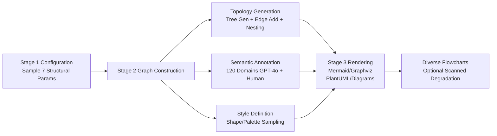

# FlowGen: Synthesizing Diverse Flowcharts to Enhance and Benchmark MLLM Reasoning

**Conference**: ICLR 2026  
**OpenReview**: [https://openreview.net/forum?id=uimrBBfDCH](https://openreview.net/forum?id=uimrBBfDCH)  
**Code**: [https://github.com/nju-websoft/FlowGen](https://github.com/nju-websoft/FlowGen)  
**Area**: Multimodal Reasoning / Visual Document Understanding / Data Synthesis  
**Keywords**: Flowchart Understanding, Controllable Data Synthesis, MLLM, Structural Parsing, Cross-Renderer Generalization  

## TL;DR
This paper proposes FlowGen, a controllable flowchart synthesizer that utilizes seven structural parameters and four rendering backends to generate diagrams on-demand. It synthesizes massive training data to significantly enhance the flowchart parsing capabilities of open-source MLLMs (approaching closed-source models) and generates a rigorous benchmark where even GPT-4o fails to achieve a 25% F1 score.

## Background & Motivation
**Background**: Flowcharts combine symbolic information with spatial layouts and serve as the most common graphical language in scientific research, business modeling (BPMN), software documentation, and education. Enabling MLLMs to read flowcharts end-to-end and extract structural representations is fundamental for downstream tasks like code generation, document knowledge extraction, and workflow reasoning.

**Limitations of Prior Work**: Existing flowchart datasets (FlowVQA, FlowLearn, CBD, hdBPMN, etc.) lack **fine-grained control over key attributes**—one cannot specify "how many branches," "nesting depth," or "edge density" a diagram should have. Most test sets use a single rendering style (e.g., exclusively Mermaid), failing to evaluate model robustness to style variations. Training sets are often small-scale, domain-specific, and lack structural features like nesting. Consequently, models fail when encountering high complexity or cross-renderer diagrams.

**Key Challenge**: Real-world flowcharts are **highly diverse** in structural complexity and visual style, whereas existing static datasets are **fixed and non-adjustable**. This lack of controllability hinders both model training and systemic evaluation.

**Goal**: To use a controllable synthesizer to simultaneously fill the gaps of "insufficient training resources" and "lacking challenging test resources" by turning structural complexity and rendering styles into adjustable knobs.

**Core Idea**: **[Controllable Synthesis]** Instead of manual annotation or web crawling, the topological structure and visual style of flowcharts are fully parameterized. Starting from a compact configuration, the system automatically generates structurally valid, semantically coherent, and stylistically diverse flowcharts, allowing for "unlimited on-demand supply" of both training and test sets.

## Method

### Overall Architecture
FlowGen is a three-stage pipeline: **Configuration → Graph Construction → Rendering**. Given a compact parameter configuration, the synthesizer first samples structural parameters controlling topology and semantic complexity. It then constructs a semantically coherent Directed Acyclic Graph (DAG) as the skeleton. Finally, it uses four distinct rendering backends to render the abstract graph into visual flowcharts. These stages respectively manage structural complexity, semantic richness, and visual appearance.

### Key Designs

**1. Seven-Parameter Structural Knobs: Defining "Diagram Difficulty" via Configuration.** This is the core of the methodology. The synthesizer characterizes the topology and semantic complexity of a flowchart using seven parameters: graph order $\nu$ (total nodes, divided into 8–12 / 13–20 / 21–30) determines the overall scale; split arrows $\epsilon_s$ and merge arrows $\epsilon_m$ introduce "virtual nodes" to simulate flow divergence into concurrent branches or convergence into a single flow; the branching factor $\Delta_b$ controls the maximum in/out-degree of these virtual nodes; density $\rho=\epsilon/\nu$ (edge-to-node ratio) adjusts visual crowding; the unlabeled edge ratio $\lambda\in[0,1]$ controls semantic sparsity—$\lambda=0$ means every edge has a text label, while $\lambda=1$ results in bare edges, maximizing reasoning difficulty; the number of nested subgraphs $\eta$ adds hierarchical depth beyond global node counts. Combining these knobs enables the precise generation of a continuous difficulty spectrum from Easy to Hard.

**2. Topology Generation: From Spanning Trees to Valid Nested DAGs.** Given sampled parameters, construction follows three steps. First, a random **spanning tree** is generated over $\nu$ nodes as an acyclic skeleton to ensure reasonable node positioning. Next, additional edges are added according to $\epsilon_s, \epsilon_m, \Delta_b$ to enhance connectivity; if edge counts remain below the target density $\rho$, random acyclic edges are supplemented. Finally, hierarchical depth is introduced by randomly selecting 2 to 5 connected nodes to be packaged into a higher-level node (controlled by $\eta$), with subgraphs constrained to be non-overlapping to maintain clarity. This ensures structural validity regardless of parameter sampling.

**3. Semantic Annotation + Style Definition: Ensuring Meaningful and Aesthetic Graphs.** Topology alone is insufficient; models must read "contentful" diagrams. The synthesizer samples a theme from **120 predefined application domains**. Each domain provides 40 node names and 40 edge labels (generated by GPT-4o and verified by humans). Labels are assigned to edges with probability $1-\lambda$ to maintain semantic coherence. For styling, a predefined dictionary is used: node/edge shapes are sampled randomly, and 5 color palettes are drawn from a pool of 90 for each instance to color borders, fills, and edges—enriching visual diversity while maintaining internal thematic consistency.

**4. Multi-Renderer Backends: Creating Style Gaps with Four Engines.** Real-world flowcharts come from various tools; models trained on a single style often fail on others. FlowGen integrates **Mermaid, Graphviz, PlantUML, and Diagrams** as complementary backends, each with unique syntax, layout algorithms, and visual conventions (Mermaid is lightweight/web-native, Graphviz excels at hierarchical layouts, PlantUML supports modular subgraphs, and Diagrams supports programmatic clusters). Abstract graphs are translated into backend-specific elements. Optionally, diagrams can be rasterized into "scanned" versions with blur, perspective distortion, and lossy compression to simulate real-world degradation.

## Key Experimental Results

### Main Results (Flowchart Parsing, strict F1 / relaxed rF1, excerpt)

| Model | FlowVQA F1 | CBD F1 | FC_A F1 | FlowLearn F1 | hdBPMN F1 |
|------|-----------|--------|---------|--------------|-----------|
| GPT-4o (Closed) | 88.2 | 64.5 | 41.9 | 53.9 | 26.5 |
| GLM-4V-Plus (Closed) | 74.0 | 55.6 | 33.0 | 31.6 | 8.6 |
| Qwen2.5-VL-3B | 12.7 | 17.9 | 2.8 | 20.6 | 2.3 |
| Qwen2.5-VL-3B **+SFT** | **51.3** | **49.8** | **22.4** | **41.6** | **8.4** |
| Qwen2.5-VL-7B | 59.4 | 49.1 | 25.8 | 43.2 | 16.6 |
| Qwen2.5-VL-7B **+SFT** | **70.9** | **55.4** | **29.5** | **60.1** | **18.3** |

After fine-tuning on FlowGen, Qwen2.5-VL-7B **outperforms the closed-source GLM-4V-Plus** on FlowLearn (60.1 vs 31.6) and hdBPMN (18.3 vs 8.6), proving that synthetic data yields genuine cross-domain generalization rather than overfitting.

### Ablation Study (Qwen2.5-VL-7B, strict F1, fixed total data volume)

| Training Variant | FlowVQA | CBD | FC_B | hdBPMN | FlowLearn |
|----------|---------|-----|------|--------|-----------|
| Full FlowGen | 70.9 | 55.4 | 40.8 | **18.3** | 60.1 |
| w/o Multi-renderer (Mermaid only) | 76.2 | 53.3↓ | 38.1↓ | 17.0↓ | 60.9 |
| w/o Nested subgraphs | 70.0 | 54.6 | 40.6 | 16.6↓ | 59.2 |
| w/o Split/Merge arrows | 69.6 | 54.3 | 38.8↓ | 17.7 | 58.3↓ |

Removing multi-renderer support slightly improves performance on Mermaid-based FlowVQA/FlowLearn due to distribution alignment, but significantly degrades performance on cross-renderer CBD/FC_B, highlighting the importance of stylistic diversity. Removing nesting primarily hurts performance on hdBPMN, the only real-world benchmark with significant nesting.

### Benchmark Results (FlowGen Test Subset, strict F1, excerpt)

| Model | Graph-Easy | Graph-Medium | Graph-Hard | Scanned-Hard |
|------|-----------|--------------|------------|--------------|
| GPT-4o | 38.4 | 16.2 | 12.0 | 20.5 |
| Gemini-2.5-Flash | 43.2 | 13.7 | 9.7 | 21.6 |
| Qwen2.5-VL-3B | 20.4 | 6.2 | 2.9 | 9.0 |

### Key Findings
- **Universal and Transferable Training Gains**: Fine-tuning small open-source models results in multiple-fold F1 increases (e.g., Qwen2.5-VL-3B on FlowVQA from 12.7 to 51.3), which generalizes to various real-world datasets.
- **Effectiveness of Triplets as Intermediate Representations**: Feeding triplets extracted by FlowGen-tuned models into QA systems yields accuracy close to gold-standard levels (FlowLearn 88.2 vs 89.1), significantly exceeding model self-extraction (77.1).
- **Extremely Challenging Benchmark**: Even GPT-4o and Gemini-2.5-Flash fail to reach 25% F1 on most subsets. Performance bottlenecks stem primarily from **complex topological structures** (branching/nesting) rather than superficial rendering effects.
- **Error Profiling**: In 50 analyzed failure cases, OCR errors accounted for 56%, edge ambiguity 44%, and complex nesting 40% (cases often involve multiple error types).

## Highlights & Insights
- **"Data" as a "Function"**: The primary contribution is the use of parameterized synthesis to solve data scarcity for both training and testing. The training set is theoretically infinite, and the test difficulty is continuously adjustable, removing the ceiling imposed by static datasets.
- **Falsifiable Difficulty**: Models trained and tested on FlowGen's own data—the most favorable condition—remain far from saturation. This cleanly demonstrates that the difficulty arises from topology rather than rendering noise, providing a solid attribution analysis.
- **Open-source Approaching Closed-source**: The work proves that high-quality controllable synthetic data allows small open-source models to match or exceed closed-source giants on specific structural tasks, providing significant value to resource-constrained researchers.

## Limitations & Future Work
- Synthetic diagrams are still "programmatically generated," leaving a distribution gap with authentic hand-drawn or scanned charts (e.g., FC_A/FC_B). Absolute performance on real-world benchmarks like hdBPMN remains low.
- Semantics rely on 120 fixed domains + GPT-4o word lists; thematic coverage and linguistic diversity are limited, potentially leaving long-tail domains as blind spots.
- While combined training shows cross-subset generalization, it often underperforms compared to subset-specific training, indicating significant distribution differences across complexity/degradation dimensions.
- Evaluation still centers on triplet exact/relaxed matching, which provides limited insight into truly complex reasoning (e.g., multi-hop workflow inference).

## Related Work & Insights
- **Flowchart Dataset Genealogy**: Unlike FlowchartQA, FlowVQA (Mermaid only), FlowLearn (8k training, single renderer), or hdBPMN (hand-drawn BPMN), FlowGen is the first to support branching + nesting across multi-renderers with "unlimited" controllable volume.
- **Controllable Data Synthesis Philosophy**: This follows the trend in vision/text domains of using synthetic data to address the shortcomings of real data. The takeaway is: when the bottleneck of a task is **controllability** rather than quantity, parameterizing the generation process and creating continuous difficulty knobs is more effective than simple data scaling.
- **Structural Intermediate Representations**: The paradigm of parsing visual diagrams into triplets before performing QA can be transferred to other "graphical language" tasks such as tables, circuit diagrams, and UML.

## Rating
- **Novelty**: ⭐⭐⭐⭐ The combination of controllable parameterized synthesis and multi-renderer backends is a first for flowcharts, effectively addressing both training and testing data dilemmas.
- **Experimental Thoroughness**: ⭐⭐⭐⭐ Covers 10 MLLMs, 6 parsing benchmarks + 4 QA benchmarks, with comprehensive ablation, error analysis, and diversity quantification.
- **Writing Quality**: ⭐⭐⭐⭐ Clear parameter definitions, intuitive pipeline diagrams, well-organized tables, and well-supported conclusions.
- **Value**: ⭐⭐⭐⭐ Open-source code and data that enable small models to approach closed-source performance, while providing a highly discriminative benchmark.

<!-- RELATED:START -->

## Related Papers

- [\[ICLR 2026\] Game-RL: Synthesizing Multimodal Verifiable Game Data to Boost VLMs' General Reasoning](game-rl_synthesizing_multimodal_verifiable_game_data_to_boost_vlms_general_reaso.md)
- [\[ICLR 2026\] CircuitSense: A Hierarchical MLLM Benchmark Bridging Visual Comprehension and Symbolic Reasoning in Engineering Design Process](circuitsense_a_hierarchical_mllm_benchmark_bridging_visual_comprehension_and_sym.md)
- [\[ICLR 2026\] ExpVid: A Benchmark for Experiment Video Understanding & Reasoning](expvid_a_benchmark_for_experiment_video_understanding_reasoning.md)
- [\[ICLR 2026\] Ref-Adv: Exploring MLLM Visual Reasoning in Referring Expression Tasks](ref-adv_exploring_mllm_visual_reasoning_in_referring_expression_tasks.md)
- [\[CVPR 2026\] CRIT: Graph-Based Automatic Data Synthesis to Enhance Cross-Modal Multi-Hop Reasoning](../../CVPR2026/vlm_reasoning/crit_graph-based_automatic_data_synthesis_to_enhance_cross-modal_multi-hop_reaso.md)

<!-- RELATED:END -->
