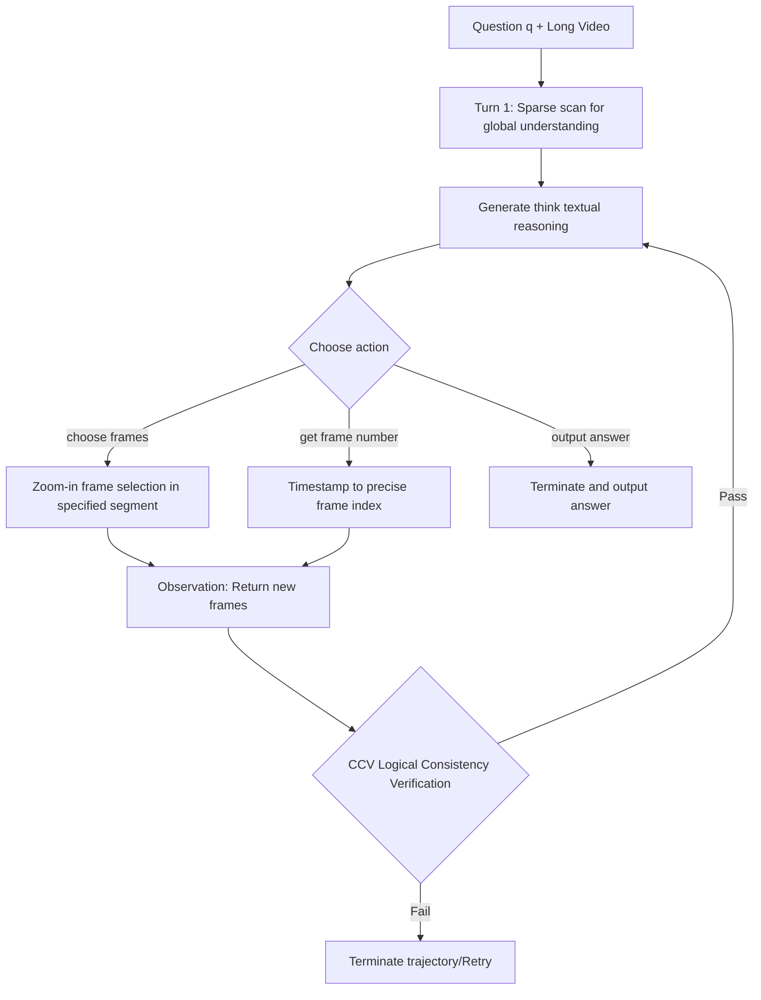

# FrameThinker: Learning to Think with Long Videos via Multi-Turn Frame Spotlighting

**Conference**: ICLR 2026  
**OpenReview**: [https://openreview.net/forum?id=nsNpsCpVG1](https://openreview.net/forum?id=nsNpsCpVG1)  
**Code**: [https://github.com/lcqysl/FrameThinker](https://github.com/lcqysl/FrameThinker)  
**Area**: Multimodal / Long Video Reasoning / Reinforcement Learning  
**Keywords**: Long Video Reasoning, LVLM, Multi-turn Interaction, Active Frame Selection, GRPO, Reward Design  

## TL;DR
FrameThinker enables visual language models to "think while watching long videos" like a detective—initially performing a sparse scan, then "zooming in" to key segments for multi-turn frame selection based on reasoning needs. Using SFT for action syntax and RL for decision strategy, it achieves a new SOTA of 76.1% on LongVideo-Reason with an average of 20.6 frames (compared to 512 frames used by competitors).

## Background & Motivation
**Background**: Large Vision-Language Models (LVLMs) such as Qwen2.5-VL, Gemini, and GPT-4o have made significant progress in video understanding. Since DeepSeek-R1, reasoning models utilizing Reinforcement Learning from Verifiable Rewards (RLVR), such as Video-R1, VideoChat-R1, and LongVILA-R1, have emerged, even surpassing closed-source models on multiple benchmarks.

**Limitations of Prior Work**: Existing methods rely almost exclusively on **uniform sparse sampling**, where long videos are sampled into a fixed set of frames before being fed to the model. In long videos, this approach is inefficient (processing many irrelevant frames), prone to missing key frames, and can hinder reasoning due to long, noisy contexts. More crucially, reasoning occurs **solely in the text space**, where visual information serves only as a static starting point; the model cannot "re-watch" parts of the video after the initial input. While video agents can interact via tools, they often depend on predefined workflows and external models, preventing the decision strategy from being learned end-to-end from data.

**Key Challenge**: Long video reasoning requires "on-demand and dynamic" evidence acquisition. However, passive uniform sampling fixes "what to see" before reasoning begins—forcibly decoupling perception from reasoning and preventing the model from revisiting visual cues based on its internal thought process.

**Goal**: To endow models with the ability to "think with long videos," shifting the paradigm from **passive one-time processing** to **active multi-turn iterative reasoning**, thereby improving reasoning accuracy while significantly reducing the number of processed frames.

**Core Idea**: [Active Interaction] Treat the video as a repeatedly queryable environment. In each step, the model outputs `<think>` followed by an `<action>` (select frames / query frame index by timestamp / output answer), interlacing textual reasoning with visual frames to form a multimodal Chain-of-Thought. [Two-stage Training + Reward Exploration] First, use SFT to teach action syntax, followed by GRPO reinforcement learning to learn strategies. Systematically explore the reward design space for multi-turn video reasoning to identify and fix issues like mode collapse and "speculative non-logical actions."

## Method

### Overall Architecture
FrameThinker models long video reasoning as a multi-turn "Think-Action-Observation" loop. Given a question $q$, the model generates a trajectory $\tau = ((t_1,a_1,o_1),\dots,(t_n,a_n,o_n))$, where $t_j$ is the textual reasoning within `<think>` tags, $a_j$ is the chosen action within `<action>` tags, and $o_j$ is the observation returned by the environment (a set of frames, a frame index, or a termination signal). The model begins with a sparse scan for global understanding, then "zooms in" to promising segments, iterating until sufficient evidence is gathered to output an answer. Training consists of two stages: SFT for basic action syntax and RL (GRPO) for decision strategy optimization, with a CCV module ensuring consistency between reasoning and actions.

### Key Designs

**1. Three Action Space: Turning "Re-watching" into Executable Operations**. FrameThinker defines three actions for long video reasoning, allowing the model to revisit the video mid-reasoning. `choose frames between START and END` is the core visual exploration action, retrieving a small segment (e.g., 8 frames) from a specified time range to achieve a "zoom-in" effect. `get frame number at time MM:SS` is an auxiliary action that translates human-readable timestamps into precise frame indices to enhance temporal awareness. `output answer` is the termination action used when sufficient evidence is collected. The structured output `<think>...</think><action>...</action>` explicitly separates reasoning from action, making each decision traceable to textual justification.

**2. Two-stage Training: SFT for Syntax + GRPO for Strategy**. Direct RL training fails as models lack basic action syntax. Conversely, pure SFT leads to rote memorization of fixed solution paths and fragile generalization. Thus, SFT is first performed on a carefully curated small dataset of **only 2,392 entries**, calculating cross-entropy loss only on tokens within `<think>` and `<action>` tags. This is followed by RL on a **larger and more diverse 28k dataset** to avoid overfitting. GRPO is utilized: for each query, $G$ trajectories are sampled from the old policy, using group-relative reward normalization to construct the advantage $A_i = \frac{R_i - \mathrm{mean}(\{R\})}{\mathrm{std}(\{R\}) + \delta}$. The optimization objective is $J_{\text{GRPO}}(\theta) = \mathbb{E}\big[\frac{1}{G}\sum_i \min(r_i A_i,\ \mathrm{clip}(r_i,1-\epsilon,1+\epsilon)A_i)\big]$, omitting the KL term for efficiency.

**3. Reward Design: From Format Rewards to Conditional Action Rewards**. Multi-turn interaction introduces new challenges in reward design. **Format reward?** No—large format rewards create "speculative incentives": early in training, models find they can obtain format points by guessing answers without reasoning, whereas taking actions risks zero points for formatting errors. **Unconditional or Conditional Action Rewards?** Unconditional rewards (awarding any action) lead to mode collapse (repeating the same action). Thus, **conditional rewards** are used—rewards are given only if an action exists within a trajectory leading to the correct answer ($R_{acc}=1$): $R_{\text{total}} = R_{acc} + R_{\text{action}}$, where $R_{\text{action}} = \lambda_{cf}\cdot\mathbb{I}(cf\in\tau) + \lambda_{gfn}\cdot\mathbb{I}(gfn\in\tau)$. **Action bias?** Set $\lambda_{gfn}\gg\lambda_{cf}$ because frame selection is hard to supervise, while querying frame numbers is objectively verifiable and provides high information density. **Encourage more turns?** Rewarding turn counts directly ($R_{\text{action}} = k\cdot(T-1)$) causes training to collapse as the model adds unnecessary turns to stack rewards.

**4. CCV: Cognitive Consistency Verification for "Speculative" Actions**. Conditional rewards solve mode collapse, but models may still execute non-logical actions that "happen to be in a successful trajectory"—e.g., thinking about one segment but selecting another. CCV is a **rule-based filter** that checks for redundancy, logical flow, and thought-action fidelity. The final reward is $R_{\text{final}} = R_{\text{total}} \cdot V_{\text{CCV}}(\tau)$, where $V_{\text{CCV}}$ is 1 for success and 0 for failure, zeroing out non-logical trajectories. During inference, CCV acts as a guardrail, terminating or retrying non-logical attempts.

## Key Experimental Results

### Main Results

Reasoning benchmarks (Backbone: Qwen2.5-VL-7B):

| Model | Video-Holmes Frames/Acc | LongVideo-Reason Frames/Acc |
|------|------|------|
| GPT-4o | 32 / 42.0 | - |
| Gemini-1.5-Pro | 32 / 41.2 | - / 69.3 |
| LongVILA-R1 | - | 512 / 72.0 |
| Video-R1 | 32 / 36.5 | - / 68.1 |
| VideoChat-R1 | 32 / 33.0 | 32 / 67.2 |
| Qwen2.5-VL-7B | 32 / 27.8 | 32 / 64.1 |
| **FrameThinker** | **15.9 / 46.8** | **20.6 / 76.1** |
| Gain vs Baseline | **-50% Frames / +19.0** | **-36% Frames / +12.0** |

Long video understanding benchmarks:

| Model | LongVideoBench Frames/Acc | MLVU Frames/Acc | VideoMME-Long Frames/Acc | LVBench Frames/Acc |
|------|------|------|------|------|
| Video-R1 | 32 / 52.7 | 32 / 60.2 | 32 / 48.2 | 32 / 35.3 |
| Qwen2.5-VL-7B | 32 / 43.2 | 32 / 48.4 | 32 / 41.9 | 32 / 31.6 |
| **FrameThinker** | **21.1 / 52.9** | **23.2 / 59.1** | **24.1 / 47.6** | **23.9 / 36.6** |
| Gain vs Baseline | -34% / +9.7 | -28% / +10.7 | -25% / +5.7 | -25% / +5.0 |

Average accuracy across six benchmarks is **53.2%**, a **+10.4%** improvement over the Qwen2.5-VL-7B baseline, with significantly fewer frames.

### Ablation Study

| Ablation Item | Key Finding |
|------|------|
| Training Stages | The full SFT+RL scheme significantly outperforms fine-tuning the baseline with only SFT or RL. |
| Format reward | Action usage dropped sharply in early training, inhibiting exploration → Discarded. |
| CCV Module | Enabling CCV during both training and inference brings tangible performance gains. |
| Action Reward Config | $\lambda_{gfn}=0.2, \lambda_{cf}=0$ (favoring frame index queries) performed best. |

### Key Findings
- **Extreme Frame Efficiency**: Achieved 76.1% on LongVideo-Reason with only 20.6 frames, surpassing LongVILA-R1 (72.0% with 512 frames) despite using 20x fewer frames.
- **Seeing Less, Understanding More**: Proved that reducing frame count by 25%–50% improves accuracy, confirming that noisy context hinders reasoning.
- **Reward Design is Critical**: Identified and avoided three counter-intuitive traps: format rewards inhibiting exploration, unconditional rewards causing collapse, and turn-count greed causing training failure.

## Highlights & Insights
- **Paradigm Shift**: Transforms long video reasoning from "one-time uniform sampling" to "detective-style multi-turn zooming," materializing the "thinking with videos" concept via multimodal Chain-of-Thought.
- **Systematic Reward Ablations**: Addressed four "should we..." questions through empirical evidence, revealing unique traps in multi-turn RLVR (speculative format scores, mode collapse, non-logical actions, turn greed).
- **CCV Utility**: The rule-based filter clears "non-logical success" trajectories and serves as both a training regularizer and an inference guardrail.
- **Efficiency and Effectiveness**: A 7B model refreshed the SOTA while saving an order of magnitude in frame count, making it highly practical for deployment.

## Limitations & Future Work
- **Limited Action Space**: Only three actions (frame selection, index query, answer) are defined, excluding fine-grained spatial cropping, object tracking, or cross-segment comparison.
- **Rule-based CCV**: Consistency verification relies on rules which may not generalize to all question types; a learned validator would be more robust.
- **Weak Frame Selection Supervision**: Direct supervision for which frames to select is lacking; the model relies on indirect constraints from frame index queries.
- **Single Backbone**: Experiments focused on Qwen2.5-VL-7B; transferability to other architectures or scales remains to be verified.

## Related Work & Insights
- **Video Understanding (RLVR)**: While Video-R1/VideoChat-R1 use verifiable rewards, they remain passive. FrameThinker pushes the "what to see" decision into the policy.
- **Video Agents**: Unlike agents with fixed workflows, FrameThinker learns an end-to-end strategy for autonomous video interaction.
- **Thinking with Images**: This work extends the "think with images" paradigm to the temporal dimension, suggesting that active retrieval is far more efficient than context-filling.

## Rating
- **Novelty**: ⭐⭐⭐⭐⭐ The active multi-turn selection paradigm is novel, and the systematic exploration of reward design is a significant contribution.
- **Experimental Thoroughness**: ⭐⭐⭐⭐ Comprehensive coverage across six benchmarks and extensive ablations, though verification across more backbones would be beneficial.
- **Writing Quality**: ⭐⭐⭐⭐⭐ Clear progression from motivation to method and ablations; the "should we" narrative for rewards is particularly engaging.
- **Value**: ⭐⭐⭐⭐⭐ Refreshing SOTA with a 7B model using 20x fewer frames is highly valuable for the efficiency of long video reasoning.

<!-- RELATED:START -->

## Related Papers

- [\[CVPR 2026\] Thinking With Videos: Multimodal Tool-Augmented Reinforcement Learning for Long Video Reasoning](../../CVPR2026/vlm_reasoning/thinking_with_videos_multimodal_tool-augmented_reinforcement_learning_for_long_v.md)
- [\[CVPR 2026\] LongVT: Incentivizing "Thinking with Long Videos" via Native Tool Calling](../../CVPR2026/vlm_reasoning/longvt_incentivizing_thinking_with_long_videos_via_native_tool_calling.md)
- [\[CVPR 2026\] Learning Transferable Temporal Primitives for Video Reasoning via Synthetic Videos](../../CVPR2026/vlm_reasoning/learning_transferable_temporal_primitives_for_video_reasoning_via_synthetic_vide.md)
- [\[ICLR 2026\] TimeSearch-R: Adaptive Temporal Search for Long-Form Video Understanding via Self-Verification Reinforcement Learning](timesearch-r_adaptive_temporal_search_for_long-form_video_understanding_via_self.md)
- [\[ICLR 2026\] VTool-R1: VLMs Learn to Think with Images via Reinforcement Learning on Multimodal Tool Use](vtool-r1_vlms_learn_to_think_with_images_via_reinforcement_learning_on_multimoda.md)

<!-- RELATED:END -->
