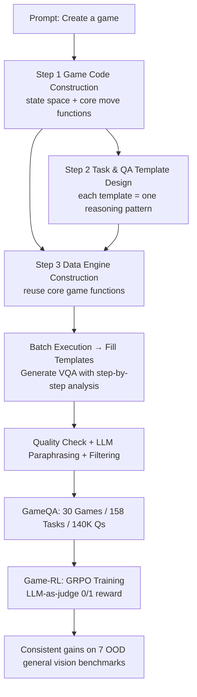

# Game-RL: Synthesizing Multimodal Verifiable Game Data to Boost VLMs' General Reasoning

**Conference**: ICLR 2026  
**Code**: [https://github.com/tongjingqi/Game-RL](https://github.com/tongjingqi/Game-RL)  
**Area**: Multimodal Vision-Language Models / Reinforcement Learning / Reasoning Data Synthesis  
**Keywords**: VLM, GRPO, Verifiable Reward, Game Data, Code2Logic, General Reasoning  

## TL;DR
The game code is "distilled" into verifiable VQA data with step-by-step analysis (GameQA: 30 games / 158 tasks / 140,000 questions). By performing GRPO reinforcement learning solely on game data, multiple VLMs achieve consistent performance improvements across seven completely out-of-domain (OOD) general vision reasoning benchmarks.

## Background & Motivation
**Background**: Vision-language reinforcement learning (RLVR) has significantly enhanced reasoning capabilities through verifiable rewards. However, training scenarios are heavily concentrated in narrow domains like **geometry and chart reasoning**, as these fields naturally provide standard answers and easy verification. Other resources that could provide rich visual elements and verifiable feedback for VLMs remain largely untapped.

**Limitations of Prior Work**: Video games are an overlooked "gold mine"—they offer rich visual scenes, text, and simple rules that can be precisely verified by programs within fully controllable environments. However, existing works (ING-VP, BALROG, VideoGameBench, VCbench) treat games only as **evaluation benchmarks**. No existing research effectively utilizes game data for **training**, primarily because game processes are not converted into trainable VQA formats.

**Key Challenge**: While games are naturally suited for RLVR training, manual annotation of game reasoning processes is costly, difficult to scale, and error-prone. Human labeling cannot simultaneously achieve "infinite quantity, controllable difficulty, and verifiable answers."

**Goal**: This work constructs a method to automatically synthesize large-scale verifiable reasoning data from games, proving that training exclusively on game data can enhance the **general** (cross-domain) reasoning abilities of VLMs.

**Core Idea (Code2Logic + Game-RL)**: Game code encodes the complete logic chain of "state → action → new state." **By mapping game code to reasoning logic, the code serves as a data engine to automatically produce batch questions with correct step-by-step analysis.** Subsequently, GRPO is applied using only game data for reinforcement learning.

## Method

### Overall Architecture
The approach consists of two layers: **Code2Logic** is responsible for synthesizing GameQA data from game code, while **Game-RL** handles GRPO training on GameQA. The key insight of Code2Logic is that "game code = executable form of reasoning logic," which transforms code into data through three steps. Game-RL uses an LLM-as-judge to provide 0/1 outcome rewards to drive GRPO.

### Key Designs

**1. Code2Logic transforms game code into verifiable data in three steps: From "writing code" to "generating questions + verifying answers."** In the first step, **game code construction**, Claude 3.5 / GPT-4o generates complete code for simple games like Sokoban from a single-sentence prompt. The code defines the state space (walls/players/boxes/targets) and core functions (e.g., `move`) for state transition rules, which are reused later. In the second step, **task and QA template design**, tasks are designed based on visual elements and action spaces (e.g., "Where is the player after X moves?"). Specific Q&A pairs are abstracted into templates with placeholders; **a single template encapsulates a reasoning pattern** within the game. Tasks are categorized into Target Perception, State Prediction, and Strategy Optimization. In the third step, **data engine construction**, an LLM writes a program based on the initial game code, consisting of four modules: environment initialization, task instance proposal, task instance solving, and QA construction. **The solver module reuses the `move` logic from the game code to simulate every step** (including collisions and box pushing), ensuring the generated step-by-step analysis is inherently correct. Executing this engine allows for infinite batch generation of questions.

**2. Using game code as a "solver" ensures correct step-by-step analysis, followed by LLM rewriting to remove template patterns.** Since answers are generated through deterministic simulation by game code, each question includes the final answer and a complete intermediate reasoning trajectory (e.g., "Move 1 - Left: (2,3)→(2,2) … Final position"). This provides the process-style supervision required for RL. To avoid repetitive and formulaic text from templates, **paraphrasing** is performed using an LLM to diversify expression, followed by **data filtering** to ensure correctness, appropriate length, and lack of excessive repetition. Human verification is involved at every step: game code is checked via manual execution, the data engine is tested by humans, and complex game features are retrieved from open-source code fed to the LLM.

**3. GameQA: 30 Games × 4 Cognitive Categories × 3 Difficulty Levels with In/Out-of-Domain splitting.** The final dataset contains 30 games, 158 tasks, and approximately 140,000 questions. These are categorized by core cognitive abilities: 3D spatial perception and understanding, pattern recognition and matching, multi-step reasoning, and strategic planning. Question formats are exclusively multiple-choice (7-8 options) or fill-in-the-blank (numbers/coordinates) for easy machine verification. Difficulty is adjusted via QA Level (question complexity) and Plot Level (image complexity/grid size). Crucially, the 30 games are split into **20 in-domain games for training and 10 out-of-domain games reserved for generalization testing**, rigorously proving that training on Game A generalizes to unseen Game B and general benchmarks.

**4. Game-RL: Pure outcome reward via GRPO + LLM-as-judge.** Training follows the standard DeepSeek format of GRPO, with the loss function defined as:
$$J_{GRPO}(\theta)=\mathbb{E}\Big[\frac{1}{G}\sum_{i=1}^{G}\frac{1}{|o_i|}\sum_{t=1}^{|o_i|}\big(\min[r_{i,t}\hat{A}_{i,t},\,\text{clip}(r_{i,t},1-\epsilon,1+\epsilon)\hat{A}_{i,t}]-\beta D_{KL}[\pi_\theta\|\pi_{ref}]\big)\Big]$$
where $r_{i,t}=\pi_\theta(o_{i,t}|q,o_{i,<t})/\pi_{\theta_{old}}(o_{i,t}|q,o_{i,<t})$. The reward is **strictly based on the correctness of the final answer**: Qwen2.5-32B-Instruct-AWQ acts as a judge to determine if the model's output is semantically equivalent to the ground truth (reward=1 if correct, else 0). An LLM judge is used instead of rule matching because the same answer can be written in multiple formats (e.g., `(2,3)` vs `x=2, y=3`). Manual inspection of 300 cases confirmed 100% judge accuracy. GRPO hyperparameters: 12 rollouts per question, 1 epoch, learning rate 2e-7, $\epsilon=0.2$, $\beta=0.04$.

## Key Experimental Results

### Main Results (Training on Pure Game Data → General Benchmark Generalization)
Three VLMs were fine-tuned with GRPO on 5K GameQA samples. Average scores across 7 general vision benchmarks are as follows:

| Model | Avg. | MathVista | MathVerse | MMBench | MMMU | CharXiv | MathVision | MMMU-Pro |
|------|------|-----------|-----------|---------|------|---------|------------|----------|
| Qwen2.5-VL-7B | 50.00 | 66.62 | 45.10 | 84.05 | 49.78 | 37.92 | 30.17 | 36.32 |
| **+Game-RL (Ours)** | **52.65 (+2.65)** | 68.48 | 48.60 | 85.00 | 51.96 | 42.08 | 32.48 | 39.99 |
| InternVL2.5-8B | 45.80 | 57.43 | 35.85 | 81.90 | 47.92 | 31.68 | 28.62 | 37.20 |
| **+Game-RL (Ours)** | **48.40 (+2.60)** | 62.38 | 38.72 | 82.18 | 48.91 | 35.66 | 31.87 | 39.08 |
| InternVL3-8B | 54.15 | 68.72 | 49.76 | 85.98 | 56.85 | 38.92 | 35.24 | 43.59 |
| **+Game-RL (Ours)** | **56.05 (+1.90)** | 73.24 | 51.40 | 86.36 | 57.82 | 40.75 | 38.05 | 45.10 |

All three models show improvements across **all 7** benchmarks, demonstrating that transferable visual understanding and reasoning skills were acquired rather than simple game memorization.

### Ablation Study (GameQA vs. General Reasoning Datasets)
Using Qwen2.5-VL-7B with GRPO, comparing various datasets (averaging OOD games and general benchmarks):

| Training Data | OOD Games Avg.(↑) | General Bench Avg.(↑) |
|----------|-------------------|------------------------|
| Original Qwen2.5-VL-7B | 27.09 | 49.94 |
| +MAVIS-8K | 27.61 (+0.52) | 51.53 (+1.59) |
| +Multimodal-Open-R1-8K | 28.33 (+1.24) | 51.86 (+1.92) |
| +MultiMath-8K | 28.38 (+1.29) | 52.81 (+2.87) |
| **+GameQA-5K (Ours)** | **29.87 (+2.78)** | 52.31 (+2.37) |
| **+GameQA-5K & MultiMath-8K** | **30.93 (+3.84)** | **53.23 (+3.29)** |

Using only 5K game data points yields results comparable to or better than using 8K geometry/math data points; furthermore, **joint training of game and math data provides additive gains**.

### Key Findings
- **Takeaway 1**: Training on pure game data generalizes to unseen games, interactive game environments (ING-VP), and 7 general vision benchmarks, indicating the learning of transferable capabilities.
- **Takeaway 2**: Improvements from game data are on par with general reasoning datasets (e.g., geometry/functions), establishing games as high-quality training resources.
- **Scaling Effects (Dual Dimensions)**: Increasing the **number (diversity)** of training games from 4 to 20, or increasing the **data volume** to 20K, leads to consistent improvements on general benchmarks—both scaling dimensions are effective.
- **Verifiability**: The LLM-as-judge achieved 100% verification accuracy on 300 samples, providing clean and reliable reward signals.

## Highlights & Insights
- **Reverse distillation of "code as reasoning logic"**: This is an ingenious approach. Instead of having the model play games, game code is treated as an executable solver to mass-produce questions with correct steps, resolving the trilemma of "infinite volume, controllable difficulty, and verifiable answers."
- **Clean OOD generalization experimental design**: Training only on in-domain games while testing on exclusively out-of-domain general benchmarks avoids data leakage controversies and provides strong conclusive evidence.
- **Filling the gap in RLVR training scenarios**: Expanding visual RL from narrow geometry/chart domains to the rich visual and highly verifiable domain of games provides a new path for scaling RL via synthetic data.

## Limitations & Future Work
- The games in the paper are mostly grid/board-based (Sokoban, Sudoku, Tangram, etc.). The visual style is relatively stylized, leaving a gap between these and real photos or complex natural scenes. The boundaries of migration to real-world perception require further validation.
- While performance gains are consistent, the absolute values are relatively limited (+1.9~+2.65 average). Whether these can be magnified with larger models or more data requires support from longer scaling curves.
- The pipeline relies on LLMs to generate game code and act as judges. Correctness of complex game code still requires human oversight, and the automation level may decrease for "difficult games."
- Rewards only utilize binary 0/1 outcomes. The existing step-by-step analysis is not used for process rewards. Future work could explore process-level rewards to further extract supervisory value from game data.

## Related Work & Insights
- **Vision-Language RLVR**: Previous work focused on geometry (MAVIS, MultiMath, Geo170k) and charts. This work expands the scenarios to games, directly complementing "training resource diversity."
- **Games as VLM Evaluation**: While ING-VP, BALROG, VideoGameBench, and VCbench use games as benchmarks, this study is the first to utilize game data for **RL training** and prove generalization.
- **Synthetic Data + Verifiable Rewards**: Following the logic of the DeepSeek-R1 series, the insight is that "in any domain with an executable ground-truth generator (code, games, simulators), infinite verifiable training data can be constructed at low cost to scale RL."

## Rating
- **Novelty**: ⭐⭐⭐⭐ — The angle of "reverse distilling game code into verifiable VQA training data" is novel and practical, shifting games from evaluation to training purposes for the first time.
- **Experimental Thoroughness**: ⭐⭐⭐⭐ — Evaluation across 3 models × 7 OOD benchmarks + comparison with 3 general datasets + dual scaling of volume/diversity + joint training experiments is very solid, though it lacks validation on even larger model scales.
- **Writing Quality**: ⭐⭐⭐⭐ — Motivation is clear, Code2Logic's three steps are well-illustrated, and takeaways are clearly defined and easy to read.
- **Value**: ⭐⭐⭐⭐ — Provides a reproducible open-source dataset and method, opening a new resource direction for "scaling visual RL with synthetic verifiable data."

<!-- RELATED:START -->

## Related Papers

- [\[ICLR 2026\] Play to Generalize: Learning to Reason Through Game Play](play_to_generalize_learning_to_reason_through_game_play.md)
- [\[ICLR 2026\] LLMs as Rules Oracles: Exploring Real-World Multimodal Reasoning in Tabletop Strategy Game Environments](llms_as_rules_oracles_exploring_real-world_multimodal_reasoning_in_tabletop_stra.md)
- [\[ICLR 2026\] MetaSpatial: Reinforcing 3D Spatial Reasoning in VLMs for the Metaverse](metaspatial_reinforcing_3d_spatial_reasoning_in_vlms_for_the_metaverse.md)
- [\[ICLR 2026\] VidGuard-R1: AI-Generated Video Detection and Explanation via Reasoning MLLMs and RL](vidguard-r1_ai-generated_video_detection_and_explanation_via_reasoning_mllms_and.md)
- [\[ICLR 2026\] FlowGen: Synthesizing Diverse Flowcharts to Enhance and Benchmark MLLM Reasoning](flowgen_synthesizing_diverse_flowcharts_to_enhance_and_benchmark_mllm_reasoning.md)

<!-- RELATED:END -->
