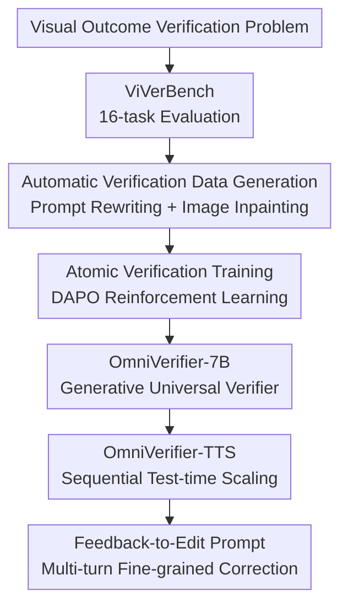

# Generative Universal Verifier as Multimodal Meta-Reasoner

**Conference**: ICLR2026  
**OpenReview**: [https://openreview.net/forum?id=DM0Y0oL33T](https://openreview.net/forum?id=DM0Y0oL33T)  
**Paper**: [Project Page](https://omniverifier.github.io/)  
**Code**: Available (provided in supplementary materials; specific repository link not in project page cache)  
**Area**: Multimodal VLM / VLM Reasoning / Visual Verification / Test-time Scaling  
**Keywords**: Multimodal Meta-reasoning, Visual Outcome Verification, Generative Verifier, Sequential Test-time Scaling, Image Self-correction

## TL;DR

This paper elevates the task of "checking whether visual outcomes satisfy task requirements" to a fundamental capability of multimodal reasoning systems. The authors construct ViVerBench to evaluate existing VLM shortcomings in visual verification, train OmniVerifier-7B as a generative universal verifier, and employ OmniVerifier-TTS to convert verification feedback into multi-turn image editing during test-time, thereby improving the quality of complex text-to-image and reasoning-based generation.

## Background & Motivation

**Background**: Multimodal Large Language Models (MLLMs) are evolving from "answering questions based on images" to more complex interleaved reasoning and unified multimodal generation. Next-generation VLMs/UMMs do not just read images; they generate intermediate visual states, call visual tools, or directly output images during the reasoning process. This trend implies that reasoning trajectories now contain many "visual outcomes": a generated image, an edited image, a bounding box result, a game state, or a robotic stacking intermediate state—all of which serve as the basis for subsequent reasoning steps.

**Limitations of Prior Work**: Current test-time scaling remains text-centric. Models can reflect on whether a textual answer is self-consistent but struggle to reliably judge whether an image satisfies a complex prompt, whether an intermediate visual state violates rules, or whether fine-grained attribute bindings in an image are correct. For image generation, the common Best-of-N approach merely selects one candidate from many, which increases computation but lacks reflection and correction of specific errors. If all candidates share the same detailed error, parallel sampling cannot overcome this ceiling.

**Key Challenge**: Multimodal reasoning requires a closed loop of "generation" and "verification," yet current visual verification capabilities lag behind generation. Visual outcomes are high-dimensional, ambiguous, and detail-rich; slight errors can be hidden in complex scenes. Many errors are not simple object presence/absence but involve cross-modal fine-grained judgments like attribute binding, spatial relations, physical laws, GUI targets, and code-image consistency. Without a reliable verifier, models cannot identify their mistakes, making it difficult to convert errors into executable correction instructions.

**Goal**: The authors decompose the problem into three steps: evaluating where existing MLLMs fail in visual verification; training a generative universal verifier with cross-task generalization; and utilizing this verifier as a multimodal meta-reasoner to improve image generation, editing, and generalized interleaved world modeling.

**Key Insight**: The key observation is that humans decompose prompts and check objects, attributes, relations, and rules step-by-step when verifying images, providing specific explanations for errors. By training this "interpretable visual verification" into a model, the verifier can provide not just true/false labels but also identify error causes and rewrite them into editing prompts, serving as an external reflection module for the generative model.

**Core Idea**: Replace simple candidate filtering with a generative universal visual verifier, creating a sequential self-correction loop of "generate image → check errors → local editing → re-check" at test-time.

## Method

### Overall Architecture

The paper constructs a complete pipeline around visual outcome verification. First, ViVerBench is proposed to evaluate VLM consistency across 16 task categories. Second, two automated data pipelines generate high-quality true/false visual verification data, and OmniVerifier-7B is obtained by training Qwen2.5-VL-7B via Reinforcement Learning (RL) with rule-based rewards. Finally, OmniVerifier-7B is integrated with a unified multimodal generation model to form OmniVerifier-TTS: the generative model produces an initial image, the verifier checks it against the prompt, and if unsatisfied, the verifier generates an explanation and edit prompt for local refinement until verification passes or a step limit is reached.

OmniVerifier functions as a multimodal meta-reasoner rather than a standard reward model. Its output is "Judgment + Explanation + Optional Edit Suggestion." This allows it to verify visual outcomes on benchmarks, convert error explanations into editing conditions in TTS, and extend to world-state reasoning like mazes or robotics.

### Key Designs

**1. ViVerBench: Decomposing Visual Verification into 16 Diagnostic Capabilities**

ViVerBench contains 3,594 samples across 6 categories and 16 sub-tasks: Concept Existence (objects, attributes, patterns); Object Relationship (spatial and non-spatial); World Dynamics (static/dynamic physics); Image Annotation (boxes, points, counting); State Value Evaluation (Maze, FrozenLake, Robotics, GUI); and STEM (charts, LaTeX vs. code consistency).

The benchmark emphasizes undisputed yet difficult answers. Samples are constructed using human annotation, program generation, and data augmentation. Evaluation requires models to output true/false and an explanation. Rule-based metrics track label accuracy: $Acc_{rule}=\frac{1}{N}\sum_i \mathbf{1}(\hat{y}_i=y_i)$. For false samples, a strict model-based judge evaluates if the explanation $\hat{e}_i$ matches the ground truth $e_i$ to prevent guessing.

**2. Two Automated Data Pipelines: Scaling true/false Verification via "Reverse Construction"**

To obtain explicit and interpretable error samples, the authors use reverse construction starting from complex images. This is more controllable than generating images from complex prompts, as current models often fail to align naturally, which can introduce ambiguous errors.

The first pipeline is **Image-Fixed, Prompt-Modified**. Given a complex image, GPT-5 generates a strict caption of visible elements (true prompt), then introduces a subtle but critical modification (e.g., number, color, position, action) to create a false prompt and error explanation. The model must check the image details to identify if the modified prompt holds.

The second pipeline is **Prompt-Modified, Image-Inpainting**. Using SAM 2.1 for segmentation, the authors masks areas and use FLUX.1-dev for inpainting to create a false image. Simultaneously, GPT-5 generates a strict prompt with bounding box constraints. This focuses training on object attributes and spatial relations within local regions.

**3. Atomic Capability Training: Generalization between Alignment and Relations**

The authors analyze the transferability of capabilities by training on specific clusters (object, attribute, spatial, maze) using DAPO RL on Qwen2.5-VL-7B. Rewards consist of a 9:1 ratio of true/false rule rewards to format rewards.

The results show two shareable levels of capability: **Explicit Alignment** (matching text elements to image elements) and **Relational Verification** (judging spatial or logical interactions). Object/attribute data improved charts, LaTeX, and GUI tasks, while spatial data improved counting and relational tasks. However, **Integrative Reasoning** (e.g., Maze) showed little transfer due to the gap between abstract rules and natural image distributions, suggesting these world-modeling tasks require domain-specific data.

**4. OmniVerifier-TTS: Sequential Image Editing via Explanations**

Unlike Best-of-N (parallel TTS), which samples $N$ images and picks one, **OmniVerifier-TTS** uses sequential scaling. The verifier acts as a "misalignment-finder," pinpointing errors and rewriting explanations into edit prompts. The UMM then performs fine-grained editing on the existing image. This is more efficient for complex prompts where errors are often local; regenerating the entire image might introduce new mistakes.

### Loss & Training

OmniVerifier-7B is initialized from Qwen2.5-VL-7B and trained on 28k high-quality samples. DAPO RL is used for optimization. A key finding is that optimizing binary judgments does not destroy explanation capabilities. Under rule-based rewards, the model naturally adopts LongCoT reasoning, decomposing prompts into checkable sub-items. Minimum binary outcome supervision is sufficient to improve verification while maintaining linguistic interpretability.

## Key Experimental Results

### Main Results

ViVerBench shows a significant gap between VLMs and humans. Gemini-2.5-Pro led closed-source models ($0.745$), while humans reached $0.932$. OmniVerifier-7B reached $0.653$, surpassing GPT-4o ($0.645$) and approaching the $72B$ version of Qwen2.5-VL.

| Model | ViVerBench Overall | Characteristics | Relation to Ours |
|------|-------------------|------------|------------|
| Qwen2.5-VL-7B | 0.570 | 7B Base model | Training starting point |
| GPT-4o | 0.645 | Strong closed-source VLM | Outperformed by OmniVerifier-7B |
| Qwen2.5-VL-72B | 0.661 | Large open-source VLM | Approximated by OmniVerifier-7B |
| Gemini-2.5-Pro | 0.745 | Best model in table | Significantly below human |
| Human | 0.932 | Expert human evaluation | Shows room for improvement |
| OmniVerifier-7B | 0.653 | Generative verifier | Gain of +0.083 over base |

In generation tasks, OmniVerifier-TTS improved T2I-ReasonBench from $55.5$ to $59.2$ and GenEval++ from $0.675$ to $0.718$ using Qwen-Image as a backbone.

### Ablation Study

Sequential TTS outperformed parallel TTS across all backbones. For Qwen-Image, sequential reached $59.2$ on T2I-ReasonBench (vs. $58.1$ parallel). Crucially, sequential refinement required fewer steps—an average of $1.86$ to $3.86$ turns—compared to 10 candidates in parallel sampling.

### Key Findings

- **Gains in Alignment/Relation**: Benefits are concentrated in explicit alignment and relational tasks, consistent with the atomic training data.
- **Verification Spillover**: Training for visual verification improves textual hallucination detection, with accuracy on VLRewardBench (hallucination) rising from $45.79$ to $70.09$.
- **Sequential Advantage**: Success stems from "actionable explanations." The verifier decomposes complexity into checkable constraints.
- **Upper Bound**: Using Gemini-2.5-Pro as a verifier further elevates performance, indicating that stronger visual judges continue to lift the ceiling for generative backbones.

## Highlights & Insights

- The paper treats "visual verification" as a first-class citizen in multimodal reasoning. The verifier is not just a reward model but an active participant that generates diagnostic feedback.
- ViVerBench extends beyond image-text matching to world states (physics, GUI, robotics), approximating the "intermediate state checking" defined for future multimodal agents.
- The distinction between Explicit Alignment, Relational Verification, and Integrative Reasoning provides a clear recipe for training verifiers: start with generalizable atomic capabilities and add domain data for high-level reasoning.
- Sequential TTS offers a plug-and-play improvement for UMMs without retraining the generation backbone.

## Limitations & Future Work

- **Performance Gap**: A significant gap remains between OmniVerifier-7B and human-level verification, especially in integrative reasoning.
- **Domain Specificity**: The lack of transfer from maze data highlights the difficulty of verifying complex world dynamics and discrete rules using natural image data.
- **Editing Dependency**: OmniVerifier-TTS relies on the UMM's editing quality. Accumulative errors or style drift during multi-turn editing can occur.
- **Inference Cost**: Multi-turn sequential refinement introduces latency which requires engineering optimization for real-time scenarios.

## Related Work & Insights

- Compared to **LLaVA-Critic**, this work emphasizes visual outcome verification and uses explanations to drive iterative refinement.
- Compared to **Best-of-N**, the sequential approach utilizes the "why" of a failure, enabling more precise corrections with fewer samples.
- **Inspiration**: This suggests that future multimodal agents should move toward a "state monitor" paradigm, where verifiers continuously check if visual world states meet expectations, triggering corrective actions or rollbacks.

## Rating

- **Novelty**: ⭐⭐⭐⭐⭐ (Defines generative verifier as meta-reasoner; links benchmark to TTS refinement).
- **Experimental Thoroughness**: ⭐⭐⭐⭐ (Extensive analysis across benchmarks, though agent evaluation is preliminary).
- **Writing Quality**: ⭐⭐⭐⭐ (Clear logic, though requires cross-referencing between main text and appendix for details).
- **Value**: ⭐⭐⭐⭐⭐ (High impact for MLLM critic training and test-time scaling strategies).

<!-- RELATED:START -->

## Related Papers

- [\[ICLR 2026\] JUDO: A Juxtaposed Domain-Oriented Multimodal Reasoner for Industrial Anomaly QA](judo_a_juxtaposed_domain-oriented_multimodal_reasoner_for_industrial_anomaly_qa.md)
- [\[CVPR 2026\] GGBench: A Geometric Generative Reasoning Benchmark for Unified Multimodal Models](../../CVPR2026/vlm_reasoning/ggbench_a_geometric_generative_reasoning_benchmark_for_unified_multimodal_models.md)
- [\[CVPR 2026\] IPR-1: Interactive Physical Reasoner](../../CVPR2026/vlm_reasoning/ipr-1_interactive_physical_reasoner.md)
- [\[CVPR 2026\] ARM-Thinker: Reinforcing Multimodal Generative Reward Models with Agentic Tool Use and Visual Reasoning](../../CVPR2026/vlm_reasoning/arm-thinker_reinforcing_multimodal_generative_reward_models_with_agentic_tool_us.md)
- [\[NeurIPS 2025\] Retrv-R1: A Reasoning-Driven MLLM Framework for Universal and Efficient Multimodal Retrieval](../../NeurIPS2025/vlm_reasoning/retrv-r1_a_reasoning-driven_mllm_framework_for_universal_and_efficient_multimoda.md)

<!-- RELATED:END -->
