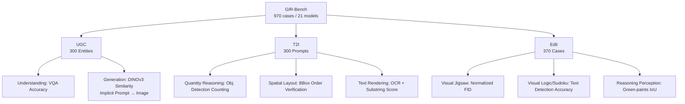

# GIR-Bench: Versatile Benchmark for Generating Images with Reasoning

**Conference**: ICLR 2026  
**OpenReview**: [https://openreview.net/forum?id=4c1gAsVd9C](https://openreview.net/forum?id=4c1gAsVd9C)  
**Code**: [https://github.com/HKUST-LongGroup/GIR-Bench](https://github.com/HKUST-LongGroup/GIR-Bench)  
**Area**: Multimodal Reasoning / Image Generation Evaluation / Unified Multimodal Models  
**Keywords**: Reasoning-driven image generation, Unified multimodal models, Understanding-generation consistency, Interpretable evaluation, benchmark  

## TL;DR
GIR-Bench systematically quantifies the understanding-generation gap in unified multimodal models—where models "can reason but cannot draw"—using three complementary subsets (UGC, T2I, Edit) and a **task-specific, programmable verification pipeline**, effectively bypassing the biases of MLLM-as-a-Judge.

## Background & Motivation
- **Background**: Unified multimodal models (e.g., GPT-Image-1, Gemini-2.5-Flash-Image, BAGEL) connect MLLM reasoning capabilities to both image understanding and generation, promising the completion of complex visual tasks via natural language. Intuitively, "stronger understanding should lead to stronger generation."
- **Limitations of Prior Work**: Early generation benchmarks (GenEval, T2I-CompBench, etc.) only examine object attributes and compositions, remaining at the shallow mapping of "text → image." Recent attempts to introduce reasoning suffer from two flaws: in terms of **evaluation dimensions**, they cannot quantify the alignment between "reasoning ability" and "generation results"; in terms of **evaluation protocols**, they rely heavily on MLLM-as-a-Judge, coupling scores with the biases or defects of the judge model itself.
- **Key Challenge**: A model can correctly recognize a landmark (e.g., Merlion) on the understanding side but fail to generate it based on an implicit description. Existing benchmarks neither detect this **understanding-generation misalignment** nor provide reproducible, undisputed scores.
- **Goal**: Construct a reasoning-centric, interpretable, and programmatically verifiable benchmark to systematically characterize the capability boundaries of unified models in reasoning-driven image generation and editing, explicitly quantifying the internal gap between "understanding vs. generation."
- **Core Idea**: **Three-perspective decomposition + task-specific verifiable pipelines**—decomposing vague "reasoning ability" into sub-tasks with deterministic ground truth (Sudoku, puzzles, quantity, space, text rendering). Each sub-task is paired with a programmable metric pipeline using detection/OCR/IoU/FID instead of relying on large models as judges.

## Method

### Overall Architecture
GIR-Bench does not train new models but designs a three-stage evaluation protocol. It interrogates unified models from three complementary perspectives: **UGC** compares the gap between "recognizing" and "generating" the same entity; **T2I** examines reasoning-based text-to-image generation requiring logical constraints or implicit knowledge; **Edit** examines reasoning-based editing requiring global planning and local modification. The three subsets comprise 970 cases, each with programmatically verifiable ground truth, ultimately quantifying the "Unified vs. Generative" and "Understanding vs. Generation" gaps across 21 representative models.

### Key Designs

**1. UGC Subset: Directly exposing the understanding-generation gap using the "same entity, two paths" approach.** The authors collected 300 real-world entities from zoology, botany, and geography. GPT-4o was used to generate **implicit prompts** describing features without naming the entity (manually verified for uniqueness), while high-quality reference images were paired with each entity. This creates two evaluation paths: on the generation side, the model draws based on the implicit prompt, and scores are based on the average DINOv3 feature similarity between the generated and reference images; on the understanding side, VQA is used to test if the model recognizes the entity from reference images. A key insight is the controlled experiment between "category input" (direct class name) and "prompt input" (implicit description)—a large gap indicates the bottleneck is not "capability to draw the object" but "capability to transfer reasoned constraints into the generation process." Results confirm this: prompt input scores are significantly lower than category input scores for all models.

**2. T2I Subset: Selecting only tasks with deterministic answers to eliminate subjective judgment.** The subset is designed around three principles: priority of objectivity (tasks like Sudoku/arithmetic with unique solutions), programmable ground truth generation or strict verification, and a focus on implicit reasoning and planning (excluding shallow "keyword → image" tasks). Specifically, three dimensions are included: **Quantity Reasoning** provides constraints like "4 animals (ducks and dogs), 10 legs total" → 3 ducks and 1 dog; object detection extracts categories and counts, where **all counts must be correct** for success (partial correctness suggests a broken reasoning chain). **Spatial Layout** uses detected bbox coordinates to verify sequential constraints like "animal on the left, vehicle on the right." **Text Rendering** addresses the issue where implicit descriptions (e.g., "Nike's 3-word slogan from 1988" → "Just do it") often lead to redundant text by proposing a **word-level continued substring score**: 
$$s_{wc}(g,p) = \frac{|W_{\text{match}}(g,p)|}{|W(g)|}$$
where $W(g)$ is the ground truth word set and $W_{\text{match}}$ counts GT words fully covered by continuous character spans in the predicted text—rewarding hits without penalizing extra content.

**3. Edit Subset: Pairing each case with a GT image to make editing capability quantifiable.** Unlike previous editing benchmarks that only provide input images, each case here includes an "input image + ground-truth image" to reduce evaluation bias. Three dimensions correspond to three pipelines: **Visual Jigsaw** cuts high-resolution near-square images into grids and shuffles them (at least half the grids are swapped), requiring the model to restore the original; FID scores between the generated and GT images are normalized to $[0,1]$ (higher is better). **Visual Logic/Sudoku** uses constraint propagation for unique solution generation and deductive digit removal; the accuracy is calculated by extracting digits and positions via text detection. **Reasoning Perception** uses images from the LISA dataset, requiring the model to paint the target region (pointed to by an implicit description) purely opaque green (as a segmentation proxy); the output is converted to a binary mask to calculate IoU with the GT mask. These pipelines transform "editing quality" from subjective judgment to pixel-level verifiable digits.

**4. Task-specific pipelines replacing MLLM-as-a-Judge.** The evaluation relies on two external tools: the grounding capability of InternVL3.5-38B for object detection (extracting categories and bboxes) and PPOCR v5 for text detection and recognition (retaining segments with confidence >0.5). This "detection/OCR + deterministic rules" approach ensures that each score is reproducible, interpretable, and decoupled from judge model biases—the core methodology distinguishing GIR-Bench from existing reasoning benchmarks.

## Key Experimental Results

### Main Results

UGC Subset (Understanding vs. Generation Overall, excerpts):

| Type | Model | Generation (Overall) | Understanding (Overall) |
|------|------|------|------|
| Generative | SD-3.5-Large | 0.288 | - |
| Generative | Qwen-Image | 0.429 | - |
| Unified | BAGEL-7B | 0.295 | 0.937 |
| Unified | BAGEL-7B w/ CoT | 0.341 | 0.968 |
| Unified (Closed) | Gemini-2.5-Flash-Image | 0.593 | - |
| Unified (Closed) | GPT-Image-1 | **0.689** | - |
| Understanding | GPT-5 | - | 0.994 |

Understanding accuracy is generally >0.87, while generation scores max out at 0.689—"recognizing" information is far better than "drawing" it for the same knowledge base.

T2I and Edit Subsets (Overall, excerpts):

| Type | Model | T2I Overall | Edit Overall |
|------|------|------|------|
| Generative | FLUX.1-schnell | 0.159 | - |
| Editing | FLUX.1-Kontext-dev | - | 0.105 |
| Unified | BAGEL-7B | 0.169 | 0.098 |
| Unified | BAGEL-7B w/ CoT | 0.276 | 0.140 |
| Unified (Closed) | Gemini-2.5-Flash-Image | 0.399 | 0.343 |
| Unified (Closed) | GPT-Image-1 | **0.622** | **0.351** |

### Ablation Study

CoT vs. Input Format (T2I Three Dimensions, BAGEL):

| Setting | Quantity Reasoning | Spatial Layout | Text Rendering |
|------|------|------|------|
| BAGEL-7B | 0.056 | 0.287 | 0.163 |
| BAGEL-7B w/ CoT | **0.249** | **0.460** | 0.120 |

CoT significantly improves quantity (0.057→0.249) and spatial (0.287→0.460) reasoning but causes a decline in text rendering (0.163→0.120). In UGC, all models show a significant drop when switching from category input to prompt input.

### Key Findings
- **Unified > Generative**: On reasoning-driven tasks, joint training of understanding and generation provides gains, though open-source unified models show marginal advantages over strong generative models.
- **Persistent Understanding-Generation Gap**: Understanding accuracy is consistently >0.87, while generation peaks at 0.689. The bottleneck is not world knowledge or basic reasoning, but "transferring reasoned constraints into the generation process."
- **CoT is effective but not a panacea**: Explicit CoT injects arithmetic/spatial constraints into generation but is ineffective for text rendering (0.163→0.120), suggesting that current reasoning traces are not truly grounded in the generation process.
- **Universal failure in editing tasks**: The performance gap narrows in the Edit subset as all models perform weakly. Even GPT-Image-1/Gemini often fail, exposing weaknesses in fine-grained local control and pixel-level information preservation.

## Highlights & Insights
- **Methodological contribution is paramount**: Systematically replacing MLLM-as-a-Judge with "deterministic tasks + programmable verification" sets a reproducible and interpretable paradigm for reasoning-based generation evaluation.
- **The "same entity, two paths" design** cleanly distinguishes "lack of capability" from "failure in capability transfer," directly pinpointing the breakdown between understanding and generation.
- **Word-level continued substring score** is a small but practical metric innovation, specifically solving the problem where "target text is correct but extra content exists" under implicit prompts, which traditional OCR metrics would penalize.
- The cross-evaluation of 21 models + three-perspective decomposition provides a clear "map of weaknesses" for the unified multimodal model community.

## Limitations & Future Work
- **Limited Coverage**: To pursue deterministic ground truth, broader reasoning scenarios like causal reasoning and open-ended common sense are excluded; the "reasoning" in the benchmark leans toward programmatically verifiable logic/counting/spatial types.
- **Dependence on External Detectors**: Evaluation scores depend on the detection quality of InternVL3.5-38B grounding and PPOCR v5. Detector errors propagate into results (smaller than MLLM-as-a-Judge bias but not eliminated).
- **Approximations in Proxy Tasks**: Using "green painting + IoU" as a proxy for segmentation and continuous substrings for semantic hits are engineering trade-offs rather than perfect measures.
- **Moderate Scale**: 970 cases are sufficient to expose issues but remain small relative to training distributions; future work could expand the scale and types of reasoning.

## Related Work & Insights
- **Comparison with early generation benchmarks** (GenEval, T2I-CompBench, DPG-Bench): These focus on shallow mappings of attributes and combinations, while GIR-Bench pushes the focus to generation requiring multi-step reasoning and implicit knowledge.
- **Comparison with recent reasoning generation evaluations**: Most still rely on MLLM-as-a-Judge; GIR-Bench pulls evaluation from "subjective judging" back to "programmatic objectivity" via task-specific verifiable pipelines.
- **Insights**: ① In evaluation design, "decomposing vague capabilities into sub-tasks with deterministic answers" is a universal strategy to reduce bias; ② In model research, the understanding-generation gap suggests that the next priority should be **explicit grounding** of reasoning results into the generation process (rather than just stacking understanding capabilities); ③ The failure of CoT in text rendering suggests a missing link between reasoning traces and generation tokens.

## Rating
- **Novelty**: ⭐⭐⭐⭐ — The evaluation paradigm of three-perspective decomposition + task-specific verifiable pipelines is a clear innovation; small metrics like the word-level substring score are practical.
- **Experimental Thoroughness**: ⭐⭐⭐⭐⭐ — Evaluation of 21 representative models across nine dimensions in three subsets, with thorough CoT/input-format comparisons; conclusions are well-supported by data.
- **Writing Quality**: ⭐⭐⭐⭐ — The logical chain from motivation to design and conclusion is clear; the three principles and task pipelines are well-explained with rich illustrations.
- **Value**: ⭐⭐⭐⭐ — Provides the unified multimodal model community with standard tools and a map of weaknesses for quantifying the understanding-generation gap; the methodology is reusable for future generation evaluations.

<!-- RELATED:START -->

## Related Papers

- [\[ICLR 2026\] IV-Bench: A Benchmark for Image-Grounded Video Perception and Reasoning in Multimodal LLMs](iv-bench_a_benchmark_for_image-grounded_video_perception_and_reasoning_in_multim.md)
- [\[ICLR 2026\] We-Math 2.0: A Versatile MathBook System for Incentivizing Visual Mathematical Reasoning](we-math_20_a_versatile_mathbook_system_for_incentivizing_visual_mathematical_rea.md)
- [\[ICLR 2026\] Medical Thinking with Multiple Images](medical_thinking_with_multiple_images.md)
- [\[ICLR 2026\] Thyme: Think Beyond Images](thyme_think_beyond_images.md)
- [\[ICLR 2026\] GTR-Bench: Evaluating Geo-Temporal Reasoning in Vision-Language Models](gtr-bench_evaluating_geo-temporal_reasoning_in_vision-language_mod.md)

<!-- RELATED:END -->
