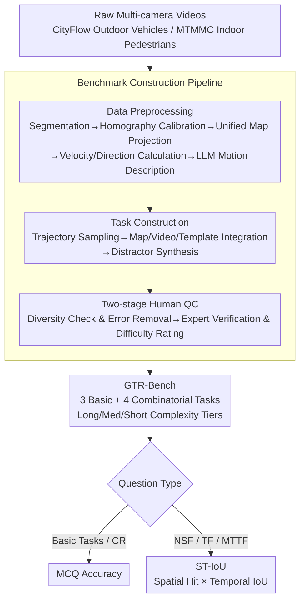

# GTR-Bench: Evaluating Geo-Temporal Reasoning in Vision-Language Models

**Conference**: ICLR 2026  
**arXiv**: [2510.07791](https://arxiv.org/abs/2510.07791)  
**Code**: [GitHub](https://github.com/X-Luffy/GTR-Bench)  
**Area**: Spatio-Temporal Intelligence / Vision-Language Model Evaluation  
**Keywords**: Geo-Temporal Reasoning, Vision-Language Models, Multi-Camera Networks, Benchmark, Spatio-Temporal Intelligence

## TL;DR

Ours proposes GTR-Bench, a new benchmark for geo-temporal reasoning of moving targets in large-scale camera networks. Evaluation reveals that the strongest model, Gemini-2.5-Pro (34.9%), lags significantly behind human performance (78.61%), uncovering three major flaws in current VLMs: imbalanced spatio-temporal context utilization, weak temporal prediction ability, and insufficient map-video alignment.

## Background & Motivation

**Background**: Spatial intelligence is a fundamental capability for human interaction with the physical world. Its extension, spatio-temporal intelligence, is crucial for fields like autonomous driving and embodied AI, involving spatial attributes (size, distance), temporal attributes (time intervals, speed), and reasoning about dynamic events.

**Limitations of Prior Work**: Current geographic reasoning benchmarks (e.g., ReasonMap) focus only on static geometric tasks and graphical contexts (e.g., subway maps), while spatio-temporal reasoning benchmarks (e.g., VSI-Bench, STI-Bench) primarily utilize ego-centric perspectives from single or few cameras using image/video contexts.

**Key Challenge**: There is a lack of geographic-level spatio-temporal reasoning evaluation. No benchmark assesses the ability of VLMs to simultaneously integrate graphical context (maps) and multi-view video observations for geo-temporal reasoning in large-scale camera networks.

**Goal**: Real-world scenarios like traffic management and emergency response urgently require comprehensive spatio-temporal analysis, such as vehicle/pedestrian trajectory reasoning and traffic flow prediction across multiple camera views.

**Key Insight**: Geo-temporal reasoning (GTR) requires multiple perspective shifts between maps and videos, joint reasoning across multiple videos with non-overlapping fields of view, and inference regarding spatio-temporal regions not observed by any video.

**Novelty**: Conventional spatio-temporal intelligence only covers first-person (egocentric) and third-person (allocentric) perspectives, whereas a geographic perspective provides VLMs with an omniscient understanding of dynamic objects.

## Method

### Overall Architecture

GTR-Bench aims to answer a previously unaddressed question: Can VLMs perform human-like geo-temporal reasoning on moving targets traveling through a map combined with a set of non-overlapping camera videos? To this end, it processes "raw multi-camera videos" through an automated construction pipeline into 420 standardized QAs (210 for CityFlow outdoor vehicles and 210 for MTMMC indoor pedestrians, covering 364 video clips). These questions are organized into **3 basic tasks + 4 combinatorial tasks** based on spatio-temporal complexity levels. Models are evaluated using two sets of metrics: MCQ accuracy for basic questions and a specially designed ST-IoU for prediction tasks to constrain both space and time.

**Basic Tasks** evaluate individual atomic capabilities:

- **Geo-Location (GL)**: Given start and end points, infer the intermediate locations (cameras) the target passed.
- **Arrival Time-Interval (ATI)**: Given start/end points and intermediate locations, infer the arrival time intervals at those locations.
- **Motion-State (MS)**: Given start/end points and intermediate locations, infer the movement status (direction, speed, distance) at those locations.

**Combinatorial Tasks** superimpose forecasting and multi-target reasoning on basic capabilities:

- **Causal Reordering (CR)**: Determine the correct chronological order of camera segments given unordered video clips and a map.
- **Next Spot Forecasting (NSF)**: Predict the next camera location and its arrival time interval given the last observation and a map.
- **Trajectory Forecasting (TF)**: Predict the complete future trajectory (sequence of cameras and time intervals) based on historical observations.
- **Multi-Target Trajectory Forecasting (MTTF)**: Predict the future meeting point (location and time) of two different targets.

### Key Designs

**1. Benchmark Construction Pipeline: Automating Video-to-QA Conversion**

Raw videos lack maps and aligned multi-view trajectories. To create questions with "maps + multi-view observations + task-specific constraints," a three-stage pipeline was developed. **Data Preprocessing** crops long videos, uses homography matrices to calibrate each camera view, projects trajectories onto a unified map, and calculates motion parameters (speed, direction) for LLM-generated descriptions. **Task Construction** samples trajectories, integrates map/video templates, and purposefully creates distractors—sampling from different architectural areas, synthesizing non-existent cameras, and randomizing camera IDs—to force reasoning rather than pattern matching. **Two-stage Human QC** ensures question diversity, removes trajectory errors, and calibrates difficulty levels.

**2. Spatio-Temporal Complexity Gradation: Ensuring Multi-Scale Evaluation**

To prevent models from relying on static backgrounds, tasks are categorized into Long, Medium, and Short tiers based on physical thresholds of trajectory length $track_d$ and duration $track_t$. Different thresholds are used for indoor and outdoor settings (e.g., outdoor driving involves shorter time but longer distances), ensuring a balanced distribution that tests dynamic cues across varying scales.

**3. ST-IoU Metric: Joint Constraint of Spatial Correctness and Temporal Precision**

While basic tasks use MCQ accuracy, NSF/TF/MTTF prediction tasks output "Camera ID + Time Interval." Simple binary labels ignore the temporal dimension. Ours proposes **ST-IoU (Spatio-Temporal IoU)**: it uses an indicator function $\mathbb{I}(C_{p_i}=C_{gt_i})$ to check if the predicted Camera ID is correct. Only if it hits is it multiplied by the temporal Intersection over Union (IoU) $\frac{|T_{p_i} \cap T_{gt_i}|}{|T_{p_i} \cup T_{gt_i}|}$, averaged over $N$ samples:

$$\text{ST-IoU} = \frac{1}{N}\sum_{i=1}^{N}\mathbb{I}(C_{p_i}=C_{gt_i}) \times \frac{|T_{p_i} \cap T_{gt_i}|}{|T_{p_i} \cup T_{gt_i}|}$$

This metric identifies whether model failures stem from spatial localization or temporal constraint issues.

### Evaluation Setup

Ours is a benchmark paper and does not involve model training. A unified inference protocol is used:
- Uniform video sampling, total frames limited to under 20.
- temperature = 0.1, max_new_token = 16384.
- Open-source models deployed via LMDeploy on 8 NVIDIA V100 GPUs.
- Traditional ReID methods are included as competitive baselines.

## Key Experimental Results

### Main Results

| Model | Type | Rank | GL(Out/In) | ATI(Out/In) | MS(Out/In) | CR(Out/In) | NSF(Out/In) | TF(Out/In) | MTTF(Out/In) | Avg |
|------|------|------|------------|-------------|------------|------------|-------------|------------|--------------|------|
| Gemini-2.5-Pro | PM | 1 | 60.0/63.3 | 46.7/13.3 | 33.3/26.7 | 56.7/70.0 | 19.1/25.1 | 13.2/28.1 | 19.2/14.4 | **34.93** |
| GPT-5 | PM | 2 | 53.3/60.0 | 76.7/30.0 | 40.0/43.3 | 40.0/86.2 | 12.0/11.3 | 12.1/2.6 | 7.3/1.8 | 34.05 |
| Claude-4-Sonnet | PM | 3 | 73.3/66.7 | 50.0/33.3 | 50.0/43.3 | 63.3/58.6 | 8.1/2.6 | 6.2/4.0 | 16.9/0.0 | 34.03 |
| InternVL3-38B | OM | 5 | 40.0/50.0 | 73.3/56.7 | 30.0/26.7 | 53.3/37.9 | 8.3/11.1 | 8.2/4.4 | 20.6/10.2 | 30.76 |
| Qwen2.5-VL-32B | OM | 6 | 43.3/33.3 | 60.0/56.7 | 33.3/43.3 | 66.7/70.0 | 0.7/3.3 | 0.0/0.0 | 15.7/0.0 | 30.45 |
| **Human** | - | - | 90.0/98.2 | 84.3/90.8 | 90.9/89.5 | 89.8/97.4 | 68.3/74.6 | 51.2/57.4 | 55.8/62.5 | **78.61** |

### Ablation Study

**Spatial Reasoning vs. Spatio-Temporal Reasoning (MCQ Acc vs. ST-IoU)**:

| Model | NSF-MCQ/ST-IoU(Out) | TF-MCQ/ST-IoU(Out) | MTTF-MCQ/ST-IoU(Out) | NSF-MCQ/ST-IoU(In) |
|------|---------------------|--------------------|-----------------------|---------------------|
| GPT-4o | 53.3/20.5 | 41.7/0.0 | 76.7/23.1 | 30.0/13.0 |
| Gemini-2.5-Pro | 38.5/19.1 | 45.5/13.2 | 51.7/19.2 | 43.3/25.1 |
| GPT-5 | 73.3/12.0 | 58.3/12.1 | 83.3/7.3 | 50.0/11.3 |
| GLM-4.1V-9B | 40.0/10.3 | 30.0/0.0 | 76.7/25.4 | 10.3/2.9 |

MCQ accuracy is significantly higher than ST-IoU, indicating that models can roughly localize spatial positions but fail to handle temporal constraints. For GPT-5 on MTTF, the gap between MCQ (83.3%) and ST-IoU (7.3%) reaches 76 percentage points.

### Key Findings

1.  **Significant Human-AI Gap**: The top model, Gemini-2.5-Pro (34.93%), falls 43.68 percentage points behind humans (78.61%).
2.  **Performance Drop in Combinatorial Tasks**: Models perform decently on basic tasks (GL, ATI can reach 60-76%), but ST-IoU on combinatorial prediction tasks (NSF/TF/MTTF) is generally below 30%.
3.  **Outdoor vs. Indoor Variance**: Most models perform better outdoors (clearer spatial cues), but Gemini-2.5-Pro performs better indoors, likely due to better reasoning in complex scenes.
4.  **Imbalanced Context Utilization**: Top-tier models (Gemini-2.5-Pro) balance spatial/temporal/motion context, while open-source models (InternVL3-38B) are significantly weaker in temporal reasoning.
5.  **Temporal Prediction Bottleneck**: Spatial localization capability far exceeds temporal prediction, as evidenced by the huge gap between MCQ Acc and ST-IoU.

## Highlights & Insights

-   **Original Task Definition**: First to extend spatio-temporal reasoning to geographic-scale multi-camera networks, introducing joint map + multi-view video reasoning.
-   **Elegant ST-IoU Metric**: Fuses spatial accuracy and temporal IoU into a single scalar to evaluate spatio-temporal prediction quality.
-   **Hierarchical Task Design**: The basic-to-combinatorial structure precisely identifies specific model bottleneck areas.
-   **Deep Flaw Analysis**: Beyond numbers, the paper reveals fundamental VLM weaknesses in context exploitation and map-video alignment.
-   **ReID Baseline Inclusion**: Traditional Re-ID methods (45.72%) outperform many VLMs in prediction tasks, indicating VLMs lack efficiency in visual feature matching.

## Limitations & Future Work

1.  **Limited Data Scale**: 420 questions may not fully capture model performance across more diverse scenarios.
2.  **Video Sampling Constraints**: Limiting total frames to 20 may lose critical temporal information required by some models.
3.  **Narrow Scene Coverage**: Only covers outdoor vehicles and indoor pedestrians; lacks drone perspectives or marine environments.
4.  **Lack of Improvement Solutions**: Identifies problems but does not propose specific architectural or prompt engineering optimizations.
5.  **Simplified Map Information**: Simplistic map representation compared to high-definition maps or 3D models.
6.  **Scalability**: Future work should include more cameras (>31), longer time spans, and more target types.

## Related Work & Insights

-   **ReasonMap / SpatialLLM**: Static geographic benchmarks—inspired GTR to introduce dynamic targets.
-   **STI-Bench / VSI-Bench**: Ego-centric benchmarks—demonstrate the necessity of moving to multi-camera networks.
-   **CityFlow / MTMMC**: Multi-camera tracking datasets—GTR-Bench repurposes their trajectory data for high-level reasoning.
-   **Inspiration**: Future research should explore (1) specialized temporal reasoning modules, (2) map-video alignment pre-training strategies, and (3) graph-based modeling of camera network topology.

## Rating

| Dimension | Rating | Description |
|------|------|------|
| Novelty | ⭐⭐⭐⭐ | First definition of the GTR task, extending evaluation to multi-camera contexts. |
| Experimental Thoroughness | ⭐⭐⭐⭐ | Evaluated 13 VLMs + humans + ReID baselines with rich analysis dimensions. |
| Writing Quality | ⭐⭐⭐⭐ | Clear structure and well-defined tasks, though some analysis could be deeper. |
| Value | ⭐⭐⭐⭐ | Reveals critical bottlenecks for spatio-temporal intelligence in autonomous systems. |

<!-- RELATED:START -->

## Related Papers

- [\[ICML 2026\] MET-Bench: Multimodal Entity Tracking for Evaluating the Limitations of Vision-Language and Reasoning Models](../../ICML2026/vlm_reasoning/met-bench_multimodal_entity_tracking_for_evaluating_the_limitations_of_vision-la.md)
- [\[ICLR 2026\] Spatial-DISE: A Unified Benchmark for Evaluating Spatial Reasoning in Vision-Language Models](spatial-dise_a_unified_benchmark_for_evaluating_spatial_reasoning_in_vision-lang.md)
- [\[ICLR 2026\] MIMIC-Bench: Exploring the User-Like Thinking and Mimicking Capabilities of Multimodal Large Language Models](mimic-bench_exploring_the_user-like_thinking_and_mimicking_capabilities_of_multi.md)
- [\[ICLR 2026\] GIR-Bench: Versatile Benchmark for Generating Images with Reasoning](gir-bench_versatile_benchmark_for_generating_images_with_reasoning.md)
- [\[ICLR 2026\] Agent-X: Evaluating Deep Multimodal Reasoning in Vision-Centric Agentic Tasks](agent-x_evaluating_deep_multimodal_reasoning_in_vision-centric_agentic_tasks.md)

<!-- RELATED:END -->
