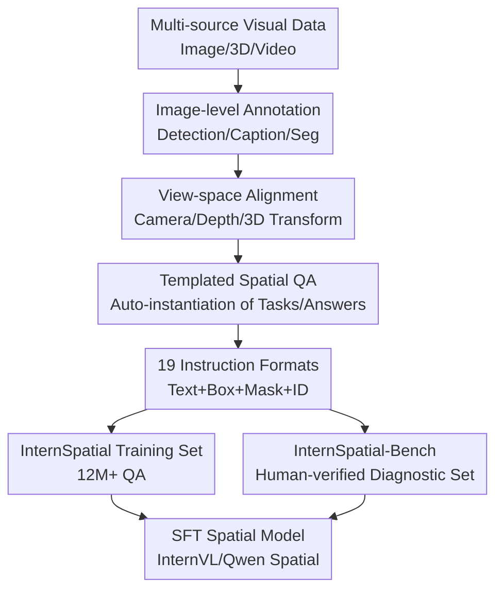

# InternSpatial: A Comprehensive Dataset for Spatial Reasoning in Vision-Language Models

**Conference**: ICLR2026  
**OpenReview**: [https://openreview.net/forum?id=L6bEitSMeu](https://openreview.net/forum?id=L6bEitSMeu)  
**Paper**: OpenReview  
**Code**: https://github.com/dengnianchen/intern-spatial  
**Area**: VLM Spatial Reasoning / Multimodal Evaluation / Dataset Construction  
**Keywords**: Spatial Reasoning, Vision-Language Models, Instruction Formats, Multi-view Understanding, Dataset  

## TL;DR
InternSpatial constructs a large-scale open dataset and diagnostic evaluation set for VLM spatial reasoning. By utilizing a unified data engine to organize single-view, multi-view, diverse scenarios, and various visual/textual instruction formats into over 12 million QA pairs, the model achieves significant improvements in spatial reasoning benchmarks while maintaining general multimodal capabilities.

## Background & Motivation
**Background**: Vision-Language Models (VLMs) have demonstrated strong performance in image question answering, description, OCR, chart understanding, and referring expression comprehension. However, understanding "where objects are in an image, which is larger, which is in front, or how much it has rotated across views" remains a weakness. For applications like robotics, embodied navigation, AR/VR, or autonomous driving, spatial relationships are not just auxiliary skills but foundational for translating visual input into action judgments.

**Limitations of Prior Work**: Existing spatial reasoning datasets often address narrow problems. Some only cover single images, some focus solely on indoor or outdoor environments, and others require additional inputs like depth maps, masks, or specialized regional annotations, making them difficult for general VLMs to use directly. Crucially, many datasets utilize only natural language queries, whereas real users might refer to objects using boxes, masks, numbers, coordinates, textual descriptions, or combinations thereof.

**Key Challenge**: Spatial reasoning training must simultaneously satisfy three conditions: broad scenarios, accurate relationships, and diverse instruction formats. Simply scaling up without 3D geometric alignment leads to noisy QA pairs; focusing only on precise annotations in narrow scenes causes the model to overfit to dataset-specific patterns; and using a single natural language query format fails to cover the diverse object-referencing methods encountered in real-world interactions.

**Goal**: The authors aim to build an open, reproducible spatial reasoning resource specifically for supervised fine-tuning (SFT). This resource includes single-view tasks (left/right, up/down, front/back, size, existence, counting) and multi-view tasks (rotation estimation, distance, room size, route planning, appearance order). It also includes a high-quality benchmark for diagnosing model strengths and weaknesses across different tasks and instruction formats.

**Key Insight**: A key observation for InternSpatial is that the bottleneck in VLM spatial reasoning is not just the model architecture but also the lack of systematic training data coverage. Rather than designing specialized models for specific tasks, it is more effective to unify multi-source images, 3D annotations, depth estimation, camera estimation, region referencing, and QA templates into a single data engine, allowing a VLM to learn from rich spatial supervision.

**Core Idea**: Use a modular data engine to unify multi-source visual data into a camera-centric coordinate system, then generate spatial QA via 19 types of textual/visual instruction formats to systematically improve VLM understanding of single-view and multi-view spatial relationships.

## Method

### Overall Architecture
InternSpatial is not a new model architecture but a complete resource comprising a "spatial reasoning data production line + evaluation set + SFT validation." Input data comes from COCO, AS-1B, Visual Genome, ScanNet, 3RScan, MultiScan, Cityscapes, Objaverse, R2R, etc. Through image-level annotation generation, view-space alignment, templated QA generation, and instruction format expansion, disparate data sources are converted into trainable spatial QA. The output consists of 12,035,415 training QA pairs and 6,008 benchmark QA pairs.

The pipeline focus is compressing heterogeneous data sources into a unified spatial representation. For data with existing 3D annotations, the authors project or transform global 3D information into the camera view. For image-only data, they use camera parameter estimation, depth estimation, and segmentation models to lift 2D annotations into 3D view space. Consequently, relationships like left/right, up/down, front/back, size, distance, and rotation are derived from geometry rather than linguistic guessing.

### Key Designs
**1. Unified View Space: Standardizing Multi-source Annotations**

A common error in spatial reasoning stems from the non-equivalence between image plane coordinates and real 3D relationships. An object appearing higher in an image is not necessarily higher in real space; a larger bounding box might simply be closer to the camera. InternSpatial adopts a canonical view space: the coordinate system is centered at the camera's optical center, with the $y$-axis along the viewing direction and the $z$-axis perpendicular to the scene's horizontal plane pointing upwards. All object positions and sizes are transformed into this camera view space assigned before determining relationships.

For 3D datasets, global 3D annotations and camera parameters are used to transform object coordinates directly. For image-only datasets, VLMs generate object boxes and captions, SAM2 generates masks, and tools like WildCamera (intrinsics), PerspectiveFields (extrinsics), and Metric3Dv2 (dense depth) are used to lift 2D regions into 3D. This allows the dataset to absorb massive image resources without regressing into purely 2D planar relationships.

**2. Multi-format Instruction Expansion: Training Object Identification**

Many spatial benchmarks assume users will describe targets clearly via natural language (e.g., "the person in the red coat"). In reality, users might draw boxes, number regions, use masks, provide bbox coordinates, or mix text and coordinates. InternSpatial expands each base QA into multiple text and image formats. Textual formats include natural language, `<ref>{caption}</ref>`, `<ref>region</ref><box>{bbox}</box>`, and combinations. Image formats include original images, images with boxes, images with masks, and images with IDs.

One QA pair can generate up to 19 training samples. The authors filter out unsuitable formats for specific samples and sample formats uniformly during training. This ensures the model learns not just "which object is on the left" but also how to locate the queried object under different referencing protocols. Ablations show that without format expansion, models remain unstable when facing rare instructions like `<box>`, masks, or IDs.

**3. Parallel Coverage of Single and Multi-view Tasks**

Single-view tasks cover position comparison, size comparison, existence, and counting, training the model to answer static questions like "who is further left" or "is there an object satisfying X relationship." However, robotics and navigation require understanding across frames or views: how much an object rotated from another angle, room size, the order of object appearance, or route planning.

InternSpatial incorporates multi-view data from ScanNet, MultiScan, R2R, and Objaverse, constructing tasks like rotation estimation, absolute distance, room size, object size, and appearance order. Rotation estimation is a specifically highlighted task, with 2,464,500 QA pairs in the training set. The authors use Alpha Shape to estimate room dimensions from point clouds and OrientedBoundingBox from Open3D to normalize object boxes.

**4. High-quality Diagnostic Benchmark**

InternSpatial-Bench is not merely a subset of the training data. The authors emphasize that while training data can be scaled via automation, benchmarks require high quality and diagnosability. They expanded SpatialRGPT-Bench and SpatialBench with sources like COCO, Flickr30K, Objaverse, and ScanNet, manually verifying generated questions and answers. The final benchmark contains 6,008 QA pairs across five categories: position, size, rotation, counting, and existence.

Notably, the authors excluded reachability prediction and certain quantitative range estimations. Since these tasks are often under-constrained for a single image without exact depth/camera parameters even for humans, the benchmark focuses on spatial problems that can be reliably judged from visual-textual input.

### Loss & Training
The paper does not introduce a specialized spatial loss function; instead, InternSpatial is added to existing VLM SFT pipelines as supervised data. The authors used InternVL2.5-8B as the primary baseline and validated transferability on InternVL2.5-1B and Qwen2.5-VL-8B. They utilized a downsampled version of the original InternVL2.5 general data mixed with InternSpatial for fine-tuning. The resulting models are named InternVL-Spatial-8B, InternVL-Spatial-1B, and Qwen-Spatial-8B.

During evaluation, InternSpatial-Bench uses accuracy for multiple-choice questions, GPT-4o scoring for quiz-style questions, and relative error for counting. For counting, the authors extract the last number from the response to focus on spatial judgment rather than output formatting issues.

## Key Experimental Results

### Main Results
InternSpatial-Bench results show a direct improvement in spatial reasoning. InternVL2.5-8B's average score increased from 58.9 to 71.0 (+12.1 points), with position comparison gaining 25.0 points and size comparison gaining 20.9 points. Similar gains in Qwen2.5-VL-8B and InternVL2.5-1B suggest the benefits are not architecture-dependent.

| Model | Position | Size | Rotation | Counting | Existence | Average |
|------|----------|------|----------|----------|-----------|---------|
| GPT-4o-2024-11-20 | 71.2 | 71.5 | 26.7 | 63.5 | 74.9 | 61.6 |
| LLaVA-OneVision-72B | 77.8 | 77.0 | 25.8 | 64.5 | 77.6 | 64.5 |
| Qwen2.5-VL-8B | 57.1 | 60.8 | 26.9 | 58.0 | 66.7 | 53.9 |
| Qwen-Spatial-8B | 79.9 | 78.7 | 34.4 | 68.3 | 80.0 | 68.3 |
| InternVL2.5-1B | 42.9 | 43.3 | 23.8 | 21.3 | 59.9 | 38.2 |
| InternVL-Spatial-1B | 65.4 | 58.5 | 26.3 | 59.4 | 74.4 | 56.8 |
| InternVL2.5-8B | 62.8 | 57.7 | 28.5 | 67.8 | 77.9 | 58.9 |
| InternVL-Spatial-8B | 87.8 | 78.6 | 33.6 | 71.3 | 83.9 | 71.0 |

On the external VSI-Bench, InternVL-Spatial-8B improved from 41.6 to 52.3. This is significant as VSI-Bench is an external multi-view spatial benchmark; steady gains here indicate the model is not just overfitting to the InternSpatial-Bench format.

| Model | Obj.Count | Abs.Dist. | Obj.Size | Room Size | Rel.Dist. | Route Plan | Appr.Order | Average |
|------|-----------|-----------|----------|-----------|-----------|------------|------------|---------|
| GPT-4o | 46.2 | 5.3 | 43.8 | 38.2 | 37.0 | 31.5 | 28.5 | 32.9 |
| Gemini-1.5 Pro | 56.2 | 30.9 | 64.1 | 43.6 | 51.3 | 36.0 | 34.6 | 45.3 |
| Qwen2.5-VL-8B | 41.5 | 21.2 | 50.7 | 36.6 | 37.9 | 30.4 | 34.0 | 36.0 |
| Qwen-Spatial-8B | 60.8 | 35.0 | 53.4 | 45.0 | 40.0 | 36.6 | 34.5 | 43.6 |
| InternVL2.5-8B | 51.7 | 32.9 | 45.1 | 42.3 | 40.8 | 27.8 | 50.5 | 41.6 |
| InternVL-Spatial-8B | 68.7 | 40.9 | 63.1 | 54.3 | 47.7 | 29.9 | 60.5 | 52.3 |

### Ablation Study
The core ablation compares different training data settings and instruction formats. InternVL-Spatial-Raw-8B was trained using InternSpatial-Bench style data without format expansion, while InternVL-Spatial-8B used the full multi-format set. Findings show that while spatial QA alone helps, format expansion significantly reduces the performance gap between different visual/textual instruction types without sacrificing natural language performance.

| Configuration | Traing Data Features | Key Observations | Explanation |
|------|--------------|----------|------|
| InternVL2.5-8B | General VLM Data | Best on Raw Image + NL; weak on box/mask/ID codes | General data lacks spatial referencing coverage |
| InternVL-Spatial-Raw-8B | Spatial QA (No Expansion) | Better than baseline across formats | Spatial supervision alone provides cross-format transfer |
| InternVL-Spatial-8B | Spatial QA + 19 Formats | Overall best across all formats; narrow gap between formats | Multi-format training enhances robustness and global spatial capability |

General capability evaluation confirmed that spatial training did not degrade original performance. InternVL-Spatial-8B score on MathVision rose from 19.0 to 20.8, TextVQA from 79.0 to 79.9, and MMStar from 62.9 to 63.1. OCRBench remained almost constant, while ChartQA dropped slightly from 83.0 to 81.4.

| Model | MathVision | OCRBench | TextVQA | ChartQA | MMStar |
|------|------------|----------|---------|---------|--------|
| InternVL2.5-8B | 19.0 | 82.3 | 79.0 | 83.0 | 62.9 |
| InternVL-Spatial-8B | 20.8 | 82.2 | 79.9 | 81.4 | 63.1 |

### Key Findings
- Improvements in position and size comparison are most significant, suggesting the unified view space and object-level geometric annotations successfully target VLM weaknesses.
- Small models benefit immensely; InternVL-Spatial-1B saw average gains of 18.6 points on InternSpatial-Bench and 14.5 on VSI-Bench, indicating data quality is crucial for smaller parameter models.
- Rotation estimation remains difficult (scoring only 33.6 for InternVL-Spatial-8B), suggesting cross-view geometry is not entirely solvable by SFT alone.
- Multi-format training improves spatial reasoning even for natural language and raw image inputs, likely because it forces the model to stabilize the binding between object referencing and geometric relations.
- Gains on the external VSI-Bench support the claim that InternSpatial provides transferable supervision for multi-view spatial understanding.

## Highlights & Insights
- InternSpatial addresses three dimensions of spatial reasoning datasets simultaneously: scale, scene diversity, and instruction format diversity.
- The Unified View Space is the practical engineering core. It bridges the gap between image data lacking 3D annotations and the requirement for 3D reasoning through camera and depth estimation.
- Defining 19 instruction formats effectively trains the model in "object referencing protocols," which is the necessary first step before actual spatial reasoning.
- The Benchmark design is restrained: the authors excluded reachability or quantitative ranges that cannot be reliably determined from a single image, ensuring the benchmark measures spatial capability rather than data ambiguity.
- The rotation estimation task transforms Objaverse multi-view data into a cross-view geometry problem, providing a direct metric for VLM 3D pose understanding.

## Limitations & Future Work
- Data generation heavily relies on upstream automated models (VLM detection, SAM2, depth/camera estimation). While manual checks show >95% accuracy, residual noise at a 12-million scale might affect fine-grained tasks.
- Templated QA is controllable and low-cost but lacks linguistic richness. Future work should explore more expressive QA generation, especially for multi-turn spatial reasoning in interactive environments.
- Rotation estimation and certain multi-view tasks are still far below human levels. Data expansion helps, but explicit geometric modeling, memory mechanisms, or cross-frame consistency constraints may be required.
- The study focuses on SFT gains and lacks a granular marginal contribution analysis of different data sources, task ratios, or format sampling strategies.
- Although the benchmark is comprehensive, 6,008 QA pairs is small relative to the training set. A hidden test set or more open evaluation forms may be needed in the future.

## Related Work & Insights
- **vs. SpatialVLM**: SpatialVLM also uses large-scale spatial VQA but is primarily single-view and single-format, and its data is not open. InternSpatial is open, covers single/multi-view, and expands to various referencing formats.
- **vs. SpatialQA / SpatialBot**: These focus on precision and embodied scenes but have limited scale and instruction variety. InternSpatial acts as a scalable framework to convert multi-source visual resources into unified supervision.
- **vs. OSD / SpatialRGPT**: These emphasize mask, depth, or grounded reasoning with specialized input requirements. InternSpatial enables general VLMs to learn spatial relations using only image and text.
- **vs. VSI-Bench**: While VSI-Bench is an evaluation metric, InternSpatial utilizes multi-view training data to actually improve performance on it, creating a complementary relationship.
- **Insight for Future Work**: For embodied VLMs, simply increasing caption/VQA data is insufficient. A more effective direction is constructing closed-loop supervision between object referencing, camera view, 3D relationships, and cross-view changes.

## Rating
- **Novelty**: ⭐⭐⭐⭐ While it is a dataset paper rather than a new architecture, combining 12M+ open spatial QA, 19 formats, and multi-view rotation tasks is highly distinctive.
- **Experimental Thoroughness**: ⭐⭐⭐⭐ Covers internal/external benchmarks, format ablations, and general capability checks, though more granular data-recipe ablations could be included.
- **Writing Quality**: ⭐⭐⭐⭐ Clear structure and pipeline; tasks and templates are well-documented in the appendix.
- **Value**: ⭐⭐⭐⭐⭐ Highly practical for VLM spatial reasoning and robotics; the open data and code provide a reusable baseline for the community.

<!-- RELATED:START -->

## Related Papers

- [\[ICLR 2026\] OmniSpatial: Towards Comprehensive Spatial Reasoning Benchmark for Vision Language Models](omnispatial_towards_comprehensive_spatial_reasoning_benchmark_for_vision_languag.md)
- [\[ICLR 2026\] SpatiaLab: Can Vision-Language Models Perform Spatial Reasoning in the Wild?](spatialab_can_vision-language_models_perform_spatial_reasoning_in_the_wild.md)
- [\[ICLR 2026\] Zebra-CoT: A Dataset for Interleaved Vision-Language Reasoning](zebra-cot_a_dataset_for_interleaved_vision-language_reasoning.md)
- [\[ICLR 2026\] Seeing Across Views: Benchmarking Spatial Reasoning of Vision-Language Models in Robotic Scenes](seeing_across_views_benchmarking_spatial_reasoning_of_vision-language_models_in_.md)
- [\[ICLR 2026\] Agentic Jigsaw Interaction Learning for Enhancing Visual Perception and Reasoning in Vision-Language Models](agentic_jigsaw_interaction_learning_for_enhancing_visual_perception_and_reasonin.md)

<!-- RELATED:END -->
