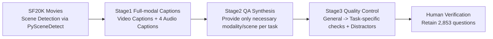

# JointAVBench: A Benchmark for Joint Audio-Visual Reasoning Evaluation

**Conference**: ICLR 2026  
**OpenReview**: [https://openreview.net/forum?id=Zg1YH8R5GG](https://openreview.net/forum?id=Zg1YH8R5GG)  
**Code**: [Project Page](https://roverx12345.github.io/jointavbench_webpage/)  
**Area**: Multi-modal Evaluation / Joint Audio-Visual Reasoning / Omni-LLM Benchmark  
**Keywords**: Audio-Visual Reasoning, Omni-LLM, Benchmark, Strong Audio-Visual Correlation, Multi-Scene Reasoning  

## TL;DR
JointAVBench is the first "audio-visual strongly correlated" joint reasoning benchmark for Omni-LLMs, covering 5 cognitive dimensions, 4 types of audio signals, and 3 scene spans for a total of 15 tasks. It utilizes a semi-automated pipeline to synthesize 2,853 multiple-choice questions from movies that require audio-visual synergy to solve; even the strongest model achieves only 65.3% accuracy.

## Background & Motivation
- **Background**: Understanding video naturally requires simultaneous reasoning over visual and auditory information. While the new generation of Omni-LLMs (Gemini, Qwen-Omni, etc.) can jointly process audio and video, progress is limited by the lack of a comprehensive benchmark specifically for evaluating "joint reasoning capabilities."
- **Limitations of Prior Work**: Existing benchmarks have gaps across three dimensions: video-only benchmarks (EgoSchema, Video-MME, MVBench) lack audio entirely; audio-visual benchmarks either lack strict audio-visual correlation control (WorldSense's truly correlated ratio is only 62.9% and leans toward visual tasks), use static images or simple videos (OmniBench, AV-Odyssey focus on image+audio), or have limited audio types (most cover only 1-3 categories).
- **Key Challenge**: Almost all existing benchmarks ignore **multi-scene reasoning**—associating speech in one scene with objects in another or cross-scene plot sequences—which is at the core of human cognition but remains an evaluation blind spot.
- **Goal**: To construct an **audio-visual strictly correlated** benchmark that systematically covers multiple audio types and multi-level scene spans, forcing models to perform true joint reasoning rather than relying on uni-modal shortcuts.
- **Key Insight**: **[Strong Correlation + 3D Taxonomy]** 15 tasks are designed with the hard constraint that "neither vision nor audio alone can answer," organized along three axes: cognitive dimension $\times$ audio type $\times$ scene span. **[Semi-automated Synthesis]** To circumvent high manual annotation costs, QA pairs are synthesized through the collaboration of vision-LLMs, audio-LLMs, and general LLMs, followed by human auditing to reduce annotation difficulty and cost.

## Method

### Overall Architecture
JointAVBench first establishes three construction principles: "strong audio-visual correlation, high-quality video sources, and multi-dimensional task taxonomy." These are implemented via a three-stage semi-automated pipeline: segmenting movie scenes, generating full-modal captions for each scene, synthesizing QA pairs by providing only necessary information based on task modality/scene constraints, and finally performing multi-level quality control with human verification. Ultimately, 2,853 human-verified multiple-choice questions were produced from 1,046 short movies.

### Key Designs
**1. 3D Taxonomy decomposing "Joint Reasoning" into 15 quantifiable tasks: Pinpointing capability blind spots.** The authors organize tasks along three orthogonal axes: Cognitive Dimension (Temporal / Spatial / Emotion / Plot / Long-range, 5 types), Audio Signal Type (Speech SPE / Vocal Timbre VOT / Sound Event SEV / Music MUS, 4 types), and Scene Span (Single-scene / Cross-scene / Full-video, 3 types). Each intersection represents a specific task, such as "Speaker Emotion Recognition (SPER)" (Single-scene $\times$ VOT $\times$ Emotion) or "Multi-Plot Ordering (MPO)" (Cross-scene $\times$ SPE+VOT $\times$ Plot). This Cartesian organization allows the benchmark to locate failures at a fine-grained level and ensures comprehensive coverage of joint reasoning.

**2. Hard constraint of strong audio-visual correlation: Rendering uni-modal approaches ineffective.** The core of the benchmark is that questions must rely on both vision and audio. During synthesis, only the specific modality and scene captions required for the task are provided to the LLM. In the quality control stage, a "Modality Check" explicitly verifies that both modalities are indispensable (e.g., a question about a speaker's emotion is discarded if only one male voice is present, as it could be inferred uni-modally). This mechanism achieves a real audio-visual correlation ratio of **93.5%**, significantly higher than previous benchmarks like OmniBench (80.4%).

**3. Three-stage semi-automated synthesis pipeline: Using LLM collaboration to reduce costs.** Stage 1 generates full-modal captions using PySceneDetect to ensure intra-scene consistency. It produces video captions along with four types of audio captions (Speech, Vocal Timbre, Sound Event, Music). Since existing audio models struggle to distinguish sound events from music, an LLM judge is used to separate them and eliminate hallucinations. Stage 2 uses human-designed templates for complex tasks (Temporal/Plot) while allowing LLM freedom for general tasks (e.g., Character Relationship Inference CRI) to ensure diversity. Stage 3 employs a "General $\rightarrow$ Task-specific" Chain-of-Thought filtering process.

**4. Human verification and label refinement: Anchoring automated output to high fidelity.** After the automated pipeline produced 3,974 MCQs, an annotation team scored them on four criteria: answer correctness, information accuracy, audio-visual dependency, and difficulty. Questions were categorized as Accepted, Pending Review, or Discarded. A final retention of 2,853 questions (71.8% yield) proves the quality of the automated pipeline. Post-hoc refinement was also performed to correct labels without changing the benchmark scale, further reducing residual inconsistencies.

## Key Experimental Results

### Main Results (Selected models, Accuracy %, Avg is the mean of 15 tasks)

| Type | Model | Size | SPER | MPO | PTG | CSA | Avg |
|---|---|---|---|---|---|---|---|
| Omni | Gemini2.5-Pro | - | 40.2 | 67.6 | 62.1 | 47.9 | **65.3** |
| Omni | Qwen3-Omni | 30B | 39.9 | 57.7 | 32.9 | 45.0 | 63.6 |
| Omni | Gemini2.5-Flash | - | 27.6 | 55.3 | 59.3 | 39.7 | 58.0 |
| Omni | Qwen2.5-Omni | 7B | 35.2 | 40.4 | 21.5 | 48.8 | 56.5 |
| Video | InternVL-2.5 | 8B | 31.9 | 44.2 | 27.5 | 40.8 | 51.7 |
| Video | GPT-4o | - | 18.8 | 17.3 | 14.8 | 39.7 | 45.0 |
| Audio | Kimi-Audio | 7B | 36.9 | 32.0 | 26.2 | 40.5 | 45.6 |
| Audio | Qwen2-Audio | 7B | 35.0 | 38.2 | 27.6 | 31.1 | 39.5 |

### Modality Utilization Analysis (A+V vs. Uni-modal Best/Worst)

| Model | Modality | $N_o$↑ | $N_u$↓ | Avg |
|---|---|---|---|---|
| Qwen2.5-Omni | A+V | 9 | 1 | 56.5 |
| VideoLLaMA2 | A+V | 5 | 5 | 46.8 |
| OneLLM | A+V | 8 | 2 | 36.9 |

> $N_o$: Number of tasks where A+V exceeds the best uni-modal score; $N_u$: Number of tasks where A+V is lower than the worst uni-modal score. Stronger models have higher $N_o$ and lower $N_u$, indicating more effective fusion.

### Key Findings
- **Overall low performance**: Even the strongest Gemini2.5-Pro reaches only 65.3%. Omni-LLMs systematically outperform pure video/audio models, highlighting the value of native modal fusion.
- **Imbalanced audio performance**: Models perform well on sound events and music (strong visual correspondence) but struggle with speech and vocal timbre—SPL, SPER, and MPO are the worst-performing tasks globally.
- **Cross-scene as a true bottleneck**: Performance is high in single scenes but drops significantly in cross-scene tasks; accuracy for multi-scene tasks plunges by ~20% as the number of scenes increases from 0-20 to 60+.
- **Emotion/Spatial anomalies**: While Omni-LLMs lead in 11 of 15 tasks, they lose to uni-modal models in emotion tasks (extra modalities act as noise) and are inferior to Video-LLMs in spatial tasks (failing to effectively integrate audio spatial cues).

## Highlights & Insights
- **"Strong Correlation" as the core contribution**: The 93.5% correlation ratio prevents models from taking uni-modal shortcuts, truly exposing the gap in joint reasoning.
- **Diagnostic 3D Taxonomy**: Instead of just piling up tasks, it allows every failure to be traced back to a specific "audio type $\times$ scene span," providing clear direction for future model improvements.
- **Systematic revelation of multi-scene reasoning**: Quantifying the collapse of cross-scene association via "scene count vs. accuracy" curves points to a previously overlooked research direction.
- **Engineering value of the semi-automated pipeline**: Collaborative LLMs + chained verification + human auditing achieves high-quality QA production at scale, reusable for other modal evaluations.

## Limitations & Future Work
- **Single question format**: All questions are 4-choice MCQs, which might overestimate understanding due to guessing or elimination strategies; there is a lack of open-ended generation or grounding tasks.
- **Narrow domain**: Video sources are restricted to movies (SF20K), which differ from instructional, surveillance, or first-person distributions.
- **Limited scale**: The sample size per task is relatively small once the 2,853 questions are divided into 15 tasks, requiring larger-scale verification for statistical robustness.
- **Reliance on off-the-shelf models**: Captions are generated by existing models, potentially introducing inherent hallucinations or blind spots (e.g., weak vocal timbre understanding).

## Related Work & Insights
- **Comparison with video-only benchmarks** (EgoSchema / Video-MME / MVBench): These have zero audio types and zero audio-visual correlation. JointAVBench fills the "Joint" dimension.
- **Comparison with audio-visual benchmarks** (OmniBench / AV-Odyssey / WorldSense): Ours leads in both number of audio types (4) and true correlation ratio (93.5% for video/multi-scene), and is one of the few to emphasize multi-scene analysis.
- **Insight**: Evaluation design can systematically extract capability blind spots using "strong modality correlation + orthogonal multi-dimensional taxonomy." For models, vocal timbre/emotion understanding and cross-scene long-range association are the most critical shortcomings in current Omni-LLMs.

## Rating
- **Novelty**: ⭐⭐⭐⭐ First to strictly implement "strong correlation + multi-scene + multi-audio types" with a clear differentiation through 3D taxonomy.
- **Experimental Thoroughness**: ⭐⭐⭐⭐ Covers 17 mainstream models across Omni/Video/Audio categories with fine-grained analysis of scene spans and modality utilization.
- **Writing Quality**: ⭐⭐⭐⭐ Logic from motivation to solution is clear; taxonomy and comparison tables are intuitive.
- **Value**: ⭐⭐⭐⭐ Provides a diagnostic and clear evaluation tool for Omni-LLMs. The findings on cross-scene and vocal timbre understanding are of practical value to the community.

<!-- RELATED:START -->

## Related Papers

- [\[CVPR 2026\] AV-Reasoner: Improving and Benchmarking Clue-Grounded Audio-Visual Counting for MLLMs](../../CVPR2026/vlm_reasoning/av-reasoner_improving_and_benchmarking_clue-grounded_audio-visual_counting_for_m.md)
- [\[ICLR 2026\] LENS: Multi-level Evaluation of Multimodal Reasoning with Large Language Models](lens_multi-level_evaluation_of_multimodal_reasoning_with_large_language_models.md)
- [\[ICLR 2026\] GIR-Bench: Versatile Benchmark for Generating Images with Reasoning](gir-bench_versatile_benchmark_for_generating_images_with_reasoning.md)
- [\[ICLR 2026\] MathNet: A Global Multimodal Benchmark for Mathematical Reasoning and Retrieval](mathnet_a_global_multimodal_benchmark_for_mathematical_reasoning_and_retrieval.md)
- [\[CVPR 2025\] Beyond Final Answers: CRYSTAL Benchmark for Transparent Multimodal Reasoning Evaluation](../../CVPR2025/vlm_reasoning/beyond_final_answers_crystal_benchmark_for_transparent_multimodal_reasoning_eval.md)

<!-- RELATED:END -->
