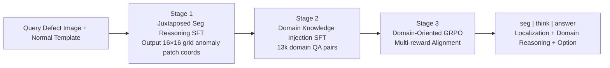

# JUDO: A Juxtaposed Domain-Oriented Multimodal Reasoner for Industrial Anomaly QA

**Conference**: ICLR 2026  
**OpenReview**: [https://openreview.net/forum?id=XW4mROtaVb](https://openreview.net/forum?id=XW4mROtaVb)  
**Code**: [https://github.com/woodavid31/JUDO](https://github.com/woodavid31/JUDO)  
**Area**: Multimodal VLM / Industrial Anomaly Understanding  
**Keywords**: Industrial Anomaly Detection, Large Multimodal Models, Domain Knowledge Internalization, Juxtaposed Reasoning, Anomaly Segmentation, GRPO  

## TL;DR
JUDO utilizes "juxtaposed normal-defect images" for fine-grained segmentation reasoning, internalizes industrial domain knowledge into model parameters via SFT, and unifies visual grounding with domain semantics using multi-reward GRPO. Using a 7B model, it outperforms GPT-4o and Qwen2.5-VL on the MMAD benchmark.

## Background & Motivation
- **Background**: Large Multimodal Models (LMMs) have advanced industrial anomaly detection from "anomaly reporting" to "conversational defect analysis" (localization, description, cause analysis), with the MMAD benchmark serving as the evaluation standard. Frameworks like AnomalyR1 and OmniAD have begun using GRPO to enhance reasoning, with OmniAD also introducing anomaly segmentation for visual grounding.
- **Limitations of Prior Work**: Existing GRPO methods primarily optimize "instruction-response" matching but **lack internalization of domain knowledge**. Industrial anomalies are highly domain-specific (definitions, causes, consequences, and normal samples as visual references), and such knowledge is rarely encountered during LMM pre-training.
- **Key Challenge**: While incorporating external knowledge or normal samples via RAG-like methods during inference can alleviate this, models with insufficient internal knowledge tend to **over-rely on external context**, producing "plausible but inaccurate" answers. The root cause is the lack of domain knowledge internalized within the parameters.
- **Goal**: To develop the first industrial anomaly reasoning framework that systematically "learns" domain knowledge into parameters and unifies domain understanding across visual grounding and textual reasoning.
- **Key Insight**: **Shift the "normal samples" and "domain knowledge" typically used at inference time to the training phase for internalization**. This involves using juxtaposed segmentation to learn visual contrast, SFT to internalize domain textual knowledge, and domain-oriented multi-reward GRPO to fuse these into a unified domain reasoning process.

## Method

### Overall Architecture
JUDO is built on Qwen2.5-VL-7B and employs a three-stage progressive training strategy: Stage 1 involves juxtaposed segmentation reasoning using "query image vs. normal template" to acquire fine-grained visual contrast capabilities; Stage 2 injects industrial domain textual knowledge into parameters via SFT; Stage 3 utilizes domain-oriented GRPO with multi-rewards to unify visual grounding and domain semantics into coherent, domain-aligned reasoning.

### Key Designs

**1. Juxtaposed Segmentation Reasoning: Converting "normal benchmarks" into actionable training signals.** The core of Stage 1 is moving beyond "pattern memorization" to explicitly comparing defect images with normal templates. Borrowing the textualized segmentation concept from Text4Seg, the model is trained to output coordinates of anomalous patches in a 16×16 grid as a text sequence (e.g., `(11,12)-(11,14), (12,11)`), wrapped in `<seg></seg>` tags. Simultaneously, it generates explanations based on "visual evidence derived from comparing with the normal image" within `<think></think>` tags. This patch-level juxtaposition forces reasoning to bind to specific visual evidence, upgrading "general comparison" to "finding fine-grained differences against a normal template," making subsequent textual explanations more reliable.

**2. Domain-Knowledge Injection: Internalization instead of external plug-ins.** Stage 1 only addresses visual contrast; the model still lacks textual domain knowledge of industrial anomalies. JUDO uses unstructured domain snippets provided by MMAD (referencing object categories and defect characteristics) and prompts GPT-4o to structure them into QA pairs (e.g., "What standard indicates a defect on a fabric edge?" "Why is detecting loose threads important for product reliability?"). Approximately 13k QA pairs are generated. Crucially, these QA pairs **are not bound to specific anomaly image samples** but focus on the underlying knowledge of how domain concepts generalize. Each QA is also paired with a normal image of that category as a visual anchor, naturally inducing the model to recall relevant domain knowledge during reasoning.

**3. Domain-Oriented Multi-Reward GRPO: Welding visual grounding and domain semantics together.** To unify the capabilities separated in the first two stages, Stage 3 employs GRPO with three sets of rewards. **The Domain Reasoning Reward** $R_{domain}=\lambda\cdot\frac{\phi(E_{gen})\cdot\phi(E_{pdomain})}{\|\phi(E_{gen})\|\|\phi(E_{pdomain})\|}$ uses all-MiniLM-L6-v2 to encode the semantic cosine similarity between the model's reasoning and "pseudo-domain rationales" (generated by GPT-4o reorganizing existing evidence without introducing new knowledge), with $\lambda=0.1$ as a soft alignment signal to prevent dominance. **The Segmentation Reward** uses a segmented F1 score to evaluate patch coordinate accuracy: $R_{seg}=1.0$ (if both predicted and ground truth are empty), $0.2+0.8\cdot F1(P,P_G)$ (if both are non-empty), and $0.0$ otherwise. **The Option and Structure Alignment Reward** includes three parts: an option reward (selecting correctly within `<answer>`), a format reward (ensuring the `<seg>...<think>...<answer>` structure is parsable), and a reasoning consistency reward (requiring the conclusion in the reasoning to match the final answer and punishing "premature commitment" where the answer is given too early in the reasoning chain).

## Key Experimental Results

### Main Results (MMAD Benchmark, 1-shot, Average Accuracy %)

| Model | Scale | Anomaly Disc. | Defect Class. | Defect Loc. | Defect Desc. | Defect Ana. | Object Class. | Object Ana. | Avg |
|------|------|------|------|------|------|------|------|------|------|
| GPT-4o | - | 68.63 | 65.80 | 55.62 | 73.21 | 83.41 | 94.98 | 82.80 | 74.92 |
| Gemini-2.5-pro | - | 83.07 | 73.86 | 67.20 | 79.97 | 86.27 | 94.88 | 83.08 | 81.19 |
| Qwen2.5-VL | 7B | 71.39 | 54.35 | 61.17 | 65.81 | 79.32 | 91.44 | 84.43 | 72.56 |
| Kimi-VL-A3B | 16B | **72.93** | 53.49 | 59.66 | 72.39 | 81.74 | 91.91 | 85.89 | 74.00 |
| AnomalyR1 | 7B | 60.93 | 64.81 | 70.72 | 79.06 | 85.52 | 93.12 | 86.91 | 77.29 |
| **JUDO** | 7B | 65.04 | **74.74** | **73.01** | **84.56** | **89.41** | 94.04 | **87.58** | **81.20** |

JUDO achieves an average accuracy of 81.20% with a 7B parameter scale, surpassing GPT-4o (74.92) and AnomalyR1 (77.29), and matching Gemini-2.5-pro (81.19). It leads significantly in the four defect sub-tasks most dependent on domain knowledge (classification/localization/description/analysis).

### Ablation Study

| Method | Avg Accuracy |
|------|------|
| Qwen2.5-VL-7B | 72.56 |
| + GRPO | 77.29 |
| + GRPO + RAG | 76.29 |
| + GRPO + DomInj | 79.82 |
| + GRPO + SegJux + DomInj | 80.35 |
| + GRPOdom + SegJux + DomInj (JUDO Full) | 81.20 |

### Key Findings
- **Internalization significantly outperforms RAG**: Adding RAG to a GRPO model actually decreased performance to 76.29, whereas Domain Injection (DomInj) increased it by nearly 5% to 79.82. This validates that learning knowledge into parameters is superior to providing it as external context during reasoning.
- **Each of the three stages contributes**: Stage 1 increased defect localization from 61.17 to 73.01; Stage 2 propelled defect description and analysis to 84.56 and 89.41 respectively; Stage 3 unified these disparate capabilities into coherent reasoning.
- **Anomaly Discrimination (Binary) is a recognized trade-off**: JUDO scored 65.04, lower than Qwen (71.39) and Kimi-VL (72.93). The authors observed that shifting from direct answering to reasoning modes causes a drop in simple discrimination tasks, suggesting the degradation stems from the "introduction of reasoning" itself rather than visual encoder capacity.

## Highlights & Insights
- **Shifting "Inference Context" to "Training Internalization"**: Normal samples and domain knowledge are typically optional inference-time add-ons. JUDO treats them as core training signals, representing a paradigm shift for industrial anomaly LMMs.
- **Textualized Patch Coordinates for Segmentation**: Using a 16×16 grid coordinate sequence embeds segmentation into generative reasoning, removing the need for extra segmentation heads and forcing reasoning to bind to visual evidence, thereby improving interpretability.
- **Pragmatic "Anti-Early Commitment" Reward**: Penalizing the disclosure of answers in the first half of the reasoning prevents the model from using CoT as mere decoration while taking shortcuts to the answer.

## Limitations & Future Work
- **Regression in Binary Anomaly Discrimination**: The introduction of reasoning processes causes a systematic drop in simple discrimination tasks. JUDO is also limited by the Qwen2.5-VL visual encoder, making it difficult to compete with commercial models with stronger encoders on simple tasks.
- **Dependency on GPT-4o for Data Construction**: Both the Stage 2 QA pairs and the Stage 3 pseudo-domain rationales rely on GPT-4o, subjecting JUDO to its potential biases and quality limitations.
- **Domain Knowledge Source Constraints**: The knowledge is derived entirely from the unstructured descriptions in MMAD; its transferability to new datasets or defect types remains to be verified.
- **Missing Baselines**: Horizontal comparisons are incomplete as some baselines like OmniAD were not open-sourced at the time of writing.

## Related Work & Insights
- **MMAD** (Jiang et al., 2025) provides the evaluation benchmark and domain knowledge snippets foundational to this work.
- **AnomalyR1 / OmniAD** are precursors in bringing GRPO to anomaly detection; JUDO differentiates itself through domain knowledge internalization.
- **Text4Seg**'s textualized segmentation inspired the use of grid coordinate sequences for anomaly segmentation.
- **Vertical Domain Insight**: For tasks requiring specialized reasoning rather than general recognition (e.g., medical, finance), domain-aligned training can allow small open-source models to outperform large commercial systems. "Learning into parameters" is superior to "retrieval during inference."

## Rating
- **Novelty**: ⭐⭐⭐⭐ Shifts normal samples/domain knowledge from inference-time context to training signals; uses a clear three-stage pipeline (juxtaposed segmentation + SFT + multi-reward GRPO).
- **Experimental Thoroughness**: ⭐⭐⭐⭐ Comprehensive comparison across seven MMAD sub-tasks against commercial and open-source models; clear ablation study showing stage contributions.
- **Writing Quality**: ⭐⭐⭐⭐ Consistent chain of Motivation-Conflict-Method-Validation; clear explanation of rewards and architecture.
- **Value**: ⭐⭐⭐⭐ Provides an empirical paradigm showing internalization is superior for industrial anomaly LMMs; 7B model beating GPT-4o is practically significant.

<!-- RELATED:START -->

## Related Papers

- [\[ICLR 2026\] Reasoning-Driven Multimodal LLM for Domain Generalization](reasoning-driven_multimodal_llm_for_domain_generalization.md)
- [\[ICLR 2026\] Not Search, But Scan: Benchmarking MLLMs on Scan-Oriented Academic Paper Reasoning](not_search_but_scan_benchmarking_mllms_on_scan-oriented_academic_paper_reasoning.md)
- [\[CVPR 2026\] IPR-1: Interactive Physical Reasoner](../../CVPR2026/vlm_reasoning/ipr-1_interactive_physical_reasoner.md)
- [\[CVPR 2026\] VRR-QA: Visual Relational Reasoning in Videos Beyond Explicit Cues](../../CVPR2026/vlm_reasoning/vrr-qa_visual_relational_reasoning_in_videos_beyond_explicit_cues.md)
- [\[CVPR 2026\] Dr. Seg: Revisiting GRPO Training for Visual Large Language Models through Perception-Oriented Design](../../CVPR2026/vlm_reasoning/dr_seg_revisiting_grpo_training_for_visual_large_language_models_through_percept.md)

<!-- RELATED:END -->
