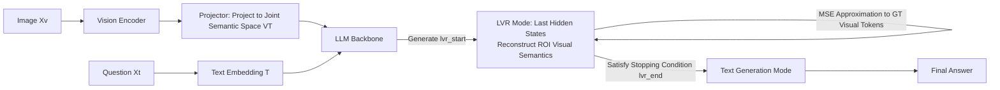

# Latent Visual Reasoning

**Conference**: ICLR 2026  
**OpenReview**: [https://openreview.net/forum?id=j84WR5ORsC](https://openreview.net/forum?id=j84WR5ORsC)  
**Code**: To be open-sourced (Paper promises release of code and weights)  
**Area**: Multimodal Visual Reasoning / MLLM  
**Keywords**: Latent Space Reasoning, Visual Semantic Reconstruction, MLLM, GRPO, Fine-grained Visual Understanding  

## TL;DR
LVR enables Multimodal Large Language Models (MLLMs) to move beyond "thinking" solely in text space. Instead, it uses the LLM's last hidden states to autoregressively reconstruct question-related visual semantics directly in the visual embedding space ("think before speaking"). Combined with a modified GRPO reinforcement learning, this approach significantly outperforms the "Think about/with Images" paradigms on perception-intensive VQA tasks.

## Background & Motivation
- **Background**: Current multimodal reasoning in MLLMs primarily follows two paths: 1) **"Thinking about Images"**, treating images as static premises for chain-of-thought (CoT) reasoning in text space; 2) **"Thinking with Images"**, calling external tools (crop, zoom, auxiliary lines, OCR) to edit images and injecting new image tokens into text reasoning.
- **Limitations of Prior Work**: Text-space CoT can introduce cross-modal interference where excessive text tokens overwhelm critical visual inputs, weakening perception. Tool-based approaches are limited by predefined APIs, are difficult to scale, involve high training costs, and often suffer from models bypassing injected sub-images due to data bias. Both **essentially only apply patches to the text side**, leaving a gap between visual input and text generation.
- **Key Challenge**: Since visual and text tokens are projected into the **same joint semantic space** in MLLMs, why must reasoning be restricted to discrete text tokens rather than visual tokens? Traditional LLMs are constrained by next-token-prediction targets, allowing them to operate only on discrete tokens and preventing direct "thinking" on continuous visual semantics.
- **Goal**: To propose a new paradigm that allows the model to **reason directly and autoregressively in the visual embedding space**, similar to how humans "visualize key scenes in their minds before speaking."
- **Core Idea**: **[Implicit Visual Thought]** Borrowing from NLP latent space reasoning (e.g., Coconut, passing last hidden states instead of discrete tokens), this work extends the concept to the visual domain—allowing the LLM to use the last hidden states between `<|lvr_start|>` and `<|lvr_end|>` to **reconstruct visual tokens of question-related ROIs**. These "latent visual thoughts" are then fed back into the context to guide subsequent text answering.

## Method

### Overall Architecture
The LVR architecture follows the standard MLLM setup of **Vision encoder → Projector → LLM** (based on Qwen2.5-VL 3B/7B), with one fundamental change: the LLM alternates autoregressively between **text generation** and **latent visual reasoning** modes. Upon generating the special token `<|lvr_start|>`, the model enters LVR mode. Here, instead of feeding back discrete tokens predicted by the LM head, the **last hidden states are directly used as input embeddings for the next position**, continuously reconstructing visual semantics. Upon reaching a stopping condition, it generates `<|lvr_end|>` and resumes normal text generation. Training consists of two stages: SFT uses ROI bounding boxes to supervise hidden states to approximate ground truth visual tokens, and the RL stage uses a modified GRPO to enable self-evolution of this latent reasoning.

### Key Designs

**1. ROI-supervised Visual Reconstruction SFT: Quickly teaching latent space reasoning via "teacher-forcing".** Each SFT sample consists of an "image-question pair + a pre-labeled ROI bounding box". The model divides the image into a grid of visual patches and retrieves the indices $I=\{I_1,\dots,I_{T_v}\}$ of patches falling within the ROI in O(1) time. The corresponding visual embeddings $\{v_1,\dots,v_{T_v}\}$ serve as the "ground truth" for reconstruction during latent reasoning. The last hidden states $\{h_t\}$ generated during the LVR segment are forced to approximate these visual tokens using MSE:
$$\mathcal{L}_{\mathrm{LVR}} = \frac{1}{T_v}\sum_{t=1}^{T_v}\lVert h_t - v_t\rVert_2^2$$
Subsequent text answering uses standard cross-entropy $\mathcal{L}_{\mathrm{NTP}}=-\frac{1}{T_y}\sum_t \log p_\theta(y_t\mid y_{<t}, h_{1:T_v})$. The joint weighted loss is: $\mathcal{L}=\mathcal{L}_{\mathrm{NTP}}+\lambda_{\mathrm{LVR}}\mathcal{L}_{\mathrm{LVR}}$. While this stage restricts reasoning content (the ROI determines what to reconstruct), it allows the model to quickly master the basic capability of "reasoning in latent space." Notably, **the vision encoder and projector are frozen throughout, updating only the LLM**—based on the strong assumption that the LLM can achieve unified reasoning space without additional projector fine-tuning.

**2. GRPO$_{\text{latent}}$: Bringing reinforcement learning into a latent space without token distributions.** After SFT, RL is used to liberate LVR from box constraints for free exploration. The challenge is that standard GRPO policy gradients are defined on token distributions, while the latent reasoning process **has no explicit token distribution**. The solution is to record the last hidden states $\tilde h^{\text{latent}}_i=\{h^{\text{latent}}_{i,1},\dots\}$ from the LVR segment during rollout and perform a **teacher-forcing forward replay** when calculating importance ratios. By "patching" the recorded hidden states back into the latent reasoning positions, the context before text generation is precisely restored, ensuring consistency of conditional log-probabilities under $\pi_\theta$ and $\pi_{\theta_{old}}$:
$$r_{i,t}(\theta)=\frac{\pi_\theta(y_{i,t}\mid q,I,\tilde h^{\text{latent}}_i,y_{i,<t})}{\pi_{\theta_{old}}(y_{i,t}\mid q,I,\tilde h^{\text{latent}}_i,y_{i,<t})}$$
Rewards are **derived only from the text output $y$**: format rewards (1 for responses containing both `<|lvr_start|>` and `<|lvr_end|>`) + accuracy rewards (1 for correct answers). Format rewards implicitly encourage LVR triggering, while accuracy rewards **indirectly supervise latent reasoning through its impact on text generation**—eliminating the need for ROI labels and allowing latent reasoning to self-evolve.

**3. Three decoding strategies for exit: Solving "when to stop visual thinking".** Inside LVR mode, the LM head still predicts tokens, but determining when to output `<|lvr_end|>` to exit is highly unstable. The paper proposes three schemes: (i) **Fixed Token**—using a fixed budget of reasoning steps (e.g., 4/8/16 steps); (ii) **Latent End Token**—learning a trainable hidden state tensor and exiting when the last hidden state is close to it; (iii) **Mode Switching Loss**—adding a BCE auxiliary loss during SFT to push the last latent token distribution toward `<|lvr_end|>` and intermediate tokens away. Testing shows **the simplest Fixed Token strategy is the most stable and effective**. Mode Switching Loss failed to learn the stopping condition, collapsing to 0 steps, while Latent End Token was unreliable due to distance metrics (cosine/L1/L2 thresholds) frequently failing to terminate, exhausting generation steps. This highlights that variable-length latent reasoning remains an open challenge.

## Key Experimental Results

The backbone is Qwen2.5-VL 3B/7B; SFT uses VISUAL CoT (438k VQA with boxes) data, and RL uses ViRL data. 7B SFT takes approximately 40 hours for 2500 steps on 4×AMD MI250.

### Main Results (7B, vision-centric tasks, selection)

| Method | V* | V* D.A. | V* R.P. | MMVP | Counting | JigSaw | Spatial Rel. |
|--------|----|---------|---------|------|----------|--------|--------------|
| Qwen2.5-VL (base) | 78.5 | 81.7 | 73.7 | 66.7 | 66.7 | 52.0 | 87.4 |
| PixelReasoner (Tool) | 80.1 | 81.7 | 77.6 | 67.0 | 66.7 | 52.7 | 88.1 |
| Vision-R1 (Text CoT) | 70.2 | 70.4 | 69.7 | 46.7 | 51.7 | 27.3 | 66.4 |
| SFT (Data Baseline) | 79.1 | 82.6 | 73.7 | 65.7 | 67.5 | 45.3 | 88.8 |
| **LVR (4 steps)** | 81.2 | **84.4** | 76.3 | **72.0** | 69.2 | 52.7 | **89.5** |
| **LVR (8 steps)** | **81.7** | **84.4** | 77.6 | 71.7 | 70.0 | 52.0 | 86.0 |
| **LVR (16 steps)** | 80.6 | 81.7 | **79.0** | 71.7 | **70.8** | 52.7 | 87.4 |

- MMVP **71.67% vs Qwen2.5-VL 66.67%** (+5%); V* R.P. (Relative Spatial Reasoning) +5.3%, V* D.A. (Detail Action) +2.7%; surpassing PixelReasoner which relies on external cropping tools.

### Ablation Study (7B, Architecture Variants)

| Variant | V* | V* D.A. | MMVP | IQ-Test | JigSaw |
|------|----|---------|------|---------|--------|
| **LVR (Standard)** | **81.7** | **84.4** | **71.7** | **29.3** | **52.0** |
| LVR LatentEnd | 39.8 | 32.2 | 19.0 | 6.7 | 13.3 |
| LVR MLP Head | 74.4 | 76.5 | 69.7 | 23.3 | 50.0 |
| LVR GLU Head | 79.6 | 82.6 | 69.0 | 25.3 | 44.0 |

- **RL (3B)**: GRPO$_{\text{latent}}$ further improves upon SFT, e.g., MMVP increasing from 54.7 to 55.3, and V* from 64.9 to 65.5 (4 steps), proving latent reasoning can evolve through reinforcement.

### Key Findings
- **Avoiding extra heads is better**: MLP/GLU heads are inferior to using the LLM's last hidden state directly, suggesting LLMs **natively align visual and text semantics** in the joint space. Adding heads creates semantic gaps.
- **Text CoT hurts perception**: PAPO/Vision-R1 show significant degradation on V*, confirming cross-modal interference in "Thinking about Images"; LVR avoids this via joint reasoning.
- **Sole weakness in Relative Reflect**: Due to training on single images while this task requires multi-image reasoning, a distribution shift exists.

## Highlights & Insights
- **Paradigm Innovation**: The first work to truly move "autoregressive reasoning" into the **visual embedding space**, addressing the intuitive question of why visual and text modalities shouldn't reason together if they share a joint space.
- **Elegant Supervision Signal**: Using existing ROI boxes → patch selection → MSE reconstruction converts "what to think" into a supervised target, bypassing the interpretability and supervision challenges of NLP latent spaces.
- **GRPO$_{\text{latent}}$ Replay Trick**: The teacher-forcing replay of hidden states to restore importance ratios is a versatile and reusable engineering solution for applying RL to non-tokenized intermediate processes.
- **Honesty with Negative Results**: Explicitly reporting the collapse of Mode Switching Loss and the instability of Latent End Token provides clear guidance on the real bottlenecks for future variable-length latent reasoning research.

## Limitations & Future Work
- **Fixed-length Reasoning constraint**: The most effective "Fixed Token" approach uses a constant budget; adaptive stopping (variable-length latent reasoning) remains the core open challenge.
- **Single-image Training Limitations**: Performance on multi-image/cross-image tasks (e.g., Relative Reflect) is suboptimal, requiring multi-image data augmentation.
- **Dependency on ROI labels for cold start**: SFT still requires box-labeled data (VISUAL CoT). While RL can remove this, the initial startup cost remains.
- **RL limited to 3B**: Due to compute constraints, RL was not scaled to 7B; scaling effects are yet to be verified.
- **Strong Assumptions on Frozen Components**: Whether "optimal projection without fine-tuning" holds for more difficult tasks remains uncertain.

## Related Work & Insights
- **Coconut (Hao et al. 2024)**: The direct conceptual source for NLP latent space reasoning—passing last hidden states rather than discrete tokens; LVR grounds this in the visual domain with supervised visual anchors.
- **Think with Images (PixelReasoner / Argus-X3)**: Argus-X3 also extracts and injects ROI visual tokens, serving as the closest comparison—but it relies on external tools. LVR learns to **reconstruct** visual semantics internally, proving many crop/zoom/OCR operations can be internalized by MLLMs.
- **Insights**: ① Latent space reasoning is a promising direction for reducing text verbosity and mitigating cross-modal interference; ② The approach of "using weak labels (boxes) to supervise hidden states" can be transferred to other latent reasoning tasks; ③ The forward replay paradigm for applying RL to intermediate non-token processes is applicable to diffusion and implicit CoT tasks.

## Rating
- Novelty: ⭐⭐⭐⭐⭐ Truly moves autoregressive reasoning into the visual embedding space; a paradigmatic new direction rather than just another CoT/tool variant.
- Experimental Thoroughness: ⭐⭐⭐⭐ Covers multiple perception-intensive benchmarks (V*/MMVP/BLINK), with thorough ablations and honest reporting of negative results. Points deducted for RL verification only on 3B and lack of large-scale/multi-image experiments.
- Writing Quality: ⭐⭐⭐⭐ Clear motivation, intuitive diagrams, and well-explained formulas and design logic; some decoding strategy details are slightly dense.
- Value: ⭐⭐⭐⭐ Provides an extensible new paradigm and reusable GRPO$_{\text{latent}}$ techniques with tangible gains for fine-grained visual understanding; code/models are promised for open source.

<!-- RELATED:START -->

## Related Papers

- [\[CVPR 2026\] Latent Implicit Visual Reasoning](../../CVPR2026/vlm_reasoning/latent_implicit_visual_reasoning.md)
- [\[ICML 2026\] Imagination Helps Visual Reasoning, But Not Yet in Latent Space](../../ICML2026/vlm_reasoning/imagination_helps_visual_reasoning_but_not_yet_in_latent_space.md)
- [\[ICLR 2026\] Composition-Grounded Data Synthesis for Visual Reasoning](composition-grounded_data_synthesis_for_visual_reasoning.md)
- [\[CVPR 2026\] Monet: Reasoning in Latent Visual Space Beyond Image and Language](../../CVPR2026/vlm_reasoning/monet_reasoning_in_latent_visual_space_beyond_image_and_language.md)
- [\[CVPR 2026\] Machine Mental Imagery: Empower Multimodal Reasoning with Latent Visual Tokens](../../CVPR2026/vlm_reasoning/machine_mental_imagery_empower_multimodal_reasoning_with_latent_visual_tokens.md)

<!-- RELATED:END -->
