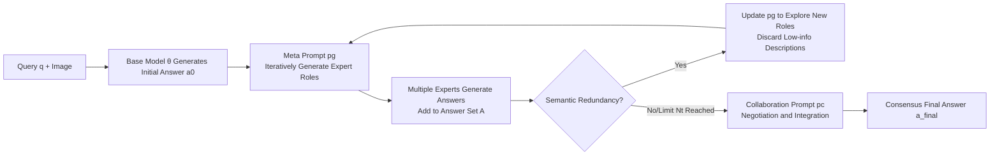

# LENS: Multi-level Evaluation of Multimodal Reasoning with Large Language Models

**Conference**: ICLR 2026  
**Code**: [https://github.com/Lens4MLLMs/lens](https://github.com/Lens4MLLMs/lens)  
**Area**: Multimodal Reasoning / Evaluation Benchmark  
**Keywords**: Multimodal Large Language Models, Evaluation Benchmark, Hierarchical Reasoning, Perception-Understanding-Reasoning, Multi-expert Collaboration  

## TL;DR
Lens constructs a unified distribution benchmark consisting of three levels and eight tasks ("Perception-Understanding-Reasoning") using the same set of 3.4K contemporary social media images paired with 60K+ human-annotated questions. It specifically quantifies the synergistic effect of low-level perception on high-level reasoning and proposes SMEC, a self-driven multi-expert collaboration framework without external tools, to improve complex reasoning performance.

## Background & Motivation
- **Background**: Multimodal Large Language Models (MLLMs) have made significant progress in visual recognition and cross-modal alignment, but complex reasoning in dynamic, diverse, real-world physical scenarios remains weak. Benchmarks such as V*, MMBench, and MMMU have begun shifting toward open-world evaluation.
- **Limitations of Prior Work**: Mainstream benchmarks are assembled in a "task-oriented" manner, where samples for different tasks often come from **different data distributions**. This prevents high scores in perception tasks from transferring to reasoning tasks. Furthermore, most benchmarks only examine primary visual understanding, lacking fine-grained characterization of high-order reasoning and spatial understanding.
- **Key Challenge**: When task sample distributions are inconsistent, it is impossible to cleanly measure how "low-level perception capabilities synergistically support high-level reasoning"—which is crucial for evaluating whether models are moving toward human-level intelligence.
- **Goal**: To build a hierarchical benchmark where **the same image carries all annotations for perception, understanding, and reasoning**, thereby evaluating cross-task synergy under a unified distribution, and to provide a language-native reasoning enhancement method that does not depend on external modules.
- **Core Idea**: **"Same-image multi-annotation + Three-level task tower"**—every image is fully annotated for eight tasks, unifying perception, understanding, and reasoning through a shared visual context so that synergistic effects can be quantitatively analyzed; **"Self-driven multi-experts"**—driving a single MLLM to act as a group of experts through self-generated role prompts and self-negotiating a consensus answer.

## Method

### Overall Architecture
Lens consist of two components: an **evaluation benchmark** (data + three levels with eight tasks) and a **reasoning framework SMEC**. The benchmark arranges eight tasks into three progressive levels: perception (Object Counting OC, Object Detection OD, Object Existence OE), understanding (Relationship Extraction RE, Visual Grounding VG, Region OCR), and reasoning (Spatial Relationship Understanding SRC, Scene Knowledge Inference SKI). All tasks share the same set of richly annotated images. SMEC drives the same MLLM during inference to generate an initial answer, self-generate a team of experts for review, filter redundant experts, and finally negotiate a consensus answer.

### Key Designs

**1. Three-level Task Tower with Same-image Multi-annotation: Making synergy measurable.** The core of Lens is not just the volume of tasks, but that **every image is covered by the same set of annotations across all eight tasks**. Consequently, perception, understanding, and reasoning levels are established on the same visual distribution. This design allows for a **controlled comparison** of a model's performance on low-level tasks (OC/OD/OE) against high-level tasks (SRC/SKI). Since input images are identical, differences stem from capability levels rather than data distribution. The paper quantifies synergy using Pearson correlation and regression: OC↔RE correlation reaches $0.73$, OE↔OCR reaches $0.67$. Furthermore, OE/OCR are strong predictors for SRC, and OC/RE significantly impact SKI, statistically confirming the hierarchical structure where "low-level perception supports high-level reasoning."

**2. Contemporary Real-world Images + Eight-task Open-ended Annotation: Anti-contamination and anti-memorization.** Images are manually collected from platforms such as X, Instagram, Weibo, and Xiaohongshu. 53% were published after January 2025, and over 80% after September 2024, naturally avoiding pre-training corpus contamination and ensuring timeliness. Tasks are designed as **open-set and natural language-driven**, covering attributes, counting, localization, relationships, reasoning, and interleaved content (Lens is the only benchmark in Table 1 compared to V*, MMBench, HC-RefLoCo, etc., to include all categories: Att./Cnt/Loc/Rel/Reasoning/Interleaved). Over 50 trained annotators produced 60K+ QA pairs, where over 60% of questions exceed simple recognition and explicitly require reasoning about scenes and user intent.

**3. SMEC—Self-generated Expert Roles and Redundancy Filtering.** Given a query $q$, the base model $\theta$ produces a rough initial answer $a_0$. Subsequently, a Meta-generation prompt $p_g$ is used to iteratively generate expert role descriptions $d_t^q$ (e.g., Geospatial Analyst, Cultural Analyst), and each valid description derives a new expert answer $a_t$ added to answer set $A$. When semantic redundancy occurs, the framework **dynamically updates $p_g$** to encourage the exploration of new roles and implicitly discards duplicate or low-information descriptions, thereby maintaining a concise and diverse expert team with minimal overhead. This step implements "multi-agent" behavior purely through prompt self-conditioning, requiring no external tools or task supervision.

**4. Consensus-driven Answer Integration.** After collecting the expert answer set, a collaboration prompt $p_c$ drives $\theta$ to perform deliberative reasoning, reconciling different expert perspectives into a unified final answer $a_{final}$. This simulates the process of a human expert panel providing individual opinions before reaching a consensus. Compared to the single-chain self-correction of Self-Refine or the blind voting of Majority Voting, SMEC's integration involves **explicit role division + redundancy pruning**, allowing it to stably accumulate gains as the number of iterations $N_t$ increases, rather than oscillating.

## Key Experimental Results

### Main Results (Representative Models, Three Levels & Eight Tasks)

| Model | Scale | OC | OD | OE | RE | VG | OCR | SRC | SKI |
|---|---|---|---|---|---|---|---|---|---|
| GPT-4o | - | 54.32 | N/A | 85.09 | 72.77 | N/A | 42.86 | 51.14 | 55.20 |
| Gemini2.5-Pro | - | 60.18 | 47.40 | 86.59 | 76.52 | 25.61 | 61.95 | 56.20 | 59.31 |
| InternVL3 | 78B | 61.38 | 47.44 | 84.87 | 74.93 | 27.24 | 54.21 | 49.39 | 55.17 |
| Qwen2.5-VL | 72B | 59.75 | 43.48 | 85.67 | 75.98 | 44.98 | 68.51 | 53.65 | 54.79 |
| QVQ-Max | 72B | 49.95 | N/A | 85.37 | 74.01 | N/A | 58.67 | 50.80 | 58.86 |
| Kimi-VL-thinking | MoE 2.8B/16B | 46.87 | N/A | 72.77 | 48.16 | N/A | 30.21 | 29.40 | 36.44 |

None of the 15+ frontier models **exceed 60% on reasoning tasks**; VG (Visual Grounding) remains a bottleneck even for 78B-scale models (InternVL3-78B achieves only 27.24%).

### Ablation Study (SMEC Gains on SKI Task)

| Method | Model | Iterations | Accuracy |
|---|---|---|---|
| Direct | Qwen2.5-VL-7B | - | 39.80 |
| Majority voting | Qwen2.5-VL-7B | - | 40.66 |
| Self-Refine | Qwen2.5-VL-7B | - | 40.51 (+0.71) |
| SMEC | Qwen2.5-VL-7B | 1 | 41.35 (+1.55) |
| SMEC | Qwen2.5-VL-7B | 2 | 42.97 (+3.17) |
| SMEC | Qwen2.5-VL-7B | 3 | 43.24 (+3.44) |
| Direct | Qwen2.5-VL-32B | - | 49.17 |
| SMEC | Qwen2.5-VL-32B | 3 | 52.44 (+3.27) |
| SMEC (Full data) | Qwen2.5-VL-32B | 3 | 54.66 (+3.12) |

### Key Findings
- **Performance scales steadily but saturates**: Qwen2.5-VL shows continuous improvement from 3B to 72B on reasoning tasks, and InternVL3's OD rises from 18.39% (2B) to 47.44% (78B), but marginal returns diminish at high scales.
- **Perception is the foundation of high-level cognition**: Models with stronger perception also perform better at reasoning; statistical correlations confirm the fundamental role of low-level visual understanding.
- **Reasoning-specialized models can partially compensate for perception shortcomings**: QVQ-Max lacks OD/VG capabilities but reaches 58.86% on SKI, relying on test-time scaling rather than solid perception.
- **SMEC gains accumulate with iterations and scale**: Improvements of +3.44% on 7B and +3.27% on 32B models are observed, and a stable +3.12% gain across the full test set indicates that benefits are not distribution-specific.

## Highlights & Insights
- **"Unified distribution" is the soul of this benchmark**: By pinning all tasks to the same set of images, the benchmark for the first time transforms "perception synergy in reasoning" from a qualitative claim into quantitative conclusions via regression and correlation analysis.
- **Hardcore anti-contamination design**: 53% of images come from after 2025 and were manually collected, directly addressing the pain point of current benchmarks where models "recite answers" from pre-training corpora.
- **Grace of SMEC lies in zero external dependencies**: It does not call external tools or expert models; it purely uses prompts to allow a single MLLM to self-split into an expert group and negotiate, resulting in low engineering deployment costs.

## Limitations & Future Work
- **Data bias remains**: Images are sourced from global social media but are influenced by platform demographics, leading to uneven geographical and cultural coverage; the authors acknowledge the need for future expansion.
- **SMEC inference overhead rises with iterations**: Three iterations involve multiple forward passes, increasing test-time cost and latency; the paper does not deeply quantify the throughput cost.
- **SMEC gains are concentrated on SKI**: Ablations primarily validated the Scene Knowledge Inference task, leaving thinner evidence for its universality across other reasoning tasks.
- **VG bottleneck remains unaddressed**: The benchmark reveals that Visual Grounding is a universal weakness, but SMEC focuses on language-side negotiation and does not directly improve fine-grained spatial-semantic alignment.

## Related Work & Insights
- **Comparison with task-oriented benchmarks** (MMBench, MMMU, HaloQuest): Lens differs by offering "unified distribution + rich annotation," bringing cross-task synergy into controllable analysis rather than measuring isolated capabilities.
- **Comparison with tool-calling/multi-agent methods**: SMEC does not rely on external modules; it compresses multi-expert collaboration into single-model prompt self-conditioning, serving as a lightweight "language-native" alternative.
- **Comparison with Self-Refine / Majority Voting**: While all are test-time enhancements, SMEC introduces explicit role division and redundancy pruning, allowing stable accumulation of gains over iterations instead of hitting a plateau.
- **Insight**: When evaluating causal/synergistic relationships between capabilities, controlling the input distribution is more important than simply increasing the number of tasks; treating a single model as a "multi-perspective integrator" at test-time is a reusable paradigm for low-cost complex reasoning enhancement.

## Rating
- **Novelty**: ⭐⭐⭐⭐ — The "same-image multi-annotation tower" makes synergy quantifiable for the first time, and the self-driven experts in SMEC are relatively unique, though individual components are not entirely new.
- **Experimental Thoroughness**: ⭐⭐⭐⭐ — Includes 15+ frontier models, three levels and eight tasks, and comprehensive correlation/regression synergy analysis; the narrow focus of the SMEC ablation (mostly SKI) is a minor drawback.
- **Writing Quality**: ⭐⭐⭐⭐ — Clear logic from motivation to benchmark, method, and synergy analysis; rich tables and effective hierarchical narrative.
- **Value**: ⭐⭐⭐⭐ — Provides an anti-contamination contemporary hierarchical benchmark and a deployable reasoning enhancement framework, offering practical reference value for both evaluation and methodology.

<!-- RELATED:START -->

## Related Papers

- [\[CVPR 2026\] Grounded Chain-of-Thought for Multimodal Large Language Models](../../CVPR2026/vlm_reasoning/grounded_chain-of-thought_for_multimodal_large_language_models.md)
- [\[ICLR 2026\] MIMIC-Bench: Exploring the User-Like Thinking and Mimicking Capabilities of Multimodal Large Language Models](mimic-bench_exploring_the_user-like_thinking_and_mimicking_capabilities_of_multi.md)
- [\[ACL 2026\] OMIBench: Benchmarking Olympiad-Level Multi-Image Reasoning in Large Vision-Language Models](../../ACL2026/vlm_reasoning/omibench_benchmarking_olympiad-level_multi-image_reasoning_in_large_vision-langu.md)
- [\[ICLR 2026\] SpinBench: Perspective and Rotation as a Lens on Spatial Reasoning in VLMs](spinbench_perspective_and_rotation_as_a_lens_on_spatial_reasoning_in_vlms.md)
- [\[ICLR 2026\] VisuRiddles: Fine-Grained Perception is a Primary Bottleneck for Multimodal Large Language Models in Abstract Visual Reasoning](visuriddles_fine-grained_perception_is_a_primary_bottleneck_for_multimodal_large.md)

<!-- RELATED:END -->
