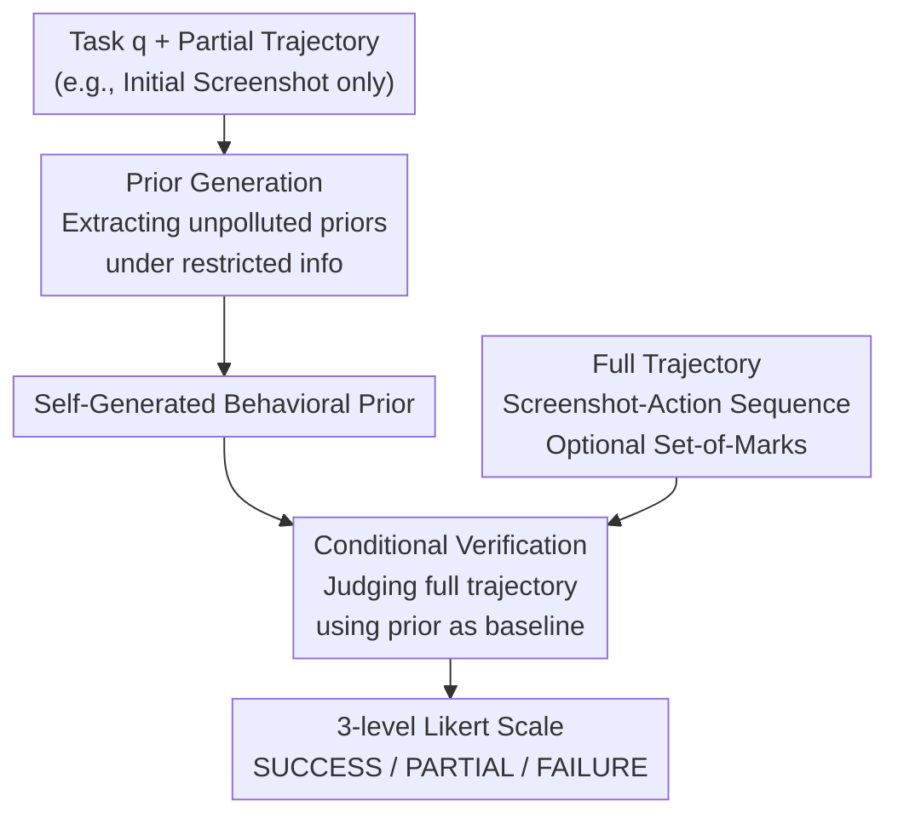

# Let's Think in Two Steps: Mitigating Agreement Bias in MLLMs with Self-Grounded Verification

**Conference**: ICLR 2026  
**arXiv**: [2507.11662](https://arxiv.org/abs/2507.11662)  
**Code**: [Project Homepage](https://github.com/GT-RIPL/SGV)  
**Area**: Multimodal VLM  
**Keywords**: mllm-as-verifier, agreement-bias, self-grounded-verification, agent-evaluation, robotics  

## TL;DR

This paper identifies a severe "agreement bias" in Multimodal Large Language Models (MLLMs) when serving as agent behavior verifiers—a systematic over-approval of agent actions. It proposes Self-Grounded Verification (SGV), a two-step generation method (extracting behavioral priors before conditional verification) to mitigate this bias. SGV improves failure detection rates by up to 25pp and accuracy by up to 14pp across web navigation, desktop operations, and robotic manipulation tasks.

## Background & Motivation

1. **Verifiers are core engines for AI progress**: From Go to code reasoning, the search+verifier paradigm has driven numerous breakthroughs. However, open-ended tasks (e.g., web operations, robotic grasping) lack formalized success criteria, making it difficult to build reliable automated verifiers.

2. **MLLMs are expected to serve as general verifiers**: With extensive world knowledge, alignment with human preferences, and multimodal reasoning capabilities, MLLMs are theoretically suitable for scoring/judging agent trajectories. They have been used in trajectory filtering, Reflexion self-improvement, and online supervision.

3. **Agreement bias is pervasive and severe**: The authors find across 13+ model families and 28+ evaluation templates that MLLMs systematically tend to give high scores to agent behaviors—the True Negative Rate (TNR) is as low as 50%, meaning half of the failed trajectories are incorrectly judged as successful. More concerningly, MLLMs generate CoT to "rationalize" their incorrect judgments.

4. **Existing test-time scaling techniques cannot solve this**: Mainstream methods like CoT, SoM, majority voting, and reasoning models fail to effectively mitigate the bias; sampling might even exacerbate the problem due to hallucinations.

5. **Key Challenge lies in the knowledge extraction bottleneck**: MLLMs actually possess correct behavioral priors (they can describe correct behaviors when given only partial information), but these priors are "overwritten" when facing full trajectories. This aligns with known limitations of pre-training and RLHF.

6. **Downstream impact is significant**: Agreement bias contaminates applications relying on MLLM judgments, such as self-improvement pipelines (Reflexion), online supervisory feedback, and behavioral cloning data filtering, preventing agents from receiving corrective signals.

## Method

### Overall Architecture

SGV (Self-Grounded Verification) is a zero-shot, training-free, two-step verification framework designed to resolve the agreement bias where MLLMs systematically provide positive evaluations. The framework deconstructs verification into two steps: first, the MLLM is prompted to freely generate behavioral priors describing "what correct behavior should look like" under "information-restricted" conditions where only partial trajectory information is visible. Second, these self-generated priors are used as a reference baseline for conditional judgment of whether the full trajectory is successful, using a three-level Likert scale. This separation bypasses the cause of agreement bias: MLLMs inherently hold correct behavioral priors, but these are "overwritten" by trajectory content when the full sequence is provided together, causing the model to blindly follow what it sees. By extracting the prior independently first, the model avoids being led astray by the trajectory.

### Key Designs

**1. Prior Generation: Extracting unpolluted behavioral knowledge under restricted information**

In the first step, the model is given only the task $q$ and a partial trajectory $\tau_{u:v}$ (e.g., the initial screenshot) to generate broad priors $\hat{k}$ regarding "what the correct behavior should look like," formalized as $\hat{k}_{q,u:v} = g\left(\prod_{i=1}^{n} P(y_i \mid y_{<i}, \tau_{u:v}, C, q)\right)$. This step directly addresses the root cause of bias: since the full trajectory to be evaluated has not yet entered the context, the model cannot conform to the "fait accompli" presented therein. Thus, it can more freely explore its own probability distribution to extract task-relevant knowledge undisturbed by the evaluation data. Essentially, it explicitly "retrieves" the correct priors that already exist in the model's mind but are usually suppressed by the trajectory. Ablations show that prior generation must be an independent step—if prior and verification are combined in a monolithic call, the prior becomes anchored by the simultaneously input trajectory; furthermore, the more comprehensive the generated prior, the better the performance.

**2. Conditional Verification: Using self-generated priors as a referee's baseline**

The second step uses the prior $\hat{k}_q$ produced in the first step as a condition to reason and score the full trajectory $\tau_{p:t}$: $r_{\text{SGV}}(\tau_t, C, q) = h\left(\prod_{i=1}^{n} P(y_i \mid y_{<i}, q, \tau_{p:t}, C, \hat{k}_q)\right)$. The prior acts as an "impartial yardstick"—instead of just focusing on seemingly plausible operations in the trajectory, the model first checks against its own pre-written standards for correct behavior before judging if the current trajectory truly meets them. Because the second step samples from a conditional distribution induced by the prior, the output distribution is more balanced and better calibrated, suppressing "systematic overestimation." This also explains why methods like CoT, SoM, and majority voting are ineffective: they aggregate or reason on an already skewed distribution, whereas SGV modifies the conditional distribution itself.

**3. Three-level Likert Scale and Trajectory Representation: Graduated judgment and visual grounding**

Instead of binary success/failure, a three-level scale of SUCCESS / PARTIAL SUCCESS / FAILURE is adopted (mapped to $[1, 0, 0]$ to align with oracle scores). Testing across 28 scoring templates revealed that MLLM responses naturally cluster in high-score zones; binary scales amplify this agreement bias, while a three-level gradient provides space for the model to express "partial success," leading to a more balanced distribution. Trajectories are represented as screenshot-action sequence pairs, with an optional Set-of-Marks (UI element ID annotations) overlay to enhance visual grounding. SGV requires no parameter updates, can be layered onto any MLLM, is compatible with reasoning models, and can even elevate non-reasoning models to the performance levels of reasoning models on verification tasks.

## Key Experimental Results

### Settings

- **Environments**: VisualWebArena (910 tasks, web navigation), OSWorld (369 tasks, desktop operations), robomimic (robotic manipulation, tool-hang task).
- **Models**: 14 models including GPT-5/o4, Gemini 2.5, Qwen3-235B, Llama-4, etc.
- **Agent**: VWA uses Gemini-2.5-Flash ReAct agent (SR=47%), OSWorld uses UI-TARS-1.5 (SR=22%), robomimic uses diffusion policy.

### Table 1: Offline Verification Performance (Combined VWA + OSWorld)

| Model | Acc (w/o SGV) | TNR (w/o SGV) | Acc (Ours) | TNR (Ours) | Acc Gain | Bias Reduction |
|------|------------|------------|----------|----------|------|-------|
| GPT-5 (T) | 81 | 78 | 86 | 87 | +5 | -6 |
| GPT-o4 (T) | 78 | 71 | 84 | 82 | +6 | -6 |
| GPT-4.1 Mini | 60 | 40 | 74 | 65 | +14 | -20 |
| Gemini-2.5-Flash (T) | 74 | 64 | 82 | 78 | +8 | -15 |
| Qwen3-235b (T) | 66 | 53 | 77 | 71 | +11 | -12 |
| Llama-4-Maverick | 60 | 44 | 65 | 54 | +5 | -7 |

SGV consistently improves TNR (up to +25pp) and accuracy (up to +14pp) across all models, with weaker models benefiting most.

### Table 2: Downstream Tasks—Online Supervision and Self-Improvement

| Method | VWA Total | VWA S/C/R | OSWorld | robomimic SR |
|------|---------|-----------|---------|-------------|
| Base Agent | 45 | 50/35/48 | 22 | 24 |
| + Verifier (w/o SGV) | 46 | 52/36/49 | 24 | 16 |
| + Verifier (Ours) | **54** | 56/43/58 | **27** | **32** |

SGV improves performance by 9pp (20% relative) on VWA, 5pp (22%) on OSWorld, and 8pp (33%) on robomimic. VWA reaches a new SOTA, exceeding the previous best by 20pp. Notably, verifiers without SGV actually decreased performance on robomimic (24→16), illustrating that agreement bias is particularly harmful in robotics tasks.

## Highlights & Insights

- **Novelty**: First to systematically define and quantify agreement bias, verifying its ubiquity and actual harm to downstream applications across 13+ model families.
- **Mechanism**: SGV is a remarkably simple zero-shot, training-free two-step prompting method that is easy to integrate into existing pipelines.
- **Experimental Thoroughness**: Covers offline evaluation and two downstream applications (self-improvement + online supervision) using fine-grained metrics rather than just reporting accuracy.
- **Key Insight**: Reveals that reasoning models are equally susceptible to agreement bias; SGV provides an additional 6-11pp improvement on reasoning models, suggesting the bias stems from knowledge extraction bottlenecks rather than reasoning capacity.

## Limitations & Future Work

- **Bias is not completely eliminated**: SGV mitigates but does not eradicate agreement bias; remaining failures stem largely from the base model's limitations in visual perception and linguistic integration.
- **Increased computational overhead**: The two-step call increases token consumption by 1.5-2.2x, requiring a trade-off in large-scale scenarios.
- **Prior quality constraints**: Prior generation depends on the MLLM's own capabilities; if the model lacks domain knowledge for a task, prior quality cannot be guaranteed.
- **Environmental coverage**: Validated only in web/desktop/robotic environments; more complex open-world scenarios (e.g., autonomous driving) remain to be explored.

## Related Work & Insights

### vs. Pan et al. (2024)—GPT-4V Evaluator

Pan et al. use GPT-4V with benchmark-specific rubrics for binary judgments, a method adopted by many subsequent works. This paper notes that binary scoring amplifies agreement bias, and even providing human rubrics does not solve it (Tab.3 row 6 shows only 66% Acc). SGV outperforms it without needing manual rubrics (Acc 76+), making it more scalable.

### vs. Reasoning Models (DeepSeek-R1, GPT-o1/o4)

Reasoning models trained via RL to generate chains-of-thought should theoretically be better at verification. However, experiments show they still suffer from agreement bias (GPT-o1 TNR is only 62%). SGV provides an additional 6-11pp gain for reasoning models, indicating the bias root lies in knowledge extraction bottlenecks rather than reasoning power itself.

### vs. Majority Voting / Tree Search

Majority voting relies on the mode of the output distribution, but agreement bias skews the distribution itself (failed trajectories have only a 48% probability of being correctly judged). Voting cannot correct systematic bias. SGV fundamentally changes the conditional distribution rather than aggregating on a skewed one.

## Rating

- ⭐⭐⭐⭐⭐ **Novelty**: Formulates agreement bias for the first time and provides a concise, effective solution.
- ⭐⭐⭐⭐⭐ **Experimental Thoroughness**: 14 models, 3 environments, 28+ templates, both offline and downstream evaluations; extremely comprehensive.
- ⭐⭐⭐⭐ **Writing Quality**: Clear structure and rigorous argumentation, though mathematical notation is dense and some paragraphs are tightly packed.
- ⭐⭐⭐⭐ **Value**: SGV is plug-and-play and directly benefits agent systems, though token overhead is a consideration.

<!-- RELATED:START -->

## Related Papers

- [\[ICLR 2026\] TimeSearch-R: Adaptive Temporal Search for Long-Form Video Understanding via Self-Verification Reinforcement Learning](timesearch-r_adaptive_temporal_search_for_long-form_video_understanding_via_self.md)
- [\[CVPR 2026\] Consensus Entropy: Harnessing Multi-VLM Agreement for Self-Verifying and Self-Improving OCR](../../CVPR2026/vlm_reasoning/consensus_entropy_harnessing_multi-vlm_agreement_for_self-verifying_and_self-imp.md)
- [\[CVPR 2026\] Self-Consistency for LLM-Based Motion Trajectory Generation and Verification](../../CVPR2026/vlm_reasoning/self-consistency_for_llm-based_motion_trajectory_generation_and_verification.md)
- [\[CVPR 2026\] Unified Generation and Self-Verification for Vision-Language Models via Advantage Decoupled Preference Optimization](../../CVPR2026/vlm_reasoning/unified_generation_and_self-verification_for_vision-language_models_via_advantag.md)
- [\[ICLR 2026\] Thyme: Think Beyond Images](thyme_think_beyond_images.md)

<!-- RELATED:END -->
