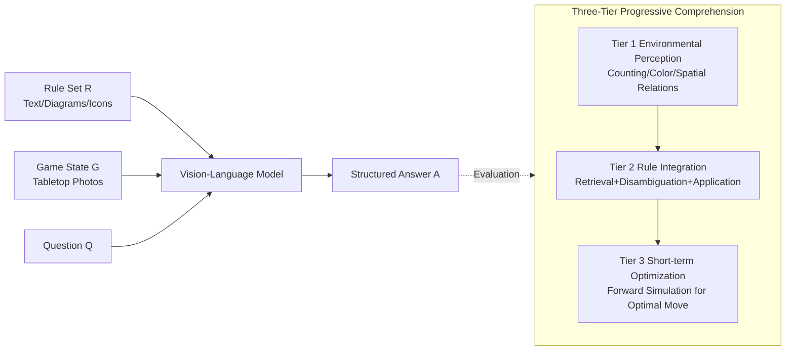

# LLMs as Rules Oracles: Exploring Real-World Multimodal Reasoning in Tabletop Strategy Game Environments

**Conference**: ICLR 2026  
**OpenReview**: [https://openreview.net/forum?id=TOgQ00DEek](https://openreview.net/forum?id=TOgQ00DEek)  
**Code**: [https://huggingface.co/spaces/launch/LudoBench](https://huggingface.co/spaces/launch/LudoBench)  
**Area**: Multimodal Reasoning / Vision-Language Model Evaluation / Benchmark  
**Keywords**: LudoBench, Tabletop game reasoning, situated game comprehension, multimodal rulebooks, visual grounding, short-term optimization  

## TL;DR
This paper introduces **LudoBench**—a multimodal game comprehension benchmark that pairs "real tabletop game photos + complete rulebooks + situated questions." It finds that leading vision-language models fail significantly on the most basic task of "understanding a new tabletop game" for novice players (Perception 63%, Rule Integration 36%, Short-term Optimization only 8%), exposing fundamental defects in cross-modal rule grounding and lightweight forward simulation capabilities.

## Background & Motivation
**Background**: Games have long been classic testing grounds for AI reasoning. Leading models such as o1 and Gemini Pro perform excellently in structured digital games like Chess and Go, which feature "rule enforcers + gym-style clean environments" where illegal moves are prohibited and state transitions are handled by simulators.

**Limitations of Prior Work**: Once this scaffolding is removed, models suggest illegal or nonsensical moves even in well-studied games like Chess, indicating they have not truly internalized game states and rules. Previous game benchmarks are almost entirely built upon "text/symbolically serialized clean boards" (e.g., representing Tic-Tac-Toe as "X at (1,1)") or only test games like Chess with extremely simple layouts and few icons, failing to reflect the cluttered, dense, and multimodal scenarios of real-world tabletop games.

**Key Challenge**: Thousands of real tabletop games are produced annually and played primarily offline. Their rulebooks are lengthy, multimodal (text + diagrams + icons + examples), and idiosyncratic, imposing a massive cognitive load on first-time players. **Can a model—without a legality checker or interactive feedback—use only a tabletop photo and an external rulebook to acquire dense cross-modal reference knowledge, retrieve and disambiguate relevant entries, parse icons and diagrams, ground them into a messy spatial layout, and apply them correctly, just as a human novice would?**

**Goal**: Rather than pursuing "deep strategic mastery," this work focuses on the entry-level reasoning challenge faced by novice players: **correctly understanding a new tabletop game for the first time.**

**Core Idea**: **Situated multimodal game comprehension**—decomposing "understanding a game" into three progressive layers of capability (Environmental Perception → Heterogeneous Rule Integration → Short-term Optimization). It uses manually annotated real tabletop game scenarios to perform step-by-step pressure testing of the models' foundational multimodal reasoning.

## Method

### Overall Architecture
LudoBench formalizes the task as visual comprehension: given a game state $G$ (one or more photos), a corresponding rule set $R$ (a mix of text, diagrams, icons, and examples), and a natural language question $Q$, the model must output an answer $A$ to address $Q | (G, R)$. The benchmark covers 5 mainstream tabletop games with diverse mechanisms (Kingdomino → Pax Renaissance, difficulty 1.2 → 4.6, rules 35 → 247). It includes 638 manually annotated QA pairs organized into three progressive comprehension tiers, testing each capability independently.

### Key Designs

**1. Three-Tier Progressive Situated Comprehension System: Decomposing "game understanding" into a ladder of independently testable capabilities.** Tier 1 (Environmental Perception) tests basic visual parsing of $G$—object counting, color identification, and spatial relationships—without requiring rule knowledge ($R$ is not used). Tier 2 (Heterogeneous Rule Integration) requires the model to ground one or more rule entries from $R$ into the observed visual state to judge state legality, current player scores, or valid actions. Tier 3 (Short-term Optimization) demands predicting optimal outcomes under given constraints (e.g., "What is the maximum score achievable before this turn ends?"), forcing the model to construct an internal world model capable of lightweight forward simulation. Sharing the same situated scenarios across tiers allows for precise identification of where reasoning fails.

**2. Human-in-the-Loop High-Fidelity Manual Annotation and Verifiable Heuristics: Ensuring unambiguous ground truth through deterministic and reproducible questions.** All scenarios are built in the Tabletop Simulator (TTS) sandbox, supporting free camera movement and precise object placement to ensure reproducible configurations and high-quality visuals. Questions follow three heuristics to ensure a "unique verifiable answer": (1) Deterministic, fully observable states—answers must be derivable solely from visible images, excluding hidden information or random events; (2) Constrained opponent modeling—multi-turn optimization questions either assume no opponent interaction or specify fixed opponent behavior (e.g., "the opponent will minimize your score"); (3) Single well-defined solution—each question has exactly one answer, avoiding ambiguity or probabilistic cases. The annotation process involves "two game experts generating questions → three enthusiast-level students answering independently → item-by-item discussion to resolve discrepancies." Expert accuracy across Tiers 1/2/3 reached 98.3%/97.4%/87.2%, while enthusiasts reached 96.7%/89.1%/82.2%, serving as the human ceiling.

**3. Tri-Modal Rulebook Ablation: Separating "knowledge availability" from "correct knowledge application."** For each game's rule set $R$, three variants are provided: IMAGE (High-definition full-page screenshots of the rulebook PDF, identical to what human annotators see), TEXT (a text-only subset of the rulebook), and NONE (only state $G$ is provided, forcing the model to rely on parametric knowledge). This comparison directly answers whether providing information-rich rulebooks is actually beneficial. Evaluation uses the OpenCompass VLMEVALKIT pipeline, where answers are post-processed by GPT-4o into semi-structured/JSON format for exact matching (manual sampling showed 100% mapping accuracy). This design revealed a counter-intuitive phenomenon: diagrammatic rulebooks, which should be easier to understand (like "learning by example"), often resulted in worse performance than text-only inputs for most models due to overfitting to examples and failure to generalize.

**4. Multi-dimensional Failure Attribution and Oracle Solvability Analysis: Categorizing "incorrectness" into diagnosable error types.** By annotating 30 Tier-2 questions from Pax Renaissance across three input conditions for "relevant rule retrieved" vs. "correctly applied," a **dual bottleneck** was identified: rule retrieval rates climb as inputs become richer (NONE → TEXT → IMAGE: 20% → 73% → 90%), but application accuracy consistently lags (17% → 64% → 56%)—models often "know the rule but misread the board." Failures are categorized into types such as Canonical Object Mapping, Spatial Enumeration error, Misapplication of Rules, Object Permanence issues (forgetting moves during sequence reasoning), and Greedy Planning. Additionally, a 27-way majority vote (9 models × 3 modalities) was used to estimate the benchmark's headroom, confirming that ~50% of Tier 3 questions remain unsolved by any system, proving significant room for improvement exists beyond annotation noise.

## Key Experimental Results

### Main Results: Layered Accuracy of 9 Leading Models (Averaged across games and modalities)

| Tier | Task | Model Avg. Accuracy | Human (Enthusiast) |
|------|------|--------------------|--------------------|
| Tier 1 | Environmental Perception | ~63% | ~96.7% |
| Tier 2 | Rule Integration | ~36% | ~89.1% |
| Tier 3 | Short-term Optimization | ~8% | ~82.2% |

- Evaluation of 9 multimodal models: GPT-4o / 4.1 / o1 / o3 / 5.1, Gemini Pro 3 / 2.5 Pro / 2.5 Flash, Claude 4.5 Sonnet.
- **Gemini Pro 3 is the strongest overall** (especially in Tiers 1/2), followed by GPT-5.1 and o3; Flash 2.5 is the weakest.
- In Tier 3, **only Gemini Pro 3 exceeded 20% in specific splits (Res Arcana | Text)**; other models faced near-total collapse.

### Ablation Study: Impact of Rulebook Modality (Relative to NONE baseline)

| Model Family | TEXT Rulebook | IMAGE Rulebook |
|--------------|---------------|----------------|
| GPT Series | Gain | Gain |
| Claude 4.5 | Gain | Gain |
| Gemini Pro 3 | Gain | Gain |
| Gemini 2.5 (Pro/Flash) | Gain (Pro 2.5 + o3 near +7%) | **Decrease** |

### Key Findings
- **Basic Visual Perception Remains Unsolved**: Tier 1 still shows frequent errors in counting occluded objects, recognizing rotated icons/text, and fragile spatial relationship parsing (Claude as low as 30% in Carcassonne|Img).
- **Retrieval $\neq$ Application Dual Bottleneck**: Rule retrieval rates reach 90%, but rule application remains at only 56%—"knowing the rule but misreading the board" is the core failure mode.
- **Diagrams as a Burden**: Most models overfit to examples in diagrammatic rulebooks and fail to generalize, contrasting sharply with how "humans benefit from diagrams" and exposing weaknesses in visual document understanding.
- **Missing World Models in Tier 3**: Responses lengthen significantly in Tier 3 without corresponding reasoning gains (verbose but ineffective); models cannot logically simulate even one or two steps internally in a fully observable environment.
- **High Oracle Headroom**: Under 27-way voting, ~50% of Tier 3 questions (up to 60% for Kingdomino) are still unsolved by any model, confirming difficulty stems from the tasks themselves rather than annotation noise.

## Highlights & Insights
- **Redefining Game Reasoning Challenges**: Shifting the research focus from "deep strategic mastery" back to "understanding a new game for the first time," revealing that this neglected entry-level capability is precisely where current models struggle.
- **Real-World Clutter as a Core Variable**: Using Tabletop Simulator to create dense, multi-component, rotatable real-world scenes forces grounding failures that serialized, "clean" benchmarks can never detect.
- **Diagnostic Value of Tri-Modal Ablation**: The NONE/TEXT/IMAGE comparison cleanly separates "lack of knowledge" from "misuse of knowledge," yielding the insight that rich inputs nearly eliminate retrieval errors, but faithful rule execution remains difficult.
- **The Diagrammatic Rulebook Paradox**: Model performance degrades under diagram-rich inputs that should be easier to understand, pointing to systemic weaknesses in visual document comprehension and symbolic grounding.

## Limitations & Future Work
- **Scale and Coverage**: Only 5 games and 638 questions, relying on intensive manual annotation (expert + enthusiast three-stage process); scaling to more games/types is costly, though situated scenarios and rulebook examples could serve as scaffolding for semi-automated expansion.
- **Evaluation Limited by Context Window**: Diagrammatic rulebooks for Pax Renaissance and Catan exceed the Claude 4.5 context window, leading to missing results and affecting fair cross-model comparison.
- **Focus on Deterministic, Fully Observable, Single-Solution Tasks**: Deliberately excludes hidden information, stochasticity, and multi-solution scenarios to facilitate verification, which bypasses uncertainty reasoning inherent in real games.
- **Diagnostic Focus Without Solutions**: The work is a diagnostic benchmark identifying three major bottlenecks—visual grounding, rule execution, and lightweight forward simulation—leaving "how to make models learn" to future work (e.g., stronger visual document understanding, explicit world models/simulator interfaces).

## Related Work & Insights
- **vs. RL in Board Games (AlphaGo/AlphaZero)**: Those involve superhuman performance in narrow domains with perfect information, massive self-play, and enforced rules. This work tests zero-shot, rapid knowledge acquisition for new games in unenforced environments.
- **vs. Text/Symbolic Game Benchmarks** (Serialized Tic-Tac-Toe): Those represent states as clean strings; this work insists on messy real-world photos where serialization is not feasible.
- **vs. Visual Board Comprehension** (Chess/Connect Four Images): These still feature simple layouts and minimal icons. This work adds complete multimodal rulebooks, requiring retrieval, disambiguation, and grounded decision-making.
- **vs. Synthetic Reasoning Games** (ARC, Baba Is AI, PuzzleVQA): Those isolate basic reasoning but are somewhat "toy-like." This work emphasizes the real-world application of visual models acting as offline "multimodal rules oracles."
- **Insights**: Reveals a common failure mode for multimodal RAG/agents—"strong retrieval, weak application"—and identifies visual document understanding (extracting semantics from diagrammatic rules) as an underestimated bottleneck, guiding future research toward world models and symbolic grounding.

## Rating
- **Novelty**: ⭐⭐⭐⭐ — The first game comprehension benchmark to pair real tabletop photos + complete multimodal rulebooks + situated questions, redefining the neglected challenge of "understanding new games."
- **Experimental Thoroughness**: ⭐⭐⭐⭐ — Comprehensive cross-evaluation of 9 leading models × 3 rulebook modalities × 3 Tiers × 5 games, supplemented with human baselines, oracle solvability votes, and fine-grained error attribution.
- **Writing Quality**: ⭐⭐⭐⭐ — Clear task formalization, clean logic for the three tiers and tri-modal ablation, and rich failure type tables and charts make for a persuasive narrative.
- **Value**: ⭐⭐⭐⭐ — Exposes fundamental flaws in multimodal models regarding visual grounding, faithful rule execution, and forward simulation. Insights like "diagrams as a burden" and "retrieval $\neq$ application" provide valuable guidance for both evaluation and methodology research.

<!-- RELATED:START -->

## Related Papers

- [\[ICLR 2026\] SpaCE-Eval: A Benchmark for Real-World Multi-Modal Reasoning](space-eval_a_benchmark_for_real-world_multi-modal_reasoning.md)
- [\[ICLR 2026\] Game-RL: Synthesizing Multimodal Verifiable Game Data to Boost VLMs' General Reasoning](game-rl_synthesizing_multimodal_verifiable_game_data_to_boost_vlms_general_reaso.md)
- [\[ICLR 2026\] Reasoning in Space via Grounding in the World](reasoning_in_space_via_grounding_in_the_world.md)
- [\[ICLR 2026\] Ref-Adv: Exploring MLLM Visual Reasoning in Referring Expression Tasks](ref-adv_exploring_mllm_visual_reasoning_in_referring_expression_tasks.md)
- [\[ICLR 2026\] Play to Generalize: Learning to Reason Through Game Play](play_to_generalize_learning_to_reason_through_game_play.md)

<!-- RELATED:END -->
