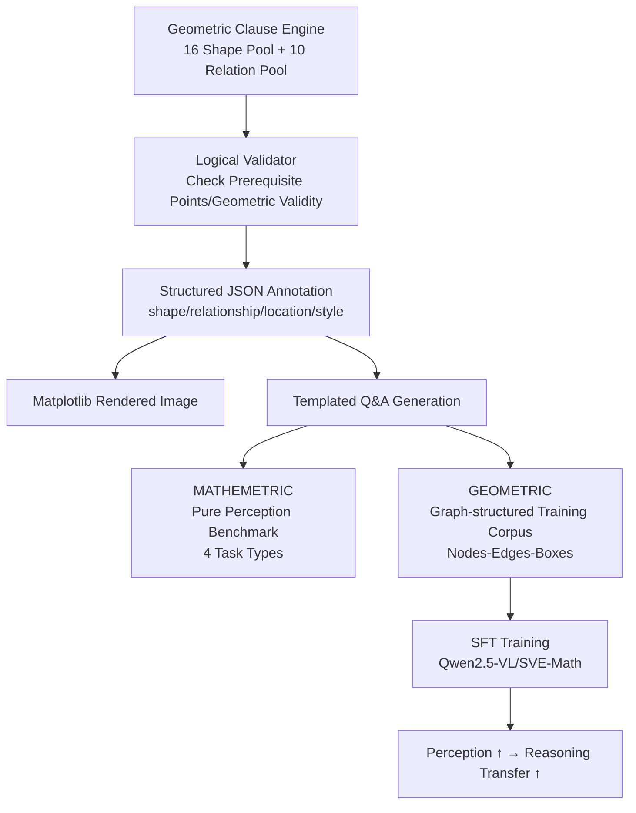

# Math Blind: Failures in Diagram Understanding Undermine Reasoning in MLLMs

**Conference**: ICLR 2026  
**OpenReview**: [https://openreview.net/forum?id=RtvmTxdQV9](https://openreview.net/forum?id=RtvmTxdQV9)  
**Code**: viocean/MATHEMETRIC (Project Homepage)  
**Area**: Multimodal VLM / Mathematical Visual Reasoning  
**Keywords**: Mathematical diagram perception, MLLM, Geometric perception, Visual grounding, Perception-reasoning transfer, Structured diagrams  

## TL;DR
This paper introduces the diagnostic benchmark MATHEMETRIC to decouple "perception" from "reasoning," revealing that current MLLMs exhibit extremely poor foundational perception (shape/counting/relationships/grounding) on mathematical diagrams—specifically, fine-grained grounding is near zero, leading to "blindly trusting text" (Math Blind). Furthermore, after training on the graph-structured geometric perception dataset GEOMETRIC, grounding tasks improve by $+79\%$. This perception gain transfers to reasoning tasks without additional CoT data, resulting in a $+3\text{--}4\%$ improvement across four public benchmarks.

## Background & Motivation
**Background**: Mathematical diagrams are "artificial symbolic visual languages"—they are not pixel samples of the real world but abstract expressions composed of precise geometric structures and symbolic notations. Although benchmarks like MathVista and MathVerse evaluate the mathematical visual reasoning of MLLMs, they mix perception and reasoning during testing: they only assess the final answer, while intermediate perception errors remain hidden.

**Limitations of Prior Work**: It is widely assumed that the "reasoning collapse and hallucination" of MLLMs on diagrams stem from insufficient reasoning capabilities, yet no one has verified whether **these failures originate from the model's fundamental inability to "see" the diagram itself**. Existing geometric training datasets (e.g., MAVIS, AutoGeo) often feature ambiguous annotations and vague structural attributes (e.g., treating a sequence of operations as a diagram description), failing to teach the model the underlying structure of the diagrams.

**Key Challenge**: MLLMs exhibit strong perception on natural images (trained on trillions of images), but degrade when facing geometric diagrams—this is due to the lack of exploitable semantic priors and surface patterns, hindering generalization. Low-level perception, which should be "solved at a glance" by humans, becomes a bottleneck for MLLMs and propagates downstream as flawed reasoning.

**Goal**: To first diagnose and prove that "perception defects indeed exist and drag down reasoning," and then demonstrate that "strengthening perception can directly transfer to and improve reasoning."

**Core Idea**: ① **Diagnosis**—Construct a pure perception, reasoning-free benchmark (MATHEMETRIC) to isolate and measure perception capabilities; ② **Repair**—Represent diagrams explicitly as graph-structured training corpora (GEOMETRIC) containing "primitive nodes + relational edges + fine-grained boxes," teaching the model "where to look" to break the dependence on textual shortcuts.

## Method

### Overall Architecture
The work is divided into two lines: a **diagnostic benchmark** MATHEMETRIC used to "measure" perception deficiencies, and a **structured training set** GEOMETRIC used to "fix" them. Both share the same synthetic data engine (based on geometric clause primitive + relationship sampling + logical validator + Matplotlib rendering + templated Q&A generation). The difference lies only in whether they generate evaluation tasks or training dialogues.

### Key Designs

**1. MATHEMETRIC: A diagnostic benchmark decoupling perception from reasoning.** It only asks pure perception questions that humans can answer "at a glance." It contains 1,198 images and 1,609 questions, covering plane geometry (66%), solid geometry (20%), and charts (14%). Four task types are designed: shape classification (16 basic shapes + CLEVR objects + FigureQA elements), object counting, relationship identification (4 spatial relations + 10+ mathematical relations), and object grounding (predicting $(x_1, y_1, x_2, y_2)$ bounding boxes in free-form). Question formats include multiple-choice, true/false, and open-ended; grounding is evaluated with an IoU threshold of 0.65. The key is that answers come directly from labels without any multi-step reasoning; thus, "wrong answers mean perception errors," exposing intermediate mistakes previously hidden by final answers.

**2. Synthetic Data Engine: Using geometric clauses as atomic units with a validator for logical consistency.** Inspired by AlphaGeometry, the engine samples geometric clauses from a shape pool (isosceles triangle, square, parallelogram, pentagon, circle, ellipse...) and a relationship pool (parallel, perpendicular, tangent, inscribed...). Each clause declares an `explanation` and `prerequisite` (e.g., `W = incircle ∆KMQ` requires prerequisite points K, M, Q). The validator checks each clause based on "manual rules + basic mathematical principles + prerequisite constraints," discarding illegal combinations and retaining valid ones. These are rendered into images and saved as structured JSON (containing attributes, bounding boxes, relationships, and style). To increase difficulty, Gaussian noise, irregular scribbles, and angular wedge symbols are injected. This engine serves as the "source of truth" for both diagnosis and training.

**3. GEOMETRIC: A structured description corpus that explicitly writes diagrams as "graphs."** Unlike the vague procedural descriptions in MAVIS/AutoGeo, GEOMETRIC uses a fixed template to organize each diagram into a hierarchical text: "first count objects $N \rightarrow$ then provide shape attributes for each $\rightarrow$ then provide fine-grained box coordinates for each primitive $\rightarrow$ finally describe relationships between primitives." This essentially corresponds to the graph's nodes (objects + attributes), edges (relationships), and geometric positions (boxes). It provides three training values: (1) clear object attributes and relationships, analogous to graph nodes and edges; (2) fine-grained box coordinates to systematically teach spatial perception; (3) compatibility for fusion with reasoning-based CoT math datasets during self-instruction tuning, enabling the model to both perceive and reason. Additionally, multi-turn dialogue instruction data is provided to strengthen instruction following.

**4. Perception $\rightarrow$ Reasoning transfer training and verification.** Full-parameter SFT is performed on SVE-Math-DeepSeek, and LoRA is applied to Qwen2.5-VL-7B/32B, using only GEOMETRIC to strengthen perception (without adding extra reasoning data). The core argument is: when the model "sees correctly," the multi-step reasoning chain becomes naturally more stable—many previously incorrect cases can be solved by simply correcting a single key perception error. This verifies that perception and reasoning are complementary, rather than relying solely on scaling reasoning data or reinforcement learning.

## Key Experimental Results

### Main Results: MATHEMETRIC Perception Diagnosis (Accuracy for selected models, %)

| Model | Avg. | Plane-cls | Plane-grd | Plane-rlat |
|------|------|---------|---------|----------|
| Human (Authors) | 99.2 | 98.7 | 95.9 | 100.0 |
| Qwen2.5-VL-7B | 59.2 | 56.2 | 18.5 | 52.0 |
| Qwen2.5-VL-32B | 62.2 | 56.9 | **0.0** | 67.0 |
| GPT-4o | 53.3 | 58.4 | 1.1 | 62.5 |
| InternVL2.5-38B | 63.1 | 59.9 | 2.5 | 66.0 |
| SVE-Math-DeepSeek-7B | 46.6 | 52.4 | 3.6 | 51.0 |
| **Qwen2.5-VL-7B+ (Ours)** | **72.9** | 70.7 | **82.6** | 85.0 |
| **Qwen2.5-VL-32B+ (Ours)** | **74.2** | 70.7 | **84.0** | 79.5 |
| **SVE-Math-DeepSeek-7B+ (Ours)** | 68.4 | 75.8 | 82.9 | 96.5 |

Key Point: Almost all SOTA models score near 0 on fine-grained grounding (grd) (including 32B and GPT-4o), creating a massive gap compared to the 95%+ human performance; the proposed method raises grounding to 80%+ (a gain of approximately $+79\%$ for the grd task).

### Perception-Reasoning Linkage (Table 2, %)

| Model | Plane Perception | MathVerse | MathVista | GeoQA | MATH-V |
|------|---------|-----------|-----------|-------|--------|
| SVE-Math-DeepSeek-7B | 35.4 | 24.3 | 48.7 | 72.8 | 14.4 |
| **SVE-Math-DeepSeek-7B+** | **84.6** | **28.1** | 51.3 | 76.2 | 16.6 |
| Qwen2.5-VL-7B | 44.0 | 49.2 | 68.2 | 76.4 | 25.1 |
| **Qwen2.5-VL-7B+** | **78.5** | 52.8 | 70.3 | 79.6 | 27.3 |
| Qwen2.5-VL-32B | 43.3 | 54.8 | 74.7 | 82.9 | 31.9 |
| **Qwen2.5-VL-32B+** | **77.9** | **57.3** | 76.9 | 85.3 | 33.3 |

Key Point: Solely by strengthening perception (no extra reasoning data), performance on four reasoning benchmarks like MathVerse improves by $+3\text{--}4\%$; the $28.1\%$ achieved by SVE-Math-DeepSeek+ even exceeds MultiMath ($26.9\%$), which was trained with large-scale reasoning samples and RL.

### Key Findings
- **Math Blind**: When diagram-text conflicts occur, models biasedly trust the text; this is more severe when perception is weaker. Models are insensitive to the vertex order of shapes (which defines shape identity), suggesting they rely on pattern memorization rather than true perception.
- **Fragility**: Easily misled by subtle visual noise and irrelevant distractors, failing to focus on salient objects.
- **Scale Ineffectiveness**: For Qwen2VL, increasing from 7B to 72B improves MathVista by $+22.3\%$ but MATHEMETRIC by only $+8.3\%$—stacking parameters is almost useless for perception.
- **General vs. Mathematical Models**: General models outperform specialized math models on solid geometry and charts because they have seen FigureQA/CLEVR/Charts, but they all fail completely on fine-grained grounding tasks.

## Highlights & Insights
- **Methodological Contribution**: Decouples perception from reasoning using "at-a-glance" pure perception tasks, providing a quantifiable diagnostic tool for the long-ambiguous question of "whether MLLMs actually understand diagrams."
- **Mechanism Insight**: Re-attributes "reasoning collapse" to "perception collapse + blind trust in text," proving with data that low-level perception is the foundation of high-level reasoning.
- **Data Design Philosophy**: The essence of a diagram is a "graph"—explicitly encoding nodes/edges/boxes is more effective than stacking scale (MAVIS is $5\times$ larger than our data but performs worse due to vagueness and out-of-distribution issues).
- **Transferability**: Perception gains transfer to reasoning without any additional CoT/RL and can generalize across sub-domains (training on plane geometry also improves solid geometry/charts).

## Limitations & Future Work
- Training mainly covers plane geometry; improvements in solid geometry and charts come from zero-shot transfer and are smaller than those in plane geometry.
- Visual-text interaction was not explicitly modeled (unlike token-level fusion in MINT-CoT). The authors acknowledge that how explicit visual-text interaction modeling could further amplify "perception $\rightarrow$ reasoning" is a future direction.
- Synthetic data is generated via templates and a fixed relationship pool; the robustness to out-of-distribution real-world hand-drawn or scanned geometric diagrams remains to be tested.
- Evaluation is primarily in the mathematical geometry domain; whether this generalizes to broader "symbolic vision" like circuit diagrams, flowcharts, or molecular formulas is unverified.

## Related Work & Insights
- **Math Visual Reasoning Benchmarks**: MathVista, MathVerse, MATH-V, GeoQA—this paper points out their blind spot in mixing perception and reasoning.
- **Geometric Training Datasets**: MAVIS, AutoGeo—the comparison and improvement targets for this paper (vague vs. structured).
- **Specialized Math MLLMs**: SVE-Math-DeepSeek (geometric primitive visual encoder), G-LLaVA, Math-LLaVA, MultiMath, URSA.
- **Reasoning Enhancement Routes**: Vision-R1 (RL-enhanced, compute-heavy), MINT-CoT (vision-text token fusion)—this paper takes the lighter, complementary route of "perception patching."
- **Inspiration**: The synthetic engine construction was inspired by AlphaGeometry's geometric clause representation; the idea of "reducing learning complexity with structure" is valuable for other symbolic vision tasks (charts, UI, document layout).

## Rating
- **Novelty**: ⭐⭐⭐⭐⭐ The combined perspective of "perception/reasoning decoupling diagnosis + graph-structured data perception patching" is novel, and re-attributing "reasoning failure" to "perception failure" is conceptually impactful.
- **Experimental Thoroughness**: ⭐⭐⭐⭐ Evaluates 20 MLLMs across three sub-domains and four task types; the main table + Table 2 + five-factor ablation are quite complete. However, training focused on plane geometry and real-world out-of-distribution verification is relatively weak.
- **Writing Quality**: ⭐⭐⭐⭐ Clear storyline (Diagnosis $\rightarrow$ Attribution $\rightarrow$ Repair $\rightarrow$ Transfer Verification); high information density in charts; memorable terminology (Math Blind / blind reasoning).
- **Value**: ⭐⭐⭐⭐⭐ Provides the math multimodal community with a clear direction: "build the perception foundation before talking about reasoning." Both the benchmark and dataset are reusable and have high practical value.

<!-- RELATED:START -->

## Related Papers

- [\[ICLR 2026\] We-Math 2.0: A Versatile MathBook System for Incentivizing Visual Mathematical Reasoning](we-math_20_a_versatile_mathbook_system_for_incentivizing_visual_mathematical_rea.md)
- [\[ICLR 2026\] ExpVid: A Benchmark for Experiment Video Understanding & Reasoning](expvid_a_benchmark_for_experiment_video_understanding_reasoning.md)
- [\[ICLR 2026\] Children's Intelligence Tests Pose Challenges for MLLMs? KidGym: A 2D Grid-Based Reasoning Benchmark for MLLMs](childrens_intelligence_tests_pose_challenges_for_mllms_kidgym_a_2d_grid-based_re.md)
- [\[CVPR 2025\] MV-MATH: Evaluating Multimodal Math Reasoning in Multi-Visual Contexts](../../CVPR2025/vlm_reasoning/mv-math_evaluating_multimodal_math_reasoning_in_multi-visual_contexts.md)
- [\[ICLR 2026\] SophiaVL-R1: Reinforcing MLLMs Reasoning with Thinking Reward](sophiavl-r1_reinforcing_mllms_reasoning_with_thinking_reward.md)

<!-- RELATED:END -->
